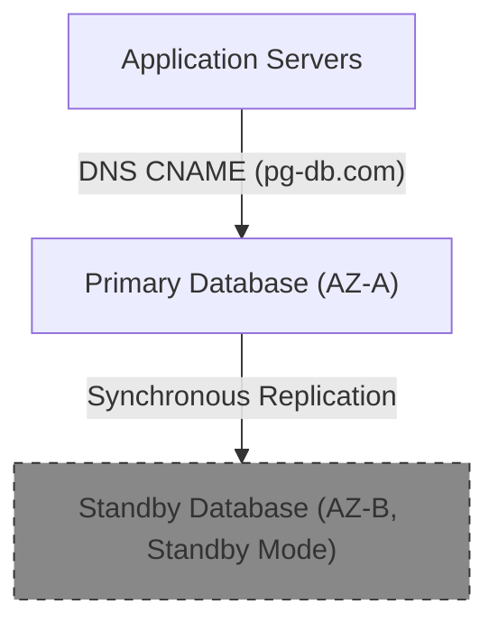

---
domains:
  - "aws"
  - "infra"
---

# Module 3-4: AWS Solution Architect Associate (SAA) Playbook

This module outlines SAA-level high-availability patterns and exam-focused checklists.

---

## 1. Multi-AZ database High Availability Pattern

To build a fault-tolerant relational database:
*   **Multi-AZ Deployment:** Deploy primary database instance in AZ-A and synchronously replicate data to a standby instance in AZ-B.
*   **Failover Execution:** In the event of primary instance failure, AWS automatically updates the DNS CNAME record to point to the standby instance, completing failover with zero manual script intervention.

---

## 2. SAA Exam-Focus Checklists

*   **VPC Peering:** Connects two VPCs using private IPs. Does not support transitive routing (VPC A peering with B, and B with C does not allow A to talk to C).
*   **Transit Gateway:** A hub-and-spoke transit router connecting VPCs and on-premises networks, replacing complex peering meshes.
*   **IAM Policies evaluation:** Explicit Deny overrides any Allow. Organizations SCPs restrict member account permissions.
*   **Database Scaling:** Aurora global databases provide read replicas in multiple regions with low replication latency, enabling disaster recovery.
