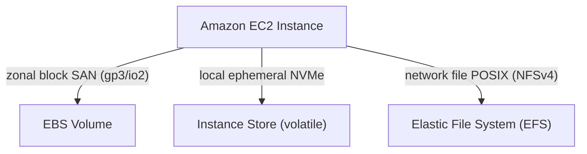

---
domains:
  - "aws"
  - "storage"
class: reference-note
tier: reference-note
tags:
  - aws/ebs
  - aws/efs
  - aws/storage
---

# Module 3-5: AWS EBS & EFS Storage

This module details persistent block storage using **Amazon Elastic Block Store (EBS)**, local transient **Instance Store** drives, shared file systems using **Amazon Elastic File System (EFS)**, and RAID array configurations.

---

## 🗺️ Cognitive Map: Storage Topology Comparison

---

## 1. Amazon EBS & Storage Options
AWS provides multiple storage choices depending on persistence, durability, performance, and accessibility.

---

## 2. EBS Snapshots, Copying, and Sharing (Eissa Notes)
Snapshots are incremental backups of EBS volumes stored in Amazon S3.

### A. Snapshot Properties & Sharing
*   **Scope:** Snapshots reside at the regional level, allowing recovery to any Availability Zone within the region.
*   **Encryption:** Sharing encrypted snapshots requires granting destination accounts access to the custom **Customer Managed Key (CMK)** used to encrypt the source snapshot. Default AWS Managed Keys cannot be shared.

---

## 3. RAID Configurations on EBS Volumes
If an application requires performance or redundancy beyond a single EBS volume, RAID can be configured within the guest OS:
*   **RAID 0 (Striping):** Combines volumes to increase I/O speed. No redundancy; if one volume fails, all data is lost.
*   **RAID 1 (Mirroring):** Duplicates data on multiple volumes. Provides fault tolerance; slower write speeds.
*   **RAID 10 (Striped Mirroring):** Combines RAID 0 and RAID 1. High I/O performance and redundancy at double the storage cost.

---

## 4. Deep-Intuition (AARF) Breakdowns

### AARF Breakdown: EBS gp3 vs. io2 Volume Selection
1.  **The Answer (Core Pattern):** Utilize EBS gp3 for standard applications and database instances. Transition to io2 Block Express only when baseline storage performance requires sustained IOPS above 16,000 or absolute sub-millisecond write performance.
2.  **The Assumptions (Context):** The instance type must support EBS Optimization to utilize the dedicated network bandwidth to the storage system without saturating VM network interfaces.
3.  **The Rationale (Why):** gp3 provides independent performance configuration (3,000 IOPS and 125 MB/s baseline included free) which is highly cost-efficient. io2 offers 99.999% durability and consistent provisioned performance but at a steep pricing tier, which is wasted if the database is throttled by CPU or memory limits rather than storage bottlenecks.
4.  **The Failure Loop (What if not):** Provisioning high IOPS on gp2 volumes relies on a "burst credit balance" model. When credits are exhausted during peak database writes, the volume throttles to a baseline of 100 IOPS, database connections saturate, query latency spikes to seconds, and the app server connection pools fail.
5.  **Alternative Case (When to use 'if not'):** For distributed, scratch-pad filesystems or cache clusters requiring maximum read/write performance without persistence, deploy Instance Store NVMe disks.

