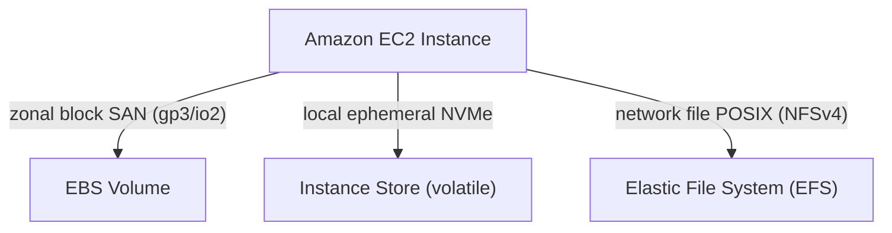

---
domains:
  - "aws"
  - "storage"
class: reference-note
tier: reference-note
tags:
  - aws/ebs
  - aws/efs
  - aws/storage
---

# Module 3-5: AWS EBS & EFS Storage

This module details persistent block storage using **Amazon Elastic Block Store (EBS)**, local transient **Instance Store** drives, shared file systems using **Amazon Elastic File System (EFS)**, and RAID array configurations.

---

## 🗺️ Cognitive Map: Storage Topology Comparison

---

## 1. Amazon EBS & Storage Options
AWS provides multiple storage choices depending on persistence, durability, performance, and accessibility.

EBS is zonal scope available over the same AZ to copy it across AZ we need to take snapshot and copy it to another zone or region 

We can create a EC2 based on EBS volume with all our configuration in an AMI as template for fast bring up 

EBS can be backed up manually or automatically 

EFS is available over the VPC so any AZ under the VPC can use the EFS its like NAT a Paas everything is handled by aws scaling and backups so aws ensures that my data on efs will always be availabe 

EFS is inside the VPC for security reasons so no one could access it 
CloudWatch Events ---> Event Bridge 
## EC2 Instance-Store
- Instance store volumes provide temporary block-storage.
- It is ideal for temporary storage of data that changes frequently. For example, Buffers and caches, Scratch data, Temporary content.
- Some instance types include instance store volumes by default (ex. i3, i3en). 
- Instance store volumes such as those on the i3 & i3en Instances can be used for high IOPS "Input/Output operations per second" OLTP databases, relational DBs and non-relational DBs.
- They can provide millions of IOPS, while EBS has a maximum limit of 64000 IOPS.
https://docs.aws.amazon.com/AWSEC2/latest/UserGuide/storage-optimized-instances.html

The architecture of Instance Store will compensate for its volatile storage nature, since if its a DB cluster if one fails others will work and as long as the operations and state is saved regulary in intervals we can compensate for the volatile nature of instance store and use its high speed input output 

## Elastic Block Store (EBS)
![[Pasted image 20250527153621.png]]

![[Pasted image 20250524110915.png]]
- EBS volumes behave like raw, unformatted, external block storage devices. 
- EBS volume data is replicated across multiple servers in the same availability zone (AZ).
- An EBS volume attaches to a single EC2 instance at a time ***(Except for the Multi Attach Provisioned IOPS)***, this happens through the AWS network. 
- Multi Attach EBS volumes allow up to 16 instances per volume, & cannot be used as boot/root volume, only for data volumes. Exclusive only for some instances "Provisioned IOPS instances".
- Both the instance and the EBS volume must be in the same AWS AZ.
- Elasticity in EBS Volumes lets us dynamically modify the size, performance, and volume type of the Amazon EBS volumes without detaching them. Size can be increased not decreased.
### EBS Types

![[Pasted image 20250524113316.png]]
##### 1- Provisioned IOPS (io1)
- Used Cases:
	- Large IOPS intensive workloads that require consistent performance.
	- Large production databases.
- Cost: Highest
- Orientation: IOPS
##### 2- General Purpose (gp2) 
- Used cases:
	- General workloads.
	- Small Databases.
	- Dev/Test environments.
	- Virtual Desktops.
	- Workloads performing small, random I/O.
- Cost: Higher
- Orientation: IOPS
##### 3- Throughout Optimized (st1)
- Used Cases:
	- Large, sequential I/O workloads such as Amazon EMR, Big Data, ETL, data warehouses, and log processing.
	- Streaming workloads requiring consistent, fast throughput "transfer speed" at a low price.
- Cost: Low
- Orientation: Throughout
##### 4- Cold HDD (sc1)
- Used Cases:
	- Large, sequential cold- data workloads.
	- Throughput-oriented storage for large volumes of data that is infrequently accessed.
	- Scenarios where the lowest storage cost is important.
- Cost: Lowest
- Orientation: Throughout

#### Volume Actions:

### EBS Snapshots
![[Pasted image 20250527153744.png]]

Can be manual or scheduled, the snapshots go to an S3 bucket in the same region, but can be copied to another region if desired.
##### Amazon Data Lifecycle Manager (DLM)

![[Pasted image 20250527154412.png]]

A total solution for creating, deleting, and retaining EBS volume snapshots. 
-  You can configure snapshot lifecycle policies to carry the required EBS snapshot tasks.
- A DLM policy can snapshot a single volume or multiple volumes attached to an EC2 instance. 
- A DLM Policy uses resource tags to identify the volumes it needs to work on. 
- You can also automate EBS snapshots with CloudWatch events, but that is for individual EBS volumes.
#### Snapshot Actions:

*Note:* Upon restoring a snapshot to a volume, the volume must be equal to or larger than the original snapshot volume size.
*EX.* A snapshot of a volume of 8Gb containing data of 3Gb "5Gb free space", when restoring or copying to a new volume, the new volume must be ≥ 8Gb.

### Copying EBS Snapshots 
![[Pasted image 20250527155002.png]]
### EBS Encryption
![[Pasted image 20250527154449.png]]
Amazon EBS uses KMS Customer Master Keys (CMKs) to generate data (encryption) keys to encrypt and decrypt data on EBS volumes. 
- EBS Currently supports symmetric keys only.
- Data is encrypted on the host of the EC2 instance. This means data in-transit to an encrypted EBS volume is also encrypted "encrypted all the way".
- Using AWS CMK is fully managed by AWS unlike customer CMK we are responsible for key rotation, who can and who can't use it , can audit who used it..
https://docs.aws.amazon.com/AWSEC2/latest/UserGuide/EBSEncryption.html#EBSEncryption

### Encrypting a volume using a CMK:
- When we encrypt a volume using CMK, its snapshots, volumes restored from its snapshots, and copies of the snapshots are all encrypted.
- There is no direct way of changing the encryption status of a volume or a snapshot.
- We cannot change the CMK key used to encrypt an existing encrypted volume or snapshot.
- However, we can work around these restrictions with copy and create volume actions.
	- Encrypting and unencrypted EBS :
		- 
	- unencrypting  an encrypted EBS volume :
		- 

*Note:* We can enable EBS Encryption region-wide which will encrypt all current & future volumes, snapshots & copies of snapshots.

### Sharing EBS Snapshots
Snapshots by default have permissions set to private & can only be viewed by the account. 
***V.Imp.NOTE:*** If we want to share an snapshot with an account in a different region, we need to copy it to that region first.

##### Unencrypted snapshots:
- Snapshots can be shared with all AWS community by modifying permissions to public. 
- Snapshots can be shared with select AWS accounts (permission needs to be private). 
##### Encrypted snapshots:
-  Can't be shared as public snapshots. 
- Can only be shared with select accounts.
- The receiving accounts must be given ****permissions*** on the CMK used to encrypt the shared snapshot "not the key, as the key don't leave the KMS to be downloaded as mentioned before".
- An encrypted snapshot that was encrypted by the default CMK "AWS-managed CMKs (*aws/service_name*)" cannot be shared.

## AMIs & Golden AMIs, Creating AMI From an EBS-Backed EC2 Instance
(AMI: Amazon Machine Images. *ex:* Linux image)

After launching an instance and customizing it; customer creates his own AMI, which can also be called a Golden AMI.
- *ie.:* Golden AMIs are customized AMIs.
- The custom AMI includes snapshots of all attached EBS volumes and they get stored in S3.
- This comes in handy when taking a snapshot, the snapshot will include the basic AMI, plus all the configurations & customizations required for reinstallation.
##### Copying Accounts
- We can copy an AMI within the same region or across AWS regions. 
- We can copy AMIs with encrypted snapshots and change the encryption status during the copy process.
- AMIs from the marketplace (with billing product codes) and Windows AMIs can't be copied to another account. 
	To work around that, launch an instance from the AMI, then create an AMI from that EC2 instance.
##### Sharing AMIs Between Accounts
- When sharing an AMI that has encrypted volumes, we need to share the CMKs used to encrypt those volumes' snapshots.
- If we want to share an AMI with an account in a different region, we need to copy the AMI to that region first.
- Sharing an AMI does not change its ownership. The owning account is charged for the storage of the AMI.
*Note:* Notice that the AMI images is treated the same way as EBS volumes when sharing & copying. This is also true in the AWS Console.

### Creating Custom AMI Image from EC2 Console:

*Note:* When creating an AMI image, it's registered automatically in AWS, **Deregistration** is required first before deletion.

## RAID (Redundant Array of Independent Disks)
It's combining multiple volumes & using them as one volume, either for redundancy or performance, & can be used to increase number of IOPS.
- EBS volumes support all RAID types. 
- RAID is performed at the OS level Software. 
- RAID volumes are not recommended by AWS to be used as root/boot volumes.
### RAID Types
##### 1- RAID 0
- Highest IOPS performance among all RAID types.
- Resulting IOPS is the sum of individual IOPS for all volumes.
- No redundancy/mirroring.
- Failure of any volume means failure of the entire array.
##### 2- RAID 1
- NO IOPS performance enhancement.
- Redundant since the same data is written to all volumes.
##### 3- RAID 10
- Combines the benefits of RAID 0 and RAID 1.
- Provides redundancy and performance enhancements.

## AWS Batch
AWS Batch is a fully managed service that simplifies running batch jobs "recurring Jobs" of any scale across multiple availability zones within a region.
- Regional Scale
- It plans, schedules, and executes the batch computing workloads and provisions the optimal quantity of compute required. 
- Customers do not have to run or maintain servers or schedulers. 
- It can scale to hundreds of thousands of batch computing jobs. 
- Use cases include digital media rendering, drug screening, and post trade analysis.

![[Pasted image 20250529143446.png]] 

---

## 2. EBS Snapshots, Copying, and Sharing (Eissa Notes)
Snapshots are incremental backups of EBS volumes stored in Amazon S3.

### A. Snapshot Properties & Sharing
*   **Scope:** Snapshots reside at the regional level, allowing recovery to any Availability Zone within the region.
*   **Encryption:** Sharing encrypted snapshots requires granting destination accounts access to the custom **Customer Managed Key (CMK)** used to encrypt the source snapshot. Default AWS Managed Keys cannot be shared.

---

## 3. RAID Configurations on EBS Volumes
If an application requires performance or redundancy beyond a single EBS volume, RAID can be configured within the guest OS:
*   **RAID 0 (Striping):** Combines volumes to increase I/O speed. No redundancy; if one volume fails, all data is lost.
*   **RAID 1 (Mirroring):** Duplicates data on multiple volumes. Provides fault tolerance; slower write speeds.
*   **RAID 10 (Striped Mirroring):** Combines RAID 0 and RAID 1. High I/O performance and redundancy at double the storage cost.

---

## 4. Deep-Intuition (AARF) Breakdowns

### AARF Breakdown: EBS gp3 vs. io2 Volume Selection
1.  **The Answer (Core Pattern):** Utilize EBS gp3 for standard applications and database instances. Transition to io2 Block Express only when baseline storage performance requires sustained IOPS above 16,000 or absolute sub-millisecond write performance.
2.  **The Assumptions (Context):** The instance type must support EBS Optimization to utilize the dedicated network bandwidth to the storage system without saturating VM network interfaces.
3.  **The Rationale (Why):** gp3 provides independent performance configuration (3,000 IOPS and 125 MB/s baseline included free) which is highly cost-efficient. io2 offers 99.999% durability and consistent provisioned performance but at a steep pricing tier, which is wasted if the database is throttled by CPU or memory limits rather than storage bottlenecks.
4.  **The Failure Loop (What if not):** Provisioning high IOPS on gp2 volumes relies on a "burst credit balance" model. When credits are exhausted during peak database writes, the volume throttles to a baseline of 100 IOPS, database connections saturate, query latency spikes to seconds, and the app server connection pools fail.
5.  **Alternative Case (When to use 'if not'):** For distributed, scratch-pad filesystems or cache clusters requiring maximum read/write performance without persistence, deploy Instance Store NVMe disks.

