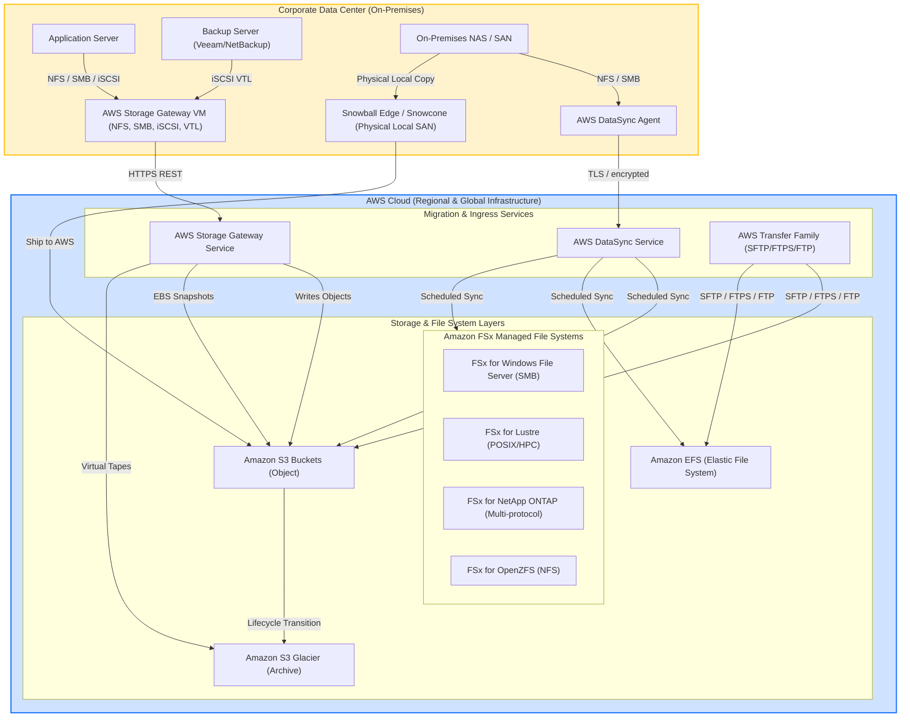
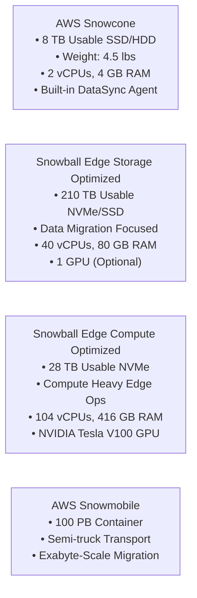

---
domains:
  - "aws"
class: reference-note
tier: reference-note
tags:
  - aws/storage
  - aws/snow-family
  - aws/storage-gateway
  - aws/fsx
  - aws/transfer-family
  - aws/datasync
---

# Module 3-5: AWS Storage Extras & Data Migration

This module covers hybrid cloud storage architectures, physical data migration devices, enterprise file systems, managed transfer protocols, and automated data synchronization services.

---

## 🗺️ Cognitive Map: Hybrid Storage & Data Migration Topology

### 📊 Quick Comparison Matrix: Hybrid & Migration Services

| Service | Protocol Access | Primary Storage Backend | Metadata & Permissions | Best Use Case |
| :--- | :--- | :--- | :--- | :--- |
| **AWS Storage Gateway** | NFS, SMB, iSCSI, iSCSI-VTL | S3, Glacier | Preserves POSIX/SMB permissions (SMB via AD) | Hybrid cloud bridging, local caching for S3, tape replacement. |
| **AWS Snow Family** | S3 API, NFS, iSCSI (Local) | S3, EBS (Local) | Local file/block level, S3 structure | Offline petabyte-scale data migration, edge compute (ships, mines). |
| **AWS Transfer Family** | SFTP, FTPS, FTP | S3, EFS | IAM mapping, POSIX UID/GID (EFS) | Fully managed FTP ingress, legacy B2B file transfers. |
| **AWS DataSync** | NFS, SMB, HDFS | S3, EFS, FSx | Full preservation (POSIX ACLs, SMB metadata) | Active migrations, schedule-based replica synchronization. |

---

## 1. AWS Storage Gateway

AWS Storage Gateway is a managed hybrid storage service that allows on-premises systems to access unlimited cloud storage. It runs as a **Virtual Machine (VM)** locally on VMware ESXi, Microsoft Hyper-V, or Linux KVM, but can also run as an **EC2 instance** in AWS.

### 📁 S3 File Gateway
*   **Access Protocols:** NFS (v3, v4.1) or SMB.
*   **Operational Mechanics:** App servers write files locally. The gateway translates those file operations to HTTPS REST API payloads (`PutObject`, `GetObject`) targeting your Amazon S3 buckets.
*   **Local Caching:** Maintains a local cache of the most recently used files for sub-millisecond retrieval.
*   **Storage Tiers:** Backed directly by S3 Standard, S3 Intelligent-Tiering, S3 Standard-IA, and S3 One Zone-IA. 
*   **Glacier Transition:** It cannot write directly to Glacier. Transitioning data to S3 Glacier requires an **S3 Lifecycle Policy** on the target S3 bucket.
*   **Active Directory (AD):** Integrates natively with Microsoft Active Directory for user authentication and authorization when using SMB.

### 💾 Volume Gateway
Provides local block storage volumes over the **iSCSI** protocol, backed by S3 and backed up via EBS snapshots.
*   **Cached Volumes:**
    *   Primary data is stored in Amazon S3.
    *   Frequently accessed data is cached locally on the gateway VM for low-latency access.
    *   *Best for:* Cost-effective storage expansion without buying new local SAN arrays.
*   **Stored Volumes:**
    *   The entire dataset is stored locally on-premises.
    *   Asynchronous backups are scheduled and stored in S3 as **EBS Snapshots** (which can be restored directly as EBS volumes on EC2).
    *   *Best for:* Low-latency local access for the entire dataset while maintaining cloud-based disaster recovery.

### 📼 Tape Gateway
*   **Access Protocol:** Exposes a Virtual Tape Library (VTL) interface over **iSCSI** to existing backup applications (e.g., NetBackup, Veeam, Backup Exec).
*   **Evolutionary Bridge:** Replaces physical tape backup storage libraries (LTO cartridges) and media rotation systems with virtual cloud cartridges.
*   **Data Lifecycle:** Writes data to virtual tapes stored in Amazon S3. Backup applications eject/export virtual tapes, which moves them into **S3 Glacier** or **S3 Glacier Deep Archive** for long-term low-cost archiving, eliminating offsite physical tape logistics.

---

## 2. AWS Snow Family

The AWS Snow Family consists of physical devices that facilitate offline data migration and localized edge computing.

### 📦 Device Specifications & Compute Configurations

*   **AWS Snowcone:**
    *   *Storage:* **8 TB** usable capacity.
    *   *Characteristics:* Small, lightweight (4.5 lbs), ruggedized, can run on battery power or USB.
    *   *Compute:* Has compute and non-compute variants (2 vCPUs, 4 GB RAM). Runs local EC2 instances.
    *   *DataSync Integration:* Includes a pre-installed **AWS DataSync agent** to automatically sync files over the network once the device is connected to the internet.
*   **AWS Snowball Edge Storage Optimized:**
    *   *Storage:* Up to **210 TB** usable capacity (or 80 TB in older models).
    *   *Compute:* Storage-focused compute options (40 vCPUs, 80 GB RAM) for basic processing and S3-compatible endpoints.
*   **AWS Snowball Edge Compute Optimized:**
    *   *Storage:* **28 TB** usable NVMe capacity.
    *   *Compute:* Designed for compute-heavy workloads (104 vCPUs, 416 GB RAM, optional NVIDIA Tesla V100 GPU).
    *   *Edge Compute Capabilities:* Run **Amazon EC2 instances**, **AWS Lambda functions**, or Kubernetes clusters locally under disconnected conditions.
*   **AWS Snowmobile:**
    *   *Storage:* Up to **100 PB** capacity in a ruggedized 45-foot shipping container.
    *   *Use Cases:* Exabyte-scale data migration. Billed based on logistics, transport, and duration.

### 🔄 Edge Storage Features
*   **Local Protocols:** Support for S3-compatible APIs and EBS block storage local attachments.
*   **Clustering:** Multiple Snowball Edge devices can be clustered together to create a local, highly available storage and compute pool.
*   **S3 Glacier Import Architecture Scenario:**
    > [!IMPORTANT]
    > Snowball devices **cannot** import data directly into Glacier. The migration pipeline must write data to **Amazon S3** first, then transition objects to **S3 Glacier** via an **S3 Lifecycle Policy**.

---

## 3. Amazon FSx Family

Amazon FSx provides managed, high-performance file systems powered by popular enterprise and open-source file system architectures.

### 🖥️ FSx for Windows File Server
*   **Protocol:** Server Message Block (SMB v2.0 to v3.1.1) and Windows NTFS.
*   **Security & Auth:** Native integration with **Microsoft Active Directory** (AWS Managed AD or Self-Managed/On-Premises AD). Supports NTFS Access Control Lists (ACLs) and user storage quotas.
*   **DFS Namespaces:** Supports Distributed File System (DFS) Namespaces, allowing you to group multiple file servers into a single logical folder structure.
*   **Multi-OS Mounts:** Although optimized for Windows, **can also be mounted on Linux instances** supporting the SMB client.
*   **Storage Classes:** SSD (performance/database) or HDD (general home directories/content management).

### 🚀 FSx for Lustre
*   **Protocol:** POSIX-compliant Lustre client.
*   **Use Cases:** High-Performance Computing (HPC), machine learning training, video rendering, and financial analytics.
*   **S3 Integration:** Direct integration with Amazon S3. The filesystem reads S3 data as a POSIX mount, loads data lazily (on-demand), performs high-speed local parallel executions, and writes computed results back to S3.
*   **Deployment Options:**
    *   *Scratch File System:* Temporary storage. Data is **not replicated** (single copy). Delivers up to 6x burst performance at a lower cost. Server failure results in data loss.
    *   *Persistent File System:* Long-term storage. Replicates data automatically **within a single Availability Zone** (AZ). Failed nodes are transparently replaced in minutes.

### 🌐 FSx for NetApp ONTAP
*   **Protocols:** Multi-protocol support across **NFS** (v3, v4), **SMB**, and **iSCSI** block protocols.
*   **Integration:** Natively supports NetApp's ONTAP features, making it the primary target for lifting and shifting on-premises NetApp NAS or SAN environments to AWS.
*   **Storage Efficiency:** Includes hardware-level inline **data compression**, **deduplication**, and **compaction** to shrink storage footprints.
*   **Features:** Auto-scaling storage capacity, point-in-time snapshots, replication, and instantaneous filesystem cloning (ideal for rapid test/staging setups).

### ⚡ FSx for OpenZFS
*   **Protocols:** NFS (v3, v4, v4.1, v4.2).
*   **Performance:** Scalable to 1 million IOPS with under 0.5 millisecond latency.
*   **Features:** Managed OpenZFS engine. Supports snapshots, compression, zpools, and point-in-time cloning.
*   **Deduplication Limit:** Unlike NetApp ONTAP, **does not support data deduplication**.

---

## 4. AWS Transfer Family

AWS Transfer Family provides fully managed endpoints for transferring files over standard file transfer protocols directly into AWS storage.

*   **Supported Protocols:**
    *   **SFTP:** Secure File Transfer Protocol (SSH-based, encrypted in transit).
    *   **FTPS:** File Transfer Protocol over SSL (SSL/TLS encrypted in transit).
    *   **FTP:** File Transfer Protocol (unencrypted in transit).
*   **Storage Integration:** Directly backed by **Amazon S3** or **Amazon EFS**. Files uploaded via FTP clients are written transparently as S3 objects or EFS files.
*   **IAM Integration:** Uses IAM roles to define resource permissions for connecting users.
*   **Identity Providers:**
    *   Service-Managed (built-in user database).
    *   External integrations via **Active Directory** (via AWS Directory Service).
    *   Custom authentication sources (LDAP, Okta, Amazon Cognito, custom databases) integrated via **Amazon API Gateway** and a backing **AWS Lambda** function.

---

## 5. AWS DataSync

AWS DataSync is an online data transfer service that automates and accelerates moving data between on-premises storage and AWS, or between different AWS storage services.

*   **On-Premises Data Sync:** Requires deploying an **AWS DataSync Agent** as a VM on-premises to mount local NFS, SMB, or HDFS shares and sync them to AWS over TLS.
*   **AWS-to-AWS Sync:** Does not require an agent. Natively synchronizes files between S3, EFS, and Amazon FSx file systems.
*   **Operational Execution:**
    *   **Scheduled Tasks:** Synchronization runs on a schedule (hourly, daily, weekly). **It is not continuous replication**.
    *   **Bandwidth Control:** Allows setting a bandwidth limit/throttle to prevent network congestion.
    *   **Metadata Preservation:** 
        > [!TIP]
        > DataSync is the primary tool for preserving filesystem metadata (such as POSIX permissions, ownership UIDs/GIDs, SMB ACLs, creation/modification times, and directory structures) during large migrations.

---

## 6. AWS Storage Options Summary

To map exam scenarios to the correct storage system, reference the core architectural highlights:

*   **Amazon S3:** Object storage, REST API (`HTTP GET/PUT`), unlimited scale, Multi-AZ. Used for general objects and media distribution.
*   **S3 Glacier:** Archive storage, asynchronous retrieval times (minutes to hours), very low cost.
*   **Amazon EBS:** Zonal block storage, NVMe/SCSI SAN. Attached to a single EC2 instance at a time (except io1/io2 Multi-Attach up to 16 instances). Used for boot disks and databases.
*   **Instance Store:** Physical SSD attached directly to the host hypervisor. Ephemeral (data is lost on stop/terminate/hardware failure). Extreme IOPS, microsecond latency. Used for temp cache and swap.
*   **Amazon EFS:** Regional POSIX file system (`NFSv4`). Shared Linux storage. Scales automatically. Multi-AZ.
*   **FSx for Windows:** Managed Windows file share (`SMB` + `NTFS`). Integrates with Active Directory. Supports DFS.
*   **FSx for Lustre:** High-performance Linux cluster (`Lustre` client). HPC, machine learning, S3 bidirectional integration.
*   **FSx for NetApp ONTAP:** Enterprise NetApp NAS/SAN integration (`NFS`, `SMB`, `iSCSI`). Supports deduplication and cloning.
*   **FSx for OpenZFS:** High performance OpenZFS engine (`NFS`). No deduplication.
*   **Storage Gateway:** Hybrid VMs bridging local servers to cloud storage (S3 File, Volume Cached/Stored, Tape VTL).
*   **Transfer Family:** FTP, FTPS, SFTP interfaces to S3 or EFS.
*   **DataSync:** Scheduled agent-based sync preserving metadata and permissions.
*   **Snow Family:** Offline physical migration (Snowcone, Snowball, Snowmobile) and disconnected edge compute.
