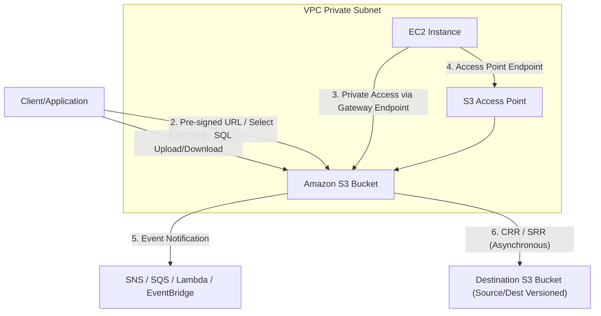

---
domains:
  - "aws"
class: reference-note
tier: reference-note
tags:
  - aws/s3
  - status/completed
---

# Module 3-6: AWS S3 Storage

This module covers scalable object storage using **Amazon Simple Storage Service (S3)**, lifecycle policies, storage tiers, access control, replication, encryption, performance tuning, and batch management.

---

## 🗺️ Cognitive Map: S3 Architecture, Endpoints & Integration


---

## 1. Amazon S3 Core Concepts & Object Structure

Amazon S3 is a regional object storage service designed for **99.999999999% (11 9s) durability**. It scales capacity infinitely and stores data as objects within resources called buckets.

### A. Object Key-Value Architecture
- **Flat Structure:** S3 does not use a traditional directory/file system. It is a flat key-value store.
- **Key Pathing:** S3 mimics "folders" in the console UI using the object **Key** (the full path to the file).
  - A key consists of a **Prefix** and the **Object Name**. E.g., for `s3://my-bucket/images/beach.jpg`, the prefix is `images/` and the object name is `beach.jpg`.
- **Naming Constraints:**
  - Namespaces can be **Global** (must be globally unique across all AWS accounts) or **Account Regional** (directory buckets).
  - Bucket names must be 3-63 characters, contain only lowercase letters, numbers, hyphens, and periods (no uppercase, no underscores).
  - Cannot be formatted as an IP address, cannot start with `xn--`, and cannot end with `-s3alias`.

### B. S3 Object Structure
An S3 object is composed of the following:
1. **Key:** The unique name of the object.
2. **Value (Data):** The actual binary byte stream content (0 bytes to 5 TB).
3. **Version ID:** A string identifying the unique version of the object (if versioning is enabled).
4. **Metadata:** Key-value pairs containing system metadata (e.g., Content-Type, Last-Modified) or user-defined custom metadata.
5. **Tags:** Up to 10 Unicode key-value pairs per object. Useful for lifecycle rules, cost allocation, and tag-based access control.

### C. Versioning States, Transitions & Delete Markers
Versioning protects against accidental deletions and overwrites by preserving history at the bucket level.
- **Versioning States:**
  - **Unversioned:** Default. Newly created objects have a version ID of `null`.
  - **Versioning-Enabled:** Every upload of the same key creates a new version ID.
  - **Versioning-Suspended:** Future uploads write to version ID `null` (overwriting any existing `null` version), but existing historical versions are preserved.
- **Delete Markers:**
  - Deleting an object in a versioned bucket without specifying a version ID creates a **Delete Marker** (a special version containing no data).
  - The delete marker becomes the current version, making the object appear deleted.
  - To restore the object, delete the Delete Marker version.
  - A **Permanent Delete** requires specifying the exact version ID to delete (cannot be undone).
- **MFA Delete:**
  - Requires Multi-Factor Authentication (MFA) to:
    1. Permanently delete an object version.
    2. Suspend versioning on the bucket.
  - Can **only** be configured via the AWS CLI or SDK by the AWS root account.

### D. Upload Limits & Protocols
- **Max Object Size:** **5 Terabytes** in S3.
- **Max Single PUT Size:** **5 Gigabytes**.
- **Multipart Upload:**
  - Splits a file into parts (up to 10,000 parts, from 5 MB to 5 GB each) uploaded in parallel. S3 reassembles them upon completion.
  - **Mandatory** for objects larger than **5 GB**; highly recommended for any upload over **100 MB** to maximize bandwidth and survive network drops.

---

## 2. S3 Storage Classes & Lifecycle Rules

S3 provides multiple storage classes optimized for different access frequencies, latencies, and billing durations.

### A. S3 Storage Class Comparison

| Storage Class | Durability | Availability | Min. Duration | Min. Billable Size | Retrieval Latency | Retrieval Fee | Use Case |
| :--- | :--- | :--- | :--- | :--- | :--- | :--- | :--- |
| **S3 Standard** | 11 9s | 99.99% | None | None | Milliseconds | None | Frequently accessed active data, analytics |
| **S3 Intelligent-Tiering** | 11 9s | 99.90% | None | None | Milliseconds | None (monitoring fee applies) | Unknown or changing access patterns |
| **S3 Standard-IA** | 11 9s | 99.90% | 30 Days | 128 KB | Milliseconds | Per GB | Infrequently accessed active data, backups |
| **S3 One Zone-IA** | 11 9s | 99.50% | 30 Days | 128 KB | Milliseconds | Per GB | Secondary backups, easily recreated data |
| **Glacier Instant Retrieval**| 11 9s | 99.90% | 90 Days | 128 KB | Milliseconds | Per GB | Archives accessed quarterly |
| **Glacier Flexible** | 11 9s | 99.90% | 90 Days | None | 1-5 mins (Expedited)<br>3-5 hrs (Standard)<br>5-12 hrs (Bulk) | Per GB | General backups, compliance archives |
| **Glacier Deep Archive** | 11 9s | 99.90% | 180 Days | None | 12 hrs (Standard)<br>48 hrs (Bulk) | Per GB | Multi-year regulatory archives |
| **S3 Express One Zone** | 11 9s | 99.90% | None | None | Single-digit ms | None | HPC, AI/ML training, Directory Buckets |
| **S3 on Outposts** | Local | Local | None | None | Single-digit ms | None | On-premises storage, local data residency |

> [!NOTE]
> **S3 Express One Zone (Directory Buckets):** Optimized for low-latency workloads. Co-locates compute and storage inside a single Availability Zone. Delivers up to 10x standard performance with 50% lower API request costs.
> **S3 on Outposts:** Delivers object storage local to your Outposts physical hardware, serving workloads that need high-throughput local storage or strict local data residency.

### B. Lifecycle Policies
Lifecycle configurations automate cost reductions using rules with two action types:
1. **Transition Actions:** Shift objects to cheaper classes based on age (e.g., Standard to Standard-IA after 30 days, Glacier after 90).
2. **Expiration Actions:** Deletes current versions, non-current versions, or aborts incomplete multipart uploads (e.g., abort incomplete uploads older than 7 days to stop paying for abandoned chunks).
- **Rule Filtering:** Can target the whole bucket, a specific prefix (`logs/`), or object tags (`Dept=Finance`).
- **S3 Storage Class Analysis:** Evaluates access patterns of Standard and Standard-IA objects to recommend transition times. Generates daily CSV reports after 24-48 hours of baseline collection.

---

## 3. S3 Access Control & Access Management

### A. Access Control Mechanisms
S3 access is private by default. Access permissions are evaluated using:
1. **IAM Policies (User-Scope):** Attached to IAM identities to define what S3 API calls the user/role can make.
2. **S3 Bucket Policies (Resource-Scope):** Attached directly to S3 buckets. Used for cross-account access, granting public access, and enforcing conditions (like HTTPS or encryption).
3. **Access Control Lists (ACLs - Legacy):** Fine-grained bucket/object permission control. Best practice is to keep ACLs disabled using **Bucket Owner Enforced** settings.
4. **Block Public Access:** A safety control at both bucket and account levels that ignores public ACLs or bucket policies to prevent data leaks.

### B. S3 Access Points
- **Definition:** Unique hostnames with dedicated access control policies pointing to specific prefixes in a bucket (e.g., a finance access point restricting access to `/finance`).
- **Scale Benefit:** Eliminates giant, complex bucket policies by delegating access to individual endpoints.
- **VPC Interface Endpoints:** Can restrict access points so they can only accept private requests from within a VPC.

### C. S3 Object Lambda
- Modifies S3 GET response data on the fly before returning it to the client.
- Uses an S3 Object Lambda Access Point to invoke an AWS Lambda function. The function fetches the file from the bucket, transforms it, and returns it.
- *Use Cases:* Redacting PII for compliance, dynamic watermarking, or real-time format conversion.

---

## 4. S3 Encryption Architecture

S3 supports encryption-at-rest (Server-Side/Client-Side) and encryption-in-transit (SSL/TLS).

### A. Server-Side Encryption (SSE) Types
1. **SSE-S3 (S3-Managed Keys):**
   - AES-256 encryption using keys managed and rotated by S3. Enabled by default.
   - Request Header: `"x-amz-server-side-encryption": "AES256"`.
2. **SSE-KMS (AWS KMS-Managed Keys):**
   - Utilizes AWS KMS keys. Enables key rotation, custom policies, and CloudTrail auditing.
   - Request Header: `"x-amz-server-side-encryption": "aws:kms"`.
   - **KMS API Quotas & Bucket Keys:** Each S3 call to a KMS-encrypted object triggers a KMS API call (`GenerateDataKey` or `Decrypt`). This can hit KMS throttling limits (5K-30K requests/sec). **S3 Bucket Keys** cache KMS key material, reducing KMS API calls and cost by up to 99%.
   - **Permissions:** Requesters need `s3:GetObject` on S3 and `kms:Decrypt` on the KMS key.
3. **SSE-C (Customer-Provided Keys):**
   - The user provides the key on every API call. AWS does not store the key and discards it after the operation.
   - **HTTPS is mandatory** to transmit keys in headers securely.
4. **DSSE-KMS (Double Engine KMS Encryption):**
   - Applies two distinct layers of server-side encryption with KMS keys to meet FIPS/strict compliance regulations.

### B. Client-Side Encryption (CSE)
- Data is encrypted locally before sending to AWS; decryption occurs locally after fetch. AWS stores only pre-encrypted blobs.

### C. Encryption in Transit (SSL/TLS)
- HTTPS can be enforced at the bucket level using a Bucket Policy with a Deny effect when `"aws:SecureTransport": "false"`.

```json
{
  "Version": "2012-10-17",
  "Statement": [
    {
      "Sid": "EnforceHTTPSOnly",
      "Effect": "Deny",
      "Principal": "*",
      "Action": "s3:*",
      "Resource": [
        "arn:aws:s3:::example-bucket",
        "arn:aws:s3:::example-bucket/*"
      ],
      "Condition": {
        "Bool": {
          "aws:SecureTransport": "false"
        }
      }
    }
  ]
}
```

---

## 5. S3 Replication (CRR vs. SRR)

Replication copies objects asynchronously across buckets.

### A. Core Requirements
- **Versioning:** Must be enabled on both source and destination buckets.
- **IAM Role:** S3 requires an IAM role with read permissions on the source bucket and write permissions on the destination bucket.

### B. Replication Types
- **Cross-Region Replication (CRR):** Source and destination buckets are in different AWS regions. Used for compliance, low-latency client access, and disaster recovery.
- **Same-Region Replication (SRR):** Source and destination buckets are in the same region. Used for log aggregation or syncing production data to staging.

### C. Advanced Replication Rules
- **Encrypted Objects (KMS):** By default, KMS-encrypted objects are not replicated. Replication must be configured to allow KMS replication, specifying destination KMS key policies and ARNs.
- **Ownership Overwrite:** Can configure S3 replication to change the owner of the replicated object to the destination bucket owner to avoid cross-account access locking.
- **Replicating Deletion Operations:**
  - **Delete Markers:** Replicating delete markers is optional/configurable.
  - **Version Deletions (Permanent Delete):** Specifying a version ID to delete is **never** replicated to prevent propagating malicious or accidental deletes.
- **Existing Objects:** Newly uploaded objects are replicated automatically. Replicating existing objects requires **S3 Batch Replication** (S3 Batch Operations).

---

## 6. Performance Optimization & Data Access

### A. S3 Baseline Performance & Prefixes
- S3 scales requests automatically based on prefixes.
- Limits: **3,500 PUT/COPY/POST/DELETE** and **5,500 GET/HEAD** requests per second **per prefix**.
- Designing applications with logical prefixes (e.g., partition folders `/dept1/`, `/dept2/`) allows scaling throughput linearly.

### B. Acceleration & Fetch Optimization
- **S3 Transfer Acceleration:** Routes traffic through near Edge Locations over AWS's high-speed private network instead of the public internet. Compatible with multipart upload.
- **Byte Range Fetches:** parallelizes GET requests by downloading specific byte offsets. Used to speed up downloads or inspect file headers without fetching the entire object.
- **S3 Select & Glacier Select:**
  - Allows querying object data (CSV, JSON, Parquet) using simple SQL statements at the S3 storage level.
  - S3 filters the data and only returns the requested subset. This reduces network data transfer, CPU cycles, and cost.

### C. S3 Requester Pays
- The owner pays for storage, but the requester pays for the API and network data transfer costs. Requesters must authenticate to AWS (no anonymous downloads allowed).

---

## 7. Data Protection & WORM (Object Lock & Vault Lock)

WORM (Write Once, Read Many) configurations prevent object deletion or modifications.

### A. S3 Glacier Vault Lock
- Set at the Glacier Vault level via a Vault Lock Policy.
- Once locked, the policy **cannot be edited or deleted by anyone**, including the AWS root account or AWS support.

### B. S3 Object Lock
- Configured at the S3 bucket level (requires versioning). Works on individual object versions.
- **Retention Modes:**
  - **Compliance Mode:** Locked versions cannot be deleted or overwritten by anyone, including the root user. The retention period cannot be shortened.
  - **Governance Mode:** Restricts deletion for most users. Users with `s3:BypassGovernanceRetention` permission (and specifying the header `x-amz-bypass-governance-retention: true`) can bypass the lock.
- **Legal Holds:**
  - Protects an object version indefinitely. Applied/removed via `s3:PutObjectLegalHold` permission. Does not use a timer.

---

## 8. S3 Batch Operations & Storage Lens

### A. S3 Batch Operations
- Runs bulk tasks on millions of existing objects (e.g., copying objects, replacing tags, restoring from Glacier, adding encryption, or invoking Lambda).
- Requires a manifest file (CSV or S3 Inventory report) listing the target objects. Handles retries and provides progress tracking and completion reports.

### B. S3 Storage Lens
- An analytics service providing organization-wide visibility into S3 usage.
- Tracks metrics across accounts, regions, buckets, and prefixes.
- **Tiers:**
  - **Free Metrics:** 28 usage metrics, 14 days of data retention.
  - **Advanced Metrics (Paid):** Activity metrics, cost optimization metrics, status codes, CloudWatch publishing, prefix-level tracking, and 15 months of retention.

---

## 🔍 Deeper Dive Notes
This table automatically displays all deeper notes, use cases, and pitfalls associated with S3.

```dataview
TABLE sub_type AS "Type", tags AS "Tags", source_type AS "Source"
WHERE class = "deeper-dive" AND icontains(string(parent_concept), this.file.name)
SORT file.name ASC
```

*Read more in [[Main Notes/Amazon S3]]*
