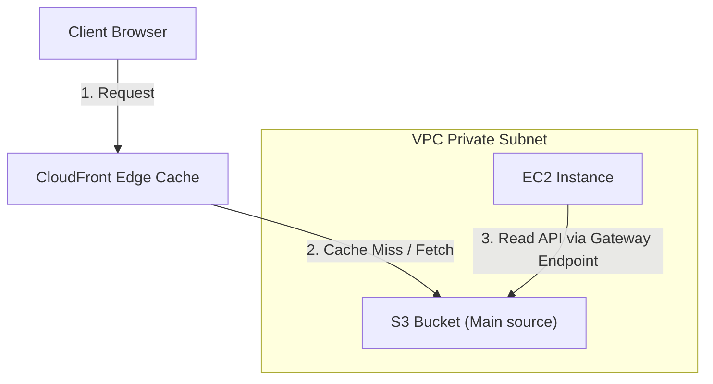

---
domains:
  - "aws"
  - "storage"
class: reference-note
tier: reference-note
tags:
  - aws/s3
  - aws/object-storage
---

# Module 3-6: AWS Amazon S3 Storage & Caching Architectures

This module covers scalable object storage using **Amazon Simple Storage Service (S3)**, lifecycle policies, storage tiers, cross-region replication, and analytics querying via **Amazon Athena**.

---

## 🗺️ Cognitive Map: S3 Gateway Endpoints & Caching



---

## 1. Amazon S3 (Simple Storage Service) Core Concepts
Amazon S3 is object storage designed for 99.999999999% (11 9s) durability.

### A. Core Features & Architecture
*   **Object Storage:** Stores data and metadata as a single object (file sizes up to 5TB).
*   **Global Unique Namespace:** Bucket names must be globally unique across all AWS accounts.
*   **Region-Scoped:** Buckets are created in a specific region and live outside the VPC.
*   **S3 Transfer Acceleration:** Uses CloudFront Edge Locations to route data over the optimized AWS backbone network to S3.

### B. S3 Storage Tiers
*   **S3 Standard:** Low latency, high throughput for active workloads.
*   **S3 Intelligent-Tiering:** Automatically optimizes costs by moving objects between frequent and infrequent access tiers.
*   **S3 Standard-IA / One Zone-IA:** Low-cost storage for infrequently accessed data (retrieval fees apply).
*   **S3 Glacier Instant / Flexible / Deep Archive:** Secure, durable archive options ranging from seconds to hours retrieval.

---

## 2. Bucket Policies & Security
*   **Bucket Policies:** JSON resources attached to the S3 bucket itself. Controls access globally.
*   **IAM Policies:** Attached to users/roles requesting API access.
*   **VPC Endpoints (Gateway):** Routing targets inside VPC route tables allowing private subnets to reach S3 directly without going to the public internet.

---

## 3. Replication & Querying (Athena)
*   **Replication:** Supports Cross-Region Replication (CRR) and Same-Region Replication (SRR). Requires S3 Versioning enabled.
*   **Amazon Athena:** An interactive query service allowing SQL queries directly against data sitting inside S3 buckets without needing database loading.

---

## 4. Hands-on Lab: Configuring S3 Bucket Policies
Create a bucket policy restricting reads strictly to specific IAM Roles inside an organization:
```json
{
  "Version": "2012-10-17",
  "Statement": [
    {
      "Sid": "AllowSpecificRole",
      "Effect": "Allow",
      "Principal": "*",
      "Action": "s3:GetObject",
      "Resource": "arn:aws:s3:::my-secure-data-bucket/*",
      "Condition": {
        "ArnEquals": {
          "aws:PrincipalArn": "arn:aws:iam::123456789012:role/AppExecutionRole"
        }
      }
    }
  ]
}
```

