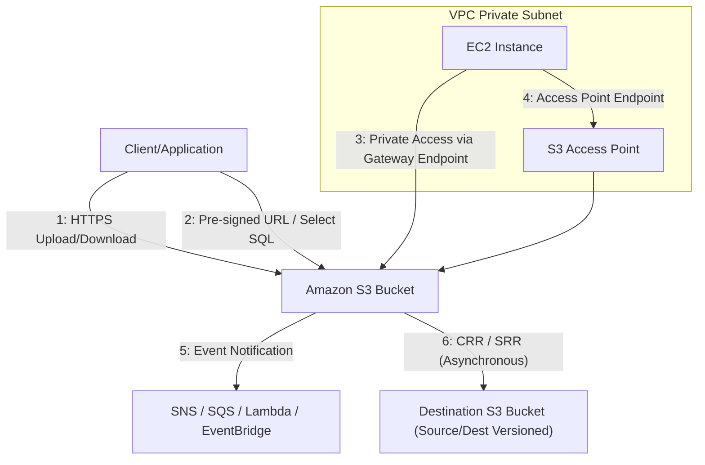

---
domains:
  - "aws"
class: reference-note
tier: reference-note
tags:
  - aws/s3
  - status/completed
---

# Module 3-6: AWS S3 Storage

This module covers scalable object storage using **Amazon Simple Storage Service (S3)**, lifecycle policies, storage tiers, access control, replication, encryption, performance tuning, and batch management.

---

## 🗺️ Cognitive Map: S3 Architecture, Endpoints & Integration


---

## 1. Amazon S3 Core Concepts & Object Structure

Amazon S3 is a regional object storage service designed for **99.999999999% (11 9s) durability**. It scales capacity infinitely and stores data as objects within resources called buckets.

### A. Object Key-Value Architecture
- **Flat Structure:** S3 does not use a traditional directory/file system. It is a flat key-value store.
- **Key Pathing:** S3 mimics "folders" in the console UI using the object **Key** (the full path to the file).
  - A key consists of a **Prefix** and the **Object Name**. E.g., for `s3://my-bucket/images/beach.jpg`, the prefix is `images/` and the object name is `beach.jpg`.
- **Naming Constraints:**
  - Namespaces can be **Global** (must be globally unique across all AWS accounts) or **Account Regional** (directory buckets).
  - Bucket names must be 3-63 characters, contain only lowercase letters, numbers, hyphens, and periods (no uppercase, no underscores).
  - Cannot be formatted as an IP address, cannot start with `xn--`, and cannot end with `-s3alias`.

### B. S3 Object Structure
An S3 object is composed of the following:
1. **Key:** The unique name of the object.
2. **Value (Data):** The actual binary byte stream content (0 bytes to 5 TB).
3. **Version ID:** A string identifying the unique version of the object (if versioning is enabled).
4. **Metadata:** Key-value pairs containing system metadata (e.g., Content-Type, Last-Modified) or user-defined custom metadata.
5. **Tags:** Up to 10 Unicode key-value pairs per object. Useful for lifecycle rules, cost allocation, and tag-based access control.

### C. Versioning States, Transitions & Delete Markers
Versioning protects against accidental deletions and overwrites by preserving history at the bucket level.
- **Versioning States:**
  - **Unversioned:** Default. Newly created objects have a version ID of `null`.
  - **Versioning-Enabled:** Every upload of the same key creates a new version ID.
  - **Versioning-Suspended:** Future uploads write to version ID `null` (overwriting any existing `null` version), but existing historical versions are preserved.
- **Delete Markers:**
  - Deleting an object in a versioned bucket without specifying a version ID creates a **Delete Marker** (a special version containing no data).
  - The delete marker becomes the current version, making the object appear deleted.
  - To restore the object, delete the Delete Marker version.
  - A **Permanent Delete** requires specifying the exact version ID to delete (cannot be undone).
- **MFA Delete:**
  - Requires Multi-Factor Authentication (MFA) to:
    1. Permanently delete an object version.
    2. Suspend versioning on the bucket.
  - Can **only** be configured via the AWS CLI or SDK by the AWS root account.

### D. Upload Limits & Protocols
- **Max Object Size:** **5 Terabytes** in S3.
- **Max Single PUT Size:** **5 Gigabytes**.
- **Multipart Upload:**
  - Splits a file into parts (up to 10,000 parts, from 5 MB to 5 GB each) uploaded in parallel. S3 reassembles them upon completion.
  - **Mandatory** for objects larger than **5 GB**; highly recommended for any upload over **100 MB** to maximize bandwidth and survive network drops.

---

## 2. S3 Storage Classes & Lifecycle Rules

S3 provides multiple storage classes optimized for different access frequencies, latencies, and billing durations.

### A. S3 Storage Class Comparison

| Storage Class | Durability | Availability | Min. Duration | Min. Billable Size | Retrieval Latency | Retrieval Fee | Use Case |
| :--- | :--- | :--- | :--- | :--- | :--- | :--- | :--- |
| **S3 Standard** | 11 9s | 99.99% | None | None | Milliseconds | None | Frequently accessed active data, analytics |
| **S3 Intelligent-Tiering** | 11 9s | 99.90% | None | None | Milliseconds | None (monitoring fee applies) | Unknown or changing access patterns |
| **S3 Standard-IA** | 11 9s | 99.90% | 30 Days | 128 KB | Milliseconds | Per GB | Infrequently accessed active data, backups |
| **S3 One Zone-IA** | 11 9s | 99.50% | 30 Days | 128 KB | Milliseconds | Per GB | Secondary backups, easily recreated data |
| **Glacier Instant Retrieval**| 11 9s | 99.90% | 90 Days | 128 KB | Milliseconds | Per GB | Archives accessed quarterly |
| **Glacier Flexible** | 11 9s | 99.90% | 90 Days | None | 1-5 mins (Expedited)<br>3-5 hrs (Standard)<br>5-12 hrs (Bulk) | Per GB | General backups, compliance archives |
| **Glacier Deep Archive** | 11 9s | 99.90% | 180 Days | None | 12 hrs (Standard)<br>48 hrs (Bulk) | Per GB | Multi-year regulatory archives |
| **S3 Express One Zone** | 11 9s | 99.90% | None | None | Single-digit ms | None | HPC, AI/ML training, Directory Buckets |
| **S3 on Outposts** | Local | Local | None | None | Single-digit ms | None | On-premises storage, local data residency |

> [!NOTE]
> **S3 Express One Zone (Directory Buckets):** Optimized for low-latency workloads. Co-locates compute and storage inside a single Availability Zone. Delivers up to 10x standard performance with 50% lower API request costs.
> **S3 on Outposts:** Delivers object storage local to your Outposts physical hardware, serving workloads that need high-throughput local storage or strict local data residency.

### B. Lifecycle Policies
Lifecycle configurations automate cost reductions using rules with two action types:
1. **Transition Actions:** Shift objects to cheaper classes based on age (e.g., Standard to Standard-IA after 30 days, Glacier after 90).
2. **Expiration Actions:** Deletes current versions, non-current versions, or aborts incomplete multipart uploads (e.g., abort incomplete uploads older than 7 days to stop paying for abandoned chunks).
- **Rule Filtering:** Can target the whole bucket, a specific prefix (`logs/`), or object tags (`Dept=Finance`).
- **S3 Storage Class Analysis:** Evaluates access patterns of Standard and Standard-IA objects to recommend transition times. Generates daily CSV reports after 24-48 hours of baseline collection.

---

## 3. S3 Access Control & Access Management

### A. Access Control Mechanisms
S3 access is private by default. Access permissions are evaluated using:
1. **IAM Policies (User-Scope):** Attached to IAM identities to define what S3 API calls the user/role can make.
2. **S3 Bucket Policies (Resource-Scope):** Attached directly to S3 buckets. Used for cross-account access, granting public access, and enforcing conditions (like HTTPS or encryption).
3. **Access Control Lists (ACLs - Legacy):** Fine-grained bucket/object permission control. Best practice is to keep ACLs disabled using **Bucket Owner Enforced** settings.
4. **Block Public Access:** A safety control at both bucket and account levels that ignores public ACLs or bucket policies to prevent data leaks.

### B. S3 Access Points
- **Definition:** Unique hostnames with dedicated access control policies pointing to specific prefixes in a bucket (e.g., a finance access point restricting access to `/finance`).
- **Scale Benefit:** Eliminates giant, complex bucket policies by delegating access to individual endpoints.
- **VPC Interface Endpoints:** Can restrict access points so they can only accept private requests from within a VPC.

#### ⚖️ S3 Access Points vs. VPC Gateway Endpoints
A very common point of confusion is distinguishing S3 Access Points from VPC Gateway Endpoints, as both are used to secure private data access.

| Feature | VPC Gateway Endpoint (Networking Layer) | S3 Access Point Endpoint (Permission Layer) |
| :--- | :--- | :--- |
| **Primary Goal** | **Network Routing:** Establishes private network path from VPC to S3 without internet. | **Permission Isolation:** Solves S3 bucket policy bloat for multi-tenant buckets. |
| **How it Works** | Modifies VPC route tables to direct S3-destined traffic over internal AWS backbone. | Creates a unique DNS hostname and dedicated IAM policy for a specific team or prefix. |
| **Access Control** | Controls *which networks* can route traffic to S3 (via Endpoint Policies). | Controls *who* can access *which path* via a dedicated endpoint-level DNS gateway. |
| **Cost** | Completely free (replaces NAT Gateway data transit costs). | Free (standard S3 API and storage fees apply). |

##### How They Work Together:
In an enterprise private network, an EC2 instance in a private subnet routes its S3 API traffic through a **VPC Gateway Endpoint** (networking layer) to reach a specific **S3 Access Point** DNS name (permission layer), which verifies that the request originates from the private VPC and belongs to the authorized group before allowing access to the S3 bucket prefix.

#### ⚖️ S3 Gateway Endpoints vs. AWS PrivateLink (Interface Endpoints)
Another critical distinction in S3 private networking is deciding between route-based endpoints and physical interface endpoints.

| Feature                | S3 Gateway Endpoint                                                                     | S3 Interface Endpoint (PrivateLink)                                                        |
| :--------------------- | :-------------------------------------------------------------------------------------- | :----------------------------------------------------------------------------------------- |
| **Technology**         | **Route Table Prefix List**                                                             | **Elastic Network Interface (ENI)**                                                        |
| **Setup Footprint**    | No physical resource in your subnet. Modifies VPC route tables to intercept S3 traffic. | Provisions a real network interface (ENI) with a private IP from your subnet's CIDR block. |
| **On-Premises Access** | **No.** On-prem servers (via VPN/Direct Connect) cannot route to it.                    | **Yes.** Being an IP in the subnet, VPN/Direct Connect routes can reach it directly.       |
| **Cross-VPC Peering**  | **No.** Peered VPCs cannot transit route through a Gateway Endpoint.                    | **Yes.** Fully accessible across VPC Peering and Transit Gateways.                         |
| **Supported Services** | Only **S3** and **DynamoDB**.                                                           | Almost all AWS services (ECR, Kinesis, SSM, etc.) and SaaS partner offerings.              |
| **Cost**               | **100% Free** (No hourly charge, no data processing fees).                              | **Paid.** Hourly rate (~$0.01/hr per AZ) + data processing fees (~$0.01 per GB).           |

##### Architectural Best Practice:
*   Use the **S3 Gateway Endpoint** for all workloads running **inside** the VPC (free and unlimited throughput).
*   Use the **S3 Interface Endpoint (PrivateLink)** only for workloads calling S3 from **outside** the VPC (on-premises servers or peering networks).

#### 🌐 S3 DNS Resolution Inside a Private VPC
A critical question in S3 private networking is: *Which DNS hostname does an internal EC2 instance use to call S3 privately?*
AWS allows applications to use standard DNS names, handling private routing transparently:

1.  **Using S3 Gateway Endpoints:**
    *   Applications use the **standard public DNS name** (e.g., `my-bucket.s3.us-east-1.amazonaws.com`).
    *   The name resolves to S3's public IPs, but the **VPC Route Table** intercepts the outgoing traffic and directs it over the private AWS backbone. No application code changes are needed.
2.  **Using S3 Interface Endpoints (PrivateLink):**
    *   **Option A: Enable Private DNS (Recommended):** AWS associates a private hosted zone with your VPC. The standard S3 DNS names automatically resolve directly to the **private IPs of the S3 ENIs** in your subnet (e.g. `10.0.1.50`). Code remains unchanged.
    *   **Option B: Endpoint-Specific DNS Names (Manual):** If Private DNS is disabled, you must use the custom AWS-generated endpoint DNS name (e.g., `bucket.vpce-xxx.s3.us-east-1.vpce.amazonaws.com`) and configure your application client to override the default S3 URL.

#### ⚙️ Why Use S3 Interface Endpoints (PrivateLink) inside a Private VPC?
Since S3 Gateway Endpoints are free and offer unlimited throughput, why would an architect ever deploy a paid S3 Interface Endpoint (PrivateLink) inside a private VPC in the same region? There are **three core enterprise use cases**:

1.  **Shared Services (Cross-VPC Peering/Transit Gateway):**
    Gateway Endpoints are **non-transitive** (you cannot route through a gateway endpoint from peered VPCs or Transit Gateway spokes). If you want to centralize S3 egress traffic through a single "Shared Services Hub VPC", you must deploy an S3 Interface Endpoint in the Hub.
2.  **Stateful Firewall Filtering (Security Groups):**
    S3 Gateway Endpoints **do not support Security Groups** (network access can only be controlled via IAM policies). Because an Interface Endpoint creates a physical ENI in your subnet, you can attach standard Security Groups to it, restricting S3 access at the packet layer (e.g., *"Only allow HTTPS from the PaymentProcessing security group"*).
3.  **Hybrid On-Premises Targets:**
    On-premises servers connected via VPN or Direct Connect cannot route traffic to Gateway Endpoints. You must deploy an Interface Endpoint to provide a private, reachable IP address (e.g., `10.0.1.50`) for on-premises database backup scripts.


### C. S3 Object Lambda
- Modifies S3 GET response data on the fly before returning it to the client.
- Uses an S3 Object Lambda Access Point to invoke an AWS Lambda function. The function fetches the file from the bucket, transforms it, and returns it.
- *Use Cases:* Redacting PII for compliance, dynamic watermarking, or real-time format conversion.

---

## 4. S3 Encryption Architecture

S3 supports encryption-at-rest (Server-Side/Client-Side) and encryption-in-transit (SSL/TLS).

### A. Server-Side Encryption (SSE) Types
1. **SSE-S3 (S3-Managed Keys):**
   - AES-256 encryption using keys managed and rotated by S3. Enabled by default.
   - Request Header: `"x-amz-server-side-encryption": "AES256"`.
2. **SSE-KMS (AWS KMS-Managed Keys):**
   - Utilizes AWS KMS keys. Enables key rotation, custom policies, and CloudTrail auditing.
   - Request Header: `"x-amz-server-side-encryption": "aws:kms"`.
   - **KMS API Quotas & Bucket Keys:** Each S3 call to a KMS-encrypted object triggers a KMS API call (`GenerateDataKey` or `Decrypt`). This can hit KMS throttling limits (5K-30K requests/sec). **S3 Bucket Keys** cache KMS key material, reducing KMS API calls and cost by up to 99%.
   - **Permissions:** Requesters need `s3:GetObject` on S3 and `kms:Decrypt` on the KMS key.
3. **SSE-C (Customer-Provided Keys):**
   - The user provides the key on every API call. AWS does not store the key and discards it after the operation.
   - **HTTPS is mandatory** to transmit keys in headers securely.
4. **DSSE-KMS (Double Engine KMS Encryption):**
   - Applies two distinct layers of server-side encryption with KMS keys to meet FIPS/strict compliance regulations.

### B. Client-Side Encryption (CSE)
- Data is encrypted locally before sending to AWS; decryption occurs locally after fetch. AWS stores only pre-encrypted blobs.

### C. Encryption in Transit (SSL/TLS)
S3 endpoints support both HTTP (unencrypted) and HTTPS (encrypted) traffic natively. 

*   **Certificate Management (AWS-Managed):** You **do not** create Certificate Authorities (CAs) or generate SSL certificates for S3. AWS automatically provisions, rotates, and binds public SSL/TLS certificates (issued by Amazon Trust Services) to all native S3 endpoints.
*   **Enforcement Mechanism:** Enforce secure transport at the bucket level using a Bucket Policy that explicitly **denies** any request where `"aws:SecureTransport": "false"` (meaning the request was sent via unencrypted HTTP).

#### S3 HTTPS-Only Bucket Policy:
```json
{
  "Version": "2012-10-17",
  "Statement": [
    {
      "Sid": "EnforceHTTPSOnly",
      "Effect": "Deny",
      "Principal": "*",
      "Action": "s3:*",
      "Resource": [
        "arn:aws:s3:::example-bucket",
        "arn:aws:s3:::example-bucket/*"
      ],
      "Condition": {
        "Bool": {
          "aws:SecureTransport": "false"
        }
      }
    }
  ]
}
```

#### 🌐 Custom Domains & Static Websites:
*   **Limitation:** S3 static website hosting endpoints **do not support SSL/TLS natively for custom domains** (e.g. `http://www.mycompany.com`).
*   **Resolution Pattern:** Deploy **Amazon CloudFront** in front of the S3 website. Request a free SSL certificate from **AWS Certificate Manager (ACM)** for the custom domain and bind it to the CloudFront distribution. CloudFront terminates HTTPS at the edge and fetches files privately from S3.

---

## 5. S3 Replication (CRR vs. SRR)

Replication copies objects asynchronously across buckets.

### A. Core Requirements
- **Versioning:** Must be enabled on both source and destination buckets.
- **IAM Role:** S3 requires an IAM role with read permissions on the source bucket and write permissions on the destination bucket.

### B. Replication Types
- **Cross-Region Replication (CRR):** Source and destination buckets are in different AWS regions. Used for compliance, low-latency client access, and disaster recovery.
- **Same-Region Replication (SRR):** Source and destination buckets are in the same region. Used for log aggregation or syncing production data to staging.

### C. Advanced Replication Rules
- **Encrypted Objects (KMS):** By default, KMS-encrypted objects are not replicated. Replication must be configured to allow KMS replication, specifying destination KMS key policies and ARNs.
- **Ownership Overwrite:** Can configure S3 replication to change the owner of the replicated object to the destination bucket owner to avoid cross-account access locking.
- **Replicating Deletion Operations:**
  - **Delete Markers:** Replicating delete markers is optional/configurable.
  - **Version Deletions (Permanent Delete):** Specifying a version ID to delete is **never** replicated to prevent propagating malicious or accidental deletes.
- **Existing Objects:** Newly uploaded objects are replicated automatically. Replicating existing objects requires **S3 Batch Replication** (S3 Batch Operations).

### D. Replication with Server-Side Encryption (SSE)
S3 replication behavior is heavily dependent on the object's encryption configuration:

1.  **SSE-S3 (S3-Managed Keys):** Replicated by default. S3 handles all decryption and encryption cycles automatically.
2.  **SSE-C (Customer-Provided Keys):** Cannot be replicated. S3 does not store the encryption key, so it cannot decrypt the object to copy it. S3 replication will skip SSE-C objects.
3.  **SSE-KMS (Key Management Service Keys):** **Not replicated by default.** To enable S3 replication for KMS-encrypted objects, three settings must be configured:
    *   **S3 Replication Configuration:** Explicitly enable the replication of KMS-encrypted objects and specify the destination KMS Key ARN.
    *   **Source KMS Key Policy:** Grant the S3 replication IAM role permission to decrypt (`kms:Decrypt` and `kms:DescribeKey`).
    *   **Destination KMS Key Policy:** Grant the S3 replication IAM role permission to encrypt (`kms:Encrypt`, `kms:GenerateDataKey*`, `kms:DescribeKey`).

#### 🚨 The Cross-Account KMS Constraint:
When replicating KMS-encrypted objects across different AWS accounts, you **cannot** encrypt the destination bucket using the default AWS-managed KMS key for S3 (`aws/s3`). AWS-managed key policies are fixed and cannot be modified to trust a replication role from another account. You **must** create a custom **Customer Managed Key (CMK)** in the destination account and modify its policy to allow access to the source account's S3 replication IAM role.

---


## 6. Performance Optimization & Data Access

### A. S3 Baseline Performance & Prefixes
- S3 scales requests automatically based on prefixes.
- Limits: **3,500 PUT/COPY/POST/DELETE** and **5,500 GET/HEAD** requests per second **per prefix**.
- Designing applications with logical prefixes (e.g., partition folders `/dept1/`, `/dept2/`) allows scaling throughput linearly.

### B. Acceleration & Fetch Optimization
- **S3 Transfer Acceleration:** Routes traffic through near Edge Locations over AWS's high-speed private network instead of the public internet. Compatible with multipart upload.
- **Byte Range Fetches:** parallelizes GET requests by downloading specific byte offsets. Used to speed up downloads or inspect file headers without fetching the entire object.
- **S3 Select & Glacier Select:**
  - Allows querying object data (CSV, JSON, Parquet) using simple SQL statements at the S3 storage level.
  - S3 filters the data and only returns the requested subset. This reduces network data transfer, CPU cycles, and cost.

### C. S3 Requester Pays
- The owner pays for storage, but the requester pays for the API and network data transfer costs. Requesters must authenticate to AWS (no anonymous downloads allowed).

---

## 7. Data Protection & WORM (Object Lock & Vault Lock)

WORM (Write Once, Read Many) configurations prevent object deletion or modifications.

### A. S3 Glacier Vault Lock
- Set at the Glacier Vault level via a Vault Lock Policy.
- Once locked, the policy **cannot be edited or deleted by anyone**, including the AWS root account or AWS support.

### B. S3 Object Lock
- Configured at the S3 bucket level (requires versioning). Works on individual object versions.
- **Retention Modes:**
  - **Compliance Mode:** Locked versions cannot be deleted or overwritten by anyone, including the root user. The retention period cannot be shortened.
  - **Governance Mode:** Restricts deletion for most users. Users with `s3:BypassGovernanceRetention` permission (and specifying the header `x-amz-bypass-governance-retention: true`) can bypass the lock.
- **Legal Holds:**
  - Protects an object version indefinitely. Applied/removed via `s3:PutObjectLegalHold` permission. Does not use a timer.

---

## 8. S3 Batch Operations & Storage Lens

### A. S3 Batch Operations
- Runs bulk tasks on millions of existing objects (e.g., copying objects, replacing tags, restoring from Glacier, adding encryption, or invoking Lambda).
- Requires a manifest file (CSV or S3 Inventory report) listing the target objects. Handles retries and provides progress tracking and completion reports.

### B. S3 Storage Lens
- An analytics service providing organization-wide visibility into S3 usage.
- Tracks metrics across accounts, regions, buckets, and prefixes.
- **Tiers:**
  - **Free Metrics:** 28 usage metrics, 14 days of data retention.
  - **Advanced Metrics (Paid):** Activity metrics, cost optimization metrics, status codes, CloudWatch publishing, prefix-level tracking, and 15 months of retention.

---

## 9. Terraform Resource Primitives for S3 Storage

Manage S3 bucket properties, access policies, and website hosting using Terraform HCL resources.

### A. Standard S3 Bucket with Encryption and Versioning
```hcl
# 1. Create S3 Bucket
resource "aws_s3_bucket" "bucket" {
  bucket = "my-company-data-vault-12345"
}

# 2. Configure Bucket Versioning
resource "aws_s3_bucket_versioning" "versioning" {
  bucket = aws_s3_bucket.bucket.id
  versioning_configuration {
    status = "Enabled"
  }
}

# 3. Configure Server-Side Encryption (SSE-S3 by default)
resource "aws_s3_bucket_server_side_encryption_configuration" "encrypt" {
  bucket = aws_s3_bucket.bucket.id

  rule {
    apply_server_side_encryption_by_default {
      sse_algorithm = "AES256"
    }
  }
}

# 4. Enforce Private Block Access
resource "aws_s3_bucket_public_access_block" "private" {
  bucket                  = aws_s3_bucket.bucket.id
  block_public_acls       = true
  block_public_policy     = true
  ignore_public_acls      = true
  restrict_public_buckets = true
}
```

### B. Static Website Hosting S3 Configuration
```hcl
# Create Bucket for Website
resource "aws_s3_bucket" "web" {
  bucket = "my-company-static-website-12345"
}

# Configure Website configuration block
resource "aws_s3_bucket_website_configuration" "web_config" {
  bucket = aws_s3_bucket.web.id

  index_document {
    suffix = "index.html"
  }

  error_document {
    key = "error.html"
  }
}
```

---

## 🔍 Deeper Dive Notes
This table automatically displays all deeper notes, use cases, and pitfalls associated with S3.

```dataview
TABLE sub_type AS "Type", tags AS "Tags", source_type AS "Source"
WHERE class = "deeper-dive" AND icontains(string(parent_concept), this.file.name)
SORT file.name ASC
```

*Read more in [[Main Notes/Amazon S3]]*
