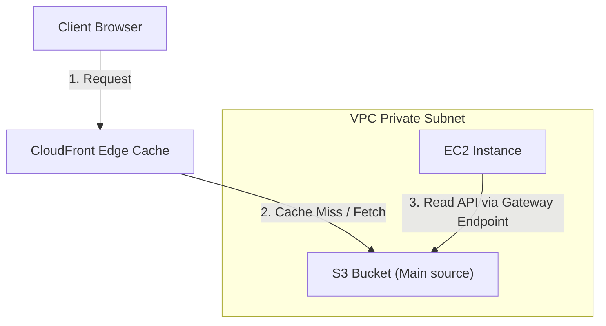

---
domains:
  - "aws"
  - "storage"
class: reference-note
tier: reference-note
tags:
  - aws/s3
  - aws/object-storage
---

# Module 3-6: AWS S3 Storage

This module covers scalable object storage using **Amazon Simple Storage Service (S3)**, lifecycle policies, storage tiers, cross-region replication, and analytics querying via **Amazon Athena**.

---

## 🗺️ Cognitive Map: S3 Gateway Endpoints & Caching



---

## 1. Amazon S3 (Simple Storage Service) Core Concepts
Amazon S3 is object storage designed for 99.999999999% (11 9s) durability.

### A. Core Features & Architecture


---

## 2. Content Delivery Networks & CloudFront Integration


---

## 3. S3 Gateway Endpoints & Private Networking


---

## 4. Athena Querying & Caching Tiers
*   **Amazon Athena:** An interactive query service allowing SQL queries directly against data sitting inside S3 buckets without needing database loading.
*   **Storage Tiers:** S3 Standard, Intelligent-Tiering, Standard-IA, One Zone-IA, Glacier Instant/Flexible/Deep Archive.

---

## 5. Hands-on Lab: Configuring S3 Bucket Policies
Create a bucket policy restricting reads strictly to specific IAM Roles inside an organization:
```json
{
  "Version": "2012-10-17",
  "Statement": [
    {
      "Sid": "AllowSpecificRole",
      "Effect": "Allow",
      "Principal": "*",
      "Action": "s3:GetObject",
      "Resource": "arn:aws:s3:::my-secure-data-bucket/*",
      "Condition": {
        "ArnEquals": {
          "aws:PrincipalArn": "arn:aws:iam::123456789012:role/AppExecutionRole"
        }
      }
    }
  ]
}
```

