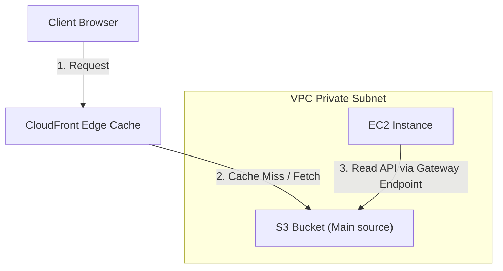

---
domains:
  - "aws"
  - "storage"
class: reference-note
tier: reference-note
tags:
  - aws/s3
  - aws/object-storage
---

# Module 3-6: AWS S3 Storage

This module covers scalable object storage using **Amazon Simple Storage Service (S3)**, lifecycle policies, storage tiers, cross-region replication, and analytics querying via **Amazon Athena**.

---

## 🗺️ Cognitive Map: S3 Gateway Endpoints & Caching



---

## 1. Amazon S3 (Simple Storage Service) Core Concepts
Amazon S3 is object storage designed for 99.999999999% (11 9s) durability.

### A. Core Features & Architecture
![[Pasted image 20250509111142.png]]
## AWS S3 -Simple Storage Service / Object Storage
![[Pasted image 20250509113404.png]]
- It's Object Storage based, Data & Meta-Data stored as whole object & not divided into objects "as in Block Storage".
- Cheaper than Block Storage "as EBS Volumes"
- Better scalability & durability.
- **Cannot be mounted as a drive or a directory to an EC2 instance. it can only be accessed through API's** 
- Ideal for data growth storage as there is no limit on amount of data or metadata in an object, only the maximum size of a file is 5 Terabyte
- S3 Storages are called S3 Buckets, & the Buckets are confined to the Region & outside the VPC, **backing up it to another regions must be done manually**. since its outside the VPC NACL and security groups are not applied to it 
- The S3 Buckets' names are Globally Unique.
- There are no actual folders within a bucket, however this can be mimicked and attach a folder name to objects for work organization.


![[Pasted image 20250509114119.png]]


#AWS-S3-SCOPE
Regional scope 

---

## 2. Content Delivery Networks & CloudFront Integration
## CDN - Content Delivery Network (Amazon CloudFront)
- Amazon CloudFront Provides highly available cache to compensate using multiple resources for less latency "**ex:** Accessing data from S3 buckets through different countries"
- using CloudFront is more economically efficient than using different Buckets.
- These Cache Locations are called Edge Locations.


Red squares refers to edge locations, if edge locations doesn't have the requested data cached it uses its high speed links to the main s3 bucket source and fetch the data so the fetch process was faster than the user connecting directly to the s3 and if the data was requested again its already cached in the edge location 

Using Cloud-Front is guaranteed to be cheaper than fetching content directly from an s3 bucket, can be a question on how to reduce s3 bucket cost usage 


## Amazon Route 53 

---

## 3. S3 Gateway Endpoints & Private Networking
*ie:* Traffic going from the private subnet to the service does not go through the internet.
- They are ``virtual devices, that are redundant, scalable, & highly available.
- They allow VPC workloads to connect to supported AWS services without leaving the AWS network, thus no need of NAT instances or gateways.
- It has two types : **Gateway or Interface Endpoints***. "usage of each is according to the service."
*Note:* Only S3 & DynamoDB uses Gateways Endpoints, while services inside the VPC use Interface Endpoints.


##### 1- Gateway Endpoints

![[Pasted image 20250516222112.png]]

![[Pasted image 20250516222112.png]]

- **Set as a target in the subnet's routing table**
- Redundant & highly available.
- Only one is required per VPC, but each gateway reaches a service
  so You can configure multiple gateways for different services.
- Region Specific.
- No Security Groups.


---

## 4. Athena Querying & Caching Tiers
*   **Amazon Athena:** An interactive query service allowing SQL queries directly against data sitting inside S3 buckets without needing database loading.
*   **Storage Tiers:** S3 Standard, Intelligent-Tiering, Standard-IA, One Zone-IA, Glacier Instant/Flexible/Deep Archive.

---

## 5. Hands-on Lab: Configuring S3 Bucket Policies
Create a bucket policy restricting reads strictly to specific IAM Roles inside an organization:
```json
{
  "Version": "2012-10-17",
  "Statement": [
    {
      "Sid": "AllowSpecificRole",
      "Effect": "Allow",
      "Principal": "*",
      "Action": "s3:GetObject",
      "Resource": "arn:aws:s3:::my-secure-data-bucket/*",
      "Condition": {
        "ArnEquals": {
          "aws:PrincipalArn": "arn:aws:iam::123456789012:role/AppExecutionRole"
        }
      }
    }
  ]
}
```

