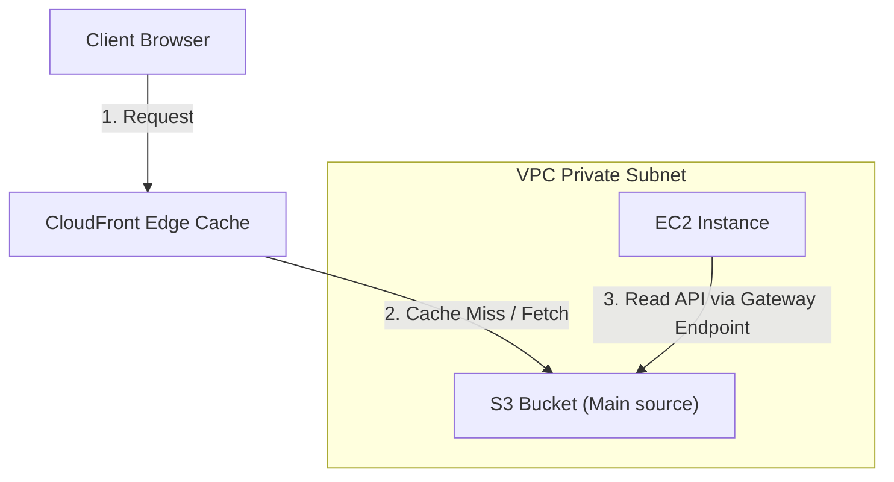
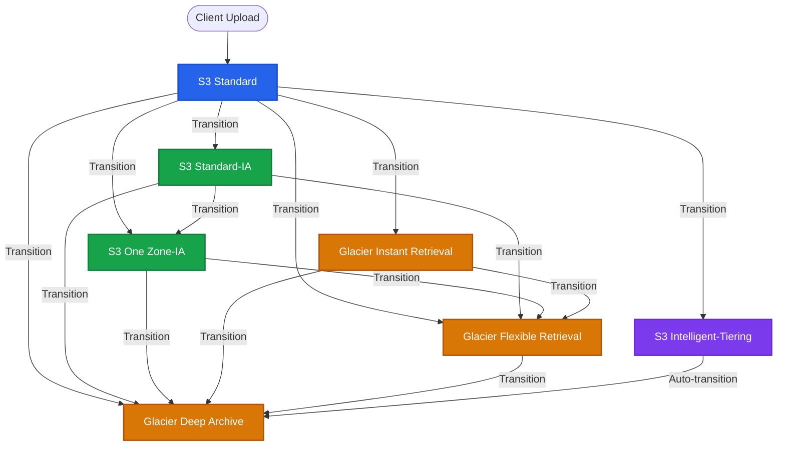

---
domains:
  - "aws"
class: reference-note
tier: reference-note
tags:
  - aws/s3
  - status/completed
---

# Module 3-6: AWS S3 Storage

This module covers scalable object storage using **Amazon Simple Storage Service (S3)**, lifecycle policies, storage tiers, cross-region replication, and analytics querying via **Amazon Athena**.

---

## 🗺️ Cognitive Map: S3 Gateway Endpoints & Caching


---

## 1. Amazon S3 (Simple Storage Service) Core Concepts

Amazon S3 is object storage designed for 99.999999999% (11 9s) durability. It stores data as objects within resources called buckets.

### A. Key Features & Architecture
- **Object-Based Storage:** Unlike block storage (such as EBS), S3 stores data and metadata as whole objects.
- **Cost-Effectiveness:** Significantly cheaper than block storage or file system storage.
- **Scalability & Durability:** Designed for high scalability and 11 9s of durability across multiple availability zones.
- **Access Patterns:** S3 is a regional service outside the VPC. It cannot be mounted directly as a block device or directory to an EC2 instance. Access is strictly via HTTP/HTTPS REST APIs or SDKs/CLI.
- **S3 Key Structure:**
  - Objects are stored in flat bucket structures. S3 has no native concept of "directories" or "folders."
  - The UI mimics folders using the object **Key** (the full path to the file).
  - A key consists of a **Prefix** and the **Object Name**. E.g., for `s3://my-bucket/images/beach.jpg`, the prefix is `images/` and the object name is `beach.jpg`.

### B. Size Limits & Upload Protocols
- **Maximum Object Size:** The maximum size of a single S3 object is **5 Terabytes**.
- **Upload Constraints:** A single PUT request can upload files up to **5 Gigabytes**.
- **Multipart Upload:** 
  - Must be used for files larger than **5 GB** and is highly recommended for any file over **100 MB**.
  - In a multipart upload, the client splits a large file into multiple smaller chunks (up to 10,000 parts, from 5 MB to 5 GB each) and uploads them in parallel to S3. Once all parts are uploaded, S3 reassembles them into the original object.
  - This increases transfer throughput, parallelizes network usage, and provides resilience against transmission failures (you only retry failed parts).

---

## 🌉 Evolutionary Bridge: S3 Bucket Namespaces
```
┌────────────────────────────────────────────────────────────────────────┐
│                        S3 BUCKET NAMESPACE EVOLUTION                   │
│                                                                        │
│  [Legacy Global Namespace Model]                                       │
│  - Every bucket must have a globally unique name across all accounts.  │
│  - High risk of name squatting; developers struggled to find names.    │
│                                                                        │
│                                  │                                     │
│                                  ▼                                     │
│                                                                        │
│  [Modern Account Regional Namespace Model]                             │
│  - Buckets can share the same base name (e.g., "demo") within account. │
│  - AWS appends a suffix based on the Account ID & Region.              │
│  - Guarantees local naming ease while keeping physical DNS unique.     │
└────────────────────────────────────────────────────────────────────────┘
```
- **Classic Naming:** Buckets required a globally unique name across all AWS accounts. Naming constraints include: only lowercase letters, numbers, hyphens, and periods (no uppercase, no underscores, cannot be an IP address). Names cannot start with `xn--` or end with `-s3alias`.
- **Modern Account Regional Namespace:** AWS introduced directory-style naming allowing the reuse of bucket names within an account across regions. AWS appends account and region suffixes automatically (e.g., `demo--aws-account-id--use1-az4--x-s3`), resolving naming conflicts in shared environments.

---

## 2. S3 Storage Classes & Lifecycle transitions

### A. Core Storage Tiers
S3 offers multiple storage classes tailored for different access frequencies, latencies, and costs. All classes (except One Zone-IA) replicate data across at least three Availability Zones.

| Storage Class | Durability | Availability | Min. Duration | Min. Billable Size | Retrieval Latency | Retrieval Fee | Use Case |
| :--- | :--- | :--- | :--- | :--- | :--- | :--- | :--- |
| **S3 Standard** | 99.999999999% | 99.99% | None | None | Milliseconds | None | Frequently accessed active data, analytics |
| **S3 Intelligent-Tiering** | 99.999999999% | 99.90% | None | None | Milliseconds | None (monitoring fee applies) | Data with unknown or changing access patterns |
| **S3 Standard-IA** | 99.999999999% | 99.90% | 30 Days | 128 KB | Milliseconds | Per GB | Infrequently accessed data, disaster recovery |
| **S3 One Zone-IA** | 99.999999999% | 99.50% | 30 Days | 128 KB | Milliseconds | Per GB | Non-critical backups, secondary replicas |
| **Glacier Instant Retrieval**| 99.999999999% | 99.90% | 90 Days | 128 KB | Milliseconds | Per GB | Long-lived archives accessed quarterly |
| **Glacier Flexible** | 99.999999999% | 99.90% | 90 Days | None | 1-5 mins (Expedited)<br>3-5 hrs (Standard)<br>5-12 hrs (Bulk) | Per GB | General backups, compliance archives |
| **Glacier Deep Archive** | 99.999999999% | 99.90% | 180 Days | None | 12 hours (Standard)<br>48 hours (Bulk) | Per GB | Multi-year retention, regulatory storage |
| **S3 Express One Zone** | 99.999999999% | 99.90% | None | None | Single-digit ms | None | AI/ML training, financial modeling, HPC |

> [!NOTE]
> **S3 Express One Zone (Directory Buckets):** Designed for low-latency, high-performance applications. Co-locates compute and storage in a single Availability Zone. Delivers up to 10x the performance of S3 Standard with 50% lower API request costs. Data is lost if the hosting AZ fails.

### B. S3 Storage Class Transitions Diagram


---

## 3. S3 Lifecycle Rules & Analytics

### A. Lifecycle Policies
Lifecycle configurations automate data management to reduce storage costs. They consist of rules containing actions:
1. **Transition Actions:** Move objects to cheaper storage classes based on creation age (e.g., transition `Standard` to `Standard-IA` after 30 days).
2. **Expiration Actions:** Permanently delete objects (e.g., delete access logs after 365 days) or clean up resources:
   - **Non-current version expiration:** Automatically delete or transition older versions of an object in version-enabled buckets.
   - **Incomplete Multipart Uploads:** Configure S3 to abort and delete incomplete multipart uploads older than a set number of days (e.g., 7 days) to stop paying for abandoned storage chunks.

- **Filters:** Lifecycle rules can target the entire bucket, a specific prefix (e.g., `logs/`), or object tags (e.g., `Department=Finance`).

### B. S3 Storage Class Analysis
S3 Analytics evaluates bucket access patterns to recommend when to transition objects from `Standard` to `Standard-IA`.
- **Scope:** Only works for `Standard` and `Standard-IA` (excludes One Zone-IA and Glacier classes).
- **Execution:** Generates a daily CSV report. It takes 24 to 48 hours of data gathering to begin analysis.

---

## 5. S3 Security & Access Management

S3 access is private by default. Access can be authorized using:
1. **IAM Policies (User-based):** Attached to IAM users/roles to dictate which S3 API actions they can perform.
2. **Bucket Policies (Resource-based):** Attached directly to S3 buckets. Used for cross-account access, making buckets public, or enforcing upload requirements (like encryption).
3. **Access Control Lists (ACLs):** Legacy fine-grained permissions. Recommended to keep disabled in favor of Bucket Policies (Object Ownership set to Bucket Owner Enforced).

### A. MFA Delete
MFA Delete adds an additional layer of security by requiring multi-factor authentication for:
- Permanently deleting an object version.
- Suspending versioning on the bucket.
- **Constraints:** Versioning must be enabled. MFA Delete can **only** be enabled or disabled via the AWS CLI by the AWS root account.

### B. Access Logs
Access Logging tracks all requests made to the bucket for audit purposes.
- **Format:** Generates files detailing requester IP, action, timestamp, and response code.
- **Target:** Logs are written to a target bucket in the **same AWS region**.
- **Important Warning:** Never set the target logging bucket to be the same as the source bucket. Doing so creates an infinite loop of logging actions, causing exponential data growth and massive bills.

### C. Pre-Signed URLs
Pre-signed URLs grant temporary access to private S3 objects.
- **Permissions:** The recipient inherits the exact permissions of the principal who generated the URL.
- **Lifespan:** The URL has a configurable expiration:
  - Max **12 hours** if generated via the AWS Console.
  - Max **168 hours (7 days)** if generated via the AWS CLI or SDK.
- **Use Cases:** Allowing authenticated users to download secure files or enabling direct client uploads to a specific bucket path without exposing AWS credentials.

### D. S3 Access Points & Object Lambda
- **S3 Access Points:**
  - Standard S3 bucket policies can grow large and complex. Access Points resolve this by creating unique network entry points with dedicated policies (e.g., a Finance Access Point allowing read/write on `/finance`).
  - Each Access Point has a distinct DNS name. They can be exposed publicly or restricted to a specific VPC via a VPC Interface Endpoint.
- **S3 Object Lambda:**
  - Modifies objects on the fly before returning them to the calling application.
  - The caller requests data through an S3 Object Lambda Access Point, which invokes an AWS Lambda function. The function retrieves the file from the underlying bucket, processes it, and returns the modified content.
  - *Use Cases:* Redacting PII (Personally Identifiable Information) for analytics, converting data formats (XML to JSON), and watermarking or resizing images dynamically.

---

## 6. S3 Encryption

S3 provides both encryption-in-transit (using SSL/TLS) and server/client-side encryption-at-rest.

### A. Encryption at Rest Types
1. **SSE-S3 (Server-Side Encryption with S3-Managed Keys):**
   - Enabled by default for all new objects.
   - Keys are managed and rotated by AWS. Uses AES-256 encryption.
   - Request header: `"x-amz-server-side-encryption": "AES256"`.
2. **SSE-KMS (Server-Side Encryption with AWS KMS Keys):**
   - Keys are managed in AWS Key Management Service (KMS), allowing customer rotation, access control, and CloudTrail auditing.
   - Request header: `"x-amz-server-side-encryption": "aws:kms"`.
   - **KMS API Quotas & Performance:** High-throughput S3 buckets using KMS keys may encounter throttling because each S3 upload/download triggers a KMS API call (`GenerateDataKey` / `Decrypt`). KMS quotas (5,000 to 30,000 requests/sec depending on the region) apply. S3 Bucket Keys can be enabled to cache KMS keys and reduce KMS API requests and costs by up to 99%.
3. **SSE-C (Server-Side Encryption with Customer-Provided Keys):**
   - S3 performs encryption/decryption, but the customer provides the key on every API call. S3 does not store the key; it is discarded after use.
   - Must use HTTPS. The key is passed in the HTTP headers.
4. **DSSE-KMS (Double Engine Server-Side Encryption with KMS):**
   - Applies two layers of server-side encryption to objects, complying with strict regulatory standards (e.g., FIPS compliance).
5. **Client-Side Encryption:**
   - The client encrypts data locally using a library (e.g., Amazon S3 Encryption Client) before uploading to S3, and decrypts it locally after downloading. S3 receives and stores pre-encrypted binary blobs.

### B. Encryption in Transit
Forced by denying access to any request that does not use HTTPS. This is configured in a Bucket Policy:
```json
{
  "Version": "2012-10-17",
  "Statement": [
    {
      "Sid": "EnforceHTTPSOnly",
      "Effect": "Deny",
      "Principal": "*",
      "Action": "s3:*",
      "Resource": [
        "arn:aws:s3:::example-bucket",
        "arn:aws:s3:::example-bucket/*"
      ],
      "Condition": {
        "Bool": {
          "aws:SecureTransport": "false"
        }
      }
    }
  ]
}
```

---

## 7. S3 Object Lock & Glacier Vault Lock

Both options implement the **WORM (Write Once, Read Many)** data model to prevent files from being deleted or overwritten.

### A. S3 Glacier Vault Lock
- Applied at the Glacier Vault level using a Vault Lock Policy.
- Once configured and locked, the policy **cannot be edited or deleted by anyone**, including the administrator or AWS support. Useful for strict compliance storage.

### B. S3 Object Lock
- Configured at the S3 bucket level (requires versioning enabled).
- Allows locking specific object versions.
- **Retention Modes:**
  - **Compliance Mode:** Strict. The locked version cannot be deleted or overwritten by any user, including the root account. The retention period cannot be shortened.
  - **Governance Mode:** Lighter. Most users cannot delete the object version or alter settings, but users with the `s3:BypassGovernanceRetention` permission (and passing the header `x-amz-bypass-governance-retention: true`) can delete the object or shorten the lock period.
- **Legal Holds:**
  - Protects an object indefinitely.
  - Applied and removed using the `s3:PutObjectLegalHold` permission. Does not require a retention period; it stays active until explicitly removed.

---

## 8. Performance Optimization & Baseline Limits

- **S3 Baseline Performance:**
  - Automatically scales requests per prefix.
  - Limits: **3,500 PUT/COPY/POST/DELETE** and **5,500 GET/HEAD** requests per second **per prefix**.
  - *Example:* If you distribute files across four folders (`/folder1/sub1/`, `/folder1/sub2/`, `/folder2/`, `/folder3/`), they count as different prefixes, allowing a combined total of 22,000 GET/HEAD requests per second in the same bucket.
- **S3 Transfer Acceleration:**
  - Speeds up file uploads and downloads.
  - Directs traffic to a nearby AWS Edge Location (over 200 locations globally).
  - The Edge Location forwards the traffic to the S3 bucket over AWS's high-speed private fiber network instead of routing it over the public internet.
- **S3 Byte Range Fetches:**
  - Speeds up downloads by fetching specific byte ranges of a file in parallel.
  - Allows retrieving only the header of a file (e.g., first 50 bytes) without downloading the entire object.

---

## 9. Cross-Region & Same-Region Replication (CRR/SRR)
- **Requirements:** Versioning must be enabled on both source and destination buckets.
- **Mechanism:** Asynchronous replication.
- **CRR (Cross-Region Replication):** Replicates objects to a bucket in a different AWS region. Used for compliance, lower-latency access, or disaster recovery.
- **SRR (Same-Region Replication):** Replicates objects to a bucket in the same AWS region. Used for log aggregation or replicating production data to test environments.
- **Important notes on replication:**
  - Only new objects uploaded after enabling replication are replicated (historical objects must be replicated via S3 Batch Operations).
  - Delete markers are replicated by default, but permanent deletions of specific object versions are **not** replicated to prevent malicious or accidental data loss propagation.

---

## 🔍 Deeper Dive Notes
This table automatically displays all deeper notes, use cases, and pitfalls associated with S3.

```dataview
TABLE sub_type AS "Type", tags AS "Tags", source_type AS "Source"
WHERE class = "deeper-dive" AND icontains(string(parent_concept), this.file.name)
SORT file.name ASC
```

*Read more in [[Amazon S3]]*
