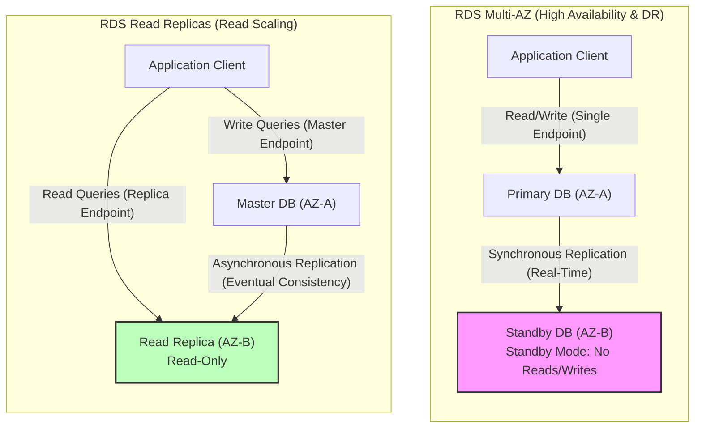

---
domains:
  - "aws"
class: reference-note
tier: reference-note
tags:
  - aws/database
---

# Module 3-7: AWS RDS & Aurora Databases

This module details relational database management systems running on **Amazon RDS** and **Amazon Aurora**, RDS Custom, Multi-AZ deployments, read replicas, database migration tools (DMS/SCT), connection pooling via **RDS Proxy**, and caching using **Amazon ElastiCache**.

---

## 🗺️ Cognitive Map: RDS Multi-AZ vs. Read Replica Topology

---

## 1. Amazon RDS (Relational Database Service)
Amazon RDS is a managed service for SQL databases. It automates provisioning, operating system patching, performance monitoring, scaling, and backups.

### A. Engine Support
RDS supports six database engines:
- **MySQL**
- **PostgreSQL**
- **MariaDB**
- **Oracle**
- **Microsoft SQL Server**
- **IBM DB2**
- *(Amazon Aurora is managed under its own dedicated cluster architecture).*

### B. Read Replicas
Designed to scale read capacity horizontally and offload query workloads.
- **Replication Mechanism:** Asynchronous replication. Reads are eventually consistent (querying a replica before replication completes may return stale data).
- **Scale Limit:** Up to 15 Read Replicas per database instance.
- **Placement Boundaries:** Replicas can be provisioned in the same Availability Zone (AZ), cross-AZ, or cross-region.
- **Promotion:** Replicas can be promoted to independent databases. Promoting a replica removes it from the replication loop and initiates its own lifecycle.
- **Connection Management:** Applications must modify their connection strings to direct read traffic to replica endpoints.
- **Supported Operations:** Only supports `SELECT` (read) queries. `INSERT`, `UPDATE`, and `DELETE` (write) queries are blocked on replicas.
- **Network Costs:** 
  - **Same Region (Cross-AZ):** Free replication traffic (managed by AWS).
  - **Cross-Region:** Incurs standard cross-region data transfer replication fees.

### C. Multi-AZ Deployments
Designed strictly for high availability (HA) and disaster recovery (DR). Not used for scaling reads.
- **Replication Mechanism:** Synchronous replication from the Primary node to a Standby node in a different AZ.
- **Standby Endpoint Details:** Application clients talk to a single DNS name (endpoint). The standby instance is passive; it has no separate endpoint and does not accept read or write traffic under normal operations.
- **Automatic Failover:** Triggered by AZ outages, primary host/storage failure, or network disruption. AWS automatically updates the DNS CNAME to point to the Standby node, promoting it to Primary. No manual application modification is required.
- **Transitioning (Single-AZ to Multi-AZ):**
  - **Zero-Downtime Operation:** Can be enabled on-the-fly via a database modification with no downtime.
  - **Process:** RDS takes a snapshot of the primary database -> Restores the snapshot to a new standby database in a different AZ -> Establishes synchronous replication -> Standby database catches up.

### D. Backups & Snapshots
- **Automated Backups:**
  - Daily full backup is performed during a user-specified backup window.
  - Transaction logs are backed up every 5 minutes, allowing Point-in-Time Recovery (PITR) to any second within the retention window.
  - Retention is configurable from 1 to 35 days (setting retention to `0` disables automated backups).
  - In Multi-AZ deployments, backups are run against the Standby node to prevent performance degradation on the Primary node.
  - Automated backups are deleted when the RDS instance is deleted.
- **Manual Snapshots:**
  - Manually triggered by the user.
  - Retained indefinitely, even after the RDS instance is deleted.
  - *Cost Savings Strategy:* For databases used intermittently (e.g., 2 hours/month), take a manual snapshot and delete the instance. Restore the snapshot into a new instance when needed to avoid continuous storage costs.
- **Restoring Backups:**
  - Always restores to a *new* database instance.
  - **Restoring from S3:** Relational database backup dumps stored in S3 can be restored directly into new RDS MySQL instances.

---

## 2. RDS Custom
Designed for applications requiring administrative control over the underlying operating system and database configuration.
- **Supported Engines:** Oracle and Microsoft SQL Server only.
- **Access Level:** Provides full administrative (root/Administrator) privileges. Users can access the underlying EC2 instance via SSH or AWS Systems Manager (SSM) Session Manager.
- **Customization:** Allows installing custom OS patches, configuring internal database settings, and enabling native OS-level features.
- **Operational Rules:**
  - **Deactivate Automation Mode** before applying updates or patches to prevent the RDS auto-healing system from overriding custom configurations or triggering reboots.
  - **Take Database Snapshots** before starting modifications to allow recovery from configuration errors.

---

## 3. Amazon Aurora
Amazon Aurora is a cloud-native, proprietary relational database engine compatible with MySQL and PostgreSQL. It delivers up to 5x the throughput of MySQL and 3x the throughput of PostgreSQL on standard RDS.

### A. Shared Virtualized Storage Architecture
- **Logical Shared Volume:** Compute instances are decoupled from storage. Aurora uses a virtualized, shared storage volume that auto-expands on-demand.
- **6-Way Replication:** Replicates database writes **6 ways across 3 Availability Zones** (2 copies per AZ).
- **Quorum Rules:**
  - **Writes:** Requires **4 out of 6** copies to commit a transaction. Tolerates the loss of an entire AZ plus an additional storage node without losing write availability.
  - **Reads:** Requires **3 out of 6** copies.
- **Self-Healing:** Continuously scans database blocks for errors in the background and runs peer-to-peer volume replication to heal corrupted blocks.
- **Storage Growth:** Starts at 10 GB and automatically scales in 10 GB increments up to 128 TB (or 256 TB depending on engine configuration) with no manual provisioning.

### B. Connection Management & Endpoints
Applications interface with Aurora clusters through DNS-based endpoints:
- **Writer Endpoint:** Points directly to the current Master/Primary DB instance. Handles all writes.
- **Reader Endpoint:** Performs connection-level load balancing across all active Read Replicas (up to 15 replicas supported, with sub-10ms replication lag).
- **Custom Endpoints:** Groups a specific subset of Aurora instances (e.g., placing larger compute instances in a pool dedicated to analytical reports) to keep heavy queries isolated from production writer/reader traffic.
- **Instance Endpoint:** Direct DNS address to a specific DB instance in the cluster, used primarily for debugging.

### C. Serverless Deployments
Aurora Serverless automates database instantiation and compute capacity scaling.
- **Compute Unit (ACU):** Scales compute capacity in Aurora Capacity Units (ACUs) based on workload demand.
- **Serverless v1:** Scales down to 0 ACUs when idle. Incurs a "cold start" latency when waking up to serve incoming requests.
- **Serverless v2:** Instantly scales compute (down to a minimum fractional capacity, e.g., 0.5 ACUs, and up to a configured maximum). v2 does not scale down to 0 ACUs, eliminating cold starts and making it production-ready.

### D. Aurora Global Database
Designed for globally distributed architectures and multi-region disaster recovery.
- **Topology:** 1 Primary region (read/write) replicates asynchronously to up to 5 (or 10) secondary read-only regions.
- **Physical Replication:** Uses dedicated physical replication infrastructure in the storage plane, maintaining cross-region replication lag at < 1 second.
- **Regional Scaling:** Supports up to 16 read replicas per secondary region.
- **Disaster Recovery (DR):** Promoting a secondary region to a primary read-write cluster takes < 1 minute (Recovery Time Objective - RTO < 1 min).

### E. Database Cloning
- **Copy-on-Write Protocol:** Creates a new Aurora cluster pointing to the exact same storage blocks as the parent database. No data is copied initially, making clones near-instantaneous and highly cost-effective.
- **Storage Splitting:** Additional storage is allocated only when changes are made to the original database or the clone. Has zero performance impact on the production database.

### F. Advanced Integrations & Translation
- **Aurora Machine Learning (ML):** Direct SQL-level integration with Amazon SageMaker (custom ML models) and Amazon Comprehend (sentiment analysis). Allows developers to run predictions inside SQL queries (e.g., `SELECT predict_sentiment(comment) FROM feedback`).
- **Babelfish for Aurora PostgreSQL:** Translates T-SQL queries (Microsoft SQL Server dialect) to PL/pgSQL on-the-fly. Allows legacy SQL Server applications to run on Aurora PostgreSQL with little to no code or driver changes.

---

## 4. RDS Security
- **Encryption at Rest:** 
  - Handled via AWS KMS keys.
  - Configured at database launch. If the master instance is unencrypted, read replicas cannot be encrypted.
  - To encrypt an unencrypted database: take a snapshot -> copy and encrypt the snapshot -> restore the encrypted snapshot to a new instance.
- **Encryption in Transit:** In-flight encryption via SSL/TLS is enabled by default. Clients must trust AWS TLS root certificates.
- **Database Authentication:** Supports traditional username/password credentials and **IAM Database Authentication** (using short-lived tokens generated via IAM policies and roles).
- **Network Access:** Restricts incoming traffic using VPC Security Groups (allowing database access only on port 3306 for MySQL or 5432 for PostgreSQL from specific security groups).
- **Auditing:** Exports database Audit Logs to AWS CloudWatch Logs for long-term retention.

---

## 5. Amazon RDS Proxy
RDS Proxy is a fully managed, serverless database proxy sitting between applications and database instances.
- **Connection Pooling:** Pools and shares backend connections to prevent client connection spikes from overloading database resources (CPU and RAM).
- **Failover Reduction:** Speeds up failover times for RDS Multi-AZ and Aurora by **up to 66%** by maintaining client connections and hot-swapping backend connection pools to the promoted primary instance.
- **Serverless Integration:** Essential for AWS Lambda architectures where rapid, concurrent function invocations would otherwise cause connection storms and exhaust database connection limits.
- **IAM Authentication:** Enforces IAM authentication for database access and securely retrieves database credentials from AWS Secrets Manager.
- **VPC Scope:** Deployed inside private subnets and is **never publicly accessible**.

---

## 6. Amazon ElastiCache
ElastiCache is a managed in-memory cache service running Redis, Valkey, or Memcached to offload read-heavy query loads from relational databases and store transient application state.

### A. Caching Patterns
- **Lazy Loading (Cache-Aside):** Application checks the cache first. If a cache hit occurs, it returns data. On a cache miss, it reads from the database, writes the data to the cache, and returns it. High read performance but can serve stale data if database updates occur.
- **Write-Through:** Updates the cache immediately when database writes occur. Avoids stale data but increases write latency.
- **Session Store:** Storing transient user sessions. Uses Time-to-Live (TTL) parameters to expire sessions.

### B. Redis OSS (and Valkey) vs. Memcached

| Dimension | ElastiCache for Redis (and Valkey) | ElastiCache for Memcached |
| :--- | :--- | :--- |
| **High Availability** | Multi-AZ with Auto-Failover | No built-in replication or HA (nodes are independent) |
| **Data Scaling** | Read Replicas (up to 5 per shard) | Sharding (Data partitioning across nodes) |
| **Data Durability** | AOF persistence, Backup/Restore | Transient in-memory only (no backups for self-managed) |
| **Data Structures** | Strings, Lists, Sets, Sorted Sets | Simple key-value pairs (strings) |
| **Threading Model** | Single-threaded | Multi-threaded |
| **Specialized Use Case** | Real-time gaming leaderboards (via Sorted Sets) | Simple web page caching, stateless session store |

### C. ElastiCache Security
- **IAM Auth:** Supported for Redis only (for API-level access and cluster management).
- **Access Control:** Uses Redis AUTH (token/password) to authenticate connections. Memcached supports SASL-based authentication.
- **Encryption:** Supports SSL/TLS encryption in-transit and encryption at rest.

---

## 7. AWS Database Migration: DMS & SCT
AWS provides tools to coordinate database migrations from on-premises or other cloud environments to AWS with minimal downtime.

- **AWS Schema Conversion Tool (SCT):**
  - Used for **heterogeneous migrations** (different source and target engines, e.g., Oracle to PostgreSQL).
  - Translates schemas, database views, tables, stored procedures, and triggers into the target database dialect.
  - *Note:* Not required for homogeneous migrations (same engine, e.g., MySQL to RDS MySQL).
- **AWS Database Migration Service (DMS):**
  - Runs on a **replication instance** deployed inside a VPC.
  - Coordinates data transfer from a **source endpoint** (on-premises, EC2, or RDS) to a **target endpoint** (RDS, Aurora, S3, DynamoDB, Redshift).
  - Supports homogeneous and heterogeneous migrations.
  - Employs **Change Data Capture (CDC)** to continuously replicate live transactions to keep target databases in sync, allowing zero-downtime cutovers.

---

## Deep-Intuition (AARF) Breakdowns

### AARF Breakdown: Aurora Multi-Master vs. Aurora Global Databases
1. **The Answer (Core Pattern):** Utilize **Aurora Global Databases** for multi-region active-passive disaster recovery and low-latency local reads. Avoid **Aurora Multi-Master** unless application writers cannot tolerate a 30-second failover window and are engineered to handle database write conflicts.
2. **The Assumptions (Context):** For Aurora Global DBs, replication is asynchronous, keeping regional replica lag under 1 second.
3. **The Rationale (Why):** Aurora Global DB uses dedicated physical replication infrastructure, keeping regional replication lag under 1 second without impacting primary instance compute. Multi-Master clusters allow writes on all nodes in a single region, but require complex application handling to manage database write conflicts (optimistic locking), degrading overall system throughput.
4. **The Failure Loop (What if not):** Implementing Aurora Multi-Master for an application with high write-concurrency on the same rows causes high database deadlock rates, transaction retries, and poor write performance.
5. **Alternative Case (When to use 'if not'):** For simple single-region workloads requiring automatic capacity adjustments based on traffic, deploy Aurora Serverless v2.
