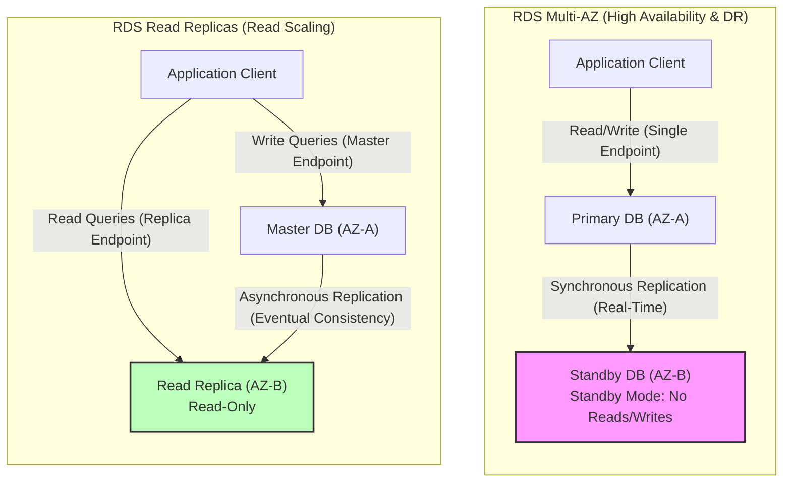

---
domains:
  - "aws"
class: reference-note
tier: reference-note
tags:
  - aws/database
---

# Module 3-7: AWS RDS & Aurora Databases

This module details relational database management systems running on **Amazon RDS** and **Amazon Aurora**, RDS Custom, Multi-AZ deployments, read replicas, database migration tools (DMS/SCT), connection pooling via **RDS Proxy**, and caching using **Amazon ElastiCache**.

---

## 🗺️ Cognitive Map: RDS Multi-AZ vs. Read Replica Topology

---

## 1. Amazon RDS Relational Databases
Managed relational database engines supporting PostgreSQL, MySQL, MariaDB, Oracle, SQL Server, and IBM DB2. RDS launches database instances inside a customer's Virtual Private Cloud (VPC) across subnet groups. It is a best practice to place database instances inside private subnets and restrict access via Security Groups (only allowing traffic from the application/backend tier).

### A. Backups, Snapshots, and Auto Scaling
- **Automated Backups:**
  - Daily full backups are performed during a user-specified backup window.
  - Transaction logs are backed up every 5 minutes, allowing Point-in-Time Recovery (PITR) up to the last 5 minutes.
  - Configurable retention from 1 to 35 days (setting retention to 0 disables automated backups).
  - Stored in an S3 bucket managed by AWS (not the customer's account).
  - In Multi-AZ deployments, backups are taken from the standby instance to prevent performance degradation on the primary node.
  - Automated backups are deleted upon database instance deletion.
- **Manual DB Snapshots:**
  - Manually initiated by the user.
  - Persisted indefinitely, even after the database instance is deleted.
  - Best practice: take a final snapshot before deleting an RDS instance.
- **Restoring from Backups/Snapshots:**
  - Always restores to a *new* database instance (does not overwrite existing).
  - Database engine, instance class, storage type (e.g., GP3 to Provisioned IOPS), and encryption can be modified during the restore process.
  - **Restoration from S3:** A native database backup file can be uploaded to S3 and restored directly into a new RDS instance running MySQL.
- **RDS Storage Auto Scaling:**
  - Dynamically scales storage capacity on-demand with zero downtime.
  - Triggered if: free space falls below 10% of allocated storage, the low-storage condition lasts for >= 5 minutes, and >= 6 hours have elapsed since the last modification.
  - Requires setting a maximum storage threshold to prevent infinite scaling/runaway costs.
- **Vertical Scaling:**
  - Modifying the instance type/class (compute) or storage type/size.
  - Scaling is decoupled; instance size and storage size can be scaled independently.
  - You can only scale *up*; shrinking storage size is not supported.

### B. Disaster Recovery (Multi-AZ) vs. Read Scaling (Read Replicas)

| Dimension | RDS Multi-AZ Deployment | RDS Read Replicas |
| :--- | :--- | :--- |
| **Primary Use Case** | Disaster Recovery & High Availability (HA) | Read Performance & Horizontal Scaling |
| **Replication Type** | **Synchronous** | **Asynchronous** (Eventually consistent) |
| **Active Instances** | 1 Primary (Read/Write) + 1 Standby (Passive/No Read or Write) | 1 Master (Read/Write) + Up to 15 Replicas (Read-Only) |
| **Failover Mechanism**| **Automatic Failover** via DNS CNAME swap (AWS managed) | Manual promotion to independent read/write database |
| **Scope** | Regional (Across Availability Zones) | Same AZ, Cross-AZ, or Cross-Region |
| **Backup Behavior** | Daily backup is taken from the Standby instance | Can take backups (must be enabled) |
| **Network Cost** | Free within the same region (AWS managed) | Free within same region (Cross-AZ); chargeable Cross-Region |

#### Transitioning from Single-AZ to Multi-AZ:
- **Zero-Downtime Operation:** Single-AZ instances can be converted to Multi-AZ on-the-fly without database interruption.
- **Behind the Scenes:** RDS takes a snapshot of the primary database -> restores it to a new standby database in another AZ -> establishes synchronous replication between the primary and standby databases -> standby DB catches up.

---

## 2. RDS Custom
For legacy, custom, or packaged applications requiring administrative access to the underlying OS and database.
- **Supported Engines:** Oracle and Microsoft SQL Server only.
- **Access Level:** Grants administrative (root/Administrator) privileges. Allows SSH or AWS Systems Manager (SSM) Session Manager access to the underlying EC2 host.
- **Operations & Customization:** Users can install patches, configure internal database settings, and enable native OS-level features while still leveraging RDS automation for backups and patching.
- **Important Guidelines:**
  - **Deactivate Automation Mode** during manual upgrades or installations to prevent RDS auto-healing from overwriting changes or triggering unnecessary reboots.
  - **Take Snapshots** before performing modifications; because users have host access, they can break critical configurations.

---

## 3. Amazon Aurora
A cloud-native, high-performance, proprietary relational database engine compatible with MySQL and PostgreSQL. Provides up to 5x throughput of standard MySQL and 3x throughput of PostgreSQL on RDS.

### A. Shared Virtualized Storage Architecture
- **Virtualized Storage Mesh:** Aurora does not use traditional EBS volumes attached to single instances. Instead, it utilizes a shared, auto-expanding logical storage volume.
- **Multi-AZ Replication:**
  - Automatically replicates data **6 ways across 3 Availability Zones** (2 copies per AZ).
  - Storage is divided into 10 GB blocks and striped across hundreds of storage nodes.
- **Quorum Requirements:**
  - **Writes:** Requires a quorum of **4 out of 6** copies. Can tolerate the loss of an entire AZ plus one additional node without write disruption.
  - **Reads:** Requires a quorum of **3 out of 6** copies.
- **Self-Healing & Auto-Expanding:**
  - Continuously scans blocks for corruption and performs background peer-to-peer self-healing.
  - Storage scales automatically in 10 GB increments up to 128 TB (or 256 TB depending on engine configuration).

### B. Connection Management & Endpoints
- **Writer Endpoint:** A single DNS CNAME pointing directly to the Master/Primary instance. Handles all write operations.
- **Reader Endpoint:** Performs connection-level load balancing across all available read replicas (up to 15 replicas). Replicas have extremely low replication lag (sub-10ms).
- **Custom Endpoints:** Allows users to group a subset of Aurora instances (e.g., larger instances like `db.r5.2xlarge`) for specialized workloads, such as running heavy analytical queries without affecting production application queries.
- **Instance Endpoint:** Direct connection to a specific DB instance in the cluster (used for debugging).

### C. Advanced Aurora Features
- **Database Cloning:**
  - Fast, cost-effective way to create a duplicate database (e.g., staging from production).
  - Uses the **Copy-on-Write** protocol: initially points to the same storage blocks, allocating new storage only when data is modified.
  - Faster and cheaper than snapshot/restore, with zero impact on production.
- **Aurora Serverless (v2):**
  - Instantly scales database compute resources (ACUs - Aurora Capacity Units) dynamically based on application demand.
  - Useful for unpredictable, variable, or development workloads. Scales down to fractional capacity to optimize costs.
- **Aurora Global Database:**
  - Designed for globally distributed applications and multi-region disaster recovery.
  - 1 Primary read-write region -> Asynchronously replicates to **up to 5 secondary read-only regions** (using dedicated physical infrastructure with replication lag < 1 second).
  - Up to 16 read replicas per secondary region.
  - DR Promotion: A secondary region can be promoted to a full write cluster in < 1 minute (RTO < 1 min).
- **Aurora Machine Learning (ML):**
  - Native integration with Amazon SageMaker (custom models) and Amazon Comprehend (sentiment analysis).
  - Allows applications to run ML predictions directly inside SQL queries (e.g., `SELECT predict_sentiment(...)`).
- **Babelfish for Aurora PostgreSQL:**
  - Translates T-SQL (Microsoft SQL Server dialect) queries into PostgreSQL commands on-the-fly.
  - Enables SQL Server applications to run on Aurora PostgreSQL with little to no code changes.

---

## 4. Amazon RDS Proxy
A fully managed, highly available, database connection proxy that sits between application clients and database instances.

- **Connection Pooling & Sharing:** Pools database connections to reduce CPU/RAM overhead on the database server. Prevents database resource exhaustion from excessive client connections.
- **AWS Lambda Integration:** Essential for serverless functions (like AWS Lambda) that scale rapidly and open/close connections frequently. RDS Proxy absorbs the connection storms and maintains stable database connections.
- **Fast Failovers:** Reduces failover times for RDS Multi-AZ and Aurora by **up to 66%** by maintaining the application-side connection and switching backend connection pools instantly to the promoted master.
- **Security & Secrets Manager:** Enforces IAM authentication for database access, securely storing database credentials in AWS Secrets Manager.
- **VPC Scope:** RDS Proxy is deployed inside a VPC and is **never publicly accessible**.

---

## 5. Amazon ElastiCache
A fully managed, in-memory caching service designed to offload read-heavy query volumes from databases and store application session state. Requires application-side code changes to integrate.

### A. Caching Strategies
- **Lazy Loading (Cache-Aside):** Application queries the cache first. On cache hit, returns data. On cache miss, queries DB, writes the retrieved data to the cache, and returns it. Data can become stale if DB changes.
- **Write-Through:** Updates the cache immediately whenever data is written to the database. Ensures data is never stale, but incurs higher write latency and storage overhead.
- **Session Store:** Stores transient session states. Uses Time-to-Live (TTL) parameters to expire keys.

### B. Redis OSS vs. Memcached Comparison

| Feature | Amazon ElastiCache for Redis | Amazon ElastiCache for Memcached |
| :--- | :--- | :--- |
| **Data Architecture** | Single-primary with read replicas | Sharded / Multi-node partition |
| **High Availability** | **Yes** (Multi-AZ with Auto-Failover) | No built-in replication or HA |
| **Data Durability** | AOF persistence, Backup/Restore | Transient in-memory only (no backups for self-managed) |
| **Data Types** | Complex structures (Lists, Sets, Sorted Sets) | Simple key-value strings |
| **Threading** | Single-threaded | Multi-threaded |
| **Specialized Use Case** | Real-time gaming leaderboards (via Sorted Sets) | Simple web page caching, session stores |

---

## 6. AWS Database Migration: DMS & SCT
Services used to migrate workloads from on-premises or other cloud environments to AWS databases.
- **AWS Schema Conversion Tool (SCT):**
  - Used for **heterogeneous migrations** (different source and target engines, e.g., Oracle to PostgreSQL).
  - Converts database schemas, views, stored procedures, and trigger code into the target dialect.
  - *Note:* Not required for homogeneous migrations (same engine, e.g., MySQL to RDS MySQL).
- **AWS Database Migration Service (DMS):**
  - Performs the actual data replication from source to target.
  - Supports homogeneous and heterogeneous migrations.
  - Can perform one-time migrations or ongoing replication (Change Data Capture - CDC) to keep databases in sync with zero downtime during cutover.

---

## Deep-Intuition (AARF) Breakdowns

### AARF Breakdown: Aurora Multi-Master vs. Aurora Global Databases
1.  **The Answer (Core Pattern):** Utilize **Aurora Global Databases** for multi-region active-passive disaster recovery and low-latency local reads. Avoid **Aurora Multi-Master** unless application writers cannot tolerate a 30-second failover window and are engineered to handle database write conflicts.
2.  **The Assumptions (Context):** For Aurora Global DBs, replication is asynchronous, keeping regional replica lag under 1 second.
3.  **The Rationale (Why):** Aurora Global DB uses dedicated physical replication infrastructure, keeping regional replication lag under 1 second without impacting primary instance compute. Multi-Master clusters allow writes on all nodes in a single region, but require complex application handling to manage database write conflicts (optimistic locking), degrading overall system throughput.
4.  **The Failure Loop (What if not):** Implementing Aurora Multi-Master for an application with high write-concurrency on the same rows causes high database deadlock rates, transaction retries, and poor write performance.
5.  **Alternative Case (When to use 'if not'):** For simple single-region workloads requiring automatic capacity adjustments based on traffic, deploy Aurora Serverless v2.
