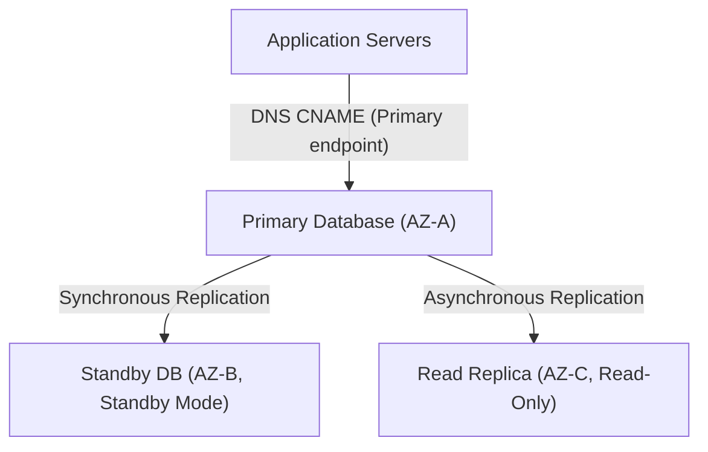

---
domains:
  - "aws"
  - "database"
class: reference-note
tier: reference-note
tags:
  - aws/rds
  - aws/aurora
  - aws/databases
---

# Module 3-7: AWS RDS & Aurora Databases

This module details relational database management systems running on **Amazon RDS** and **Amazon Aurora**, Multi-AZ deployments, read replicas, database migration tools (DMS/SCT), and encryption mechanisms.

---

## 🗺️ Cognitive Map: RDS Multi-AZ vs. Read Replica Topology

---

## 1. Amazon RDS Relational Databases
Managed database engines (PostgreSQL, MySQL, SQL Server, Oracle).

### A. Backups, Snapshots, and Scaling
# Part 6: SQL-Based "Relational" Databases Services

## Data Types:
![[Pasted image 20250626170852.png]]
#### SQL (Structured Data)
- Data that is ready to be included in a relational database.
- Tabled data is an example.
#### NoSQL (Unstructured Data)
- Data that is ready to be included in a relational database.
- Emails, word processing documents, presentations, audio and video files, webpages are examples.
#### No-SQL (Semi-Structured Data)
- CSV & JSON files.

# *〔1〕RDS (Amazon Relational Database Service)*

*OLTP DB: On-Line Transactional Processing Databases*

It is a fully managed relational DB from AWS.
- Supports MS SQL, MySQL, MariaDB, PostgreSQL, Oracle and Amazon Aurora. 
- Launches inside your VPC. However, you do not have root access or OS access for the DB instances.
- Use self-managed DB (on EC2) if OS control or root access is required.
- RDS integrates with SNS for event notifications.
- Mentioned short notes about RDS in Part 1:
	- RDS Launches the database inside the VPC.
	- It's advised to be put inside a private subnet.
	- A security group can be attached to the RDS database.
	- RDS instance can be launched in a standalone mode "single AZ" or Multi-AZ mode (Primary instances for read/write & Standby RDS instances for instant data replication only).
	- It supports auto scaling.

## Standby DB instance & RDS for Multi-AZ
RDS can be configured for Multi-AZ deployment during or after launch. RDS service creates a standby instance in the same region but in a different Availability Zone.
- For data replication.
- Synchronous/immediate data replication from primary to standby is configured by RDS service.
- CANNOT read or write to the standby instance. 

## RDS Failover for Multi-AZ
Failover means using the Standby DB in case of failier.
Failover maybe triggered when: 
- Primary AZ or Primary DB instance failure.
- Loss of network connectivity to primary DB.
- Compute or Storage failure on primary.
- Patching the primary DB instance OS "As a reboot may be needed".
- The DB instance's server type is changed.
- Manual failover (reboot with failover) on primary.

Applications should use the DNS Hostname of the RDS DB and not the IP addresses. *Why??*
Because when a Standby RDS is used it's set as the primary database, & the original primary DB is set to Standby "exchange roles". 
- So the DNS will redirect to the right IP address after changing.
- Amazon RDS update the standby IP to correspond to the RDS DB Hostname when the primary fails over to the standby.

## RDS Automated Backup
It's a point-in-time copy of the entire database (DB)
- Taken daily.
- Enabled by default.
- Creates a storage volume snapshot of the entire DB that gets stored in an S3 Bucket ***not owned by the customer***.
- Snapshots are retained for seven days by default (0 to 35 days configurable).
- The automated backup can be used to restore the DB up to five minutes in time.
- If the DB is on Multi-AZ, the backup is taken from the Standby DB instance in order of not affecting the performance of the primary DB.
- Automated DB backups are deleted when the DB gets deleted.

## Manual DB Snapshots
Manual snapshots are the ones manually created during the lifetime of the DB instance. 
- They get stored in S3.
- Manual snapshots do not get deleted automatically when the DB is deleted.
- AWS recommends taking a final snapshot of the DB before deleting it.

## Restoring from Backups
- Restoring happens to a new DB, no overwriting to the old one.
- The DB storage type can be changed during a restore process.
- Automated snapshots can be used to restore to any point-in-time during the retention period of the snapshot. AWS RDS will use the transaction logs to restore up to 5 minutes in time.
- We can restore from a manual snapshot, but we cannot specify a point in time to recover to.

## Copying & Sharing DB Snapshots
##### Copying:
Both automated backups and manual snapshots can be copied.
- In either case the resulting copy is considered a manual snapshot. 
- Copying snapshots can happen within the same or different regions. 
##### Sharing:
Manual encrypted or un-encrypted snapshots can be shared with other accounts.
- Shared snapshots by other accounts can also be copied. 
- Automated backups cannot be shared with other accounts. 
**Workaround:** copy the automated backup into a manual snapshot, then share the copy.

## Scaling RDS: Auto Scaling
Amazon RDS supports storage auto scaling. 
- When enabled, RDS Auto Scaling will automatically scale storage capacity on-demand with zero downtime. 
- Auto Scaling in RDS is storage scaling. 
- It can be enabled on existing or new RDS instances.
- Fully Managed service as stated before.

## Scaling RDS: Vertical Scaling
Vertical scaling refers to changing the instance or storage of the same RDS instance.
- Only Scales up, no scaling down.
- Scaling instance type and storage are decoupled, scaling each separately.
*ie.* It is possible to change the database storage volume size or type (Ex. general purpose to Provisioned IOPS to enhance performance). 

## RDS Horizontal Scaling using Read Replicas (Scaling Read Operations)
It's a DB with a replica of the data, & it has a READ ONLY status.
- Allows reading the data without affecting performance of the primary DB.
- Data replication is ***Asynchronous***.
- Can be set up in a Multi-AZ configuration, & the data replication to the Read Replica can happen through the Standby DB instance to enhance performance of the Primary DB even more.
- Can be in a different AZ in the same region or a different region.
- The Read Replica's storage type or instance class can be different from those on the primary DB Instance.
- Can be later used as a primary DB in case of a failure.
- Can be later used as a totally separate DB if needed.

## RDS Encryption
Amazon RDS supports encryption at rest using AWS KMS encryption keys. 
- If encryption is enabled on RDS, the underlying DB storage "EBS volumes", DB logs, automated backups, DB manual snapshots, and Read Replicas will all be encrypted.
- The Read Replica encryption status is like that of the primary.
* Communication between the RDS Client and RDS DB can be TLS/SSL encrypted.

##### Communication between the RDS Client and RDS DB:
- The RDS Server has a digital root certificate.
- Upon creating an RDS DB, the RDS Root Certificate is downloaded on the Primary DB,
- When a Client connects with RDS DB with SSL connection, the DB responds with the RDS Root Certificate.

## Transparent Data Encryption (TDE)
Encryption feature for Oracle & MS SQL.
- Transparent Data Encryption (TDE) is an encryption where data is client-side encrypted before being written to the RDS DB.
- TDE for Oracle and MS SQL can be used simultaneously with RDS encryption at rest.

## RDS Authentication
Connection to RDS is done via username & password.
Another way is using IAM Authentication:
### IAM DB Authentication for MYSQL & PostgreSQL
Used to access MySQL and PostgreSQL RDS databases.
- Authentication is done by an authentication Token (its lifetime is 15 minutes) which can be requested from Amazon RDS.
- IAM user or role has to be configured in the DB with the same name.
- Client to DB must be SSL encrypted.
*ie.* RDS authentication uses two methods, either username & Password, or username & an authentication token.

# *〔2〕Amazon Aurora*
**{{OLTP DB: On-Line Transactional Processing Databases}}**

Aurora is a fully managed relational DB service compatible with MySQL and PostgreSQL engines.
- Can provide ***3x PostgreSQL*** and ***5x MySQL performance***.
- A virtual database storage volume that spans multiple AZS.
- Aurora maintains 2 copies of the data per AZ, & in in three AZs.
- No standby instances, substituted by read replicas.
- Up to 15 read-only Aurora replicas in different AZS in the same AWS Region.

## Aurora Scaling
Aurora has the following scaling features:
##### Storage Scaling:
- Automatically adjusts the storage size in 10GB increments up to 100TB+.
##### Read Scaling: 
* Up to 15 Aurora Replicas. The Replicas can be placed in Multi-AZs.
##### Aurora Auto Scaling:
- Scales the number of Aurora replicas up and down based on need, up to 15 Replicas. 
##### Instance Scaling:
- We can scale the Aurora instances up or down by modifying the instance type/size.

## Aurora Connection Management & Endpoints
Incase of RDS, one Endpoint was required as there were only connecting to primary or Reading from Read Replicas.

For Aurora DBs, multiple endpoints exists for connecting to them:
##### Cluster Endpoint
- Connects to the Primary Aurora Instance
- .- ID Ex: 
	***mydbcluster.cluster***-123456789012.us-east-1.rds.amazonaws.com:3306
##### Reader Endpoint
- Connects to an Aurora Replica.
- Performs connection load balancing to Replicas.
- ID Ex: 
	***mydbcluster.cluster-ro***-123456789012.us-east-1.rds.amazonaws.com:3306
##### Instance Endpoint
- Connects to a specific Instance
- - ID Ex: 
	 ***mydbinstance***.123456789012.us-east-1.rds.amazonaws.com:3306

## Aurora Replicas - Aurora Backup
Aurora Replicas serve as backup replicas.
- It can return the data written by the primary instance in less than 100msec. 
- To increase availability, Aurora Replicas can be used as failover targets. If the primary instance fails, an Aurora Replica is promoted to the primary instance.
- Aurora database supports automated backups and manual snapshots the same way as in Amazon RDS.

## Aurora Infrastructure Security & Authentication
Aurora clusters are launched in a VPC. 
The VPC must have DB subnet groups, with one subnet in each of at least two Availability Zones.
- Security groups are associated with the cluster & can be used to control access to DB.
- Aurora supports TLS/SSL connections to these endpoints. 
- IAM DB authentication can be used with Aurora MySQL as in the case with RDS.
- Aurora APIs are accessible from within a VPC using VPC Interface endpoints "For configuring the service".

## Aurora Encryption
Same way as RDS, Encryption can be enabled on the Aurora cluster
- The database cluster will be encrypted at rest, including the underlying storage volumes. 
- If an Aurora cluster is encrypted, the cluster storage and data, its snapshots, automated backups and Aurora replicas will all be encrypted too.
- We can't change the encryption status of a cluster.
- We can restore from an unencrypted Aurora DB cluster snapshot into an encrypted Aurora DB cluster. 
- A replica's encryption status follows that of the DB cluster.

## Aurora Global DB
- Consists of one read/write cluster primary region & Up to 5 secondary read-only cluster regions.
- Secondary clusters regions can have up to 16 Aurora replicas each, no primary/master instances "15 replicas+1 failover for primary".
- Replication happens using a dedicated replication **physical** infrastructure with latency of less than 1 second.
- Failover is possible in less than one minute.

## Aurora Cross-Region Replication Options
Using Aurora for cross-regional replications is recommended by AWS & is better than MySQL DBs, because:
- Faster Replication. <1sec
- Less failover time. <1min
- Data transfer charges don't apply, while it's chargeable in case of MySQL DB
- Aurora supports MySQL & PostgreSQL.

## Aurora Cluster Backtracking
Backtracking is simply rewinding your DB cluster to a time you specify without restoring from a backup. Can be used to undo mistakes or explore changes made to the DB cluster.
- This Service is only for Aurora DBs, & not in RDS.
- Can backtrack back and forth.

## Aurora Multi-Master Clusters
Also referred to as multi-writer cluster. It is an Aurora cluster where all instances can handle read/write operations.
- If a writer instance fails, there is immediately another one that takes over without interruption (***Continuous Availability*** which is better than HA).
- Used for applications where we can't afford even a brief downtime.
- Currently, multi-master clusters have many feature limitations compared to single master clusters.

## Aurora Serverless
Aurora Serverless is an on-demand, autoscaling configuration of Amazon Aurora.
- It manages a warm pool "Ready & booted pool" of resources in an AWS region to minimize scaling time.
- Runs on the same architecture as Aurora (provisioned DB clusters).
- Supports TLS/SSL client/app connections.
- It starts and scales compute capacity (DB nodes) per applications' usage and shuts it down when no longer required.
Aurora Serverless clusters can be accessed from within a VPC using two VPC endpoints.

##### Aurora Serverless can be used for: 
- Infrequently used applications (low volume sites).
- New applications when DB instance sizes are unknown.
- Variable or unpredicted workloads.
- Development and test databases. 
- Multi-tenant applications.

## Aurora is under RDS Dashboard on Console

---

## 2. Database Migration: DMS & SCT
*   **AWS Database Migration Service (DMS):** Migrates database workloads to AWS. Supports homogenous (MySQL to RDS MySQL) and heterogenous migrations.
*   **AWS Schema Conversion Tool (SCT):** Converts database schemas and code objects between different engines (e.g., Oracle to PostgreSQL) before running DMS.

---

## 3. Deep-Intuition (AARF) Breakdowns

### AARF Breakdown: Aurora Multi-Master vs. Aurora Global Databases
1.  **The Answer (Core Pattern):** Utilize **Aurora Global Databases** for multi-region active-passive disaster recovery and low-latency local reads. Avoid **Aurora Multi-Master** unless application writers cannot tolerate a 30-second failover window and are engineered to handle database write conflicts.
2.  **The Assumptions (Context):** For Aurora Global DBs, replication is asynchronous, keeping regional replica lag under 1 second.
3.  **The Rationale (Why):** Aurora Global DB uses dedicated physical replication infrastructure, keeping regional replication lag under 1 second without impacting primary instance compute. Multi-Master clusters allow writes on all nodes in a single region, but require complex application handling to manage database write conflicts (optimistic locking), degrading overall system throughput.
4.  **The Failure Loop (What if not):** Implementing Aurora Multi-Master for an application with high write-concurrency on the same rows causes high database deadlock rates, transaction retries, and poor write performance.
5.  **Alternative Case (When to use 'if not'):** For simple single-region workloads requiring automatic capacity adjustments based on traffic, deploy Aurora Serverless v2.

