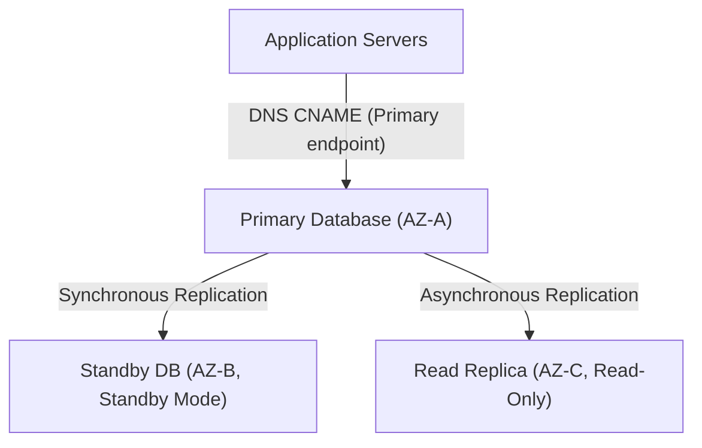

---
domains:
  - "aws"
  - "database"
class: reference-note
tier: reference-note
tags:
  - aws/rds
  - aws/aurora
  - aws/databases
---

# Module 3-7: AWS RDS & Aurora Databases

This module details relational database management systems running on **Amazon RDS** and **Amazon Aurora**, Multi-AZ deployments, read replicas, database migration tools (DMS/SCT), and encryption mechanisms.

---

## 🗺️ Cognitive Map: RDS Multi-AZ vs. Read Replica Topology

---

## 1. Amazon RDS Relational Databases
Managed database engines (PostgreSQL, MySQL, SQL Server, Oracle).

### A. Backups, Snapshots, and Scaling

---

## 2. Database Migration: DMS & SCT
*   **AWS Database Migration Service (DMS):** Migrates database workloads to AWS. Supports homogenous (MySQL to RDS MySQL) and heterogenous migrations.
*   **AWS Schema Conversion Tool (SCT):** Converts database schemas and code objects between different engines (e.g., Oracle to PostgreSQL) before running DMS.

---

## 3. Deep-Intuition (AARF) Breakdowns

### AARF Breakdown: Aurora Multi-Master vs. Aurora Global Databases
1.  **The Answer (Core Pattern):** Utilize **Aurora Global Databases** for multi-region active-passive disaster recovery and low-latency local reads. Avoid **Aurora Multi-Master** unless application writers cannot tolerate a 30-second failover window and are engineered to handle database write conflicts.
2.  **The Assumptions (Context):** For Aurora Global DBs, replication is asynchronous, keeping regional replica lag under 1 second.
3.  **The Rationale (Why):** Aurora Global DB uses dedicated physical replication infrastructure, keeping regional replication lag under 1 second without impacting primary instance compute. Multi-Master clusters allow writes on all nodes in a single region, but require complex application handling to manage database write conflicts (optimistic locking), degrading overall system throughput.
4.  **The Failure Loop (What if not):** Implementing Aurora Multi-Master for an application with high write-concurrency on the same rows causes high database deadlock rates, transaction retries, and poor write performance.
5.  **Alternative Case (When to use 'if not'):** For simple single-region workloads requiring automatic capacity adjustments based on traffic, deploy Aurora Serverless v2.

