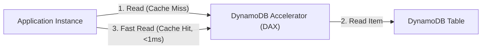

---
domains:
  - "aws"
class: reference-note
tier: reference-note
tags:
  - aws/nosql
---

# Module 3-8: AWS DynamoDB & NoSQL

# Module 3-8: AWS DynamoDB & NoSQL

This module covers high-performance NoSQL operations using **Amazon DynamoDB**, write/read capacity metrics (RCUs/WCUs), caching architectures using **Amazon ElastiCache**, and data warehousing via **Amazon Redshift**.

---

---

## 🗺️ Cognitive Map: DynamoDB Acceleration (DAX) Cache

---

---

## 1. Amazon Redshift OLAP Data Warehouse
Historical Online Analytical Processing (OLAP) database engine.

### A. Redshift Infrastructure & Enhanced Routing

---

# *〔3〕Amazon RedShift*
**{{OLAP DBs: On-Line Analytical Processing DBs}}**
		*Note:* Analytical DBs has two types:
		- Realtime Analytical DB
		- Historical Analytical DBs

Amazon RedShift is a Database service for analytics collected over a period called historical analytical database.
- Amazon RedShift is a Historical OLAP DB service.

---

## Data Warehouse
A data warehouse is a collection of data collected from different sources, which then undergoes complex long queries for analytics, business reporting, and visualization purposes.
- A data warehouse is a relational DB "support SQL queries" that is designed for analytics (OLAP) rather then Transaction processing (OLTP).
- On-Line Analytical Processing (OLAP) is characterized by relatively low transactions volume and very complex queries that involved aggregations.

---

## RedShift Service
Amazon RedShift is a fully managed data warehouse service (OLAP) in AWS.
- Petabyte Scale, so capable of storing large size of data
- It provides fast querying over structured data using familiar SQL based clients "using ODBC, JDBC connections" and business intelligence (BI) tools "Quicksight, Tableau, etc."".
- Uses columns rather than rows to store data. This is 10x faster than transactions SQL databases.
- Uses advanced compression, and Massive parallel processing of data.
- Despite its high storage ability, it can't take a large data ingestion in real time "stores the data for later analyzing".
- Works in one AZ inside the VPC.
- RedShift is a pay-as-you-go service (no upfront commitments).

---

## RedShift Availability
- RedShift doesn't support Multi-AZs, snapshots can be used for data recovery.
- Can be single-node or multi-node clusters "in a single AZ". Leader and compute nodes. 
- Clusters are launched in a single AZ. 
- RedShift automatically replicates all data with the cluster. It keeps three copies of the data.
- RedShift can fully recover from a node or component failure.
- RedShift automatically patching and data backup. performs node

---

## RedShift concurrency Scaling
Allows RedShift to support virtually unlimited concurrent users and queries while maintaining consistent high performance. 
- This is achieved by automatically adding additional cluster capacity (concurrency scaling cluster) when required.

---

## RedShift Backup & Restore
RedShift automatically takes incremental backups 
- Snapshots are taken every 8 hours or 5GB of data.
- Restoring from a backup happens to a new cluster in the same or different AZ.
- Manual backups are also possible.
- RedShift can be configured to copy snapshots when they are created to another AWS Region.

---

## RedShift Data Sources & Security
##### Data Sources: 
- S3 (Parallel reads).
- COPY command (EMR, EC2, DynamoDB).
- Data Pipeline (S3 or DynamoDB).
- Database Migration Service.
##### Security:
- Redshift supports encrypting data at rest (disabled by default).
- Customer can manage their keys through Amazon HSM or use KMS keys.
- Snapshots created from an encrypted Redshift cluster are also encrypted.
- Redshift supports encrypting data in-transit using SSL.

---

## Redshift WLM & Enhanced VPC Routing
##### Workload Management (WLM)
- Is a way to define a number of query queues such that short running queries are not stuck in queues behind long-running ones.
##### Enhanced VPC Routing
- Forces traffic between your Redshift cluster and S3 to go over a VPC endpoint.

---

---

## 2. Amazon DynamoDB Serverless NoSQL
DynamoDB is a serverless key-value database providing single-digit millisecond latency.

### A. DynamoDB Metrics & Core Infrastructure

---

# Part 7: NoSQL-Based Databases Services

---

# *〔1〕Amazon DynamoDB*
DynamoDB is a fully managed, NoSQL database that provides fast and predictable performance with seamless scalability.
- OLTP Database.
- Does not support complex joins or queries like SQL databases.
- Supports semi-structured and unstructured data.
- Supports both document "CSV & JSON" and key-value data models.
- It saves data over the optimum number of servers according to the read/write capacity required.
- It has a flexible schema (sometimes referred to as schema-less).
- It uses HTTPS as a transport between application & DB.
- Unlimited scaling without downtime or performance degradation.
- Provides single-digit millisecond latency at any scale.
- It has Multi-Region, ***Multi-Master*** "read & write replicas" features.
- It is a durable database and has built-in backup and restore, in-memory caching, and security features.
- Use cases include mobile, retail, banking, gaming, ad-tech applications and for storing session state data.

---

## Data Consistency Model
DynamoDB Supports:
##### Eventual Consistency Reads
- Might not reflect the latest data in the table.
- Best read speed.
##### Strong Consistency reads:
- A read returns the latest data.
- Needs waiting time to check all replicas for the data.

Applications reading from DynamoDB tables can specify strong consistency reads.

---

## DynamoDB Tables & Items
DynamoDB stores data in tables. A table is a collection of data items.
- Each table has an unlimited number of items
- Each item can be up to 400KB in size.
	We can store larger data in an S3 bucket, and store S3 pointers (URLs) in the DynamoDB table items yo get around this.
- An item is a group of attributes.
- An attribute is the fundamental data element in DynamoDB. Attributes are like columns in relational DBs.
- Each attribute has an attribute name and a value or a set of values (key and value).
The table is indexed by a **Primary Key** or a **Composite Key**.
- The primary key gets specified at the table creation time.
- The primary key is an attribute that exists in each item and has a ***unique*** value in each item.

---

## DynamoDB Capacity Units
Billing on DynamoDB is done on RCUs & WCUs:
##### Read Capacity Unit (RCU)
- One RCU represents one Strongly Consistent read/Sec  for an item up to 4KB in size.
- Or two Eventual Consistency reads/Sec  for an item up to 4KB in size.
##### Write Capacity Units (WCU)
- One WCU represents one write/sec for an item up to 1KB in size.

If the read or write request rate exceeds the throughput settings for a table, DynamoDB will throttle them, & drop the request.
*Note:* WCUs are more expensive than RCUs

---

## DynamoDB Auto Scaling
Uses application autoscaling to adjust the RCUs and/or WCUs for a DynamoDB table as demand increases or decreases.
- It works with CloudWatch and application auto scaling to do the required.
- Customers must configure a scaling policy and define a target utilization to scale the capacity units of the table out or in.
-

---

## DynamoDB is a service on Console

---

---

## 3. Caching Services: ElastiCache
In-memory caching databases:
*   **Amazon ElastiCache for Redis:** Supports complex data structures, high availability (Multi-AZ), replicas, and backups. Can be used as a primary database.
*   **Amazon ElastiCache for Memcached:** Simple key-value store, multi-threaded architecture. Best for simple, temporary object caching.

---

---

## 4. Deep-Intuition (AARF) Breakdowns

---

## Deep-Intuition (AARF) Breakdowns

### AARF Breakdown: DynamoDB Partitioning and Hot Keys
1.  **The Answer (Core Pattern):** Design primary keys with high cardinality (e.g., UUIDs or timestamped transaction IDs) to ensure uniform data distribution across physical partitions.
2.  **The Assumptions (Context):** DynamoDB splits tables into physical partitions based on storage size (10GB per partition) or provisioned throughput (1,000 WCUs or 3,000 RCUs maximum per partition).
3.  **The Rationale (Why):** Uniform hash distribution prevents single partition bottlenecks. If an application repeatedly writes to the same partition key value, all requests target a single physical partition, quickly exhausting its allocated throughput and triggering throttling.
4.  **The Failure Loop (What if not):** Choosing a low-cardinality partition key (e.g., `Status: ACTIVE/INACTIVE` or `State: CA/NY`) creates a "Hot Key" scenario. During peak events, writes partition-lock, RCU/WCU throttling activates, client HTTP requests drop with 400 errors, and the UI times out.
5.  **Alternative Case (When to use 'if not'):** For read-heavy hot keys where data changes infrequently, enable DynamoDB Accelerator (DAX) to serve cache reads in microseconds without consuming RCU capacity.
