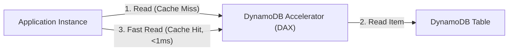

---
domains:
  - "aws"
  - "database"
class: reference-note
tier: reference-note
tags:
  - aws/dynamodb
  - aws/elasticache
  - aws/redshift
---

# Module 3-8: AWS DynamoDB & NoSQL

This module covers high-performance NoSQL operations using **Amazon DynamoDB**, write/read capacity metrics (RCUs/WCUs), caching architectures using **Amazon ElastiCache**, and data warehousing via **Amazon Redshift**.

---

## 🗺️ Cognitive Map: DynamoDB Acceleration (DAX) Cache

---

## 1. Amazon Redshift OLAP Data Warehouse
Historical Online Analytical Processing (OLAP) database engine.

### A. Redshift Infrastructure & Enhanced Routing

---

## 2. Amazon DynamoDB Serverless NoSQL
DynamoDB is a serverless key-value database providing single-digit millisecond latency.

### A. DynamoDB Metrics & Core Infrastructure

---

## 3. Caching Services: ElastiCache
In-memory caching databases:
*   **Amazon ElastiCache for Redis:** Supports complex data structures, high availability (Multi-AZ), replicas, and backups. Can be used as a primary database.
*   **Amazon ElastiCache for Memcached:** Simple key-value store, multi-threaded architecture. Best for simple, temporary object caching.

---

## 4. Deep-Intuition (AARF) Breakdowns

### AARF Breakdown: DynamoDB Partitioning and Hot Keys
1.  **The Answer (Core Pattern):** Design primary keys with high cardinality (e.g., UUIDs or timestamped transaction IDs) to ensure uniform data distribution across physical partitions.
2.  **The Assumptions (Context):** DynamoDB splits tables into physical partitions based on storage size (10GB per partition) or provisioned throughput (1,000 WCUs or 3,000 RCUs maximum per partition).
3.  **The Rationale (Why):** Uniform hash distribution prevents single partition bottlenecks. If an application repeatedly writes to the same partition key value, all requests target a single physical partition, quickly exhausting its allocated throughput and triggering throttling.
4.  **The Failure Loop (What if not):** Choosing a low-cardinality partition key (e.g., `Status: ACTIVE/INACTIVE` or `State: CA/NY`) creates a "Hot Key" scenario. During peak events, writes partition-lock, RCU/WCU throttling activates, client HTTP requests drop with 400 errors, and the UI times out.
5.  **Alternative Case (When to use 'if not'):** For read-heavy hot keys where data changes infrequently, enable DynamoDB Accelerator (DAX) to serve cache reads in microseconds without consuming RCU capacity.

