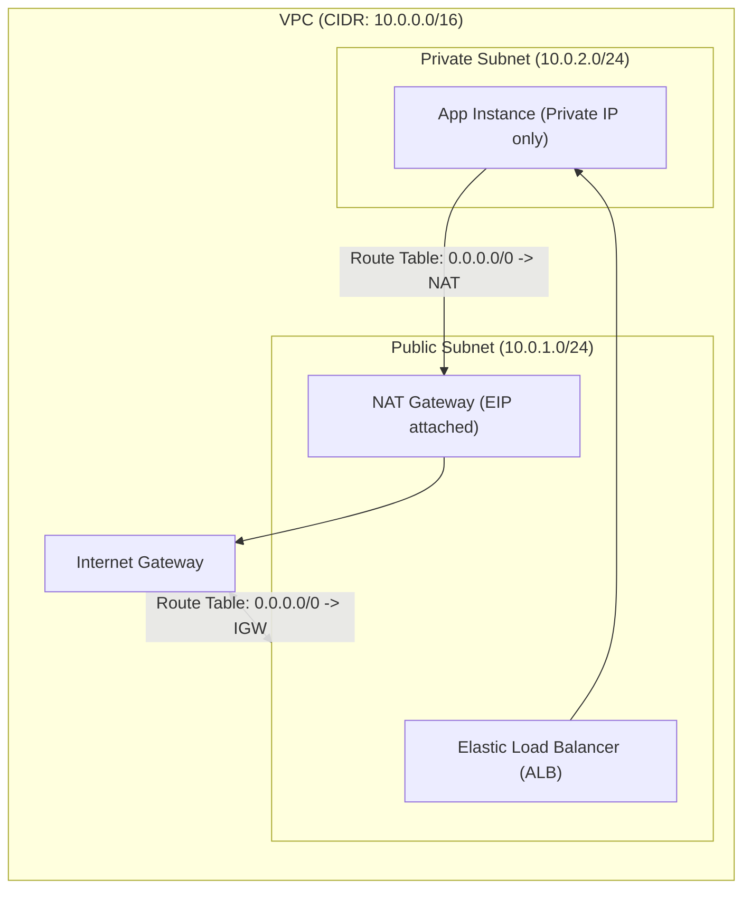

---
domains:
  - "aws"
class: reference-note
tier: reference-note
tags:
  - aws/networking
---

# Module 3-9: AWS VPC Networking

## 🗺️ Cognitive Map: VPC Network Routing Topology

---

---

## VPC - Virtual Private Cloud
- The Virtual Private Cloud, is a virtual data center in the cloud, confined to an AWS region & isolated from other VPCs by default.
management- The client has full control over his VPC & is secured from other clients with other VPCs on the same AWS host server.
- A VPC is confined to a single AWS Region

#AWS-VPC-SCOPE
VPC is a regional service 
You don't get charged over VPC creation (igw,vgw,subnets)
### VPC Components  
- ##### CIDR Block
	- Each created VPC has  a main CIDR Block created with it & this main cannot be removed or changed, only the VPC can be totally deleted.
	- **VPC Address Pool can be expanded by adding up to 4 secondary CIDR Blocks, with some limitations.**                  secondary CIDR  == Expansion CIDR
	- When Connecting to another VPC subnets or on premise if the same CIDR range is used it creates a problem but it can be worked around it 

- ##### Subnets
	- Multiple subnets can be configured per VPC.
	- subnets can't be overlapping and that is a basic TCP/IP restriction subnets are confined in a *Availability Zone*, *meaning they cannot stretch between multiple AZs.* 
	- Subnets can only attach to one route table at a time 

	--if i tried stretching a subnet over two AZ is not recommended because it causes troubles like broadcast problems ??-- 

- ##### Implied Router
	- AWS provides an implied virtual router for the VPC, connecting all subnets to one another. This router is accessible or manageable  only by AWS not the client.

     We can Control Implied Router behavior but thats not in the associate level 

- ##### Route Tables
    - The client only edits the routing tables provided by the Implied Router
    - Route table can be used by more than one subnet 

	Routing inside a VPC is guaranteed by default and it can't be changed or removed 

#AWS-ROUTE-TABLE-SCOPE
Subnet level 

 - ##### Internet Gateway "IGW"
	 Default VPCs are automatically assigned with Internet Gateway, created new VPCs doesn't & must be assigned to an Internet Gateway Manually .
	 Internet Gateway is fully managed by AWS not the client, horizontally scaled, redundant & highly available, & supports IPv4 & IPv6.
	 **Only one IGW can be assigned to a VPC at a time.**
	- ##### Virtual Private Gateway "VGW"
	  An encrypted (VPN-IPsec) Gateway over the internet **(can be affected by network latency)** to establish connection to On-Premise with the cloud "For Hybrid Clouds".
	  Only one VGW can be assigned to a VPC at a time.
- ##### Security Groups
- ##### Network Access Control Lists "Network ACL"

### VPC Console
By default there will a VPC on each region, this can be viewed from the VPC dashboard. 
From the VPC Console You can manage & view the info of current VPCs or create new VPCs, & manage all the VPC components listed before.

---

## Public Subnet vs Private Subnet
### Public Subnet 
Is a subnet created in a VPC with IGW attached and its associated routing table contains a default route pointing at the VPC's IGW, 
meaning it has internet access. 
Public Subnets is used for the applications & services that will need internet access
### private subnets 
doesn't have internet access. They can't access the internet directly and can't be accessed from outside the VPC,*Private Subnets is mainly for databases*, Private subnets is sometimes even used for application that need internet access for extra security so it will access the internet indirectly   

---

## Hybrid Cloud Connectivity Options in AWS
##### 1- VPN Connection
- Not reliable
- Over the internet connection
- Quick to deploy
- Secure
- Cost effective
##### 2- AWS Direct Connect Connection "DX"
- Long deployment times
- Reliable good performance
- Not secure by default as VPN Connection
*Note:* It's applicable to use "IPSec"/VPN on top of the DX to get the benefits of the DX with more reliable security.
Both Connections above are terminated on the "VGW" from the VPC end, & on the Customer Gateway from the On-Premises end.
![[Pasted image 20250508151826.png]]

---

## Security Groups
- Security Groups are virtual firewalls applied on the ENI "Elastic Network Interface" of the EC2 instance.
- Traffic going into the ENI is called inbound traffic, & traffic from the ENI is called outbound traffic. 
- Security Groups have only permit rules. no deny rules. If no permits are found it is considered as an implied deny.
- Can add up to 16 (5 default maximum) Security Groups per EC2 instance.
- Security Groups are stateful, meaning that if the traffic is allowed either if its inbound or outbound, the opposite direction response is automatically allowed even if no permit rules were found.

---

## 6. VPC Deep Dive & Network Architecture
A **Virtual Private Cloud (VPC)** is a customer-defined private logical network inside an AWS Region.

### A. VPC Foundations
*   **CIDR Block:** Primary private IP range.
*   **Subnets:** Segmentations of the VPC CIDR confined to a single Availability Zone.
    *   *Public Subnets:* Have route entries to an **Internet Gateway (IGW)**.
    *   *Private Subnets:* Do not have direct routes to the internet.
*   **Route Tables:** Lists of paths directing network packages.
*   **Implied Router:** Managed routing fabric linking all subnets inside the VPC.

AWS --> HAS REGIONS 

Regions consist of availability zones --> Actual data centers

Edge locations --> **Edge locations are AWS data centers designed to deliver services with the lowest latency possible.** they are much more smaller than the Availability zones..

Ec2 instances which is a Vm on the cloud

vpc --> virtual private network it consist of a vpc cidr which is even divided into smaller subnet cidr all the EC2 instances is launched in the subnet, so vpc is like a virtual allocation of a large number of ips which is further divided into subnets 

The vpc can be on multiple AZs under the same region where they are divided into smaller number of subnets and can communicate directly with there private Ips 

In aws different subnet can communicate directly aslong as they share the same subnet 

up-till now every thing is within a virtual private network no one can access it from the outside and Ec2 instance can access the internet 

Public subnet --> all the Ec2 instances within that subnet can access the internet through the region public ips which is provided from aws to any instance within the public subnet 

private subnet --> any instance within that subnet will not be able to communicate with the outside world two ways inbound and outbound but its reachable from inside the VPC

IGW internet gateway --> Any VPC must and should have a IGW to accessible the from internet 

NAT --> Its activated in public subnet and is used as a tunnel to the private subnets to the internet by assigning a elastic public ip to the Ec2 instance within the private subnet 

Elastic public ip --> a ip assigned by NAT to private EC2 instances in a private subnet 

NACL NETWORK ACCESS LIST --> Its like a first layer firewall on the subnet, it allows all traffic by default 

SG security group --> Think of it as a 2nd layer firewall but on Ec2 instance and unique for every Ec2 

Route tables --> Define routing rules for a subnet so a public Ec2 instance can route to the IGW and a private EC2 instance can route to the NAT

### B. VPC Components & Deeper Details

---

## My take on the 1st hour
#### VPC Recap

![[Pasted image 20250516113120.png]]

If i want to make a patch updates in the private network i need to download but the private subnet is completely isolated it can't even access s3 buckets since they are a accessed trough a public endpoint so a private subnet can't access it also even if its an aws resource 

I can't add a gateway route in the **route table** to the IGW since its a private subnet this will be out of sense 
#### Using a NAT instance:

So we used a NAT instance as a mediator a broker between public internet and private subnet 
![[Pasted image 20250516114836.png]]

- Remember any http communication the source chooses a port from the ephemeral range of ports 

![[Pasted image 20250516115220.png]]

#### NAT Gateway 

The NAT instance is not a fully managed service by aws and its a single point of failure.
We can apply multiple Instance for HA and to be redundant and start manually to configure route table of different private subnets on my NAT instances so its a bit of hassle on top of that  it will cost.

so why not just use a **NAT Gateway**

![[Pasted image 20250516120635.png]]

### High availability architecture 

Remember that the HA and redundancy is applied on the NAT gateway itself as a resource, but it can't be stretched on multiple AZ so we create on NAT Gate way in each AZ and it servers the private subnets under that AZ thats how the architecture it self is HA and redundant so is the NAT Gateway   

![[Pasted image 20250516121047.png]]

#### NAT Instance vs NAT Gateway 
![[Pasted image 20250516121547.png]]

----

---------------

---

## NAT Deep Dive & NAT services
Suppose a scenario of which the EC2 in a private instance & need to update its data from an S3 Bucket, the bucket is accessible by a public IP (it has public endpoint) on the internet, & same goes for all of AWS Services. As the EC2 is in a private subnet it won't be able to connect to the S3 to get the update unless changed to a public subnet, removing the purpose which the EC2 is in a private subnet in the first place.. so the solution is refused.
There are two NAT Services that can fix the issue proposed:
#### 1- NAT Instance
- Its an EC2 instance AMI (Amazon Machine Image), so it's fully managed & secured by the client.
- NAT instance is launched in a public subnet.
- The routing table of the private subnet requiring internet access should be given a default route pointing to the NAT Instance ID
- The NAT instance has a translation table, having the source/destination IP & port, as well as the mapping IP & port.
- All Ports in the translation table are from the ephemeral range.
- The instance is given private or elastic IP address.
- The Mapping IP is the translated public IP in the NAT translation table of the Private/Elastic IP Address in the public subnet.

#### 2- NAT Gateway
- NAT Gateway is a fully managed highly available service, scaling by up to 45 Gbps per gateway.
- NAT Gateways work only with Elastic IP Addresses.
- It cannot be associated with a security group.
- More preferred than instances due to its high availability.
- Although it's highly available, but it exists only in one availability zone.

#### AZ Independent Architecture For High Availability
Multiple NAT Gateways are deployed over multiple Availability Zones "one per each", & have the route table of the private subnets in each AZ to its NAT Gateway.
So if a NAT Gateway went down the routing table redirects the packet to the other NAT Gateway in another AZ in the same network, & if an AZ went down, the other NAT Gateways keep functioning.

#### How they work:
The packet goes from the private subnet to the NAT instance/NAT Gateway in the public subnet, which redirects it to the IGW with a new public IP from the translation table in the IGW, sending it over the internet.

#### Console Applications:
###### 1- Creating NAT Instance
- Create an ordinary EC2 instance, with a NAT instance image which can be found in **Community AMIs**. 
- Make sure to add HTTP & HTTPS ports to the security group if it will be needed.
- **A very important note** when creating a NAT instance is **disabling the Source/Destination Check**. This is because by default the EC2 instance can  work as a source or a distention but not as an intermediate stage, this is controlled by the Source/Destination Check.

###### 2- Logging in to a Private Subnet's EC2 Instance using NAT Instance
- A private Subnet doesn't have internet access, so you can't access it remotely.
- To log in to a private subnet, log in to a NAT public instance & log in to the private one from it.
- Remember to add the NAT ID to the private subnet route table, with destination 0.0.0.0/0
- Access the Public EC2 instance then the Private one
- Use command   to set if the instance will update or not, to test connectivity.

###### 3- Creating NAT Gateway
- Created from the VPC Console
- Created with an Elastic IP Address
- No Source/Destination Check, No Security Groups, etc.. As it's an AWS fully managed service
###### 4- Logging in to a Private Subnet's EC2 Instance using NAT Gateway
- Same as before, but instead of adding NAT Instance ID in the target in the routing table, add NAT Gateway ID with destination 0.0.0.0/0

***Notice that*** using the NAT Instance or NAT Gateway for accessing the private subnet made us allow SSH Port for accessing it. Despite this technique working properly, its not preferred in a production environment as the NAT shouldn't get SSH requests to access it, meaning that we should remove the SSH Port from  NAT Instance, & you can't SSH request on a NAT Gateway anyways.
	*What is the alternative?* Bastion Host

gateway of last resort --> when we add an entry in a route table which is 0.0.0.0/24, as when you don't know where to route use this entry 
black hauling --> when i delete a instance or an endpoint that was used in a route table the route table entry becomes a black hauling

### Bastion Host
it's an EC2 instance with no applications, allowing SSH(22) "for Linux Bastion" or RDP(3389) "for Windows Bastion", & it has all required security applications. Bastion Host is the ONLY way to access the subnets from the internet.
Thus It's a regular EC2 Instance with Security Hardening "Strict & Heavy security" created & set by you. ***BASTION HOST IS NOT A SERVICE!***

- Bastion Hosts are launched in Public subnets
- You can set the Bastion Host to only allow SSH or RDP from the corporate IP Addresses range **instead of any remote access**, this is done from the **Bastion Host Security Group or NACL in case** the subnet **only contains bastion hosts**, if the subnet has other instances or a NAT gateway we will apply the security on just the bastion instance (security group) because the NACL will also block the NAT gateway and other instances traffic 
- **Remote accessing** can be done by using a remote desktop, so the **admins log in from home to the remote desktop in corporate**, & then **to the Bastion Host**.So its recommended for a **bastion host** to have **an elastic ip** so it doesn't change unless I manually release the IP
- Once Iam inside the VPC through Bastion I can even access private subnets since Iam using the private VPC network unless i deny it explicitly in security groups or the NACL  
- For high availability, multiple Bastion Hosts can be set across different subnets & apply auto-scaling between them.
- Bastion Hosts are used only for accessing the subnets, & not sending from inside a subnet to the internet. AWS recommends NAT Gateways for outgoing requests.

---

## Proxy Server
- Proxy Servers are used for **URL Filtering**
- Created in Public Subnets
- It's created in the EC2 instance & works similar to NAT Instances
- If an EC2 in a private subnet required Proxy servers, the Proxy is initiated in a public subnet & the redirection happens similar to how NAT Instances did.

---

## Reverse Proxy Server
it is a service that is used for **caching**. When accessing the application/website linked with a Reverse Proxy, **the URL resolves to the R-proxy**, **filtering the traffic & then sending it to the application server**, & **it deals with the response from the application server** **the same way**, **caching the operation. So if the same request came again, it will respond automatically as it's cached.**

---

## Connecting VPCs together 
### VPC Peering
![[Pasted image 20250516193947.png]]

By default, VPCs cannot communicate directly with each other without using internet access(No Network between them). 
VPC Peering connection allows routing between two VPCs.
- Highly available & fully managed by AWS.
- The two VPCs can be from the same account or different account, & they can be in the same AWS region or not.
- The two VPCs cannot have overlapping CIDR ranges "not even in one subnet".
- Subnets routing tables must be edited & have the new VPC range added to it.
- The routing tables contain the CIDR Block Network Range.

![[Pasted image 20250516194210.png]]
- Transitive Peering is not allowed "No intermediate routing to VPCs".

![[Pasted image 20250516194416.png]]

![[Pasted image 20250516194453.png]]

- No Edge to Edge Routing "No intermediate routing to VPN/Direct connections".

*Note :* For any to any connection, the no. of required peering connections is N(N-1)/2

![[Pasted image 20250516194758.png]]

### AWS Transit Gateway
Upon increasing the no. of VPCs required to be connected together, more VPC Peering connections are required, & if on-premises is to be connected to the VPCs, no. of VPNs & DX will increase as will.
Here comes the use of Transit Gateway, as it can simplify communication requirements as the VPCs grow.

![[Pasted image 20250516195320.png]]
- **Regional resource.**
- Highly available & fully managed by AWS.
- Supports IPv4 & IPv6
- VPCs cannot have overlapping CIDR ranges "not even in one subnet".
- It allows intermediate routing through editable routing tables.
- If multiple regions is to be connected, a transit gateway peering can take place between the two AWS Transit Gateways.
- The routing tables contain the Subnets IP Addresses.

*Note:* Remember to edit the routing table either when using peering connection or Transit Gateway, setting each of them as the destination.

### VPC Peering & Transit Gateway in Console
##### 1- Peering Connection
![[Pasted image 20250516200245.png]]
- Check that the security groups & NACLs allow the connection & Ping Request.
- Upon creating Peering connection, the other VPC will get a pending request to accept or refuse.
- The peering connection request is accepted from the *Peering connection* table.
- After this step, if you tried to ping, time out will occur as the routing table is not set up yet.
- In the routing table, make sure to set the *Destination* as the other CIDR Network, & the *Target* as the peering connection.
- Edit both routing tables for both subnets containing EC2s you will use for the ping test.

##### 2- Transit Gateway

- For using Transit Gateway, first make sure to remove the peering connection from the routing tables to get rid of any black holes.
- When creating the Transit Gateway you will find the attachment type desired.
- After choosing the VPC, a new list will appear for you to choose which subnets to work with, as it's for subnet level.
- Edit the route tables after creating the Transit Gateway, make sure to set the *Destination* as the other CIDR Network, & the *Target* as the Transit Gateway.

---

## VPC Endpoints
### Why need them illustration

![[Pasted image 20250516215126.png]]

![[Pasted image 20250516215953.png]]

![[Pasted image 20250516220822.png]]

### Gateway endpoint & Interface endpoint

Used for making applications/instances on private subnets connect to AWS services "as S3 Buckets" without a public end point "no internet access".
*ie:* Traffic going from the private subnet to the service does not go through the internet.
- They are ``virtual devices, that are redundant, scalable, & highly available.
- They allow VPC workloads to connect to supported AWS services without leaving the AWS network, thus no need of NAT instances or gateways.
- It has two types : **Gateway or Interface Endpoints***. "usage of each is according to the service."
*Note:* Only S3 & DynamoDB uses Gateways Endpoints, while services inside the VPC use Interface Endpoints.

##### 1- Gateway Endpoints

![[Pasted image 20250516222112.png]]

![[Pasted image 20250516222112.png]]

- **Set as a target in the subnet's routing table**
- Redundant & highly available.
- Only one is required per VPC, but each gateway reaches a service
  so You can configure multiple gateways for different services.
- Region Specific.
- No Security Groups.

##### 2- Interface Endpoints
![[Pasted image 20250516223643.png]]

- It's an interface with a private IP Address in a subnet you choose.
- Services that use this endpoint are known to be *Powered by AWS Private Link*.
- Supports IPv4
- Regional Specific.
- **You can add Security Groups.**
- **No Routing is done**, instead it's **based on DNS** resolution to the service.
*Note:* Remember to **create an IAM Role** for the instance with the **permissions required for dealing with services**, otherwise the endpoint will ensure the connection but the commands won't work.

### Controlling Access to services with VPC Endpoint Policies

![[Pasted image 20250516223932.png]]

- By default, an endpoint allows full access to the designated service.
- *Endpoint Policies* can be used to control who access what in the designated service
- The Policies exists for both kinds of endpoints.
*Notice:* No NACLs or Security Groups, its done through permission policies.

### Accessing VPC Endpoints from Remote Networks using Proxy Server

One of the uses of Proxy servers, is that if we created it in a private subnet & connect the subnet with VPN or DX connection to an on-premises site, the proxy can be used to redirect the traffic from the site to the VPC Endpoints, making AWS services reachable from the site without internet traffic.

---

## IPv6 Egress-only internet Gateway
All IPv6 addresses are public, thus any IPv6 address you need is allocated from AWS not you.
*What if you need a private instance allocated with IPv6?*
- Egress Only Gateway allows outbound IPv6 traffic, but prevents initiated inbound traffic from the internet to the VPC, so it was designed to satisfy private subnets requirements.
- It's attached to the VPC, & created under the VPC Console.
- It's stateful.
- cannot be associated by a security group. But notice that if this is required, the security groups & NACLs support IPv6, so you can add security roles as desired.
- It's assigned through the routing table as the target.
- A routing table can have both IPv4 & IPv6.

---

## VPC Flow Logs
It's a feature allowing logging to the IP traffic going to & from the network interfaces in the VPC.
- It provides Source IP/Port, Destination IP/Port, and status (Accepted or Rejected).
- The logs doesn't contain the data or a description of it.
- You can create a flow log per VPC, per subnet, or per ENI "Elastic Network Interface".
- Flow logs can be published to Amazon CloudWatch logs, *or* Amazon S3 Buckets.
- To create a flow log for any of the 3 levels, it's created in the Console under the desired level as in picture.

![[Pasted image 20250522122808.png]]

---

## Hybrid Cloud Connectivity
![[Pasted image 20250522130140.png]]
### VPN
Connecting a corporate data center to an AWS private subnet is done via static or dynamic routing. This is done using a *Customer Gateway* for the corporate level, & *VGW* for the cloud level.
- It uses IPSec to establish a secure connection.
	Internet Protocol Security "IPSec" is a secure network layer protocol suite that can authenticate & encrypt data packets between host & gateway.responsiblity
- Internet-based connection, so quality & latency depends on the internet traffic.
- Route propagation between implied router and VGW, it makes implied router has knowledge of the available connection to remote site so if it need something from there it can use the VGW 
- Routing is either static or dynamic.
- VPN encryption scope is not end-to-end encryption. Its site to site from a gateway to gateway when the data is received its not the VPN responsibility any more  
- The VGW IP address the corporate will connect to is public IP address, & the customer gateway IP address is also public.
- The customer gateway is the side that initiates connection.
- After initiating, two public IP addresses are assigned to the VGW "Not highly available as the customer gateway still has one IP address".

![[Pasted image 20250522130620.png]]

If customer gateway is behind NAT it must be NAT traversal 
![[Pasted image 20250522131147.png]]
#### VPN setup on Console
- Done under the VPC Console, VIRTUAL PRIVATE NETWORK (VPN) tab.
- You will notice that you have the option to create customer gateway, this is not a creation of course but it's defining the customer gateway that already exists on the corporate side.

- Choose the option create virtual private gateway, to setup your VGW.
- The created VGW is detached, go to actions & attach it to a VPC.

- Choose Site-to-Site VPN Connections, & create your VPN as desired.
- Download the configuration file & send it to the corporate to set up the customer gateway, as it is the one that initiates the connection not the VGW.

### AWS Direct Connect "DX"
- Requires an AWS Router, that is assigned to the internet provider in the customer country.
- the sub interfaces between the corporate & the ISP uses VLANs.
- Only Dynamic Routing is supported.
- Requires virtual interfaces "VIF"
- Private VIF is for VPC (VGW) connections, & public VIF is for AWS public endpoints "for services".
- Provides low latency & consistent performance.
- Supports link aggregation up to 4 "Using multiple links as one logical link for higher speed & bandwidth".
- Customer can request a dedicated connection of speed 1-10Gbps.
- Customer can request a hosted connection with starting speed 50Gbps.

![[Pasted image 20250522132919.png]]

##### DX High availability options
DX Connection is not cost efficient, so setting up multiple DX links for high availability might not be the best option.
- You can use VPN connection as your high availability solution, this is obviously is not fault tolerant.
For higher fault tolerance "no economic limitings":
- You can use multiple DX links.
- You can use multiple DX links & multiple customer gateway.

*Note:* Remember that all of the connections after the DX router in the ISP cage is managed by AWS & stated as redundant & highly available. Thus no editing in these connection shall be considered.
##### AWS Direct Connect Speeds & Link Aggregation Groups 
![[Pasted image 20250522134734.png]]
#### Direct Connect Gateway
DX is a link is bound to a specific region according to direct connect location, So I Want to connect to one of my VPC in another region I can't do that with the Private VIF provided in the current Region. Customer can use VPN connection after the DX router to reach the VGW assigned to the VPC in the other region makes an encrypted & secure connections again, As long as Iam using Public VIF because it provide access to all public aws endpoints without internet. So any public AWS endpoint can be reached without internet by **this work around until Direct connect gateway was made**

Direct Connect Gateway allows reaching any VGW in the account, using a single ***private VIF***.
It can associate either with VGWs in VPCs, or with a transit gateway that has multiple VPC attachments in one region.
*Note:* **DX Gateway won't establish any connection between the VPCs & each other.** 
*Note:* *Although DX is only used by a corporate but its not encrypted and its not private data is sent in plain text so we use DX over IpSec, so its not secured by default*
![[Pasted image 20250522135039.png]]

##### Multiple Region DX Connections
DX Gateway can be associated with a transit gateway, so no multiple DX links will be needed across different regions. A ***Transit VIF*** will be needed for Transit Gateways connections "after the ISP as the public & private VIF".

*Note:* All kinds of DX connections are not considered secure "although the data link is dedicated to the customer", as the data is not encrypted. This can be overcome by using IPSec upon the DX connection, as stated before in Part 1.

---

---

## NACLs - Network Access Control Lists
- NACL functions at a subnet level, so it's applied to all EC2 instances inside the subnet.
- It's applied at the implied router
- NACLs are **Stateless** "one way only".
- It includes permit & deny rules.
- Each NACL rule has a sequence number, rules are elevated from lowest to highest sequence number.
- Once a rule is found either permit or deny the process is stopped "no reading for rest of the rules", if none are found it ends with explicit deny.
- Traffic going into Subnet is called inbound traffic, & traffic from the Subnet is called outbound traffic.

**Security Group Vs NACL, NACL is applied to all EC2 inside the subnet**

*Note:* As Network ACL acts on the Subnet not the VPC, **its Dashboard is on the VPC Dashboard,** unlike the security groups which is on the EC2 Dashboard.

#AWS-NACL-SCOPE
subnet level 

### Whitelisting vs Blacklisting 
![[Pasted image 20250509101613.png]]

custom NACL by default is black listed deny all traffic and by adding rules we are whitelisting, Default NACL allow inbound and outbound 

In outbound traffic the source will be a port of the ephemeral range that the client may be using so we need to set the range of the outbound rules same as the ephemeral range 
![[Pasted image 20250509102806.png]]

![[Pasted image 20250509102735.png]]

---

## Deep-Intuition (AARF) Breakdowns

### AARF Breakdown: NAT Gateway vs. NAT Instance
1.  **The Answer (Core Pattern):** Deploy highly available, managed **NAT Gateways** within each Availability Zone where private subnets reside, configuring separate route tables per AZ pointing outbound traffic to the local NAT Gateway.
2.  **The Assumptions (Context):** A NAT Gateway requires an Elastic IP and must be launched in a public subnet with a route pointing to an Internet Gateway.
3.  **The Rationale (Why):** NAT Gateways are fully managed, scale up to 45 Gbps, and provide built-in redundancy. NAT Instances are single-node EC2 instances requiring manual security patching, source/destination check disabling, and custom failover scripts.
4.  **The Failure Loop (What if not):** Operating a single NAT Instance for multiple AZ private subnets creates a single point of failure. If that instance crashes, all outbound connections from private subnets fail, breaking database syncs and application API requests.
5.  **Alternative Case (When to use 'if not'):** In low-budget development/sandbox environments, use a single t3.micro NAT Instance to save costs.

### AARF Breakdown: SG and NACL Ephemeral Ports
1.  **The Answer (Core Pattern):** Layer security by applying restrictive instance-level Security Groups combined with subnet-level NACLs. When configuring custom NACLs, always ensure outbound rules permit return traffic to the client's ephemeral port range (typically TCP 1024-65535).
2.  **The Assumptions (Context):** TCP handshakes require two-way communication. Client browsers establish connections by selecting a random high-numbered port to receive responses.
3.  **The Rationale (Why):** SGs are stateful; they track connection state tables and allow return packets automatically. NACLs are stateless and evaluate every packet. Failing to configure outbound ephemeral port rules on a custom NACL blocks the return packet from leaving the subnet.
4.  **The Failure Loop (What if not):** If a custom NACL has inbound rules allowing port 80/443, but lacks an outbound rule allowing ports 1024-65535, a client attempting to load a website will experience connection timeouts. The packet enters the subnet, the server processes it, but the return packet is blocked at the subnet boundary by the stateless NACL.
5.  **Alternative Case (When to use 'if not'):** In development environments where network segmentation auditing is not required, use default Open NACLs (Allow All) and rely exclusively on Security Groups.

---
