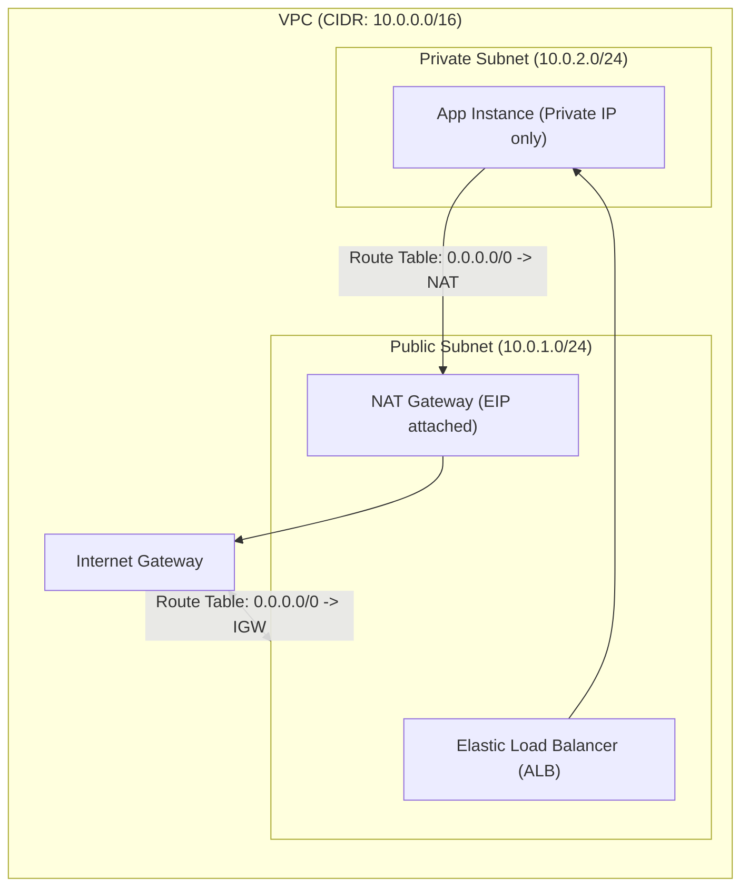
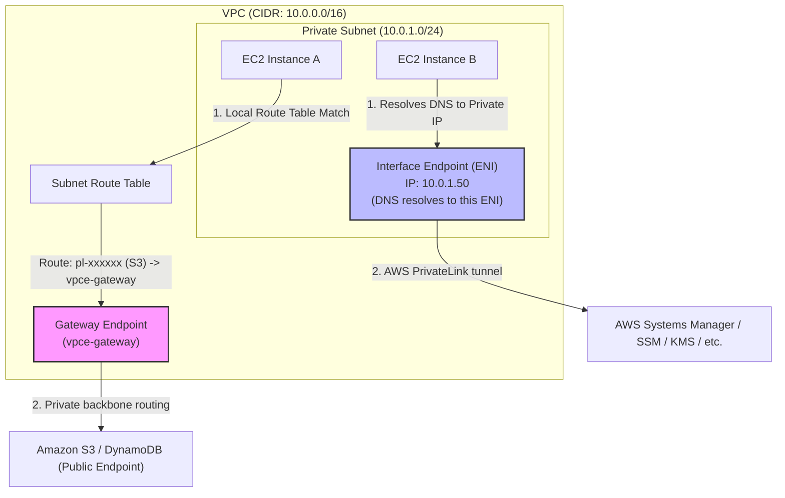

---
domains:
  - "aws"
class: reference-note
tier: reference-note
tags:
  - aws/networking
  - status/completed
---

# Module 3-9: AWS VPC Networking

## 🗺️ Cognitive Map: VPC Network Routing Topology

---

## 🗺️ Cognitive Map: VPC Endpoint Architecture Comparison

---

## 1. VPC Foundations & Core Concepts

### A. Virtual Private Cloud (VPC)
A **Virtual Private Cloud (VPC)** is a customer-defined private logical network inside an AWS Region. It behaves like a virtual data center in the cloud, isolated from other VPCs by default. 
*   **Scope:** Confined to a single AWS Region.
*   **Cost:** No charge for VPC creation (including subnets, Internet Gateways, Route Tables, and Network ACLs). Charges are incurred for resources launched inside the VPC and for specific networking gateways (e.g., NAT Gateways, Transit Gateways, VPNs).

### B. CIDR Block Planning & Subnetting
IP address allocation within a VPC is determined by **Classless Inter-Domain Routing (CIDR)** blocks.
*   **Primary CIDR Block:** Assigned when creating the VPC. This primary block cannot be modified or changed; to replace it, the VPC must be deleted and recreated.
*   **Secondary CIDR Blocks:** Up to 4 expansion CIDR blocks can be added to an existing VPC, subject to alignment constraints.
*   **Block Size Limitations:** AWS supports VPC CIDR blocks between `/16` (65,536 IP addresses) and `/28` (16 IP addresses).
*   **Private Ranges (RFC 1918):** AWS recommends using private IPv4 ranges:
    *   `10.0.0.0/8` (VPC range example: `10.0.0.0/16`)
    *   `172.16.0.0/12` (VPC range example: `172.16.0.0/16`)
    *   `192.168.0.0/16` (VPC range example: `192.168.0.0/16`)
*   **AWS Reserved IPs:** AWS reserves **5 IP addresses** in every subnet (first 4 and last 1):
    *   `.0`: Network Address.
    *   `.1`: AWS VPC Router (Implied Router).
    *   `.2`: Amazon DNS Server (`AmazonProvidedDNS`, located at the base IP + 2).
    *   `.3`: Reserved by AWS for future use.
    *   `.255`: Network Broadcast Address. (VPC networking does not support broadcast, but the address remains reserved).

### C. Default VPC vs. Custom VPC
Every AWS account is provisioned with a **Default VPC** in each region to simplify the onboarding of new users.
*   **Default VPC Characteristics:**
    *   Pre-configured with a public subnet in each Availability Zone (CIDR `/20`).
    *   An Internet Gateway (IGW) is pre-attached.
    *   Route tables are configured to route `0.0.0.0/0` to the IGW.
    *   Launched instances automatically receive a public IPv4 address and public/private DNS names.
*   **Custom VPC Characteristics:**
    *   Created completely empty (no subnets, no IGW, default main route table only contains a local route).
    *   The administrator must manually create subnets, configure route tables, and attach gateways.
    *   Instances launched in a Custom VPC do not receive public IPs unless explicitly requested or the subnet property is modified.

### D. Subnets
Subnets are divisions of the VPC CIDR block.
*   **AZ Confinement:** A subnet is strictly confined to a single Availability Zone (AZ) and cannot stretch across multiple AZs.
*   **Public vs. Private:**
    *   *Public Subnet:* A subnet whose associated route table has an explicit route pointing outbound traffic (`0.0.0.0/0`) to an Internet Gateway (IGW).
    *   *Private Subnet:* A subnet without a direct route to an IGW. Outbound traffic to the internet must traverse a NAT device.
*   **Overlapping:** Subnet CIDR ranges within the same VPC cannot overlap.

### E. Implied Router & Route Tables
*   **Implied Router:** A fully managed, logical VPC routing fabric that connects all subnets together by default.
*   **Route Tables:** Lists of routing rules (destination to target) applied at the subnet level.
    *   Every subnet must be associated with exactly one route table.
    *   If no association is specified, the subnet is automatically associated with the VPC's Main Route Table.
    *   The local VPC route (e.g., `10.0.0.0/16 -> local`) is created by default in all route tables and cannot be modified or deleted.

### F. Internet Gateway (IGW)
An **Internet Gateway** is a horizontally scaled, redundant, and highly available VPC component that enables communication between instances in the VPC and the internet.
*   Provides a target in VPC route tables for internet-routable traffic.
*   Performs Network Address Translation (NAT) for instances assigned public IPs.
*   Supports both IPv4 and IPv6 traffic.
*   **Limit:** Only **one** Internet Gateway can be attached to a VPC at a time.

---

## 2. Public & Private Network Edge Connectivity

### A. NAT Instances vs. NAT Gateways
Private subnet workloads often require outbound internet access to download software updates or contact public API endpoints without allowing inbound connections. AWS provides two mechanisms: **NAT Instances** (legacy, customer-managed) and **NAT Gateways** (modern, fully managed).

| Feature | NAT Instance | NAT Gateway |
| :--- | :--- | :--- |
| **Management** | Customer-managed (requires patching, OS maintenance) | Fully managed by AWS (no OS administration) |
| **High Availability** | Single node by default (requires custom scripts/ASGs for HA) | Highly available within an Availability Zone |
| **Scaling** | Limited to the bandwidth of the chosen EC2 instance size | Scales automatically up to 45 Gbps |
| **Security Groups** | Associated with a standard EC2 Security Group | Cannot be associated with a Security Group |
| **Source/Dest Check** | Must be manually **disabled** to allow routing traffic | Handled automatically by AWS |
| **Elastic IP (EIP)** | Optional (can use public IP) | **Required** for public NAT Gateways |
| **Cost Model** | Hourly instance pricing + standard EC2 data transfer costs | Hourly gateway fee + per-GB data processing fee |

#### High Availability Multi-AZ Design
While a NAT Gateway is highly available within its AZ, it is a regional point of failure if that specific AZ goes down. 
*   **Architecture Pattern:** Deploy **one NAT Gateway per Availability Zone**. Configure the route table of the private subnets in each AZ to route internet traffic (`0.0.0.0/0`) through the local NAT Gateway in the same AZ. This limits cross-AZ dependency and eliminates cross-AZ data transfer fees for outbound traffic.

### B. Bastion Hosts
A **Bastion Host** is a hardened EC2 instance deployed in a public subnet, used as a secure gateway to administration services (SSH/RDP) inside private subnets.
*   It is a regular EC2 instance configured with security hardening (strict SSH configs, minimal packages).
*   **Security Configuration:**
    *   The Bastion Host's security group must restrict inbound SSH (port 22) or RDP (port 3389) to specific corporate IP ranges.
    *   Admins SSH/RDP into the Bastion, and from there, open a secondary session to the private instances using their private IPs.
    *   **Elastic IP:** A Bastion should have an Elastic IP assigned so that administrative access configurations do not break if the instance restarts.
*   AWS recommends using NAT Gateways for outbound application traffic, and Bastion Hosts solely for inbound administrative access.

### C. Proxy & Reverse Proxy Servers
*   **Proxy Server:** Deployed in a public subnet to act as a forward proxy for outbound web requests. Used for URL filtering, access auditing, and whitelisting. Private instances route outbound web traffic through the proxy port instead of a NAT Gateway.
*   **Reverse Proxy Server:** Deployed in a public subnet to sit in front of application servers. It intercepts inbound requests, handles SSL/TLS termination, performs caching, filters traffic, and forwards requests to the backend servers.

---

## 3. Security and Traffic Control

### A. Security Groups
Security Groups act as virtual firewalls at the **Elastic Network Interface (ENI)** level of an EC2 instance.
*   **Stateful:** If an inbound request is permitted, the outbound response traffic is automatically allowed, regardless of outbound rules.
*   **Permit Only:** Rules can only allow traffic; explicit deny rules are not supported. Any traffic not matching a permit rule is denied by default (implied deny).
*   **Evaluation:** All rules are evaluated before traffic is allowed.
*   **Limits:** Up to 16 Security Groups can be associated with a single ENI.

### B. Network Access Control Lists (NACLs)
NACLs act as a stateless firewall at the **subnet boundary**.
*   **Stateless:** Outbound return traffic must be explicitly permitted by outbound rules, and inbound return traffic must be permitted by inbound rules.
*   **Permit & Deny:** Supports both allow rules and deny rules (useful for blocking specific IP addresses).
*   **Sequential Evaluation:** Rules are processed in numerical order (lowest to highest). The first matching rule determines the outcome (Allow/Deny), and evaluation stops.
*   **Default NACL:** Associated with the VPC by default; allows all inbound and outbound traffic.
*   **Custom NACL:** Denies all traffic by default until rules are explicitly added.
*   **Ephemeral Ports:** Because NACLs are stateless, return traffic from a web server must be allowed outbound. Client browsers select a random port from the ephemeral port range (`TCP 1024-65535`). Outbound NACL rules must permit this range for web servers to respond to clients.

| Feature | Security Group | Network ACL |
| :--- | :--- | :--- |
| **Level** | ENI / Instance | Subnet |
| **State** | Stateful | Stateless |
| **Rule Types** | Allow rules only | Allow and Deny rules |
| **Evaluation** | Evaluates all rules | Evaluates rules sequentially |
| **Scope** | App User / Instance Administrator | Network Administrator (VPC Dashboard) |

### C. AWS Network Firewall
A fully managed, sophisticated firewall service that protects the entire VPC (Layer 3 to Layer 7).
*   **Architecture:** Internally deploys endpoints powered by the AWS **Gateway Load Balancer (GWLB)**, but handles the underlying appliance infrastructure automatically.
*   **Protection Scope:** Inspects VPC-to-VPC traffic, internet outbound/inbound traffic, and hybrid connections (Direct Connect, VPN).
*   **Capabilities:**
    *   Supports thousands of stateful and stateless rules.
    *   **Domain Filtering:** Restricts outbound HTTP/S traffic to a whitelist of fully qualified domain names (FQDN) or third-party repositories.
    *   **Protocol Filtering:** Identifies and blocks specific protocols (e.g., blocking SMB outbound).
    *   **Pattern Matching:** Uses regular expressions and Suricata rule syntax to match payloads.
    *   **Actions:** Allow, Drop, or Alert. Includes active intrusion prevention (IPS) and flow inspection.
    *   **Logging:** Rule execution logs can be streamed to S3, CloudWatch Logs, or Kinesis Data Firehose.

---

## 4. Inter-VPC and Hybrid Connectivity

### A. VPC Peering
VPC Peering allows direct network routing between two VPCs using AWS's private network infrastructure.
*   **Scope:** Works across different AWS accounts and different AWS Regions (Inter-Region Peering).
*   **CIDR Constraint:** VPCs must have **non-overlapping** CIDR ranges.
*   **Non-Transitive:** Routing is strictly peer-to-peer. If VPC A is peered with VPC B, and VPC B is peered with VPC C, VPC A cannot communicate with VPC C unless an explicit peer is created between A and C.
*   **Mesh Complexity:** For $N$ VPCs to be fully interconnected, the number of required connections is $\frac{N(N-1)}{2}$.
*   **No Edge-to-Edge Routing:** A peered VPC cannot route transit traffic to or from an attached VPN or Direct Connect gateway.

### B. AWS Transit Gateway
AWS Transit Gateway acts as a cloud transit hub, simplifying mesh topology by routing traffic transitively across VPCs, VPNs, and Direct Connect links.
*   **Scope:** Regional resource (TGWs in different regions can be peered together).
*   **Managed Routing:** Supports editable routing tables to route traffic between attachments.
*   **VPC Peering Alternative:** Replaces complex, non-transitive mesh peering with a hub-and-spoke model.
*   **Constraint:** Connected attachments must not have overlapping CIDR ranges.

### C. Virtual Private Network (VPN)
Allows connecting an on-premises network to an AWS VPC over the public internet.
*   **Virtual Private Gateway (VGW):** The VPN concentrator attached to the AWS VPC side.
*   **Customer Gateway (CGW):** The logical definition of the on-premises VPN appliance. The connection must be initiated from the CGW.
*   **Tunneling:** Establishes two IPsec VPN tunnels for redundancy.
*   **VPN CloudHub:** A hub-and-spoke topology where multiple customer sites connect to a single VGW, routing traffic between sites over the AWS backbone.

### D. AWS Direct Connect (DX) & Direct Connect Gateway
A dedicated, physical network connection from an on-premises data center directly to an AWS colocation facility.
*   **Performance:** Provides low-latency, high-bandwidth connections (1G, 10G dedicated, or hosted links starting at 50 Mbps).
*   **Virtual Interfaces (VIF):**
    *   *Private VIF:* Connects to a VGW or Direct Connect Gateway to access VPC instances via private IPs.
    *   *Public VIF:* Accesses public AWS endpoints (S3, DynamoDB, EC2 public services) without routing over the public internet.
    *   *Transit VIF:* Connects to a Transit Gateway.
*   **Plaintext:** Traffic over a Direct Connect link is **not encrypted** by default. To secure data in transit, run an IPsec VPN tunnel over the Direct Connect connection.
*   **Direct Connect Gateway:** Connects a single private VIF to VGWs in multiple VPCs across different AWS Regions (excluding China). Does not route traffic between VPCs directly.

---

## 5. Private AWS Service Integration (VPC Endpoints)

### A. Gateway Endpoints vs. Interface Endpoints
VPC Endpoints allow private connections to supported AWS services without traversing an Internet Gateway, NAT Gateway, VPN, or Direct Connect link.

| Feature | Gateway Endpoint | Interface Endpoint (PrivateLink) |
| :--- | :--- | :--- |
| **Supported Services** | Amazon S3 and DynamoDB only | Most AWS services (EC2, KMS, SSM, etc.) |
| **Architecture** | Modifies VPC Route Tables (adds Prefix List routes) | Provisions an Elastic Network Interface (ENI) with a private IP |
| **Routing Mechanism** | Subnet Route Table target (`vpce-xxxxxx`) | DNS resolution to the private IP of the ENI |
| **Security Groups** | Not supported (uses Endpoint Policies) | Supported (assign standard Security Groups to ENI) |
| **Pricing** | **Free** to use | Hourly charge + per-GB data processing fee |

### B. Endpoint Policies
Both Gateway and Interface endpoints support **VPC Endpoint Policies**.
*   These are JSON IAM policies attached directly to the endpoint.
*   They control which IAM principals can access which resources (e.g., restricting access to a specific S3 bucket or blocking anonymous calls).
*   They do not replace IAM user policies or resource policies, but act as an additional policy boundary.

### C. Accessing Endpoints from Remote Networks
Interface Endpoints can be accessed directly from on-premises networks over VPN or Direct Connect because they have private IPs inside the VPC subnet.
*   Gateway Endpoints cannot be accessed directly from on-premises networks.
*   **Proxy Pattern:** To access S3/DynamoDB privately from on-premises without a public endpoint, deploy forward proxy instances (e.g., Squid) in the VPC public/private subnet. On-premises clients configure the proxies, which then forward requests to the S3 Gateway Endpoint.

---

## 6. Advanced Monitoring & IPv6 Networking

### A. VPC Flow Logs
VPC Flow Logs capture metadata about IP traffic going to and from network interfaces in the VPC.
*   **Levels:** Can be enabled at the VPC, Subnet, or ENI level.
*   **Data Captured:** Source/Destination IP, Source/Destination Port, Protocol, Packets, Bytes, and Action (ACCEPT or REJECT). It does **not** capture payload data.
*   **Destinations:**
    *   *Amazon S3:* Query logs using Amazon Athena.
    *   *CloudWatch Logs:* Query logs using CloudWatch Log Insights.
    *   *Kinesis Data Firehose:* Stream logs to external SIEM tools.

### B. VPC Traffic Mirroring
A security and monitoring feature that copies network traffic from a source ENI and forwards it to a target ENI or Network Load Balancer (NLB) for deep packet inspection.
*   **Non-Intrusive:** Captures traffic out-of-band without disrupting active workloads.
*   **Source:** Elastic Network Interface (ENI).
*   **Target:** ENI or NLB in the same VPC or peered VPC.
*   **Traffic Filters:** Rules can define which traffic (protocols, source/destination IPs/ports) is copied.
*   **Use Cases:** Intrusion detection (IDS), content inspection, network diagnostics, threat intelligence.

### C. IPv6 for VPC
*   All IPv6 addresses allocated in AWS are globally unique, public addresses. There is no RFC 1918 equivalent for IPv6.
*   **Egress-Only Internet Gateway:** Used to provide outbound-only internet connectivity for IPv6 addresses inside private subnets.
    *   Allows instances in private subnets to reach the internet over IPv6.
    *   Blocks incoming connections initiated from the internet.
    *   It is stateful and associated with subnet route tables.
    *   It cannot be assigned a Security Group.

---

## 7. Networking Cost Optimization

AWS data transfer charges depend on boundaries (Availability Zone, Region) and IP types.

### A. Core Traffic Cost Rules
1.  **Ingress (Inbound):** Traffic entering AWS services or instances from the internet is **free**.
2.  **Same Availability Zone:** Traffic between two EC2 instances using their **private IPs** in the same AZ is **free**.
3.  **Cross Availability Zone (Same Region):** Traffic between instances in different AZs within the same region costs **$0.01 per GB** each way (total $0.02/GB) if using private IPs.
4.  **Public vs. Private IPs (Same AZ/Region):** If two instances in the same region communicate using public or Elastic IPs (even in the same AZ), the traffic leaves the internal routing envelope and is charged at **$0.02 per GB** (1 cent for egress, 1 cent for ingress). Use private IPs for internal communication.
5.  **Cross-Region:** Traffic between regions costs **$0.02 per GB** (standard inter-region egress fee).

### B. Architectural Cost Reductions
*   **S3 Replication:** Same-region S3 transfer is free. Cross-Region Replication (CRR) incurs standard cross-region data transfer fees ($0.02/GB).
*   **CloudFront Integration:** Data transfer from S3 to CloudFront is **free**. CloudFront to the internet is cheaper ($0.085/GB) than S3 to the internet ($0.09/GB), and caching reduces request charges.
*   **VPC Endpoint Optimization:**
    *   Accessing S3 via a **NAT Gateway** costs $0.045/hour + $0.045/GB data processing + potential region data charges.
    *   Accessing S3 via a **Gateway VPC Endpoint** is **free** (no hourly fee, no per-GB processing fee for same-region traffic). 

---

## 8. Deep-Intuition (AARF) Breakdowns

### AARF Breakdown: NAT Gateway vs. NAT Instance
1.  **The Answer (Core Pattern):** Deploy highly available, managed **NAT Gateways** within each Availability Zone where private subnets reside, configuring separate route tables per AZ pointing outbound traffic to the local NAT Gateway.
2.  **The Assumptions (Context):** A NAT Gateway requires an Elastic IP and must be launched in a public subnet with a route pointing to an Internet Gateway.
3.  **The Rationale (Why):** NAT Gateways are fully managed, scale up to 45 Gbps, and provide built-in redundancy. NAT Instances are single-node EC2 instances requiring manual security patching, source/destination check disabling, and custom failover scripts.
4.  **The Failure Loop (What if not):** Operating a single NAT Instance for multiple AZ private subnets creates a single point of failure. If that instance crashes, all outbound connections from private subnets fail, breaking database syncs and application API requests.
5.  **Alternative Case (When to use 'if not'):** In low-budget development/sandbox environments, use a single t3.micro NAT Instance to save costs.

### AARF Breakdown: SG and NACL Ephemeral Ports
1.  **The Answer (Core Pattern):** Layer security by applying restrictive instance-level Security Groups combined with subnet-level NACLs. When configuring custom NACLs, always ensure outbound rules permit return traffic to the client's ephemeral port range (typically TCP 1024-65535).
2.  **The Assumptions (Context):** TCP handshakes require two-way communication. Client browsers establish connections by selecting a random high-numbered port to receive responses.
3.  **The Rationale (Why):** SGs are stateful; they track connection state tables and allow return packets automatically. NACLs are stateless and evaluate every packet. Failing to configure outbound ephemeral port rules on a custom NACL blocks the return packet from leaving the subnet.
4.  **The Failure Loop (What if not):** If a custom NACL has inbound rules allowing port 80/443, but lacks an outbound rule allowing ports 1024-65535, a client attempting to load a website will experience connection timeouts. The packet enters the subnet, the server processes it, but the return packet is blocked at the subnet boundary by the stateless NACL.
5.  **Alternative Case (When to use 'if not'):** In development environments where network segmentation auditing is not required, use default Open NACLs (Allow All) and rely exclusively on Security Groups.
