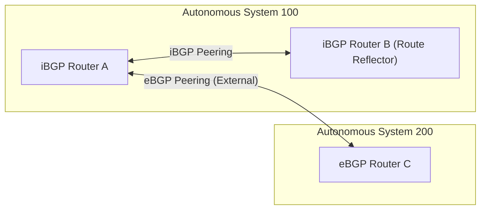

---
domains:
  - "networking"
---

# Module 4-1: BGP Fundamentals & Topologies

This module covers Border Gateway Protocol (BGP) routing architectures. It details path-vector routing concepts, eBGP vs. iBGP peering, BGP message exchanges, session state machine transitions, path-vector attributes, loopback peering load-balancing, and Route Reflector scaling configurations.

---

## 🗺️ Cognitive Map: eBGP and iBGP Peering Architecture



---

## 1. eBGP vs. iBGP Routing Primitives

Border Gateway Protocol (BGP) is a path-vector Exterior Gateway Protocol (EGP) designed to exchange routing and reachability information between different Autonomous Systems (AS) across the internet. Unlike Interior Gateway Protocols (IGPs) such as OSPF or EIGRP, BGP is built for administrative policy enforcement and scalability rather than rapid local convergence.

*   **eBGP (External BGP):** Exchanged between routers located in different Autonomous Systems. Peers are typically directly connected via physical point-to-point links. The Administrative Distance (AD) for eBGP is **20**.
*   **iBGP (Internal BGP):** Exchanged between routers within the same Autonomous System. Peers do not need to be physically adjacent. The Administrative Distance (AD) for iBGP is **200**. iBGP is used inside an AS to carry transit route information across the network while maintaining crucial BGP attributes (such as the AS-PATH).

---

## 2. BGP Connection Mechanics, Messages, & States

### Connection Initialization
BGP does not run directly over IP; instead, it establishes peer relationships manually via standard **TCP port 179**. Because peers must be explicitly configured, BGP does not use automatic discovery protocols.

### BGP Message Types
BGP uses four distinct message formats to manage sessions:
1.  **Open Message:** Initiates a BGP session. Contains parameters such as BGP version, local AS number, hold time, and BGP Identifier (router ID).
2.  **Keepalive Message:** Exchanged periodically (default interval: 60 seconds; hold time: 180 seconds) to verify peer availability and maintain the active TCP connection.
3.  **Update Message:** Carries routing information. Advertises newly reachable prefixes (with path attributes) or withdraws revoked routes.
4.  **Notification Message:** Triggered when a protocol error is detected. Immediately closes the TCP connection and resets the BGP session.

### BGP State Machine Transitions
A BGP neighbor relationship traverses six distinct operational states:
*   **Idle:** The initial state. The BGP routing process is waiting for a startup event or attempting to restart after a fatal error.
*   **Connect:** BGP attempts to establish a TCP 3-way handshake with the peer. If successful, it sends an Open message and transitions to *OpenSent*.
*   **Active:** If the TCP handshake fails during the *Connect* state, the router attempts to initiate a new connection. It listens for incoming connections from the neighbor. If successful, it transitions to *OpenSent*. If it fails or times out, it falls back to *Connect* (or back to *Idle*).
*   **OpenSent:** An Open message has been sent. The router is waiting to receive a matching Open message from the peer.
*   **OpenConfirm:** The router has received the peer's Open message and sent an acknowledgment (Keepalive). It waits for a Keepalive from the peer confirming parameters match.
*   **Established:** The session is fully active. Routers exchange routing updates via Update messages and monitor connectivity via Keepalives.

---

## 3. Path Vector Attributes & Origin Codes

BGP selects the best path to a destination based on cumulative path attributes rather than simple link cost.

### Core Selection Attributes
*   **AS-PATH:** A list of Autonomous System numbers that a route advertisement has traversed. BGP prefers paths with the fewest AS hops.
*   **NEXT-HOP:** The IP address of the boundary router to reach the destination prefix. When eBGP routes are advertised into iBGP, this attribute remains unchanged by default, which can cause routing drops if internal routers cannot resolve the next-hop IP.
*   **Origin Code:** Defines how the prefix was introduced into the BGP table:
    *   **IGP (`i`):** Prefixes introduced via the `network` command. Indicates the route belongs to the originating AS. Has the **highest priority**.
    *   **Incomplete (`?`):** Prefixes introduced via redistribution (injection) from another routing protocol (e.g., OSPF, static).
    *   *Note:* The origin code can be manually manipulated to influence inbound traffic routing path choices.

### Network Mask Best Practices
When defining prefixes to advertise in BGP, always specify the subnet mask explicitly (e.g., `network 10.1.0.0 mask 255.255.0.0`). Omitting the mask causes BGP to fall back to the default classful boundaries (Class A, B, or C), which can lead to route aggregation errors, blackholing, or ignored route entries if the actual subnet is subnetted (Classless).

---

## 4. Load Balancing & Redundancy between Autonomous Systems

When connecting two Autonomous Systems via multiple links, establishing independent BGP sessions over each physical interface leads to protocol overhead (redundant updates and multiple TCP sessions) and sub-optimal traffic sharing.

#### Deep-Intuition (AARF) Breakdown: eBGP Peering via Loopback Interfaces
1.  **The Answer (Core Pattern):** Configure eBGP peerings between the loopback interfaces of adjacent boundary routers. Define static routes or run an IGP to guarantee loopback-to-loopback reachability, change the update source, and increase the TTL:
    ```
    router bgp 100
      neighbor 192.168.1.1 remote-as 200
      neighbor 192.168.1.1 update-source Loopback0
      neighbor 192.168.1.1 ebgp-multihop 2
    ```
2.  **The Assumptions (Context):** Static routes or an IGP must be active on both sides to provide IP reachability between loopback addresses before the TCP port 179 connection can resolve.
3.  **The Rationale (Why):** If a physical peering link fails, BGP sessions built on physical interfaces immediately flap and drop. Loopback interfaces remain up as long as at least one physical link between the routers is operational, allowing static routing to failover transparently without tearing down BGP control-plane sessions.
4.  **The Failure Loop (What if not):** Since eBGP enforces a default Time-To-Live (TTL) of **1**, attempting to peer loopbacks without specifying `ebgp-multihop` causes BGP packets to expire at the receiving interface before reaching the internal loopback IP. The session will get stuck in the `Active` or `Idle` state, failing to establish.
5.  **Alternative Case (When to use 'if not'):** If the two adjacent interfaces reside on different subnets but no intermediate hops exist, configure `neighbor <IP> disable-connected-check` instead of changing the TTL to establish the session while maintaining security limits.

---

## 5. Route Reflector Topology and Redundancy

Within an Autonomous System, the **iBGP Split Horizon** rule states that a router cannot advertise a route learned from one iBGP peer to another iBGP peer. This prevents loop propagation. Traditionally, this required a **Full Mesh** topology where every iBGP router peered with every other router, scaling poorly at $\frac{N(N-1)}{2}$ sessions. Route Reflectors (RR) eliminate this limitation.

#### Deep-Intuition (AARF) Breakdown: Route Reflector Redundancy and Loops
1.  **The Answer (Core Pattern):** Deploy central core routers as Route Reflectors, and designate edge routers as clients. When deploying redundant Route Reflectors for high availability, configure identical `CLUSTER_ID`s on both RRs:
    ```
    router bgp 100
      bgp cluster-id 10.10.10.100
      neighbor 10.1.1.1 route-reflector-client
      neighbor 10.1.1.2 route-reflector-client
    ```
2.  **The Assumptions (Context):** RRs reflect updates according to specific rules: routes from clients are reflected to all peers; routes from non-clients are reflected to clients only.
3.  **The Rationale (Why):** When a Route Reflector reflects a route, it appends its `CLUSTER_ID` to the `CLUSTER_LIST` attribute. If a redundant RR receives an update containing its own configured `CLUSTER_ID` in the list, it discards the update, successfully preventing infinite control-plane routing loops.
4.  **The Failure Loop (What if not):** If redundant Route Reflectors lack a matching `CLUSTER_ID` configuration, they will recursively reflect received updates to each other. This creates a routing control-plane loop that saturates CPU resources and breaks interior gateway routing convergence.
5.  **Alternative Case (When to use 'if not'):** For small Autonomous Systems containing fewer than 5 internal routers, maintain a standard full-mesh iBGP configuration to avoid RR setup complexity.

---

## 6. Dynamic Neighbors, Peer Groups, and Policy Routing

### Peer Groups
BGP updates require generating and sending separate packets to every peer. Using peer groups allows grouping neighbors sharing identical policies. The router generates the update once and copies it to all group members, saving memory and CPU cycles.

### Dynamic Neighbors
Allows a Route Reflector to dynamically accept incoming BGP sessions from a range of IP addresses (defined via subnet wildcards) without explicitly configuring each neighbor. This simplifies large scale deployments.

### Split-Horizon and Next-Hop-Self
*   **Split Horizon Mitigation:** An RR acts as the centralized broker, relaxing the split-horizon rule for its clients.
*   **Next-Hop-Self:** When eBGP routes are advertised into iBGP, the next-hop remains set to the external peer's IP. If internal iBGP routers do not have an IGP path to that external subnet, the route is marked unreachable. Configuring `neighbor <IP> next-hop-self` on the boundary router forces it to advertise its own IP as the next-hop, solving reachability drops.
*   **PR-Inline Design:** Forcing path steering through the centralized RR for monitoring or filtering. In these cases, administrators must apply route filters (using ACLs, Prefix Lists, or Route Maps) to ensure symmetric traffic flows.

---

## 🖼️ Visual Topologies (Reference Slides)

### Peer Group Neighbor Route Reflector (Dynamic & Redundant)
![[session4-PeerGroup_NeighborRouteReflector_DynamicNeighbor_Redundancy.png]]

### Peer Group Route Reflector
![[session4-PeerGroup_NeighborRouteReflector.png]]

### Dynamic Neighbor Setup
![[session4-PeerGroup_NeighborRouteReflector_DynamicNeighbor.png]]

---

## 📖 Sources and References
*   CCNP ENARSI Course Reference material.
*   Video Tutorial: [BGP Configuring Base Topology – eBGP & iBGP Day2 pt2](https://www.youtube.com/watch?v=QHC5LydqHx4&list=PLSHBzUeysAH-Q56u5-cGvCxg4cdlDFkhw&index=7)
