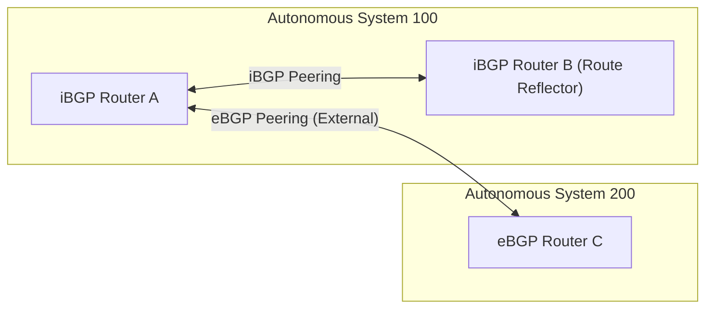

---
domains:
  - "networking"
---

# Module 4-1: BGP Fundamentals & Topologies

This module covers Border Gateway Protocol (BGP) routing architectures. It details path-vector routing concepts, eBGP vs. iBGP peering, Route Reflector topologies, and dynamic neighbor configuration.

---

## 🗺️ Cognitive Map: eBGP and iBGP Peering Architecture



---

## 1. eBGP vs. iBGP Routing Primitives

BGP is an Exterior Gateway Protocol (EGP) used to exchange routing information between Autonomous Systems (AS).

*   **eBGP (External BGP):** Exchanged between routers in different Autonomous Systems. Router connections are typically point-to-point physical links.
*   **iBGP (Internal BGP):** Exchanged between routers inside the same AS. Requires a **Full Mesh** topology (all iBGP routers peer with each other) or Route Reflectors to prevent routing loops.

---

## 2. Route Reflector Topology and Redundancy

In a large internal network, a full mesh iBGP topology scales poorly ($N(N-1)/2$ sessions). Route Reflectors (RR) solve this scaling bottleneck.

#### Deep-Intuition (AARF) Breakdown:
1. **The Answer (Core Pattern):** Designate central iBGP core routers as Route Reflectors, and group edge routers as RR Clients. Deploy redundant RRs inside client peering groups:
    ```
    router bgp 100
      neighbor 10.10.10.1 route-reflector-client
    ```
2. **The Assumptions (Context):** The RRs must configure the `CLUSTER_ID` attribute properly when redundant path reflections are active to prevent routing loop loops.
3. **The Rationale (Why):** Standard iBGP routing rules state that a router cannot advertise a route learned from one iBGP peer to another iBGP peer (to prevent routing loops). An RR overrides this rule, acting as a broker that reflects routes learned from client peers to other client and non-client peers.
4. **The Failure Loop (What if not):** Without Route Reflectors, iBGP updates stop propagating past the first hop, isolating subnet routes. If redundant RRs lack identical `CLUSTER_ID` configurations, they reflect paths recursively between themselves, creating an infinite routing control-plane loop that consumes cpu.
5. **Alternative Case (When to use 'if not'):** For small AS architectures containing fewer than 5 internal routers, maintain a standard full-mesh iBGP configuration to avoid RR setup complexity.
