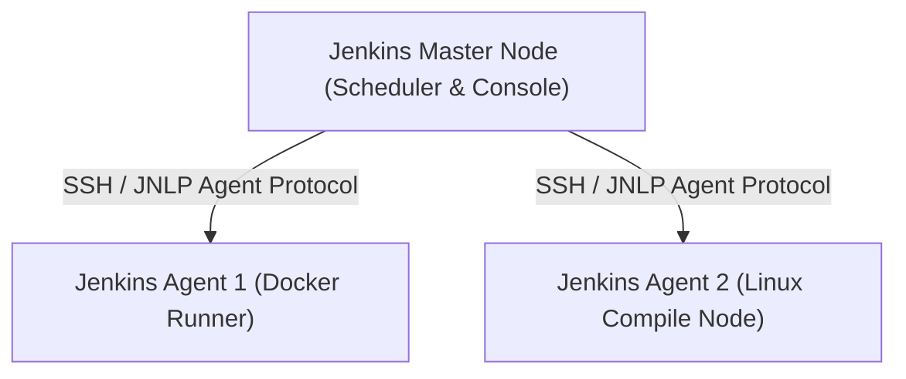

---
domains:
  - "jenkins"
  - "infra"
---

# Module 5-1: Jenkins Architecture & Pipeline Structure

This module covers Jenkins CI/CD system design, focusing on master-agent architectures and structuring Declarative Pipelines.

---

## 🗺️ Cognitive Map: Master-Agent Distributed Execution



---

## 1. Master-Agent Distributed Execution Topology

In production environments, Jenkins scales workloads using a distributed execution model.

*   **Jenkins Master:** The central scheduler, hosting the web console, managing configurations, plugins, and assigning build jobs to agents.
*   **Jenkins Agents:** Remote executors executing build scripts. Agents run minimal runner payloads, connecting via SSH or JNLP protocols.

---

## 2. Declarative Pipeline Syntax

Declarative Pipelines define the CI/CD workflow as code using a structured YAML-like format.

#### Deep-Intuition (AARF) Breakdown:
1. **The Answer (Core Pattern):** Utilize the `pipeline` block with explicitly declared stages, agent labels, and post-actions:
    ```groovy
    pipeline {
        agent { label 'docker-node' }
        stages {
            stage('Compile') {
                steps {
                    sh 'make compile'
                }
            }
        }
        post {
            always {
                archiveArtifacts 'build/dist/*.zip'
            }
        }
    }
    ```
2. **The Assumptions (Context):** The Jenkins agent tagged with `docker-node` must have the compiler runtime binaries installed and configured.
3. **The Rationale (Why):** Provides a strict, readable structure that ensures stages compile sequentially, executing cleanups automatically in `post` blocks.
4. **The Failure Loop (What if not):** Scripting free-form code outside a structured pipeline block results in syntax execution bugs, makes stage tracking on the UI impossible, and prevents proper cleanup runs on executor environments.
5. **Alternative Case (When to use 'if not'):** Use legacy Scripted Pipelines (Groovy DSL) when complex, dynamic control loops or runtime class injections are strictly required.
