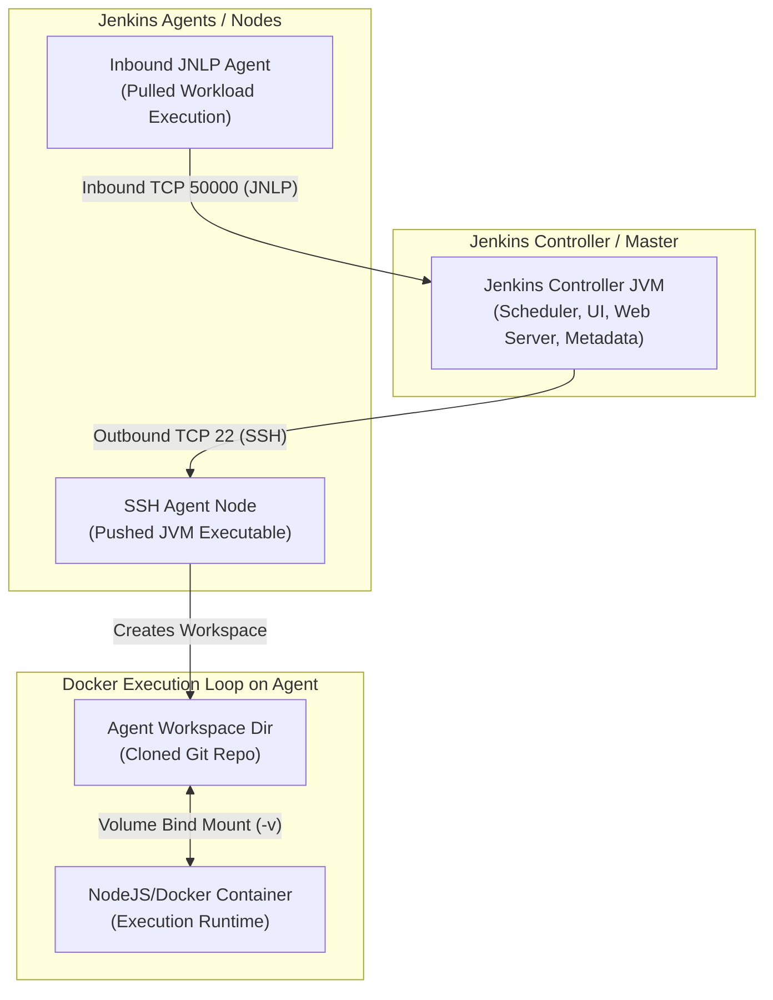

---
domains:
  - "jenkins"
  - "infra"
---

# Module 5-1: Jenkins Architecture & Pipeline Structure

This module covers the system design of Jenkins CI/CD, highlighting the distributed Master-Agent execution model, agent connection protocols, Docker runtime integration, and the transition from legacy Freestyle configurations to modern Declarative Pipelines-as-Code.

---

## 🗺️ Cognitive Map: Master-Agent Distributed Execution & Connection Topologies



---

## 1. Master-Agent Distributed Execution Topology

In production environments, scaling build workloads requires a strict separation of concerns between the scheduling control plane and execution runtimes.

*   **Jenkins Controller (Master):** The central orchestration JVM. It hosts the web console UI, stores job metadata, manages system configuration/plugins, schedules workloads, and stores build histories. Running actual build processes on the controller is a critical anti-pattern that compromises system security, fills disk space, and can freeze the scheduling UI due to memory exhaustion.
*   **Jenkins Agents (Nodes):** Ephemeral or static runtime environments hosting a lightweight Java agent application (`agent.jar`). Agents retrieve build instructions, run shell utilities, and stream exit statuses/stdout/stderr logs back to the controller.

### 🔌 Connection Protocols: SSH vs. JNLP Inbound

#### Deep-Intuition (AARF) Breakdown:
1.  **The Answer (Core Config):** Configure Agent connections depending on network directionality.
    *   **SSH (Outbound from Controller):** The controller acts as the SSH client and logs into the agent host via SSH (Port 22), copying and launching `agent.jar` automatically.
    *   **JNLP/Inbound (Inbound from Agent):** The agent host starts the execution runner manually or via boot script, establishing an inbound connection to the controller's dedicated TCP port (default `50000`):
        ```bash
        java -jar agent.jar \
          -url http://jenkins-controller:8080/ \
          -secret f1c28c8942b08... \
          -name "static-agent-01" \
          -workDir "/var/jenkins"
        ```
2.  **The Assumptions (Context):**
    *   **SSH:** Requires the controller to hold private SSH credentials (configured in Jenkins Credentials store) matching the public key in the agent's `/home/jenkins/.ssh/authorized_keys` file.
    *   **JNLP:** Requires the Jenkins Controller to enable the inbound agent TCP port (configured under *Global Security*) and allow traffic through intermediate firewalls, load balancers, or Kubernetes ingress rules. JDK version parity must be maintained between the controller JVM and the agent JVM.
3.  **The Rationale (Why):** SSH simplifies management since the controller orchestrates agent lifecycles directly. JNLP is ideal for agents behind NATs, firewalls, or dynamic compute resources (e.g., ephemeral Kubernetes pods) where the controller cannot initiate outbound connections to the target IP address.
4.  **The Failure Loop (What if not):**
    *   *SSH Misconfiguration:* Results in connection rejection loops:
        ```
        SSH Launcher failed to establish connection. 
        java.io.IOException: Authentication failed: Password or Public Key rejected.
        ```
    *   *JNLP Network/Version Mismatch:* Results in infinite connection retry loops or immediate JVM termination:
        ```
        Severe: Agent discovery failed. Connection timed out.
        Or:
        java.io.IOException: The server rejected the connection: JDK version mismatch.
        ```
5.  **Alternative Case (When to use 'if not'):** For Kubernetes environments, run the Jenkins Kubernetes Plugin. The controller spawns dynamic Pods on-demand using the JNLP protocol, terminating the agent Pod immediately upon stage completion to minimize idle compute costs.

---

## 2. Docker Container Runtime Integration

Integrating Docker with Jenkins agents allows pipelines to define execution environments as code, eliminating the need to pre-install specific runtime tools (e.g., Node.js, Python, compiler toolchains) on the host operating system of the agent.

### 🐳 Docker Agent Lifecycle & Volume Mapping

#### Deep-Intuition (AARF) Breakdown:
1.  **The Answer (Core Config):** Declare the target Docker image in the `agent` block of the stage or pipeline:
    ```groovy
    pipeline {
        agent none
        stages {
            stage('Build & Compile') {
                agent {
                    docker {
                        image 'node:18-alpine'
                        label 'docker-runner'
                        args '-v /var/run/docker.sock:/var/run/docker.sock'
                    }
                }
                steps {
                    sh 'node -v'
                    sh 'npm run build'
                }
            }
        }
    }
    ```
2.  **The Assumptions (Context):** The agent host tagged with the label `docker-runner` must have the Docker daemon installed and running. The Jenkins system user on the host must belong to the `docker` system group to access `/var/run/docker.sock` without root privileges.
3.  **The Rationale (Why):** Under the hood:
    *   The controller schedules the stage to execute on the agent matching `docker-runner`.
    *   The agent clones the Git repository into its local directory (workspace).
    *   The agent executes a `docker run` command, automatically mounting the agent's host workspace directory into the container using a volume bind mount (`-v`).
    *   All execution steps within the stage are executed inside the running container context.
    *   Because of the bind mount, compilation artifacts (like `/dist` directories) are written directly back to the host filesystem.
    *   Upon stage completion, the agent runs `docker stop` and `docker rm` to tear down the container, freeing system resources while leaving build outputs intact in the workspace directory.
4.  **The Failure Loop (What if not):**
    *   If the Jenkins agent user cannot access the Docker daemon socket, the stage immediately fails with:
        ```
        docker: Got permission denied while trying to connect to the Docker daemon socket at unix:///var/run/docker.sock
        ```
    *   If the volume mapping is broken or the workspace path is not correctly mountable, compilation outputs are lost inside the ephemeral container boundary when it terminates, crashing downstream deployment stages.
5.  **Alternative Case (When to use 'if not'):** If the runtime environment must execute docker commands themselves (e.g., building a new container image via `docker build`), utilize the host's Docker socket or run Docker-in-Docker (DinD) within a Kubernetes container wrapper, ensuring proper security profiling.

---

## 3. Legacy Freestyle vs. Declarative Pipeline-as-Code

Understanding the transition from Freestyle Jobs to Declarative Pipelines is fundamental to implementing modern infrastructure-as-code principles.

| Architectural Dimension | Legacy Freestyle Jobs | Modern Declarative Pipelines |
| :--- | :--- | :--- |
| **Configuration Model** | Configured manually through Jenkins Web GUI. | Defined via code in a versioned `Jenkinsfile`. |
| **Storage Mechanism** | Saved as system-internal XML files on the controller. | Stored in Git alongside application source code. |
| **Auditability & Trackability** | Poor. Changes are untraceable unless audited via specific logs. | High. Tracked via standard Git commits (who, what, when). |
| **Workflow Complexity** | Linear, sequential execution model. | Complex execution: parallel stages, conditional branches, error handling. |
| **Plugin Reliance** | Heavy. Requires plugins for basic control flow extensions. | Low. Native DSL structures handle complex execution patterns. |

### 🛠️ Declarative Pipeline Structure

#### Deep-Intuition (AARF) Breakdown:
1.  **The Answer (Core Config):** Standardize all CI/CD pipelines in a declarative structure enclosing variables, stages, steps, and post-execution cleanup handlers:
    ```groovy
    pipeline {
        agent { label 'linux-node' }
        stages {
            stage('Source Checkout') {
                steps {
                    checkout scm
                }
            }
            stage('Build') {
                steps {
                    sh 'make build'
                }
            }
        }
        post {
            always {
                archiveArtifacts artifacts: 'build/*.bin', onlyIfSuccessful: true
            }
            cleanup {
                cleanWs()
            }
        }
    }
    ```
2.  **The Assumptions (Context):** The pipeline configuration must be located in a file named `Jenkinsfile` at the root of the source control repository. The controller must have the Pipeline Plugin suite installed.
3.  **The Rationale (Why):** Declarative syntax enforces a clean structural schema. Features like `post` hooks guarantee that execution reporting, artifact archiving, and workspace cleaning take place regardless of whether intermediate compilation stages succeed or fail.
4.  **The Failure Loop (What if not):** Using Freestyle jobs or unstructured Scripted pipelines makes code review impossible for build logic, creates config drift between environments, and leaves abandoned file artifacts in workspaces, which leads to disk exhaustion and "dirty" builds.
5.  **Alternative Case (When to use 'if not'):** Scripted pipelines (written in pure Groovy DSL without the `pipeline {}` wrapper) are only recommended for legacy compatibility or when dynamically constructing stages at runtime based on complex runtime configurations.

---

### CKA / DevOps Tip
> [!TIP]
> When setting up multi-agent architectures, label agents based on their exact runtime capabilities (e.g., `jdk-17`, `golang`, `aws-cli`). This prevents build failures caused by steps attempting to execute compiler commands on agent nodes that lack the correct system runtimes.
