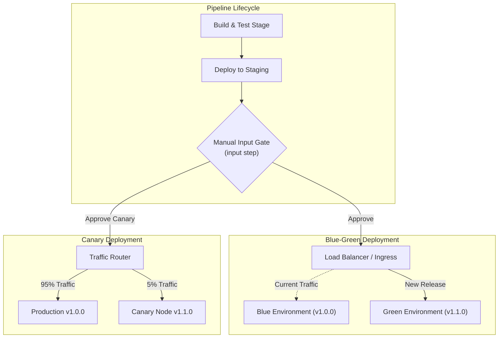

---
domains:
  - "jenkins"
---

# Module 5-3: Jenkins Administration & Troubleshooting

This module covers the operational administration of Jenkins servers, including core upgrades, plugin dependency management, troubleshooting build failures via exit codes, and structuring continuous delivery deployment staging.

---

## 🗺️ Cognitive Map: CD Gating & Deployment Strategies



---

## 1. Jenkins Upgrade & Dependency Management

Maintaining Jenkins server health requires systematic upgrades of the core controller runtime and its installed plugins.

### 🔄 Docker-Based Jenkins Core Upgrade Protocol

#### Deep-Intuition (AARF) Breakdown:
1.  **The Answer (Core Config):** For Docker-based controllers, perform updates by pulling the latest LTS base image, rebuilding the custom image, and redeploying:
    ```bash
    # 1. Stop the current running controller
    docker compose down
    
    # 2. Rebuild drawing down the latest LTS core version
    docker compose build --pull
    
    # 3. Bring the service back up in the background
    docker compose up -d
    ```
2.  **The Assumptions (Context):** `$JENKINS_HOME` config metadata (jobs, credentials, workspace records) must reside on a persistent volume bind-mounted to the host. Upgrades must be recorded in a centralized maintenance log:
    
    | Date | Target Component | Update Type | Pre-Version | Post-Version | Authorized By | Status |
    | :--- | :--- | :--- | :--- | :--- | :--- | :--- |
    | 2026-06-11 | Jenkins Core | Security Patch | 2.440.1 | 2.452.2 | Admin | Successful |
    | 2026-06-11 | GitHub Plugin | Compatibility | 1.37.3 | 1.38.0 | Admin | Successful |

3.  **The Rationale (Why):** Replacing raw `.war` binaries manually inside a container is an anti-pattern. Treating the container as immutable and updating via image tags prevents configuration drift and ensures clean dependency mapping.
4.  **The Failure Loop (What if not):** Modifying file systems inside container runtimes causes loss of configurations when the container restarts. If dependent plugins are upgraded before the core version is updated, dependency compilation conflicts will arise, causing core startup crashes:
    ```
    Severe: Jenkins failing to start due to PluginClassLoadException: 
    Plugin 'github' requires Jenkins 2.452.2 or higher.
    ```
5.  **Alternative Case (When to use 'if not'):** For package-manager-based OS installations (APT/YUM), lock the package version to prevent accidental automated system updates using `apt-mark hold jenkins`.

### 🔌 Safe Plugin Updates & System Restarts

#### Deep-Intuition (AARF) Breakdown:
1.  **The Answer (Core Config):** Upgrade plugins through the Jenkins Plugin Manager interface. To safely activate changes without terminating running pipelines, initiate a safe restart via the REST API or console URI:
    ```
    http://jenkins-server:8080/safeRestart
    ```
2.  **The Assumptions (Context):** Administrator privileges are required to access `/safeRestart`.
3.  **The Rationale (Why):** `/safeRestart` allows currently executing pipelines to finish their jobs before putting the controller into a reboot state. This prevents build failures and workspace corruption.
4.  **The Failure Loop (What if not):** Triggering an immediate hard restart via `docker restart` or `/restart` terminates active JVM threads, aborts running builds immediately, and can corrupt local workspace database schemas.
5.  **Alternative Case (When to use 'if not'):** If the controller is frozen or unresponsive due to thread starvation or out-of-memory errors, use `docker compose restart` to force system initialization.

---

## 2. Debugging Pipeline Failures & Exit Codes

Jenkins evaluates shell script actions by capturing the exit code returned by the operating system kernel.

### 🛠️ Analyzing Exit Codes & Console Logs

#### Deep-Intuition (AARF) Breakdown:
1.  **The Answer (Core Config):** Understand that non-zero exit codes (1–255) signal failure. When debugging console logs, locate the execution commands prefixed with a `+` to find the exact failure point:
    ```
    [Pipeline] sh
    + npm run test
    ...
    [Pipeline] }
    [Pipeline] // stage
    ERROR: script returned exit code 1
    Stage 'Execute Tests' failed. Stage 'Deploy' skipped due to earlier failure.
    ```
2.  **The Assumptions (Context):** Jenkins runs shells with the `-e` flag active (`set -e`), which tells the shell engine to exit immediately if any command returns a non-zero exit status.
3.  **The Rationale (Why):** The exit status acts as a signaling mechanism. If any step fails, Jenkins immediately halts execution to prevent broken configurations from leaking into production stages.
4.  **The Failure Loop (What if not):** Without capturing exit codes, a compiler crash (e.g., compile error exit code 2) would be ignored. The pipeline would continue running, packaging a broken build and deploying it, causing immediate outage events.
5.  **Alternative Case (When to use 'if not'):** If a command is allowed to fail without crashing the pipeline (e.g., non-critical diagnostic tools), override the exit code checking using a try-catch block or shell OR syntax:
    ```groovy
    sh 'npm run audit || true'
    ```

---

## 3. Continuous Delivery (CD) Staging & Deployment Strategies

Continuous Delivery differs from Continuous Deployment by requiring a gatekeeper verification loop (manual gate) before staging production releases.

### 🚦 Implementing Manual Gates (Input Steps)

#### Deep-Intuition (AARF) Breakdown:
1.  **The Answer (Core Config):** Restrict production deployments to authorized release groups using the `input` step DSL syntax:
    ```groovy
    stage('Deploy to Production') {
        input {
            message "Approve deployment of version ${env.GIT_COMMIT_SHORT} to Production?"
            ok "Promote Release"
            submitter "release-managers,admin"
            parameters {
                string(name: 'RELEASE_NOTES', defaultValue: 'Bug fixes', description: 'Release notes')
            }
        }
        steps {
            echo "Deploying release with notes: ${RELEASE_NOTES}"
            sh './deploy-prod.sh'
        }
    }
    ```
2.  **The Assumptions (Context):** The user accounts making the approval must belong to the authorization roles specified in the `submitter` property.
3.  **The Rationale (Why):** Gating releases prevents code from moving to production until manual validation, security compliance audits, or business approvals are finalized.
4.  **The Failure Loop (What if not):** Without manual gates, untested changes or builds that passed automated tests but contain business logic errors are pushed to production automatically, exposing users to bugs.
5.  **Alternative Case (When to use 'if not'):** For true Continuous Deployment, omit the manual input block. Trigger automatic deployments once all automated testing (unit, integration, load tests) stages pass successfully.

### 🏛️ Staging Deployment Patterns

*   **Blue-Green Deployment:** Maintain two identical, isolated production environments (Blue hosts current v1.0.0; Green hosts new v1.1.0). Switch DNS or Load Balancer routing to Green once validation checks pass. Rollback is instant by routing traffic back to Blue.
*   **Canary Deployment:** Route a tiny fraction of user traffic (e.g., 5%) to the new v1.1.0 release while the bulk continues on v1.0.0. Monitor system errors and logs; if no failures occur, gradually route all traffic to the new version.
*   **Rolling Update:** Incrementally replace instances of v1.0.0 with v1.1.0 across clusters (e.g., Kubernetes Deployments). Prevents service downtime but results in mixed versions serving user requests simultaneously.

---

### CKA / DevOps Tip
> [!TIP]
> Always configure a workspace cleanup post-execution step using `cleanWs()` in your pipeline. This prevents local disk build-up on agents and ensures that each build starts from a clean environment, avoiding compile anomalies from leftover artifacts.

