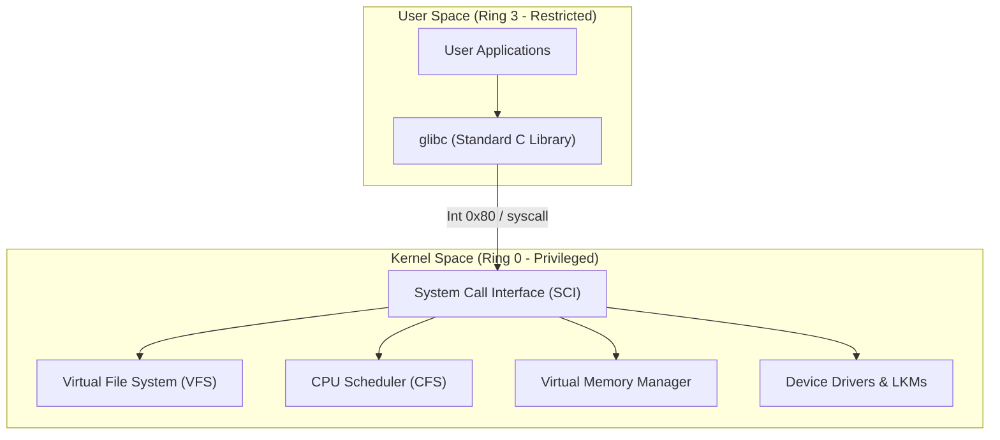

# Module 8-1: Linux Kernel Architecture & Process Mechanics

**Breadcrumbs:** [[8-Index - Linux and OS|🏠 Linux and OS Index]] > **Kernel & Process Mechanics**

---

## 🏛️ Kernel Architecture & Space Segmentation

The Linux operating system segregates memory and CPU privilege levels into two primary execution spaces to protect the system from user-space application instability.



### Kernel Space vs. User Space
1.  **Kernel Space (Ring 0):**
    *   Runs with maximum CPU privileges.
    *   Has direct, unrestricted access to the underlying hardware execution pipelines.
    *   Memory protection is disabled; an invalid instruction or memory address access here will trigger a **Kernel Panic**.
2.  **User Space (Ring 3):**
    *   Runs with restricted CPU privileges.
    *   Cannot execute privileged CPU instructions (e.g., direct disk writes, page table modification).
    *   Memory protection is enabled; invalid operations trigger a `Segmentation Fault` and terminate only the offending process.

### The System Call Interface (SCI)
All requests for hardware resources or privileged operations by user-space applications must traverse the System Call Interface.
*   **Mechanism:**
    1.  Application calls a library wrapper (e.g., standard `glibc` function).
    2.  The library places system call arguments in CPU registers and executes a software interrupt/privilege transition (`syscall` instruction on x86_64).
    3.  CPU switches from Ring 3 to Ring 0, jumping to the kernel's syscall entry point.
    4.  Kernel validates arguments, executes the kernel-space routine, places the return value in a register, and switches back to Ring 3.
*   **Common Syscalls:**
    *   *Process Control:* `fork()`, `execve()`, `clone()`, `exit()`, `waitpid()`
    *   *File Operations:* `open()`, `read()`, `write()`, `close()`, `stat()`
    *   *Memory Management:* `mmap()`, `brk()`
    *   *Network & IPC:* `socket()`, `bind()`, `connect()`, `pipe()`

### Loadable Kernel Modules (LKMs)
To avoid compiling a giant static binary, the Linux kernel dynamically loads and unloads device drivers and features at runtime.
*   **Lifecycle Tools:**
    *   `lsmod`: Lists currently loaded kernel modules (reads `/proc/modules`).
    *   `modinfo <module>`: Displays detailed module parameters and dependency rules.
    *   `modprobe <module>`: Loads a module and automatically resolves/loads all required dependency modules.
    *   `modprobe -r <module>`: Unloads a module and its unused dependencies.

---

## ⚙️ Process Lifecycle & Memory Mechanics

### Process Creation (fork-exec)
Linux process spawning is divided into two sequential operations:
1.  **`fork()`:** Clones the calling (parent) process, creating a child process. The child receives a unique Process ID (PID) and a duplicate copy of the parent's file descriptors, registers, and memory mappings.
2.  **`execve()`:** Overwrites the child process's memory space with a new executable program, initializing the stack and starting program execution at the binary's entry point.

### Process Lifecycle States
Each process tracks its execution state, visible in `/proc/<PID>/status` or via `ps`:
*   **Running/Runnable (R):** Currently executing on a CPU core or waiting in the scheduler runqueue.
*   **Interruptible Sleep (S):** Waiting for an event or resource (e.g., network packet, keystroke). Can be woken up by software signals.
*   **Uninterruptible Sleep (D):** Waiting on synchronous device I/O (typically disk metadata). Cannot be interrupted by signals, even `SIGKILL` (often seen as processes hung in `D` state during disk/NFS failures).
*   **Stopped (T):** Execution suspended by control signals (e.g., `SIGSTOP` or `Ctrl+Z`).
*   **Zombie (Z):** The process has terminated (`exit()`), but its exit status has not yet been collected by its parent process using the `wait()` system call. It consumes no memory but occupies an entry in the system **PID Table**.

### Virtual Memory & Address Space Layout
Linux abstracts physical RAM by giving each process a contiguous Virtual Address Space. This isolation prevents processes from reading or writing into each other's memory segments.

```
+------------------------------------+ <-- High Memory (0xFFFFFFFFFFFFFFFF)
|            Kernel Space            | (Mapped to physical RAM, inaccessible to User mode)
+------------------------------------+
|         Stack (Grows Down)         | (Stores local variables, function frames)
+------------------------------------+
|                 ||                 |
|                 \/                 |
|      Memory Mapping Segment        | (Mapped libraries via mmap)
|                 /\                 |
|                 ||                 |
+------------------------------------+
|          Heap (Grows Up)           | (Dynamic memory allocated via malloc/brk)
+------------------------------------+
|   BSS (Uninitialized Globals)      |
+------------------------------------+
|   Data (Initialized Globals)       |
+------------------------------------+
|        Text (Program Code)         | <-- Low Memory (0x0000000000000000)
+------------------------------------+
```

*   **Page Tables:** The kernel maps 4KB virtual chunks (pages) to physical frames in RAM using multi-level page tables, cached in the CPU hardware **Translation Lookaside Buffer (TLB)**.
*   **Memory Overcommit:** The kernel allows processes to request more virtual memory than is physically available, banking on the assumption that not all processes utilize their allocations simultaneously.
*   **OOM Killer (Out-of-Memory):** When physical memory and swap are exhausted, the kernel executes the OOM killer algorithm to terminate processes with high memory footprint and low priority. The likelihood of termination is governed by the `oom_score` (visible in `/proc/<PID>/oom_score`), which can be adjusted via `/proc/<PID>/oom_score_adj`.

---

## 📊 CPU Scheduling & Priorities

### Completely Fair Scheduler (CFS)
The default scheduling class for non-realtime processes in Linux is the **Completely Fair Scheduler (CFS)**.
*   **Concept:** CFS uses a red-black tree data structure to track the virtual runtime (`vruntime`) of all runnable processes. The scheduler allocates CPU time to the process with the smallest `vruntime`, ensuring execution fairness.
*   **Nice Values:** Controls process priority weight. Ranging from `-20` (highest priority) to `19` (lowest priority). A lower nice value decreases `vruntime` accumulation speed, granting the process more CPU time slices.

### Real-Time Schedulers
For latency-critical applications, Linux bypasses CFS in favor of real-time scheduling classes:
*   **`SCHED_FIFO` (First-In, First-Out):** A process runs until it blocks, yields, or is preempted by a higher-priority real-time process.
*   **`SCHED_RR` (Round-Robin):** Similar to `SCHED_FIFO` but limits runtime to a specific time-slice quantum, rotating between runnable processes of identical priority.

### CPU Affinity
Binds a process to specific CPU execution cores using the `sched_setaffinity()` system call (or `taskset` CLI). This optimization prevents cache thrashing and maintains memory locality (NUMA nodes).

---

## 🛡️ Resource Limits & Process Sandboxing (Containers)

### Resource Limits (ulimits)
Controls user and process resource usage limits (configured via `/etc/security/limits.conf` or the `ulimit` builtin).
*   **Soft Limits:** Limits that a process can increase on its own (up to the hard limit).
*   **Hard Limits:** Hard ceiling that can only be increased by the root user.
```bash
# View all active shell limits
ulimit -a

# Set max open file descriptors (nofile) to 65535
ulimit -n 65535
```

### Process Sandboxing: Namespaces
Namespaces isolate system resources, providing the foundational virtualization layer for Linux Containers (Docker, Podman).
1.  **PID Namespace:** Restricts process visibility. A process inside a PID namespace can be PID 1 (init) inside its boundary, but maps to a standard PID (e.g. PID 12435) in the parent system.
2.  **NET Namespace:** Isolates the network stack (interfaces, routing tables, port bindings, and firewall rules).
3.  **MNT Namespace:** Isolates file system mount points, allowing a process to mount/unmount file systems without affecting the host.
4.  **UTS Namespace:** Isolates system hostnames and domain names.
5.  **IPC Namespace:** Isolates shared memory, semaphores, and message queues.
6.  **USER Namespace:** Isolates user and group IDs. A user can be root (UID 0) inside the namespace, but map to an unprivileged user (UID 10005) on the host.

### Resource Controls: Control Groups (cgroups)
While namespaces handle **isolation**, cgroups handle **resource allocation, throttling, and monitoring**.
*   **cgroups v1:** Divided resources into discrete, independent subsystem directories (e.g. `/sys/fs/cgroup/cpu`, `/sys/fs/cgroup/memory`). Difficult to coordinate across different subsystems.
*   **cgroups v2:** Provides a single, unified resource controller hierarchy. This is the modern standard used by current container runtimes (`systemd` cgroup driver in Kubernetes).
```bash
# Example limit in cgroups v2 (unified hierarchy)
# Paths are usually managed automatically by systemd or containerd:
/sys/fs/cgroup/system.slice/docker.service/memory.max
```
