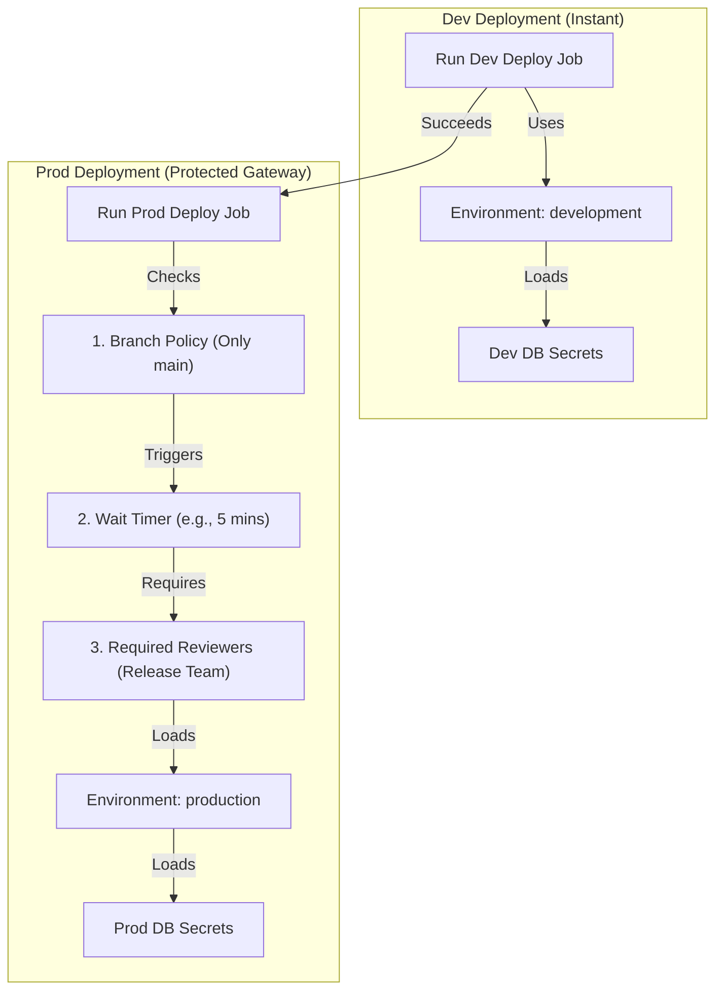

# Module 9-10: GitHub Actions Environments, Secrets & Approvals

**Breadcrumbs:** [[9-Index - GitHub Actions|🏠 GitHub Actions References Index]] > **GitHub Actions Environments, Secrets & Approvals**

This module covers environment protection and secure configuration management in GitHub Actions. It details the setup of deployment environments, manual approval workflows, wait timers, branch restriction policies, and the scope resolution of environment-specific variables and secrets.

---

## 🗺️ Cognitive Map: How to Think About the Flow of Knowledge

Secure your release path by routing code promotions through environment protection gates and scoped credential stores:



1. **Deployment Isolation Challenges (Section 1):** Understand the need for environment-specific secrets and controlled releases.
2. **Environment Protection Rules (Section 2):** Set up manual reviews, timing delays, and branch policies.
3. **Environment-Scoped Variables & Secrets (Section 3):** Manage configuration overrides between global repository and local environment levels.
4. **Protected Deployment Blueprint (Section 4):** Write a pipeline utilizing multi-environment promotion patterns.

---

## 1. Configuration Isolation & Deployment Challenges

In enterprise software development, a single application artifact must promote through multiple staging environments (e.g., `development` -> `staging` -> `production`) before reaching users.

This promotion path presents three challenges:
*   **Environment-Specific Configuration:** Different environments require different parameters (e.g., log verbosity levels, replica counts, API URLs).
*   **Credential Isolation:** Security mandates that a database connection string or API token for `development` must not have access to the `production` database. Devs should not have access to production credentials.
*   **Controlled Deployments (Release Gates):** Organizations must control who can deploy, when they can deploy, and which branches are allowed to target staging/production environments.

---

## 2. Environments and Protection Rules

GitHub Actions **Environments** solve these challenges by grouping secrets, variables, and protection rules under a logical target name.

### A. Environment Protection Rules
Configured via the GitHub UI (**Settings** -> **Environments** -> **Configure Environment**):
*   **Required Reviewers:** Pauses the job execution and notifies designated users/teams. The job remains in a "Waiting" state until approved by a reviewer or the timeout (default 30 days) is reached.
*   **Wait Timer:** Delays job execution for a specified number of minutes after the workflow trigger.
*   **Deployment Branches:** Limits which Git branches are allowed to deploy to the environment. For example, you can restrict the `production` environment so it only accepts deployments from the `main` branch or tags matching `release/*`.

### B. Secret Scoping and Override Logic
You can define variables and secrets at three levels in GitHub:
1.  **Organization Level:** Shared across multiple repositories.
2.  **Repository Level:** Accessible by any job in that specific repository.
3.  **Environment Level:** Accessible only to jobs that explicitly reference the environment name.

**Resolution Hierarchy:**
When a job references an environment, GHA searches for secrets in this order:

```mermaid
graph TD
    Lookup["Step references secret: ${{ secrets.DATABASE_URL }}"] --> EnvCheck{"1. Exists in Environment scoped secrets?"}
    EnvCheck -->|Yes (Match)| ReturnEnv["Use Environment Secret (Overrides all others)"]
    EnvCheck -->|No| RepoCheck{"2. Exists in Repository secrets?"}
    RepoCheck -->|Yes (Match)| ReturnRepo["Use Repository Secret"]
    RepoCheck -->|No| OrgCheck{"3. Exists in Organization secrets?"}
    OrgCheck -->|Yes (Match)| ReturnOrg["Use Organization Secret"]
    OrgCheck -->|No| Fail["Authentication / Secret Not Found Error"]
```

---

## 3. Hands-on Protected Deployment Blueprint

This blueprint demonstrates a multi-stage promotion pipeline.
*   The **development deployment** job runs instantly and pulls dev-specific variables.
*   The **production deployment** job is gated behind the `production` environment, meaning it will trigger manual approvals, wait timers, and branch policies configured on GitHub. It pulls production-scoped secrets using the same naming scheme.

```yaml
# .github/workflows/secure-deployment.yml
name: Controlled Environment Deployment

on:
  push:
    branches:
      - main
      - 'releases/**'

jobs:
  build-and-test:
    name: Build & Package Artifact
    runs-on: ubuntu-latest
    steps:
      - name: Checkout Source Code
        uses: actions/checkout@v4

      - name: Compile Code
        run: echo "Compiling production-ready container image..."

  deploy-development:
    name: Deploy to Dev
    needs: build-and-test
    runs-on: ubuntu-latest
    
    # Associate job with the development environment
    environment:
      name: development
      url: https://dev.app.internal.company.com

    steps:
      - name: Deploy to Development Server
        # env.DATABASE_CONN is loaded from development environment variables
        run: |
          echo "Deploying to Development Environment..."
          echo "Target Host: ${{ vars.DEPLOYMENT_HOST }}"
          echo "Connecting to database: ${{ secrets.DATABASE_CONN }}"

  deploy-production:
    name: Deploy to Production
    needs: deploy-development
    runs-on: ubuntu-latest
    
    # Associate job with production environment (enforces manual approvals/secrets)
    environment:
      name: production
      url: https://app.company.com

    steps:
      - name: Deploy to Production Cluster
        # GHA dynamically resolves vars.DEPLOYMENT_HOST and secrets.DATABASE_CONN
        # to the production-scoped values, overriding repository-level defaults.
        run: |
          echo "Manual Approval Received. Deploying to Production..."
          echo "Target Production Host: ${{ vars.DEPLOYMENT_HOST }}"
          echo "Connecting to Production DB: ${{ secrets.DATABASE_CONN }}"
          echo "Injecting Prod API Token: ${{ secrets.API_TOKEN }}"
```

---

## 4. Summary & Best Practices
*   **Enforce branch restrictions:** Always limit production environments to the `main` or release branches to prevent developers from accidentally deploying experimental feature branches to production.
*   **Apply the Principle of Least Privilege:** Never store production secrets at the repository level. Keep them scoped to the `production` environment to prevent unauthorized jobs from accessing them.
*   **Utilize Environment URL:** Declare the `url` property inside the `environment` block. GitHub displays a convenient "View deployment" button directly on the Pull Request page, letting developers quickly access the live environment.

---

### 📖 Sources & Ingested Transcripts
- Source 9: `inflow/GitHub Actions Environments Explained  Variables, Secrets, Approvals & Protection Rules.txt`
