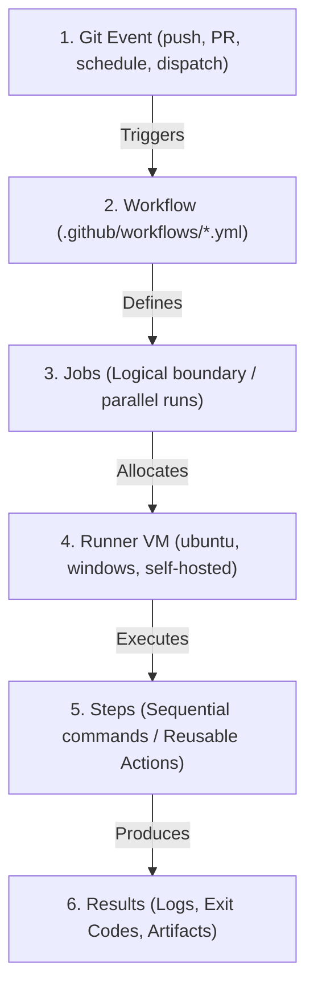
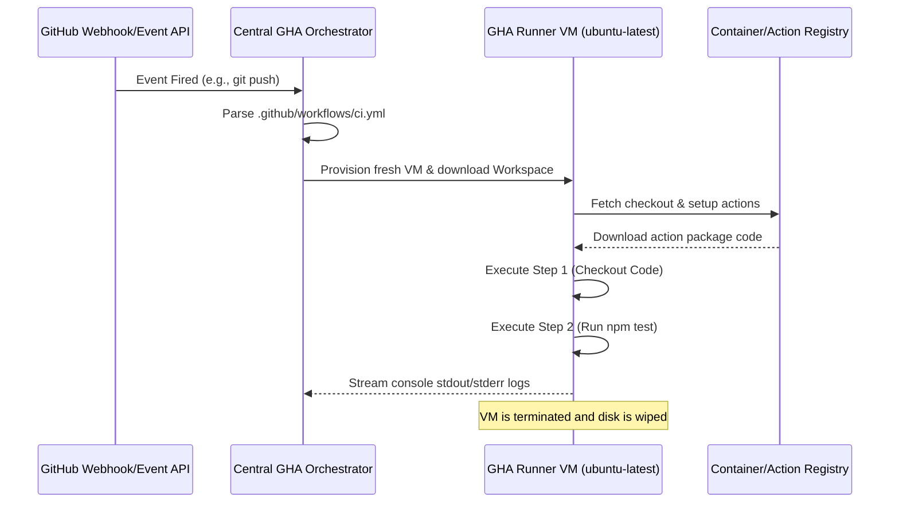

# Module 9-1: GitHub Actions Architecture & Workflow Design

This module covers the core execution architecture of GitHub Actions, event-driven triggers, runtime VM sandboxes, and the foundational syntax used to define automated workflows.

---

## 🗺️ Cognitive Map: How to Think About the Flow of Knowledge

To build a strong intuition for GitHub Actions, think of the execution lifecycle as moving from an external repository trigger to a sandboxed job runner:



1. **Step 1: Event-Driven Triggers (Section 1):** Git hooks and APIs fire events that notify GitHub's orchestrator.
2. **Step 2: Runner Allocation & Sandboxing (Section 2):** Job requests are queued, and runners (hosted or self-hosted VMs) spin up clean execution environments.
3. **Step 3: Sequential Step Execution (Section 3):** Steps execute sequentially on the allocated runner, using shell commands (`run`) or containerized marketplace blocks (`uses`).

---

## 1. Core Concepts & Architecture

### A. Terminology & Boundaries
*   **Workflow:** An automated process defined in a YAML file inside the `.github/workflows/` directory. It is the topmost organizational unit.
*   **Job:** A group of steps that execute on the same runner. Jobs run in **parallel** by default but can be chained sequentially using dependencies.
*   **Step:** An individual task within a job. Steps execute sequentially. They can run shell commands (`run`) or reference reusable pieces of code (`uses` actions).
*   **Action:** A reusable, standalone unit of code. Actions can be written in JavaScript, packaged as Docker containers, or defined as composite shell steps.
*   **Runner:** The execution host. GitHub-hosted runners run in fresh, isolated virtual machines (provisioned on Azure VMs under the hood) that are destroyed after job completion.
*   **Event:** A specific Git activity or API call that triggers a workflow (e.g. code push, pull request creation, webhook, or cron schedule).
*   **Artifact:** Files (like compiled binaries, zip archives, or test reports) produced during a job run that can be persisted and shared with other jobs or downloaded manually.

---

## 2. In-Depth Architecture: Runner Sandboxing & Execution Flows

When an event triggers a workflow, GitHub's central orchestration engine compiles the workflow YAML and dispatches jobs to available runners.



*   **Virtual Machine Isolation:** Each GitHub-hosted runner executes within an isolated, single-use virtual machine instance. This ensures that concurrent runs do not share filesystems, process memory, or network ports, guaranteeing security and reproducibility.
*   **Workspace Mounting:** The runner automatically initializes a work directory (accessible via the `$GITHUB_WORKSPACE` environment variable) where code from the checkout action is cloned.

---

## 3. Deep-Intuition (AARF) Breakdowns: Workflow Triggers & Event Filters

### A. Event Filtering Rules (Branch/Path Limits)
#### Deep-Intuition (AARF) Breakdown:
1. **The Answer (Core Pattern):** Utilize explicit filters (`branches`, `paths`, and `tags`) to limit workflow executions to specific scopes, avoiding unnecessary runner billing cycles.
    ```yaml
    name: Optimized CI
    on:
      push:
        branches:
          - main
          - 'releases/**'
        paths:
          - 'src/**'
          - 'package.json'
      pull_request:
        branches:
          - main
    ```
2. **The Assumptions (Context):** The filters use glob patterns. Branch matching is case-sensitive, and paths are evaluated relative to the repository root.
3. **The Rationale (Why):** By default, listing `on: [push]` triggers the workflow on *every* commit to *any* branch, and for *any* file change. Restricting triggering to main branch pushes and source directory changes ensures that documentation edits, helper scripts, or experimental feature branch pushes do not consume runner minutes.
4. **The Failure Loop (What if not):** If filters are omitted, push/PR events on scratch/temporary branches, doc updates (e.g., editing `README.md`), or local script updates will trigger the entire build-and-test suite. This wastes runner resources, slows down the CI queue, and increases organization costs.
5. **Alternative Case (When to use 'if not'):** For manual releases or scheduled nightly regression builds, use `workflow_dispatch` or `schedule` cron configurations instead of branch-push event filters:
    ```yaml
    on:
      schedule:
        - cron: '0 2 * * 1-5' # Run at 02:00 UTC Monday-Friday
      workflow_dispatch:
        inputs:
          debug_level:
            description: 'Log Verbosity'
            default: 'info'
            required: true
    ```
6. **The Evolutionary Bridge:** In legacy on-premise setups, engineers configured central cron servers or Jenkins poll triggers that periodically scanned Git repositories via SSH loops (causing high CPU overhead and polling lag). Modern CI/CD systems like GitHub Actions use real-time webhook architectures, where GitHub fires event payloads immediately after repository state changes, enabling zero-latency build starts.

---

## 4. Hands-on Basic Configuration

### Repository Structure
```
repo-root/
├── .github/
│   └── workflows/
│       └── basic-ci.yml
├── src/
│   └── main.js
└── package.json
```

### Basic CI Workflow Blueprint
```yaml
# .github/workflows/basic-ci.yml
name: Foundational CI

on:
  push:
    branches: [ main ]
  pull_request:
    branches: [ main ]

jobs:
  test-suite:
    name: Run Unit Tests
    runs-on: ubuntu-latest
    
    steps:
      # Step 1: Checkout the code to the workspace
      - name: Retrieve Code
        uses: actions/checkout@v4

      # Step 2: Set up NodeJS runtime environment
      - name: Initialize NodeJS
        uses: actions/setup-node@v4
        with:
          node-version: '18'
          cache: 'npm'

      # Step 3: Install dependencies using clean install
      - name: Install Project Packages
        run: npm ci

      # Step 4: Run test command
      - name: Run Test Scripts
        run: npm test
```

### Key Syntax Elements
*   `runs-on: ubuntu-latest`: Requests a standard Linux virtual machine runner containing pre-installed software (Docker, AWS CLI, node, python, etc.).
*   `uses: actions/checkout@v4`: Downloads the checkout action code from GitHub's official actions organization and executes the git commands to clone the repo into `$GITHUB_WORKSPACE`.
*   `run: npm ci`: Executes the specified bash/sh shell commands directly inside the runner environment. `npm ci` is preferred in CI over `npm install` because it enforces package-lock consistency and throws an error if packages mismatch.

---

## ⚙️ 5. Advanced Triggers, Runners, and Runtime Contexts

### A. Advanced Event Trigger Configuration
*   **Manual Inputs (`workflow_dispatch`):** Enforce manual triggers with runtime parameters:
    ```yaml
    on:
      workflow_dispatch:
        inputs:
          environment:
            description: 'Deployment target'
            required: true
            default: 'staging'
            type: choice
            options:
              - dev
              - staging
              - production
          perform_cleanup:
            description: 'Trigger workspace post-clean'
            required: false
            type: boolean
            default: false
    ```
*   **Release Tag Triggers:** Trigger builds on semantic versioning release tags:
    ```yaml
    on:
      push:
        tags:
          - 'v*.*.*' # Matches v1.0.0, v2.5.1
    ```

### B. Runner Sizing and Labels
*   **Standard Runner:** Default GitHub VM configuration (`ubuntu-latest` maps to 2-core CPU, 7GB RAM).
*   **Self-Hosted Tag Targeting:** Direct jobs to specific local self-hosted infrastructure:
    ```yaml
    runs-on: [self-hosted, linux, x64, gpu-enabled]
    ```

### C. GHA Contexts and Environment Variables
Contexts are collections of properties accessible throughout workflow execution.
*   **`github` Context:** Metadata about the running workflow (e.g. `${{ github.sha }}` for the commit hash, `${{ github.actor }}` for the user who triggered the run).
*   **`env` Context:** Access environment variables defined globally or at job/step levels.
*   **`vars` Context:** Non-sensitive variables configured at the repository, organization, or environment level.
*   **`secrets` Context:** Encrypted values (e.g. token hashes, passwords).
*   **`steps` Context:** Access outputs and status checks of previous steps.

---

### 📖 Sources & Ingested Transcripts
*   GitHub Actions Course Transcript (Arabic): `inflow/GithubAction-Elfakharny.md`
*   Varun Joshi GHA Course Transcripts:
    *   `inflow/What is GitHub Actions  Build Your First Workflow from Scratch.txt`
    *   `inflow/GitHub Actions Triggers & Runners Explained  Events, Contexts & Hosted Runners.txt`
    *   `inflow/Build Your First Production-Style Workflow with GitHub Actions.txt`
    *   `inflow/GitHub Actions Workflow Logic Explained  Filters, Contexts, Variables & Expressions.txt`
*   Standalone Lecture Summaries: 
    *   [[Reference Notes/9-4_github_actions_lecture_elfakharny.md|Module 9-4: GitHub Actions & CI/CD Platform Automation (Elfakharny Lecture)]]
    *   [[Reference Notes/9-5_github_actions_introduction_and_production_workflows.md|Module 9-5: GitHub Actions Introduction & Production Workflows]]
    *   [[Reference Notes/9-6_github_actions_triggers_runners_and_logic.md|Module 9-6: GitHub Actions Triggers, Runners & Workflow Logic]]
