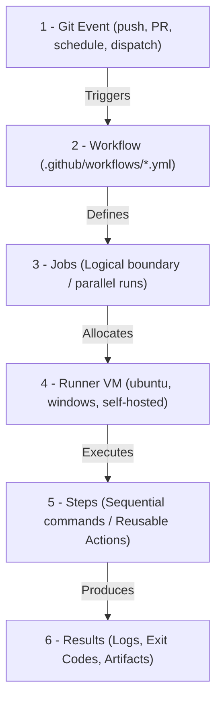
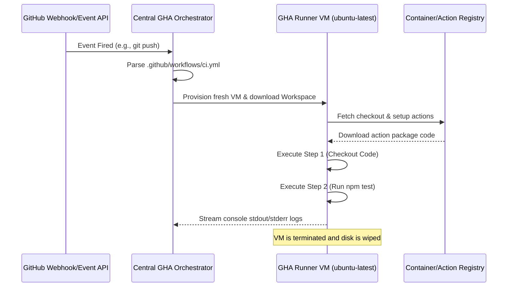

# Module 9-1: GitHub Actions Architecture & Workflow Design

This module covers the core execution architecture of GitHub Actions (GHA), event-driven triggers, runtime VM sandboxes, and the foundational syntax used to define automated workflows.

---

## 🗺️ Cognitive Map: How to Think About the Flow of Knowledge

To build a strong intuition for GitHub Actions, think of the execution lifecycle as moving from an external repository trigger to a sandboxed job runner:



1. **Step 1: Event-Driven Triggers (Section 1):** Git hooks and APIs fire events that notify GitHub's orchestrator.
2. **Step 2: Runner Allocation & Sandboxing (Section 2):** Job requests are queued, and runners (hosted or self-hosted VMs) spin up clean execution environments.
3. **Step 3: Sequential Step Execution (Section 3):** Steps execute sequentially on the allocated runner, using shell commands (`run`) or containerized marketplace blocks (`uses`).

---

## 1. Core Concepts & Architecture

### A. Terminology & Boundaries
*   **Workflow:** An automated process defined in a YAML file inside the `.github/workflows/` directory. It is the topmost organizational unit.
*   **Job:** A group of steps that execute on the same runner. Jobs run in **parallel** by default but can be chained sequentially using dependencies.
*   **Step:** An individual task within a job. Steps execute sequentially. They can run shell commands (`run`) or reference reusable pieces of code (`uses` actions).
*   **Action:** A reusable, standalone unit of code. Actions can be written in JavaScript, packaged as Docker containers, or defined as composite shell steps.
*   **Runner:** The execution host. GitHub-hosted runners run in fresh, isolated virtual machines (provisioned on Azure VMs under the hood) that are destroyed after job completion.
*   **Event:** A specific Git activity or API call that triggers a workflow (e.g., code push, pull request creation, webhook, or cron schedule).
*   **Artifact:** Files (like compiled binaries, zip archives, or test reports) produced during a job run that can be persisted and shared with other jobs or downloaded manually.

### B. Core Orchestration Engine
When a trigger event occurs, the workflow goes through the following sequence:



*   **Virtual Machine Isolation:** Each GitHub-hosted runner executes within an isolated, single-use virtual machine instance. This ensures that concurrent runs do not share filesystems, process memory, or network ports, guaranteeing security and reproducibility.
*   **Workspace Mounting:** The runner automatically initializes a work directory (accessible via the `$GITHUB_WORKSPACE` environment variable) where code from the checkout action is cloned.

### C. The Checkout Rationale
Unlike legacy CI/CD platforms (e.g., GitLab CI, Bitbucket Pipelines, Jenkins) which automatically checkout the repository code prior to executing any job logic, **GitHub Actions does not auto-checkout the code**. 

#### Why GHA Works This Way:
GitHub Actions is not merely a CI/CD platform; it is a general-purpose repository event automation engine. Because workflows can trigger on events like issue creation, repository starring (`watch`), or discussions, many workflows do not require access to the codebase. Omitting automatic checkout saves bandwidth, disk I/O, and CPU time. For workflows that do require codebase access (e.g., building, testing), developers must explicitly declare the checkout step:
```yaml
- name: Retrieve Code
  uses: actions/checkout@v4
```

---

## 2. In-Depth Architecture: Runner Sandboxing & Execution Flows

### A. GitHub-Hosted vs. Self-Hosted Runners
When designing workflow environments, choosing the appropriate runner topology is a critical decision.

| **Criterion** | **GitHub-Hosted Runners** | **Self-Hosted Runners** |
| :--- | :--- | :--- |
| **Isolation** | Ephemeral, single-use hypervisor VMs. Complete security sandbox. Wiped immediately upon completion. | Persistent machine. Reuse of filesystem and runtime state. |
| **Maintenance** | Zero overhead. OS patches, tool updates, and system packages are managed by GitHub. | High overhead. The organization is responsible for OS updates, security, and cleaning build artifacts. |
| **Hardware Choices** | Standard (2 vCPUs, 7GB RAM) up to Larger Runners (64 vCPUs, 256GB RAM). | Fully custom. Can run on bare-metal, local VMs, on-premises servers, or GPU-enabled hardware. |
| **Network Access** | Public internet egress. Cannot easily access private corporate networks without VPNs/Proxies. | Native private access. Can reside inside a private VPC, behind corporate firewalls, or on-premises. |
| **Security Risks** | Negligible. Untrusted pull request code cannot compromise other systems or projects. | High. Untrusted pull request code runs with host permissions, creating risks of lateral network movement. |
| **Cost Structure** | Pay-per-minute billing (based on OS and hardware size). | Cost of server infrastructure and power; GHA orchestration is free. |

### B. Self-Hosted Runner outbound communication model
Unlike typical agent architectures that require inbound ports (such as SSH) to be open on the runner machine, self-hosted runners utilize an **outbound-only polling architecture**. The runner daemon calls GitHub APIs over HTTPS (port 443) using a persistent long-polling connection (WebSockets). This eliminates the need to configure inbound firewall holes, simplifying deployment within secure private networks.

---

## 3. Deep-Intuition (AARF) Breakdowns: Workflow Triggers & Event Filters

### A. Event Filtering Rules (Branch/Path Limits)
#### Deep-Intuition (AARF) Breakdown:
1. **The Answer (Core Pattern):** Utilize explicit filters (`branches`, `paths`, and `tags`) to limit workflow executions to specific scopes, avoiding unnecessary runner billing cycles.
    ```yaml
    name: Optimized CI
    on:
      push:
        branches:
          - main
          - 'releases/**'
        paths:
          - 'src/**'
          - 'package.json'
      pull_request:
        branches:
          - main
    ```
2. **The Assumptions (Context):** The filters use glob patterns. Branch matching is case-sensitive, and paths are evaluated relative to the repository root.
3. **The Rationale (Why):** By default, listing `on: [push]` triggers the workflow on *every* commit to *any* branch, and for *any* file change. Restricting triggering to main branch pushes and source directory changes ensures that documentation edits, helper scripts, or experimental feature branch pushes do not consume runner minutes.
4. **The Failure Loop (What if not):** If filters are omitted, push/PR events on scratch/temporary branches, doc updates (e.g., editing `README.md`), or local script updates will trigger the entire build-and-test suite. This wastes runner resources, slows down the CI queue, and increases organization costs.
5. **Alternative Case (When to use 'if not'):** For manual releases or scheduled nightly regression builds, use `workflow_dispatch` or `schedule` cron configurations instead of branch-push event filters:
    ```yaml
    on:
      schedule:
        - cron: '0 2 * * 1-5' # Run at 02:00 UTC Monday-Friday
      workflow_dispatch:
        inputs:
          debug_level:
            description: 'Log Verbosity'
            default: 'info'
            required: true
    ```
6. **The Evolutionary Bridge:** In legacy on-premises setups, engineers configured central cron servers or Jenkins poll triggers that periodically scanned Git repositories via SSH loops (causing high CPU overhead and polling lag). Modern CI/CD systems like GitHub Actions use real-time webhook architectures, where GitHub fires event payloads immediately after repository state changes, enabling zero-latency build starts.

### B. Trigger Syntax Elements & Wildcard Matching
GitHub Actions uses specific glob patterns for filters:
*   `*`: Matches zero or more characters, excluding directory separators (`/`). For example, `releases/*` matches `releases/v1` but not `releases/v1/beta`.
*   `**`: Matches zero or more characters, including directory separators (`/`). For example, `releases/**` matches `releases/v1/beta`.
*   `?`: Matches zero or one character. For example, `v?` matches `v1` and `v2`.
*   `+`: Matches one or more characters.
*   `!`: Negates the pattern (excludes paths/branches).

---

## 4. Hands-on Basic Configuration

### Repository Structure
```
repo-root/
├── .github/
│   └── workflows/
│       └── basic-ci.yml
├── src/
│   └── main.js
└── package.json
```

### Key Syntax Elements
*   `on`: Defines the triggers that start the workflow. Can be a list of events or a structured map of event filters.
*   `runs-on`: Specifies the runner environment for a job (e.g., `ubuntu-latest`, `windows-2022`, `macos-14`, or custom self-hosted tags).
*   `steps`: Contains the sequential tasks executed by the job.
*   `uses`: Invokes a reusable action (e.g., `actions/checkout@v4`).
*   `run`: Executes shell commands on the runner.
*   `with`: Supplies input parameters to the referenced action.
*   `env`: Defines environment variables at the workflow, job, or step level.
*   `defaults.run.working-directory`: Configures a default directory for all shell commands in the workflow or job.
*   `defaults.run.shell`: Configures the default shell interpreter (e.g., `bash`, `pwsh`, `cmd`, `sh`).

### Shell Defaults by OS
GitHub-hosted runners resolve default shell commands as follows:
*   **Linux (`ubuntu-*`):** Runs in `bash`.
*   **macOS (`macos-*`):** Runs in `bash`.
*   **Windows (`windows-*`):** Runs in PowerShell Core (`pwsh`). If `pwsh` is not available, it falls back to Windows PowerShell.

---

## 5. Job Chaining and Dependencies (`needs` and `if`)

By default, jobs defined in a workflow run in parallel. To establish order, use the `needs` key. To control execution based on status, use status check functions:
*   `success()`: True if all previous jobs/steps succeeded. This is the default if no `if` expression is declared.
*   `failure()`: True if any previous job/step failed. Typically used to trigger rollback operations or send alerts.
*   `always()`: Enforces execution regardless of the status of previous steps or cancellation events. Often used for cleanup.
*   `cancelled()`: True if the parent workflow execution was explicitly cancelled.

---

## 6. Annotated Production-Grade YAML PoC Blocks

### PoC 1: Foundational CI Workflow Blueprint
This workflow implements clean Node.js environment bootstrapping, dependency caching, compile validation, and unit testing.

```yaml
# .github/workflows/foundational-ci.yml
name: Foundational CI

on:
  push:
    branches: [ main ]
  pull_request:
    branches: [ main ]

jobs:
  test-suite:
    name: Run Unit Tests
    runs-on: ubuntu-latest
    
    steps:
      # Step 1: Retrieve project code
      - name: Retrieve Code
        uses: actions/checkout@v4

      # Step 2: Initialize NodeJS runtime
      - name: Initialize NodeJS
        uses: actions/setup-node@v4
        with:
          node-version: '18'
          cache: 'npm' # Configures built-in npm caching

      # Step 3: Clean install dependencies based on package-lock.json
      - name: Install Project Packages
        run: npm ci

      # Step 4: Run unit tests
      - name: Run Test Scripts
        run: npm test
```

### PoC 2: Advanced Trigger Configuration with Inputs and Cron Scheduler
This workflow demonstrates path-filtered pull request triggers, scheduled nightly jobs, and manual execution inputs.

```yaml
# .github/workflows/advanced-triggers.yml
name: Advanced Triggers & Schedulers

on:
  push:
    branches:
      - 'main'
      - 'releases/v*'
    tags:
      - 'v*.*.*'
    paths:
      - 'src/**'
      - 'package.json'
      - '!src/**/*.md' # Ignore updates to documentation within src/
  
  pull_request:
    branches:
      - main
    paths:
      - 'src/**'

  schedule:
    # Run at 02:00 UTC, Monday through Friday
    - cron: '0 2 * * 1-5'

  workflow_dispatch:
    inputs:
      target_env:
        description: 'Target Deployment Environment'
        required: true
        default: 'staging'
        type: choice
        options:
          - dev
          - staging
          - sandbox
      run_migrations:
        description: 'Execute database migrations'
        required: false
        default: false
        type: boolean

jobs:
  run-dispatch-logic:
    runs-on: ubuntu-latest
    steps:
      - name: Parse Trigger Inputs
        run: |
          echo "Target Environment: ${{ inputs.target_env || 'N/A' }}"
          echo "Execute Migrations: ${{ inputs.run_migrations || 'false' }}"
          echo "Trigger Source Event: ${{ github.event_name }}"
```

### PoC 3: Multi-Job Directed Acyclic Graph (DAG) Pipeline
This workflow defines sequential dependencies (`needs`) and uses status gate checks to handle failures and perform cleanups.

```yaml
# .github/workflows/multi-job-pipeline.yml
name: Enterprise DAG Pipeline

on:
  push:
    branches: [ main ]

jobs:
  lint:
    name: Code Linter
    runs-on: ubuntu-latest
    steps:
      - name: Checkout
        uses: actions/checkout@v4
      - name: Run Linter
        run: |
          echo "Running code style checks..."
          # exit 0 to proceed, exit 1 to fail

  test:
    name: Core Unit Tests
    runs-on: ubuntu-latest
    needs: lint # Requires linter to pass before starting
    steps:
      - name: Checkout
        uses: actions/checkout@v4
      - name: Run Unit Tests
        run: |
          echo "Executing test suites..."

  deploy:
    name: Deploy Package
    runs-on: ubuntu-latest
    needs: test # Requires tests to pass before deploying
    steps:
      - name: Deploy
        run: |
          echo "Deploying application artifact to staging..."

  notify-on-failure:
    name: Send Slack Notification
    runs-on: ubuntu-latest
    needs: [lint, test, deploy]
    if: failure() # Runs only if one of the preceding jobs fails
    steps:
      - name: Failure Alert
        run: |
          echo "Pipeline job failed. Dispatching Slack alert..."

  teardown:
    name: Global Resource Cleanup
    runs-on: ubuntu-latest
    needs: [lint, test, deploy]
    if: always() # Executes under any circumstances, even if jobs fail or get cancelled
    steps:
      - name: Run Cleanup
        run: |
          echo "Wiping temporary variables and resources..."
```

---

## 📖 Sources & Ingested Transcripts
*   `inflow/What is GitHub Actions  Build Your First Workflow from Scratch.txt`
*   `inflow/GitHub Actions Triggers & Runners Explained  Events, Contexts & Hosted Runners.txt`
*   `inflow/Build Your First Production-Style Workflow with GitHub Actions.txt`
*   `inflow/GitHub Actions Workflow Logic Explained  Filters, Contexts, Variables & Expressions.txt`
*   `inflow/GithubAction-Elfakharny.md`
