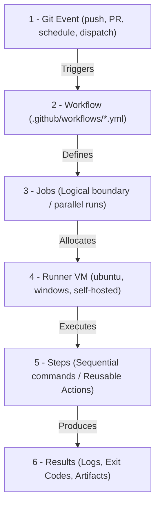
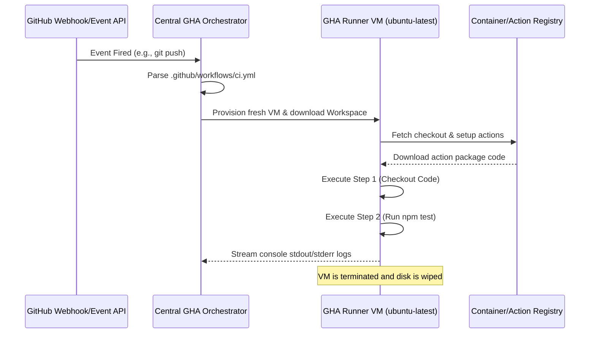
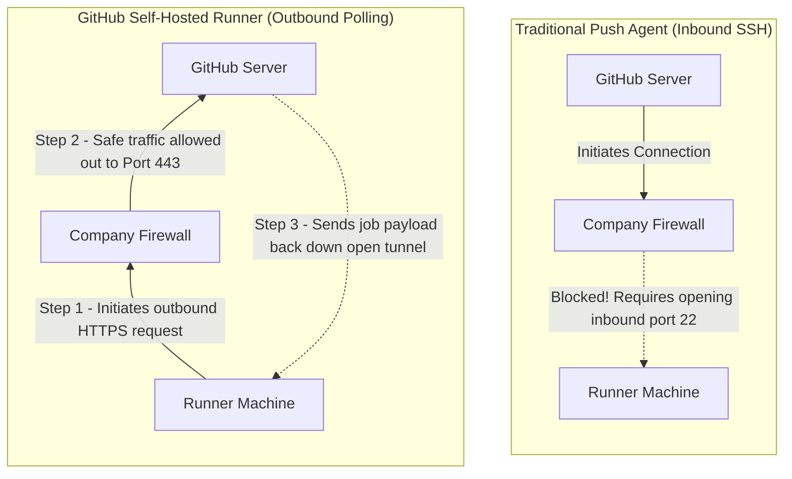

---
domains:
  - "github-actions"
class: reference-note
tier: reference-note
tags:
  - github-actions/architecture
  - github-actions/workflows
  - github-actions/runners
---

# Module 9-1: GitHub Actions Architecture & Workflow Design

This module covers the core execution architecture of GitHub Actions (GHA), event-driven triggers, runtime VM sandboxes, and the foundational syntax used to define automated workflows.

---

## 🗺️ Cognitive Map: How to Think About the Flow of Knowledge

To build a strong intuition for GitHub Actions, think of the execution lifecycle as moving from an external repository trigger to a sandboxed job runner:



1. **Step 1: Event-Driven Triggers (Section 1):** Git hooks and APIs fire events that notify GitHub's orchestrator.
2. **Step 2: Runner Allocation & Sandboxing (Section 2):** Job requests are queued, and runners (hosted or self-hosted VMs) spin up clean execution environments.
3. **Step 3: Sequential Step Execution (Section 3):** Steps execute sequentially on the allocated runner, using shell commands (`run`) or containerized marketplace blocks (`uses`).

---

## 1. Core Concepts & Architecture

### A. Terminology & Boundaries
*   **Workflow:** An automated process defined in a YAML file inside the `.github/workflows/` directory. It is the topmost organizational unit.
*   **Job:** A group of steps that execute on the same runner. Jobs run in **parallel** by default but can be chained sequentially using dependencies.
*   **Step:** An individual task within a job. Steps execute sequentially. They can run shell commands (`run`) or reference reusable pieces of code (`uses` actions).
*   **Action:** A reusable, standalone unit of code. Actions can be written in JavaScript, packaged as Docker containers, or defined as composite shell steps.
*   **Runner:** The execution host. GitHub-hosted runners run in fresh, isolated virtual machines (provisioned on Azure VMs under the hood) that are destroyed after job completion.
*   **Event:** A specific Git activity or API call that triggers a workflow (e.g., code push, pull request creation, webhook, or cron schedule).
*   **Artifact:** Files (like compiled binaries, zip archives, or test reports) produced during a job run that can be persisted and shared with other jobs or downloaded manually.

### B. Core Orchestration Engine
When a trigger event occurs, the workflow goes through the following sequence:



*   **Virtual Machine Isolation:** Each GitHub-hosted runner executes within an isolated, single-use virtual machine instance. This ensures that concurrent runs do not share filesystems, process memory, or network ports, guaranteeing security and reproducibility.
*   **Workspace Mounting:** The runner automatically initializes a work directory (accessible via the `$GITHUB_WORKSPACE` environment variable) where code from the checkout action is cloned.

### C. The Checkout Rationale
Unlike legacy CI/CD platforms (e.g., GitLab CI, Bitbucket Pipelines, Jenkins) which automatically checkout the repository code prior to executing any job logic, **GitHub Actions does not auto-checkout the code**. 

#### Why GHA Works This Way:
GitHub Actions is not merely a CI/CD platform; it is a general-purpose repository event automation engine. Because workflows can trigger on events like issue creation, repository starring (`watch`), or discussions, many workflows do not require access to the codebase. Omitting automatic checkout saves bandwidth, disk I/O, and CPU time. For workflows that do require codebase access (e.g., building, testing), developers must explicitly declare the checkout step:
```yaml
- name: Retrieve Code
  uses: actions/checkout@v4
```

### D. Concurrency vs. Parallelism in Workflow Execution
In computing, **concurrency** is dealing with many tasks at once (often via context-switching on a shared resource), whereas **parallelism** is executing many tasks at the same time (using multiple compute resources). In GitHub Actions:
*   **Default Execution Model:** Under the hood, GitHub Actions operates using **true parallelism**. Workflows and jobs do not share CPU time-slicing on a single host. By default, GitHub provisions completely separate, isolated Virtual Machines (Runners) hosted on Azure VMs for each active job.
*   **Simultaneous Executions:** If you trigger multiple workflows simultaneously (or trigger the same workflow multiple times through rapid Git pushes), GitHub spins them up in parallel on separate runners, subject to account/org concurrency limits.
*   **The Execution Hierarchy:**
    *   **Workflows:** Run in parallel by default, unless limited by a `concurrency` group.
    *   **Jobs (inside a workflow):** Run in parallel by default, unless chained sequentially via the `needs:` keyword.
    *   **Steps (inside a job):** Always run **sequentially** on the same VM runner machine, sharing the filesystem and memory state.

#### Scenario: Concurrent Git Push Events
When multiple developers push commits concurrently (e.g., to different branches or rapid pushes to the same branch), GitHub evaluates every YAML workflow file in `.github/workflows/` independently against each push event.
*   *Example:* If a repo has three workflows (`lint.yml`, `test.yml`, and `deploy.yml`) configured to run `on: push`, and Developer A pushes code to `Branch-A` while Developer B pushes code to `Branch-B` a second later:
    *   GitHub queues **6 distinct workflows** (3 for Developer A, 3 for Developer B).
    *   GitHub allocates **6 separate Runner VMs** executing in true parallel.
    *   The runs are fully isolated from one another.

#### ⚠️ The Deployment Race Condition & Concurrency Resolution
When multiple runs of a deployment workflow execute concurrently, they can result in severe race conditions on the target environment (e.g., database schema lock conflicts, corrupted target server filesystem state, or Terraform state lock collisions). 

To resolve this, GitHub Actions uses the `concurrency` block as a distributed locking manager. A concurrency group locks executions sharing the same group key:

```yaml
# Example: Staging deployment lock (Global or scoped)
concurrency:
  group: deploy-staging
  cancel-in-progress: false # Forces sequential execution; never cancels a running deployment mid-way
```

##### Concurrency Group Identifiers & Use Cases
Developers use dynamic contexts to partition concurrency boundaries:

1. **Global Environment Lock (Database & IaC Deployments):**
   * **Syntax:** `group: deploy-staging` or `group: deploy-${{ inputs.target_env }}`
   * **Behavior:** Locks the target environment globally. Only one run can deploy to `staging` at any time, regardless of what branch or commit triggered it.
   * **Setting:** `cancel-in-progress: false`. Extremely critical. If Developer A is running a DB migration, Developer B's run will wait in a pending queue. Canceling mid-way would leave the database in a corrupted state.

2. **Branch-Scoped CI Lock (Testing & Linting):**
   * **Syntax:** `group: ci-${{ github.ref_name }}` or `group: ${{ github.workflow }}-${{ github.ref }}`
   * **Behavior:** Locks runs on a per-branch/workflow basis. If a developer pushes multiple commits in rapid succession to `feature-branch-1`, only one CI run executes.
   * **Setting:** `cancel-in-progress: true`. Outdated runs are immediately canceled to free up runner capacity and save build minutes, since only the latest commit is relevant for code quality checks.

3. **Pull Request Validation Lock:**
   * **Syntax:** `group: pr-${{ github.event.pull_request.number }}`
   * **Behavior:** Limits runs per Pull Request. Pushing new commits to the PR automatically terminates the previous validation run.

##### 🔍 Deep-Intuition: How GHA Evaluates Concurrency Groups (Interview Deep-Dive)
To answer advanced questions during the PwC interview, understand the design mechanics of these groups:

*   **Is the \"Group\" a Job Container?**
    No. The `group` is **simply a string (label/key)**. It is a locking namespace evaluated by GHA's orchestrator. Think of it as a "Lock Room Name". When a workflow run or job evaluates its concurrency block, GHA checks if there is currently an active lease on that exact string.
*   **Why use dynamic variable names?**
    By using contexts like `${{ github.ref_name }}`, GHA generates the lock name dynamically at runtime. For example, a push to `feature-A` gets lock `ci-TestSuite-feature-A` while a push to `feature-B` gets lock `ci-TestSuite-feature-B`. Because the lock names are different, **Branch A and Branch B runs execute in parallel without blocking each other.** However, if a developer pushes two rapid commits to `feature-A`, both runs resolve to the *exact same* string, and the older run is canceled.
*   **Why must the deployment lock be static?**
    In deployments, if both `feature-A` and `feature-B` attempt to deploy to the *same* staging server, they must compete for the same lock. If we used a dynamic branch-scoped lock, they would get different lock names and run in parallel, corrupting the staging environment. By using a **static string** (e.g., `group: deploy-staging`), both runs are forced to resolve to the exact same lock name. This locks them globally, forcing sequential queueing (`cancel-in-progress: false`).

###### 💡 Concurrency Comparison Matrix
| Lock Type | Group Pattern Example | Key Characteristic | Best Used For |
| :--- | :--- | :--- | :--- |
| **Dynamic Lock** | `group: ci-${{ github.ref_name }}` | Scoped to each branch. Runs on Branch A do not block Branch B. | **CI/Testing/Linting:** Cancels old runs when new code is pushed to the same branch (`cancel-in-progress: true`). |
| **Static Lock** | `group: deploy-staging` | Shared globally across all branches. Locks the destination environment. | **CD/Deployments/IaC:** Forces runs to queue sequentially, preventing deployment collisions (`cancel-in-progress: false`). |

##### Complete Concurrency YAML Example
The following workflow demonstrates both a top-level concurrency lock (for branch CI runs) and a job-level concurrency lock (for environment deployments):

```yaml
name: Production Deployment Pipeline

on:
  push:
    branches:
      - main
  pull_request:
    branches:
      - main

# Top-level Concurrency: Locks the entire workflow run on a per-branch/PR basis.
# If a new push occurs on the same branch/PR, the previous active run is canceled.
concurrency:
  group: ci-${{ github.workflow }}-${{ github.ref }}
  cancel-in-progress: true

jobs:
  build:
    name: Compile and Package Application
    runs-on: ubuntu-latest
    steps:
      - name: Checkout Code
        uses: actions/checkout@v4
        with:
          fetch-depth: 0
      - name: Build Binary
        run: |
          echo "Building application..."
          echo "Release-Package-v1.0" > build-output.txt
      - name: Upload Binary
        uses: actions/upload-artifact@v4
        with:
          name: app-package
          path: build-output.txt

  deploy-staging:
    name: Deploy to Staging Environment
    runs-on: ubuntu-latest
    needs: build
    # Job-level Concurrency: Overrides the top-level lock.
    # Locks the staging environment globally across all active branches.
    # We set cancel-in-progress to FALSE to prevent half-finished deployment corruptions.
    concurrency:
      group: environment-deploy-staging
      cancel-in-progress: false
    steps:
      - name: Download Binary
        uses: actions/download-artifact@v4
        with:
          name: app-package
      - name: Execute Ansible/Terraform Deploy Script
        run: |
          echo "Acquiring state lock..."
          echo "Running database schema migrations..."
          sleep 10
          echo "Deployment completed successfully!"
```

#### Sequential Jobs (`needs`) vs. Single-Job Steps
If jobs run on separate clean VMs, they require repeating `actions/checkout` and passing files via artifacts. Why not consolidate everything into sequential steps inside a single job? While simpler, splitting into separate jobs with `needs` is essential for:
1.  **Manual Approval Gates:** Steps cannot pause for human verification. Jobs can target an "Environment" which allows pausing the pipeline until a reviewer approves the deployment.
2.  **Partial Pipeline Re-runs:** If a single job with 50 steps fails at step 49 (e.g., due to a deployment timeout), you must re-run the entire job, repeating all tests. With separate jobs, you can re-run *only* the failed deployment job while keeping the successful test job green.
3.  **The Fan-Out / Fan-In Pattern:** Steps run strictly in sequence, which increases execution time. Splitting allows you to **fan-out** (run unit tests, integration tests, and security scans concurrently on different VMs) and then **fan-in** (converge into a single deployment job once all upstream jobs pass).

```
          [ Job 1: Build Application ]
                       │
       ┌───────────────┼───────────────┐
       │ (Fan-Out)     │ (Fan-Out)     │ (Fan-Out)
       ▼               ▼               ▼
  [ Job 2:   ]    [ Job 3:   ]    [ Job 4:   ]
  [ Unit     ]    [ Integr.  ]    [ Security ]
  [ Tests    ]    [ Tests    ]    [ Scan     ]
       │               │               │
       └───────────────┼───────────────┘
                       │ (Fan-In)
                       ▼
          [ Job 5: Deploy to Staging ]
```

4.  **Heterogeneous OS and Hardware:** Steps are locked to one runner. Separate jobs allow utilizing different operating systems (macOS, Windows, Ubuntu) or runner environments (e.g., testing on clean standard hosted runners, deploying on private self-hosted runners sitting behind a secure VPC).

---


## 2. In-Depth Architecture: Runner Sandboxing & Execution Flows

### A. GitHub-Hosted vs. Self-Hosted Runners
When designing workflow environments, choosing the appropriate runner topology is a critical decision.

| **Criterion** | **GitHub-Hosted Runners** | **Self-Hosted Runners** |
| :--- | :--- | :--- |
| **Isolation** | Ephemeral, single-use hypervisor VMs. Complete security sandbox. Wiped immediately upon completion. | Persistent machine. Reuse of filesystem and runtime state. |
| **Maintenance** | Zero overhead. OS patches, tool updates, and system packages are managed by GitHub. | High overhead. The organization is responsible for OS updates, security, and cleaning build artifacts. |
| **Hardware Choices** | Standard (2 vCPUs, 7GB RAM) up to Larger Runners (64 vCPUs, 256GB RAM). | Fully custom. Can run on bare-metal, local VMs, on-premises servers, or GPU-enabled hardware. |
| **Network Access** | Public internet egress. Cannot easily access private corporate networks without VPNs/Proxies. | Native private access. Can reside inside a private VPC, behind corporate firewalls, or on-premises. |
| **Security Risks** | Negligible. Untrusted pull request code cannot compromise other systems or projects. | High. Untrusted pull request code runs with host permissions, creating risks of lateral network movement. |
| **Cost Structure** | Pay-per-minute billing (based on OS and hardware size). | Cost of server infrastructure and power; GHA orchestration is free. |

### B. Self-Hosted Runner Outbound Communication Model
Unlike traditional agent architectures that require inbound ports (such as SSH, port 22) to be open on the runner machine, self-hosted runners utilize an **outbound-only polling architecture**.
*   **The Polling Model:** The runner daemon initiates all communication. It contacts GitHub APIs over HTTPS (port 443) using a persistent long-polling WebSocket connection, requesting work.
*   **The Firewall Advantage:** Because the connection is initiated from *inside* the secure network out to the public internet, the corporate firewall treats it as standard outbound web traffic (similar to a user browsing a website). No inbound ports need to be opened, and no external entity can initiate connections inward. This simplifies security audits and setup in highly restricted network zones.
*   **Long-Polling Mechanics:** Instead of spamming GitHub with constant API requests (which wastes bandwidth and causes rate limiting), the runner connects and GitHub holds the connection open (long-polls) for a set duration (e.g., up to 50 seconds). If a job is triggered, GitHub immediately pushes the payload down the open connection. If the timeout expires with no jobs, the connection closes, and the runner immediately establishes a new long-poll.
*   **Analogy:** Think of a delivery dispatcher (GitHub) and a delivery driver (the self-hosted runner agent). In traditional push models, the dispatcher calls the driver's phone (requiring inbound port 22/SSH to be open and accepting calls). In GHA's outbound model, the driver constantly walks into the dispatch office and asks, *"Any packages for me?"* and if none are ready, waits there for a minute before asking again.



### C. Standard vs. Larger Hosted Runners
GitHub provides different tiers of hosted runners:
*   **Standard Runners:** Typically 2 vCPUs, 7 GB RAM, and 14 GB of SSD space. They are free for public repositories and have a monthly free tier allocation for private repositories.
*   **Larger Runners:** Up to 64 vCPUs and 256 GB RAM. These support features like static IP ranges, autoscaling, and customized networking. They are billed at custom per-minute rates.

### D. Containerized Job Execution
To run steps inside a clean environment without installing tooling directly on the runner host operating system, you can use containerized jobs via the `container:` keyword.
*   **Execution Flow:**
    1.  The runner host VM boots.
    2.  The runner pulls the specified Docker image and launches a container.
    3.  Every step in the job executes *inside* the container runtime namespace (rather than the host OS namespace).
    4.  At the end of the job, GHA automatically stops and cleans up the container (`docker rm`).
*   **Workspace Volume Mounting:** The repository code checked out by the runner needs to be accessed by steps running inside the container. To handle this, the GHA runner automatically creates a workspace directory on the **host** and mounts it as a Docker volume to the container (e.g., `-v /home/runner/work/repo/repo:/github/workspace`).
*   **Benefits for Self-Hosted Runners:** Containerized jobs solve the "dirty state" problem. Any dependencies, system packages, or temporary files generated during the steps are isolated within the container and disappear when the container is destroyed, keeping the host VM completely clean.

##### 📋 Containerized Job Execution YAML Examples

###### Example 1: Custom Toolchain Isolation on GitHub-Hosted Runners
This workflow forces steps to run inside a specific Node.js and Alpine-based container environment on GHA-hosted VMs, ensuring OS library consistency:

```yaml
name: Hosted Containerized CI

on:
  push:
    branches: [ main ]

jobs:
  test-alpine:
    name: Run Unit Tests inside Alpine Node Container
    runs-on: ubuntu-latest # The host VM is standard Ubuntu
    
    # Force the runner to execute all steps inside this container namespace
    container:
      image: node:20-alpine
      env:
        NODE_ENV: test
      options: --user 1001 # Set custom runtime flags for container security

    steps:
      - name: Checkout Code
        uses: actions/checkout@v4 # Workspace is automatically mounted to /github/workspace inside container

      - name: Verify Environment OS
        run: |
          echo "Running on OS:"
          cat /etc/os-release # Will print Alpine, confirming container environment
          
      - name: Install Dependencies & Run Tests
        run: |
          npm ci
          npm test
```

###### Example 2: State Isolation & Cleanup on Enterprise Self-Hosted Runners
This workflow runs on your company's persistent self-hosted VM, isolating a database schema compilation job to prevent polluting the host server:

```yaml
name: Self-Hosted Containerized Build

on:
  workflow_dispatch:

jobs:
  build-and-compile:
    name: Safe compilation on persistent VM
    runs-on: self-hosted # Executes on your internal persistent company runner VM
    
    container:
      image: python:3.11-slim
      # Mount external services if required by your pipeline
      # GHA automatically spins these up as sidecars linked to the container network
      services:
        postgres:
          image: postgres:15-alpine
          env:
            POSTGRES_DB: app_test
            POSTGRES_PASSWORD: secret_db_pass
          ports:
            - 5432:5432

    steps:
      - name: Retrieve Code
        uses: actions/checkout@v4

      - name: Execute DB Schema Migration
        env:
          DB_HOST: postgres # Resolves to the sidecar container IP automatically
          DB_PASSWORD: secret_db_pass
        run: |
          pip install psycopg2-binary
          python scripts/migrate.py
          
      # GHA automatically terminates and removes the python container AND postgres sidecar
      # when the job completes, preventing any "dirty state" from lingering on the persistent VM.
```

---

## 3. Workflow Triggers & Event Filters

Workflows are event-driven. GHA provides granular controls to specify which events trigger executions.

### A. Core Triggering Mechanics
Workflows define their triggers under the `on:` key. Multiple triggers can be defined; the workflow will run if **any** of the events occur (logical OR).

```yaml
on:
  push:
    branches: [ main, release/* ]
  pull_request:
    branches: [ main ]
  schedule:
    - cron: '0 0 * * *' # Daily at midnight UTC
```

### B. Trigger Types
1.  **Repository Events:** Triggered by git operations or metadata changes (e.g., `push`, `pull_request`, `issues`, `release`).
2.  **Manual Triggers (`workflow_dispatch`):** Allows triggering the workflow manually via the GitHub UI or API. It supports input parameters.
    ```yaml
    on:
      workflow_dispatch:
        inputs:
          environment:
            description: 'Target deployment environment'
            required: true
            default: 'staging'
            type: choice
            options:
              - development
              - staging
              - production
    ```
3.  **External Triggers (`repository_dispatch`):** Triggered by external systems invoking the GitHub API. It accepts a custom JSON payload.
    ```yaml
    on:
      repository_dispatch:
        types: [ webhook-trigger ]
    ```
4.  **Cross-Workflow Triggers (`workflow_call`):** Configures the workflow to be a reusable workflow that can be called by other pipelines.

### C. Event Filters & Glob Matching
Filters restrict workflow execution to specific branches, paths, or tags using **glob patterns** to evaluate matches:
*   **Branches:** Use `branches` or `branches-ignore` (mutually exclusive in the same event configuration).
*   **Paths:** Use `paths` or `paths-ignore` to trigger workflows based on file change patterns relative to the repository root.
*   **Tags:** Use `tags` or `tags-ignore` to target specific git release tags (e.g., `v*.*.*`).

#### Glob Pattern Wildcards
*   `*` matches zero or more characters, but **stops at directory boundaries** (does not match `/`).
    *   `src/*.js` matches `src/app.js` but *fails* on `src/components/button.js`.
*   `?` matches **exactly one** character.
    *   `v1.?` matches `v1.0` and `v1.x` but *fails* on `v1.12` or `v1.`.
*   `**` matches zero or more characters **including directory boundaries** (slashes).
    *   `src/**/*.js` matches `src/app.js`, `src/components/button.js`, and `src/components/auth/login.js`.
*   `!` is the **negation character**. It ignores matching files if declared at the start of a pattern.
    *   `!src/**/*.md` ignores changes made to markdown files inside the source directory.

#### Branch vs. Tag Lifecycle Triggers
Although branch and tag filters can be listed under the same `push:` trigger, they act as an **OR** condition. Pushing a tag will trigger the workflow even if the commit on which the tag sits is not on a listed branch, and vice versa.
*   **Branch Filters (e.g., `releases/v*`):** Used during the *stabilization phase* of a release lifecycle. As developers push bug fixes to a release branch, the workflow builds and runs tests to ensure stability.
*   **Tag Filters (e.g., `v*.*.*`):** Used for the *frozen release*. When the release branch is stable, the team creates a tag (like `v1.0.0`) and pushes it, which triggers the same workflow to run tests one final time, build the production image, and deploy it.

#### Security Best Practice: `github.ref` vs. `github.ref_name`
When writing conditional checks to ensure a step or job only runs on a tag, always use the fully qualified `github.ref` context variable instead of the short-name `github.ref_name`.
*   **`github.ref`** provides the absolute Git ref path, e.g., `refs/tags/v1.0.0` or `refs/heads/releases/v1`.
*   **`github.ref_name`** provides the short name, e.g., `v1.0.0` or `releases/v1`.
*   **The Naming Loophole:** If you check `if: startsWith(github.ref_name, 'v')`, a developer could accidentally or maliciously create a branch named `v-test` and push it. This would satisfy the condition and run release-specific jobs. Checking `if: startsWith(github.ref, 'refs/tags/v')` ensures the event is mathematically guaranteed to be a tag push.

```yaml
on:
  push:
    branches:
      - 'main'
      - 'releases/v*'
    tags:
      - 'v*.*.*'
    paths:
      - 'src/**'
      - 'package.json'
      - '!src/**/*.md' # Ignore documentation edits inside src/
```

---

## 4. Reusable Actions & Marketplace

Workflows leverage modular automation blocks called Actions. 

### A. Uses vs. Run
*   **`run`**: Executes custom shell scripts (e.g., `bash`, `pwsh`, `python`) on the runner host.
*   **`uses`**: Runs a pre-packaged action from the GitHub Marketplace, a local directory, or another repository.

```yaml
steps:
  - name: Clone Code
    uses: actions/checkout@v4 # Reusable marketplace action
    
  - name: Run Tests
    run: npm run test # Custom shell execution
```

### B. Action Selection & Versioning
When using marketplace or external actions, pinning the version is critical to prevent pipeline breakage due to upstream changes. GHA supports three pinning strategies:

1.  **Tag Pinning (`uses: actions/checkout@v4`):** Flexible, but risk of tag reassignment.
2.  **Branch Pinning (`uses: actions/checkout@main`):** Pulls the latest commits on a branch. High risk of breaking builds.
3.  **SHA-1 Pinning (`uses: actions/checkout@a5ac7e51b41094c92402da3b24376905380afc29`):** **Most Secure**. Pinning to an immutable commit SHA prevents supply chain attacks and unexpected updates.

---

## 5. Step-by-Step Tutorial: Flask Docker Pipeline

This hands-on tutorial configures a Flask application build, smoke test, and container push workflow.

### A. Project Structure
Create the following files in your repository:
```text
.
├── .github
│   └── workflows
│       └── flask-ci.yml
├── app.py
├── requirements.txt
└── Dockerfile
```

### B. Application Files

**`app.py`:**
```python
from flask import Flask, jsonify

app = Flask(__name__)

@app.route('/')
def hello():
    return jsonify(message="Hello from GitHub Actions Course!")

@app.route('/health')
def health():
    return jsonify(status="healthy"), 200

if __name__ == '__main__':
    app.run(host='0.0.0.0', port=5000)
```

**`requirements.txt`:**
```text
Flask==3.0.3
werkzeug==3.0.3
```

**`Dockerfile`:**
```dockerfile
FROM python:3.11-slim

WORKDIR /app

COPY requirements.txt requirements.txt
RUN pip install --no-cache-dir -r requirements.txt

COPY . .

EXPOSE 5000

CMD ["python", "app.py"]
```

### C. Workflow Manifest
Add the following to `.github/workflows/flask-ci.yml`. This workflow will run on pull request changes to python files on the feature branches, as well as manually. It builds a Docker image, spins it up in a container, executes a smoke test and health-check, and pushes the verified image to DockerHub if credentials are provided in secrets (`DOCKER_USERNAME` and `DOCKER_PASSWORD`).

```yaml
name: Flask Application CI

on:
  push:
    branches:
      - main
    paths:
      - '**.py'
      - 'Dockerfile'
      - 'requirements.txt'
  pull_request:
    branches:
      - main
    paths:
      - '**.py'
      - 'Dockerfile'
      - 'requirements.txt'
  workflow_dispatch:

jobs:
  build-and-test:
    runs-on: ubuntu-latest

    steps:
      - name: Checkout Repository
        uses: actions/checkout@v4

      - name: Setup Python
        uses: actions/setup-python@v5
        with:
          python-version: '3.11'

      - name: Install Linting Tools
        run: |
          python -m pip install --upgrade pip
          pip install flake8

      - name: Lint Code
        run: |
          # stop the build if there are Python syntax errors or undefined names
          flake8 . --count --select=E9,F63,F7,F82 --show-source --statistics
          # exit-zero treats all errors as warnings.
          flake8 . --count --exit-zero --max-complexity=10 --max-line-length=127 --statistics

      - name: Build Docker Image
        run: |
          docker build -t flask-app-test:latest .

      - name: Start Container for Smoke Testing
        run: |
          docker run -d -p 5000:5000 --name flask-container flask-app-test:latest
          sleep 3 # Allow Flask app to start up inside container

      - name: Execute Smoke Tests
        run: |
          # Test base endpoint
          response=$(curl -s -o /dev/null -w "%{http_code}" http://localhost:5000/)
          if [ "$response" -ne 200 ]; then
            echo "Base endpoint failed with HTTP $response"
            exit 1
          fi

          # Test health endpoint
          health_status=$(curl -s http://localhost:5000/health | grep -o '"status":"healthy"')
          if [ -z "$health_status" ]; then
            echo "Health check failed"
            exit 1
          fi
          echo "Smoke tests completed successfully!"

      - name: Clean Up Test Container
        if: always()
        run: |
          docker stop flask-container || true
          docker rm flask-container || true

      - name: Log in to Docker Hub
        if: github.event_name == 'push' && github.ref == 'refs/heads/main'
        uses: docker/login-action@v3
        with:
          username: ${{ secrets.DOCKER_USERNAME }}
          password: ${{ secrets.DOCKER_PASSWORD }}

      - name: Push Container to Docker Hub
        if: github.event_name == 'push' && github.ref == 'refs/heads/main'
        run: |
          docker tag flask-app-test:latest ${{ secrets.DOCKER_USERNAME }}/flask-app:latest
          docker push ${{ secrets.DOCKER_USERNAME }}/flask-app:latest
```
