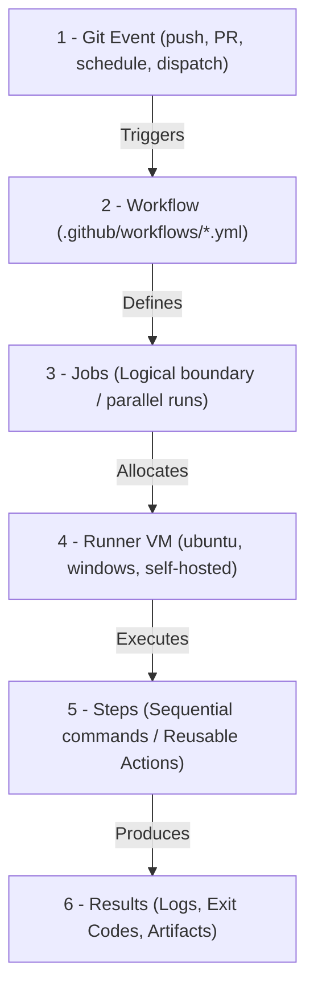
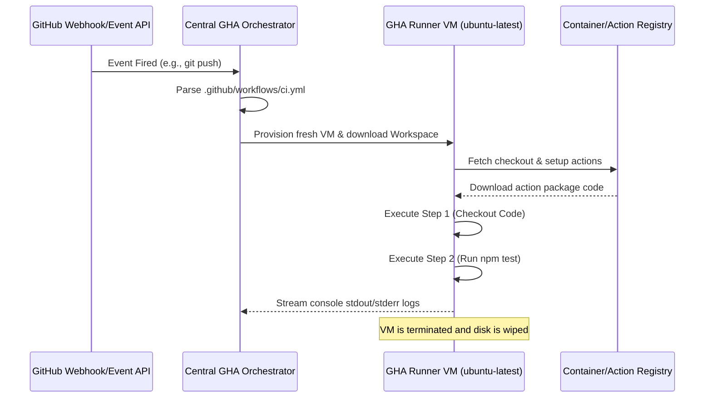

---
domains:
  - "github-actions"
class: reference-note
tier: reference-note
tags:
  - github-actions/architecture
  - github-actions/workflows
  - github-actions/runners
---

# Module 9-1: GitHub Actions Architecture & Workflow Design

This module covers the core execution architecture of GitHub Actions (GHA), event-driven triggers, runtime VM sandboxes, and the foundational syntax used to define automated workflows.

---

## 🗺️ Cognitive Map: How to Think About the Flow of Knowledge

To build a strong intuition for GitHub Actions, think of the execution lifecycle as moving from an external repository trigger to a sandboxed job runner:



1. **Step 1: Event-Driven Triggers (Section 1):** Git hooks and APIs fire events that notify GitHub's orchestrator.
2. **Step 2: Runner Allocation & Sandboxing (Section 2):** Job requests are queued, and runners (hosted or self-hosted VMs) spin up clean execution environments.
3. **Step 3: Sequential Step Execution (Section 3):** Steps execute sequentially on the allocated runner, using shell commands (`run`) or containerized marketplace blocks (`uses`).

---

## 1. Core Concepts & Architecture

### A. Terminology & Boundaries
*   **Workflow:** An automated process defined in a YAML file inside the `.github/workflows/` directory. It is the topmost organizational unit.
*   **Job:** A group of steps that execute on the same runner. Jobs run in **parallel** by default but can be chained sequentially using dependencies.
*   **Step:** An individual task within a job. Steps execute sequentially. They can run shell commands (`run`) or reference reusable pieces of code (`uses` actions).
*   **Action:** A reusable, standalone unit of code. Actions can be written in JavaScript, packaged as Docker containers, or defined as composite shell steps.
*   **Runner:** The execution host. GitHub-hosted runners run in fresh, isolated virtual machines (provisioned on Azure VMs under the hood) that are destroyed after job completion.
*   **Event:** A specific Git activity or API call that triggers a workflow (e.g., code push, pull request creation, webhook, or cron schedule).
*   **Artifact:** Files (like compiled binaries, zip archives, or test reports) produced during a job run that can be persisted and shared with other jobs or downloaded manually.

### B. Core Orchestration Engine
When a trigger event occurs, the workflow goes through the following sequence:



*   **Virtual Machine Isolation:** Each GitHub-hosted runner executes within an isolated, single-use virtual machine instance. This ensures that concurrent runs do not share filesystems, process memory, or network ports, guaranteeing security and reproducibility.
*   **Workspace Mounting:** The runner automatically initializes a work directory (accessible via the `$GITHUB_WORKSPACE` environment variable) where code from the checkout action is cloned.

### C. The Checkout Rationale
Unlike legacy CI/CD platforms (e.g., GitLab CI, Bitbucket Pipelines, Jenkins) which automatically checkout the repository code prior to executing any job logic, **GitHub Actions does not auto-checkout the code**. 

#### Why GHA Works This Way:
GitHub Actions is not merely a CI/CD platform; it is a general-purpose repository event automation engine. Because workflows can trigger on events like issue creation, repository starring (`watch`), or discussions, many workflows do not require access to the codebase. Omitting automatic checkout saves bandwidth, disk I/O, and CPU time. For workflows that do require codebase access (e.g., building, testing), developers must explicitly declare the checkout step:
```yaml
- name: Retrieve Code
  uses: actions/checkout@v4
```

---

## 2. In-Depth Architecture: Runner Sandboxing & Execution Flows

### A. GitHub-Hosted vs. Self-Hosted Runners
When designing workflow environments, choosing the appropriate runner topology is a critical decision.

| **Criterion** | **GitHub-Hosted Runners** | **Self-Hosted Runners** |
| :--- | :--- | :--- |
| **Isolation** | Ephemeral, single-use hypervisor VMs. Complete security sandbox. Wiped immediately upon completion. | Persistent machine. Reuse of filesystem and runtime state. |
| **Maintenance** | Zero overhead. OS patches, tool updates, and system packages are managed by GitHub. | High overhead. The organization is responsible for OS updates, security, and cleaning build artifacts. |
| **Hardware Choices** | Standard (2 vCPUs, 7GB RAM) up to Larger Runners (64 vCPUs, 256GB RAM). | Fully custom. Can run on bare-metal, local VMs, on-premises servers, or GPU-enabled hardware. |
| **Network Access** | Public internet egress. Cannot easily access private corporate networks without VPNs/Proxies. | Native private access. Can reside inside a private VPC, behind corporate firewalls, or on-premises. |
| **Security Risks** | Negligible. Untrusted pull request code cannot compromise other systems or projects. | High. Untrusted pull request code runs with host permissions, creating risks of lateral network movement. |
| **Cost Structure** | Pay-per-minute billing (based on OS and hardware size). | Cost of server infrastructure and power; GHA orchestration is free. |

### B. Self-Hosted Runner Outbound Communication Model
Unlike typical agent architectures that require inbound ports (such as SSH) to be open on the runner machine, self-hosted runners utilize an **outbound-only polling architecture**. The runner daemon calls GitHub APIs over HTTPS (port 443) using a persistent long-polling connection (WebSockets). This eliminates the need to configure inbound firewall holes, simplifying deployment within secure private networks.

### C. Standard vs. Larger Hosted Runners
GitHub provides different tiers of hosted runners:
*   **Standard Runners:** Typically 2 vCPUs, 7 GB RAM, and 14 GB of SSD space. They are free for public repositories and have a monthly free tier allocation for private repositories.
*   **Larger Runners:** Up to 64 vCPUs and 256 GB RAM. These support features like static IP ranges, autoscaling, and customized networking. They are billed at custom per-minute rates.

---

## 3. Workflow Triggers & Event Filters

Workflows are event-driven. GHA provides granular controls to specify which events trigger executions.

### A. Core Triggering Mechanics
Workflows define their triggers under the `on:` key. Multiple triggers can be defined; the workflow will run if **any** of the events occur (logical OR).

```yaml
on:
  push:
    branches: [ main, release/* ]
  pull_request:
    branches: [ main ]
  schedule:
    - cron: '0 0 * * *' # Daily at midnight UTC
```

### B. Trigger Types
1.  **Repository Events:** Triggered by git operations or metadata changes (e.g., `push`, `pull_request`, `issues`, `release`).
2.  **Manual Triggers (`workflow_dispatch`):** Allows triggering the workflow manually via the GitHub UI or API. It supports input parameters.
    ```yaml
    on:
      workflow_dispatch:
        inputs:
          environment:
            description: 'Target deployment environment'
            required: true
            default: 'staging'
            type: choice
            options:
              - development
              - staging
              - production
    ```
3.  **External Triggers (`repository_dispatch`):** Triggered by external systems invoking the GitHub API. It accepts a custom JSON payload.
    ```yaml
    on:
      repository_dispatch:
        types: [ webhook-trigger ]
    ```
4.  **Cross-Workflow Triggers (`workflow_call`):** Configures the workflow to be a reusable workflow that can be called by other pipelines.

### C. Event Filters
Filters restrict workflow execution to specific branches, paths, or tags:
*   **Branches:** Use `branches` or `branches-ignore` (cannot be used together in the same event).
*   **Paths:** Use `paths` or `paths-ignore` to trigger workflows only when specific files change.
*   **Tags:** Use `tags` or `tags-ignore` to run pipelines only when specific git tags are pushed.

```yaml
on:
  push:
    branches:
      - main
    paths-ignore:
      - '**.md'
      - 'docs/**'
```

---

## 4. Reusable Actions & Marketplace

Workflows leverage modular automation blocks called Actions. 

### A. Uses vs. Run
*   **`run`**: Executes custom shell scripts (e.g., `bash`, `pwsh`, `python`) on the runner host.
*   **`uses`**: Runs a pre-packaged action from the GitHub Marketplace, a local directory, or another repository.

```yaml
steps:
  - name: Clone Code
    uses: actions/checkout@v4 # Reusable marketplace action
    
  - name: Run Tests
    run: npm run test # Custom shell execution
```

### B. Action Selection & Versioning
When using marketplace or external actions, pinning the version is critical to prevent pipeline breakage due to upstream changes. GHA supports three pinning strategies:

1.  **Tag Pinning (`uses: actions/checkout@v4`):** Flexible, but risk of tag reassignment.
2.  **Branch Pinning (`uses: actions/checkout@main`):** Pulls the latest commits on a branch. High risk of breaking builds.
3.  **SHA-1 Pinning (`uses: actions/checkout@a5ac7e51b41094c92402da3b24376905380afc29`):** **Most Secure**. Pinning to an immutable commit SHA prevents supply chain attacks and unexpected updates.

---

## 5. Step-by-Step Tutorial: Flask Docker Pipeline

This hands-on tutorial configures a Flask application build, smoke test, and container push workflow.

### A. Project Structure
Create the following files in your repository:
```text
.
├── .github
│   └── workflows
│       └── flask-ci.yml
├── app.py
├── requirements.txt
└── Dockerfile
```

### B. Application Files

**`app.py`:**
```python
from flask import Flask, jsonify

app = Flask(__name__)

@app.route('/')
def hello():
    return jsonify(message="Hello from GitHub Actions Course!")

@app.route('/health')
def health():
    return jsonify(status="healthy"), 200

if __name__ == '__main__':
    app.run(host='0.0.0.0', port=5000)
```

**`requirements.txt`:**
```text
Flask==3.0.3
werkzeug==3.0.3
```

**`Dockerfile`:**
```dockerfile
FROM python:3.11-slim

WORKDIR /app

COPY requirements.txt requirements.txt
RUN pip install --no-cache-dir -r requirements.txt

COPY . .

EXPOSE 5000

CMD ["python", "app.py"]
```

### C. Workflow Manifest
Add the following to `.github/workflows/flask-ci.yml`. This workflow will run on pull request changes to python files on the feature branches, as well as manually. It builds a Docker image, spins it up in a container, executes a smoke test and health-check, and pushes the verified image to DockerHub if credentials are provided in secrets (`DOCKER_USERNAME` and `DOCKER_PASSWORD`).

```yaml
name: Flask Application CI

on:
  push:
    branches:
      - main
    paths:
      - '**.py'
      - 'Dockerfile'
      - 'requirements.txt'
  pull_request:
    branches:
      - main
    paths:
      - '**.py'
      - 'Dockerfile'
      - 'requirements.txt'
  workflow_dispatch:

jobs:
  build-and-test:
    runs-on: ubuntu-latest

    steps:
      - name: Checkout Repository
        uses: actions/checkout@v4

      - name: Setup Python
        uses: actions/setup-python@v5
        with:
          python-version: '3.11'

      - name: Install Linting Tools
        run: |
          python -m pip install --upgrade pip
          pip install flake8

      - name: Lint Code
        run: |
          # stop the build if there are Python syntax errors or undefined names
          flake8 . --count --select=E9,F63,F7,F82 --show-source --statistics
          # exit-zero treats all errors as warnings.
          flake8 . --count --exit-zero --max-complexity=10 --max-line-length=127 --statistics

      - name: Build Docker Image
        run: |
          docker build -t flask-app-test:latest .

      - name: Start Container for Smoke Testing
        run: |
          docker run -d -p 5000:5000 --name flask-container flask-app-test:latest
          sleep 3 # Allow Flask app to start up inside container

      - name: Execute Smoke Tests
        run: |
          # Test base endpoint
          response=$(curl -s -o /dev/null -w "%{http_code}" http://localhost:5000/)
          if [ "$response" -ne 200 ]; then
            echo "Base endpoint failed with HTTP $response"
            exit 1
          fi

          # Test health endpoint
          health_status=$(curl -s http://localhost:5000/health | grep -o '"status":"healthy"')
          if [ -z "$health_status" ]; then
            echo "Health check failed"
            exit 1
          fi
          echo "Smoke tests completed successfully!"

      - name: Clean Up Test Container
        if: always()
        run: |
          docker stop flask-container || true
          docker rm flask-container || true

      - name: Log in to Docker Hub
        if: github.event_name == 'push' && github.ref == 'refs/heads/main'
        uses: docker/login-action@v3
        with:
          username: ${{ secrets.DOCKER_USERNAME }}
          password: ${{ secrets.DOCKER_PASSWORD }}

      - name: Push Container to Docker Hub
        if: github.event_name == 'push' && github.ref == 'refs/heads/main'
        run: |
          docker tag flask-app-test:latest ${{ secrets.DOCKER_USERNAME }}/flask-app:latest
          docker push ${{ secrets.DOCKER_USERNAME }}/flask-app:latest
```
