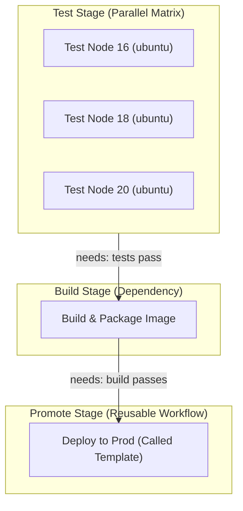
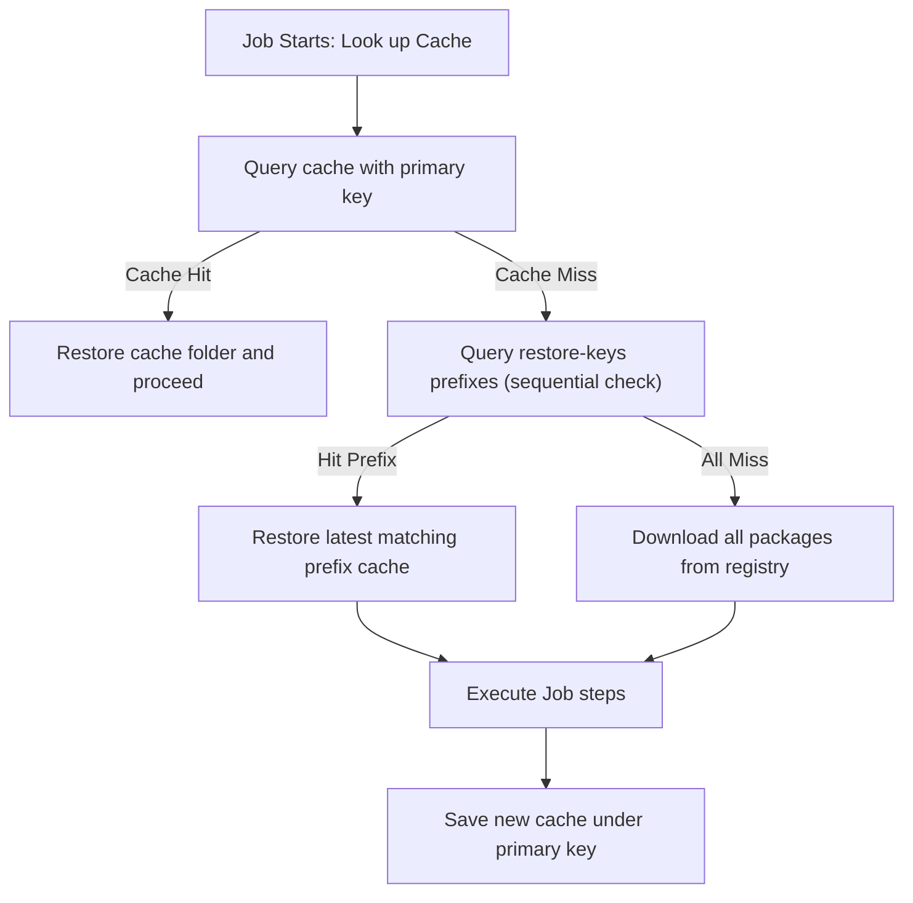

# Module 9-2: Advanced Pipeline Control & Execution

This module covers advanced control structures in GitHub Actions (GHA): parallel matrix strategies, sharing build data (artifacts vs. outputs), dependency caching mechanics, modular pipeline configurations (reusable workflows vs. composite actions), and dynamic expressions.

---

## 🗺️ Cognitive Map: How to Think About the Flow of Knowledge

To optimize execution speed and establish safe promotion gates, structure your pipeline from parallel testing to controlled promotions:



1.  **Step 1: Parallel Matrix Testing (Section 1):** Validate code across multiple architectures, OS, and runtimes concurrently.
2.  **Step 2: Artifact/Cache Handovers (Section 2 & 3):** Save compilation outputs as artifacts and cache vendor directories to speed up downstream builds.
3.  **Step 3: Modular Architecture (Section 4):** Standardize deployment pipelines via Reusable Workflows and Composite Actions.

---

## 1. Matrix Strategy Parallelization

### 🍔 The Analogy: Ordering from a Menu
Imagine you run a restaurant that serves burgers. You have 3 types of buns (Wheat, Sesame, Gluten-Free) and 2 types of patties (Beef, Veggie). Instead of writing 6 separate recipes on how to cook each combination, you write **one recipe** with variable placeholders: `Assemble [Patty] on [Bun]`. 
The kitchen makes all 6 burgers at the same time in parallel.

### ⚙️ How it Works
A Matrix strategy runs the **same job template** across multiple combinations of inputs (like OS, language versions, or custom parameters) concurrently, multiplying your test coverage without copy-pasting YAML code.

### 📝 Syntax Breakdown
```yaml
strategy:
  fail-fast: false      # [1] Do not cancel other runs if one fails
  max-parallel: 3       # [2] Run at most 3 jobs concurrently
  matrix:
    os: [ubuntu-latest, windows-latest]  # [3] OS array
    version: [18, 20]                    # [4] Language version array
```
*   `[1] fail-fast: false`: By default (`true`), if the Node 18 build on Windows fails, GHA immediately cancels the Node 20 builds. In testing, set this to `false` so you see all test failures across all runtimes.
*   `[2] max-parallel: 3`: Restricts concurrency. Useful when hitting rate-limited external APIs or database connections.
*   `[3] & [4] Cartesian Multiplication`: GHA runs the Cartesian product. Here it spawns 4 jobs ($2 \times 2$):
    - Job 1: `ubuntu-latest` / Node `18`
    - Job 2: `ubuntu-latest` / Node `20`
    - Job 3: `windows-latest` / Node `18`
    - Job 4: `windows-latest` / Node `20`

### 🔄 Dynamic Customization: `include` & `exclude`
*   **`exclude`:** Filters out specific unsupported combinations.
    ```yaml
    exclude:
      - os: windows-latest
        version: 18 # Skip running Node 18 on Windows
    ```
*   **`include`:** Appends unique variables to specific combinations, or inserts entirely new configurations.
    ```yaml
    include:
      - os: ubuntu-latest
        version: 20
        experimental: true # This flag is injected ONLY into this specific run
      - os: macos-14 # Adds a completely new standalone job to the matrix run
        version: 21
    ```

### 💬 PwC Interview Talking Points (The "Why" & "Alternatives")
*   **Why use matrices?** It enforces DRY (Don't Repeat Yourself) YAML configurations. Multi-platform compatibility testing is done concurrently rather than sequentially, reducing developer feedback cycles from hours to minutes.
*   **The Alternatives:**
    - *Alternative A (Sequential jobs):* Running tests on Node 18, and if that passes, running on Node 20.
      *Trade-off:* Slows down release cycles. If Node 18 passes in 10 minutes but Node 20 fails, the developer waits 20 minutes to find out.
    - *Alternative B (Duplicate jobs):* Writing separate `test-node-18` and `test-node-20` blocks.
      *Trade-off:* Creates massive YAML files that are hard to maintain. A change to a test step must be updated in multiple places.

---

## 2. Sharing Data: Artifacts vs. Outputs

### 📦 The Analogy
*   **Outputs** are like sending a **text message**: "The build number is 1.4.2". It is fast, lightweight, and metadata-focused.
*   **Artifacts** are like sending a **shipping container**: You package up the entire compiled binary directory and ship it to a cloud warehouse.

### ⚙️ How it Works
Because GHA executes different jobs on completely separate, isolated runner VMs, they cannot share files via a local filesystem. You must use GHA-managed sharing mechanisms.

### 📊 Comparative Analysis

| **Criterion** | **Artifacts (`actions/upload-artifact`)** | **Outputs (`$GITHUB_OUTPUT`)** |
| :--- | :--- | :--- |
| **Data Type** | Files, directories, binary bundles, test reports. | Plain text strings (key-value metadata). |
| **Capacity** | Large (gigabytes, up to repo storage limits). | Extremely small (limited to string buffers). |
| **Storage Mechanism** | Uploaded to central GitHub cloud storage. | Held in-memory by the GHA orchestrator. |
| **Latency** | Medium (requires compression & network transfer). | Low (near-instant metadata propagation). |
| **Use Case** | Sharing compiled binaries, tarballs, HTML test results. | Passing build versions, IPs, or run metrics. |
| **Retention** | Persisted (1 to 90 days, defaults to 90 days). | Discarded immediately after workflow finishes. |

### 📝 Syntax Breakdown: Step to Job Output Mapping
Passing metadata between jobs requires mapping a step output to a job output:
```yaml
jobs:
  build:
    runs-on: ubuntu-latest
    outputs:
      build-sha: ${{ steps.gen-sha.outputs.short_sha }} # [2] Map step output to Job output
    steps:
      - id: gen-sha # [1] Step identifier
        run: echo "short_sha=${GITHUB_SHA:0:7}" >> "$GITHUB_OUTPUT" # Write to special output file

  deploy:
    runs-on: ubuntu-latest
    needs: build
    steps:
      - name: Deploy
        run: echo "Deploying version ${{ needs.build.outputs.build-sha }}" # [3] Reference upstream job output
```

---

## 3. Dependency Caching Strategies

### 🥫 The Analogy: Pantry vs. Supermarket
Every time you bake a cake, you need flour. If you go to the supermarket (internet registry like npm or PyPI) to buy flour every time, it takes 30 minutes. Instead, you check your pantry (cache). If you have flour, you use it (cache hit - takes 10 seconds). If you don't, you go to the store, bake, and store the leftover flour in your pantry for next time (cache miss).

### ⚙️ How it Works
GHA uses `actions/cache` to match dependency folders against a unique key (usually a hash of your lockfile). 



### 📝 Syntax Breakdown
```yaml
- name: Cache Pip Packages
  uses: actions/cache@v4
  with:
    path: ~/.cache/pip # [1] Path to cache
    key: ${{ runner.os }}-pip-${{ hashFiles('**/requirements.txt') }} # [2] Primary Key
    restore-keys: | # [3] Fallback Keys
      ${{ runner.os }}-pip-
```
*   `[1] path`: The directory containing the downloaded dependencies. (E.g. `~/.cache/pip` for python, `~/.npm` for Node.js).
*   `[2] key`: The primary lookup key. GHA evaluates `${{ hashFiles('**/requirements.txt') }}`. If the requirements file changes, the hash changes, generating a cache miss.
*   `[3] restore-keys`: Fallback prefixes. If GHA doesn't find the exact hash key (cache miss), it searches for the newest cache prefix matching `${{ runner.os }}-pip-`. It restores the old packages, and the installer only downloads the *newly added* packages, saving significant time.

### 💬 PwC Interview Talking Points (The "Why" & "Alternatives")
*   **Why use caching?** It decreases build times by up to 80% and protects the pipeline against external registry downtime.
*   **The Alternatives:**
    - *Alternative A (Static Mounting on Self-Hosted Runners):* Direct mapping of a local host directory (e.g. `/var/cache/npm`) to the runner.
      *Trade-off:* Extremely fast (no zipping/network transfer). However, it introduces build contamination. If a previous job leaves corrupted packages, subsequent builds fail randomly. GHA's native cache guarantees a clean, isolated restoration.

---

## 4. Reusable Workflows vs. Composite Actions

### 🧩 The Analogy
*   **Composite Actions** are like **Lego blocks**: Small, reusable steps that you insert inside a job (e.g., "Install Node, download SSH keys, configure git"). They do not run on their own; they run inside the caller's job.
*   **Reusable Workflows** are like **Templates**: Entire pre-designed blueprints containing multiple jobs, runners, and environments (e.g., "The official company staging-to-prod deployment pipeline").

### 📊 Comparative Analysis

| **Feature** | **Reusable Workflows (`workflow_call`)** | **Composite Actions** |
| :--- | :--- | :--- |
| **Definition File** | Defined in `.github/workflows/reusable-name.yml`. | Defined in `action.yml` within any folder. |
| **Execution Scope** | Run at the **Job** level. | Run at the **Step** level. |
| **Runner Spec** | Defines its own `runs-on` VM targets. | Uses the runner defined by the caller job. |
| **Secret Access** | Inherits caller secrets implicitly (`secrets: inherit`). | Secrets must be passed explicitly as step inputs. |
| **Log Visibility** | Jobs appear separated in the GHA interface. | Steps are collapsed inside the executing step log. |
| **Job Chaining** | Can chain multiple internal jobs sequentially. | Limited to a single step list. |

---

## 5. Expression Language, Contexts, & Functions

GHA evaluates expressions dynamically using the `${{ <expression> }}` wrapper.

### A. Context Variables
*   `github`: Repository/run metadata (e.g. `${{ github.sha }}` for commit hash, `${{ github.ref }}` for branch branch).
*   `env`: Custom variables defined at workflow/job levels.
*   `vars`: Non-sensitive configuration variables.
*   `secrets`: Encrypted credentials.
*   `runner`: VM environment metadata (e.g. `${{ runner.os }}`).

### B. Core Functions
*   `hashFiles(path)`: Calculates SHA-256 hash of files matching the glob pattern.
*   `contains(search, item)`: Returns true if `search` contains `item`. (E.g. `${{ contains(github.ref, 'release/') }}`).
*   `toJSON(value)` / `fromJSON(value)`: Serializes/deserializes data payloads.

---

## 6. Annotated Production-Grade YAML PoC Blocks

### PoC 1: Modular Reusable Workflow Template

#### Called Reusable Workflow (`.github/workflows/reusable-deploy.yml`)
```yaml
# .github/workflows/reusable-deploy.yml
name: Reusable Deployment Template

on:
  workflow_call:
    inputs:
      deploy_env:
        required: true
        type: string
        description: "Target environment"
      app_version:
        required: true
        type: string
        description: "SemVer build version"
    secrets:
      api_key:
        required: true
        description: "Deployment authorization token"
    outputs:
      status_message:
        description: "Deployment outcome log"
        value: ${{ jobs.execute-deployment.outputs.result_summary }}

jobs:
  execute-deployment:
    runs-on: ubuntu-latest
    outputs:
      result_summary: ${{ steps.action-deploy.outputs.summary }}
    steps:
      - name: Deploy Action
        id: action-deploy
        run: |
          echo "Deploying version ${{ inputs.app_version }} to ${{ inputs.deploy_env }}..."
          echo "summary=deployment-completed-successfully" >> "$GITHUB_OUTPUT"
        env:
          API_KEY: ${{ secrets.api_key }}
```

#### Caller Workflow (`.github/workflows/main-pipeline.yml`)
```yaml
# .github/workflows/main-pipeline.yml
name: Main Orchestrator Pipeline

on:
  push:
    branches: [ main ]

jobs:
  build-metadata:
    runs-on: ubuntu-latest
    outputs:
      version: ${{ steps.gen-ver.outputs.build_version }}
    steps:
      - name: Generate Version Number
        id: gen-ver
        run: |
          echo "build_version=v2.4.1-sha-${GITHUB_SHA:0:7}" >> "$GITHUB_OUTPUT"

  deploy-stage:
    needs: build-metadata
    # Reference the called workflow using the local path
    uses: ./.github/workflows/reusable-deploy.yml
    with:
      deploy_env: 'staging'
      app_version: ${{ needs.build-metadata.outputs.version }}
    secrets:
      api_key: ${{ secrets.STAGING_API_KEY }}

  evaluate-outcome:
    runs-on: ubuntu-latest
    needs: deploy-stage
    steps:
      - name: Output Status Log
        run: |
          echo "Deployment Outcome: ${{ needs.deploy-stage.outputs.status_message }}"
```

### PoC 2: Multi-Job Artifact Sharing with Cache Fallback

```yaml
# .github/workflows/artifact-cache-pipeline.yml
name: Compiled Assets Delivery Pipeline

on:
  push:
    branches: [ main ]

jobs:
  build-and-compile:
    runs-on: ubuntu-latest
    steps:
      - name: Checkout Code
        uses: actions/checkout@v4

      # Step 2: Configure Dependency Cache
      - name: Cache Python Virtualenv
        id: python-cache
        uses: actions/cache@v4
        with:
          path: ~/.cache/pip
          key: ${{ runner.os }}-pip-${{ hashFiles('**/requirements.txt') }}
          restore-keys: |
            ${{ runner.os }}-pip-

      - name: Setup Python environment
        uses: actions/setup-python@v5
        with:
          python-version: '3.11'

      # Step 4: Install dependencies (leveraging cache)
      - name: Install Project Libraries
        run: |
          python -m pip install --upgrade pip
          pip install -r requirements.txt

      # Step 5: Compile application binary
      - name: Compile Distribution Assets
        run: |
          mkdir -p build/dist
          echo "Binary Compilation Successful" > build/dist/app.bin

      # Step 6: Upload Build Output
      - name: Upload Binary Artifact
        uses: actions/upload-artifact@v4
        with:
          name: application-binary-package
          path: build/dist/
          retention-days: 7

  deploy-package:
    runs-on: ubuntu-latest
    needs: build-and-compile
    steps:
      - name: Create Landing Directory
        run: mkdir -p landing/

      # Step 2: Download the artifact uploaded by the build job
      - name: Download Compiled Binary
        uses: actions/download-artifact@v4
        with:
          name: application-binary-package
          path: landing/

      - name: Execute Deployment
        run: |
          cat landing/app.bin
```

---

## 📖 Sources & Ingested Transcripts
*   `inflow/GitHub Actions Functions Explained  Build a Production-Style CI Pipeline.txt`
*   `inflow/GitHub Actions Outputs Explained  Step, Job & Reusable Workflow Outputs.txt`
*   `inflow/GitHub Actions Artifacts & Caching Explained  Share Files & Optimize Builds.txt`
*   `inflow/GitHub Actions Matrix Strategy Explained  Multi-OS, Multi-Version Testing at Scale.txt`
*   `inflow/GitHub Actions Inputs Explained  Workflow Inputs, Reusable Workflows & Production Use Cases.txt`
