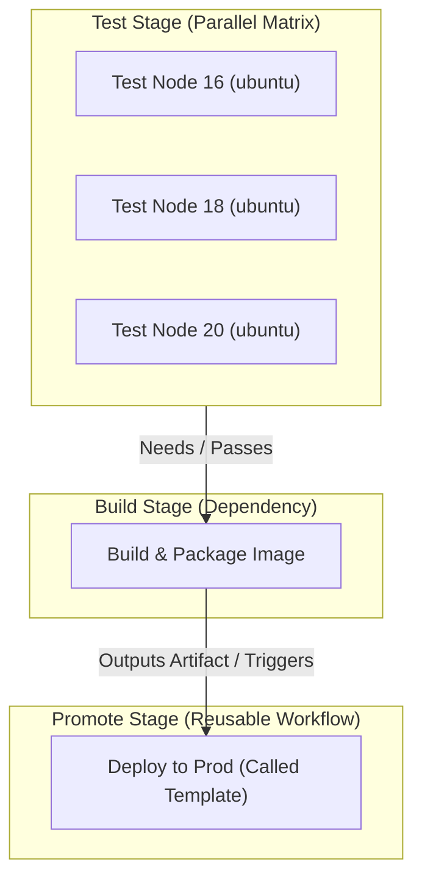
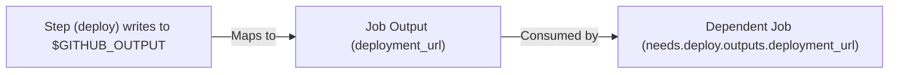

---
domains:
  - "github-actions"
class: reference-note
tier: reference-note
tags:
  - github-actions/execution
  - github-actions/matrix
  - github-actions/caching
  - github-actions/inputs-outputs
---

# Module 9-2: Advanced Pipeline Control & Execution

This module covers advanced control structures in GitHub Actions (GHA): parallel matrix strategies, sharing build data (artifacts vs. outputs), dependency caching mechanics, modular pipeline configurations (reusable workflows vs. composite actions), and dynamic expressions.

---

## 🗺️ Cognitive Map: How to Think About the Flow of Knowledge

To optimize execution speed and establish safe promotion gates, structure your pipeline from parallel testing to controlled promotions:



1. **Step 1: Matrix Parallelism (Section 5):** Run tests concurrently across OS environments and language runtimes to catch platform-specific issues early.
2. **Step 2: Shared Storage Optimization (Section 4):** Persist code packages via caching to speed up downstream steps, and pass build outputs to other jobs via artifacts.
3. **Step 3: Outputs & Reusable Workflows (Section 3):** Capture execution results in outputs, and pass them as inputs to modular, reusable workflows.

---

## 1. Variables, Contexts, & Expressions

GitHub Actions separates compile-time evaluation (orchestrator level) from runtime execution (runner VM level).

### A. Context Expressions vs. Runner Shell Variables
Understanding the difference between orchestrator evaluation and runner host evaluation is critical:

| **Feature**         | **GitHub Actions Contexts (`${{ env.KEY }}`)**                                  | **Runner Shell Variables (`$KEY` / `$GITHUB_ENV`)**                                   |
| :------------------ | :------------------------------------------------------------------------------ | :------------------------------------------------------------------------------------ |
| **Evaluation Time** | Pre-processed by the GHA orchestrator **before** the job is sent to the runner. | Evaluated at runtime by the shell interpreter on the runner host.                     |
| **Parsing Context** | Works anywhere in the YAML (triggers, `if` conditions, `with` blocks).          | Only works within the `run` shell command blocks.                                     |
| **Security**        | Safe from shell injection if sanitized; can be used in YAML structure.          | Subject to shell interpolation and environment visibility.                            |
| **Scope**           | Available globally or scoped depending on context map.                          | Scoped to the current shell session or written to `$GITHUB_ENV` for subsequent steps. |

#### Evaluation Example:
```yaml
env:
  VERSION: "1.0.0"
jobs:
  demo:
    runs-on: ubuntu-latest
    steps:
      - name: Print variables
        env:
          LOCAL_VAR: "RunTimeValue"
        run: |
          echo "Orchestrator Compile-Time: ${{ env.VERSION }}"
          echo "Runner Shell Runtime: $LOCAL_VAR"
```

### B. Supported Contexts
GHA makes execution metadata available through contexts. Below is a detailed breakdown of each context with concrete YAML examples:

1. **`github`**: Contains details about the current workflow run and the event that triggered it.
   ```yaml
   # Example: Triggering execution conditionally based on branch name and SHA
   steps:
     - name: Build branch
       if: github.ref == 'refs/heads/main'
       run: echo "Building main branch at commit: ${{ github.sha }}"
   ```

2. **`env`**: Allows you to read environment variables set at the workflow, job, or step level.
   ```yaml
   # Example: Referencing global variables
   env:
     DEPLOY_REGION: "us-east-1"
   steps:
     - name: Output region
       run: echo "Target region is: ${{ env.DEPLOY_REGION }}"
   ```

3. **`steps`**: Contains the outputs and execution statuses of steps within the current job.
   ```yaml
   # Example: Passing outputs sequentially between steps
   steps:
     - name: Generate Value
       id: generator
       run: echo "random_id=job-id-99" >> $GITHUB_OUTPUT
     - name: Use Value
       run: echo "Received random ID: ${{ steps.generator.outputs.random_id }}"
   ```

4. **`needs`**: Accesses the outputs, result status (`success`, `failure`, `skipped`, or `cancelled`) of jobs listed as dependencies.
   ```yaml
   # Example: Controlling downstream execution based on upstream results
   jobs:
     build:
       runs-on: ubuntu-latest
       outputs:
         build_id: ${{ steps.save.outputs.id }}
       # ...
     deploy:
       needs: build
       if: needs.build.result == 'success'
       runs-on: ubuntu-latest
       steps:
         - run: echo "Deploying build number: ${{ needs.build.outputs.build_id }}"
   ```

5. **`runner`**: Accesses metadata about the host VM executing the current job.
   ```yaml
   # Example: Locating dynamic workspace and OS parameters
   steps:
     - name: Inspect runner platform
       run: |
         echo "Host Operating System: ${{ runner.os }}"
         echo "Host Temp Directory: ${{ runner.temp }}"
   ```

6. **`secrets`**: Accesses encrypted variables configured in repository or environment scopes.
   ```yaml
   # Example: Injecting secrets into step execution environment
   steps:
     - name: Query Database
       env:
         DB_PASSWORD: ${{ secrets.DATABASE_PASSWORD }}
       run: ./db_query.sh --password "$DB_PASSWORD"
   ```

7. **`inputs`**: Accesses variables supplied via manual triggers (`workflow_dispatch`) or reusable triggers (`workflow_call`).
   ```yaml
   # Example: Dynamic environment choice via manual UI dispatch
   on:
     workflow_dispatch:
       inputs:
         target_env:
           type: string
           default: "staging"
   steps:
     - run: echo "Target destination: ${{ inputs.target_env }}"
   ```

8. **`matrix`**: Accesses parameters of the current matrix execution loop.
   ```yaml
   # Example: Multi-version setup referencing matrix keys
   strategy:
     matrix:
       python-version: ["3.11", "3.12"]
   steps:
     - name: Set up Python
       uses: actions/setup-python@v5
       with:
         python-version: ${{ matrix.python-version }}
   ```

---

## 2. Built-in Functions & Flow Control

Functions process data and evaluate expressions within the `${{ }}` syntax.

### A. General-Purpose Functions
These functions allow you to perform string matching, format variables, serialize payloads, and generate cache hashes. Below is the operational context and usage for each function:

1. **`contains(search, item)`**
   * **Context:** Used to search a string (e.g., checking if a branch name contains a prefix) or to check an array (e.g., checking if a user is part of an approved lists).
   * **YAML Example:**
     ```yaml
     # Trigger step only on feature branches OR if actor is an administrator
     if: contains(github.ref, 'refs/heads/feature/') || contains(fromJSON('["kmashour", "admin-user"]'), github.actor)
     ```

2. **`startsWith(string, search)`** & **`endsWith(string, search)`**
   * **Context:** Used to check string boundaries. Useful for gating steps based on naming conventions (e.g., release tag prefixes, or commit message flags).
   * **YAML Example:**
     ```yaml
     # Execute deployment only if tag starts with 'v' and commit message does not end with '[skip-ci]'
     if: startsWith(github.ref, 'refs/tags/v') && !endsWith(github.event.head_commit.message, '[skip-ci]')
     ```

3. **`format(template, val1, val2...)`**
   * **Context:** Synthesizes custom strings by replacing numbered placeholders (`{0}`, `{1}`, etc.) with values. Excellent for creating structured image tags or notification templates.
   * **YAML Example:**
     ```yaml
     steps:
       - name: Set dynamic image tag
         run: echo "TAG=${{ format('app-v{0}-sha-{1}', github.run_number, github.sha) }}" >> $GITHUB_ENV
     ```

4. **`join(array, separator)`**
   * **Context:** Flattens a structured array of strings into a single string joined by a separator. Commonly used to parse list objects (like pull request reviewers or modified paths) for Slack alerts.
   * **YAML Example:**
     ```yaml
     steps:
       - name: Log PR Reviewers
         run: echo "PR Reviewers requested: ${{ join(github.event.pull_request.requested_reviewers.*.login, ', ') }}"
     ```

5. **`hashFiles(path)`**
   * **Context:** Computes a SHA-256 checksum of files matching a glob pattern. This is the **standard mechanism** for generating cache keys; if `requirements.txt` or `package-lock.json` changes, the hash changes, triggering a cache miss.
   * **YAML Example:**
     ```yaml
     uses: actions/cache@v4
     with:
       path: ~/.cache/pip
       key: pip-cache-${{ runner.os }}-${{ hashFiles('**/requirements.txt') }}
     ```

6. **`fromJSON(json)`** & **`toJSON(value)`**
   * **Context:**
     * `toJSON(value)`: Serializes objects into JSON strings. Primarily used to print execution contexts for diagnostic debugging.
     * `fromJSON(json)`: Parses JSON strings into structured objects. Essential for dynamically configuring runner matrices from output strings of parent setup jobs.
   * **YAML Example:**
     ```yaml
     # Debugging: Dump GitHub metadata
     - name: Dump Context
       run: echo "${{ toJSON(github) }}"

     # Dynamic Matrix: Parse matrix string computed in 'setup' job
     jobs:
       test:
         needs: setup
         strategy:
           matrix: ${{ fromJSON(needs.setup.outputs.matrix_config) }}
     ```

### B. Status Check Functions
Status checks control step execution based on the parent job status. If no status check is defined, GHA defaults to `success()`.
*   **`success()`**: Returns true if all previous steps succeeded.
*   **`failure()`**: Returns true if any previous step failed.
*   **`always()`**: Forces execution regardless of previous step status (runs even if cancelled).
*   **`cancelled()`**: Returns true if the workflow execution was explicitly cancelled.

```yaml
steps:
  - name: Run Primary Test Suite
    run: npm test
    
  - name: Upload Logs on Failure
    if: failure() # Runs only if tests fail
    run: ./upload-debug-logs.sh
```

---

## 3. Modular Reusability: Inputs & Outputs Propagation

To build DRY (Don't Repeat Yourself) pipelines, GHA supports **Composite Actions** and **Reusable Workflows**.

### A. Reusable Workflows vs. Composite Actions
Choosing the correct modular pattern affects security, structure, and execution limits:

| **Feature** | **Reusable Workflows (`workflow_call`)** | **Composite Actions (`composite`)** |
| :--- | :--- | :--- |
| **Execution Boundary**| Runs as a separate job. Can contain multiple jobs. | Runs as a series of steps inside a caller's job. |
| **Compute Choice** | Can define custom `runs-on` runners inside the called file. | Executes on whichever runner the caller job allocates. |
| **Secrets Access** | Can be explicitly passed or inherited (`secrets: inherit`). | Accesses caller's secrets; cannot declare separate secret schemas. |
| **Logical Logic** | Supports nested steps and complex conditional job sequences. | Only contains sequential steps using the `run` or `uses` keys. |

### B. Defining Inputs & Outputs
*   **Step Outputs:** Written to the `$GITHUB_OUTPUT` file descriptor.
*   **Job Outputs:** Map step outputs to the job level so dependent jobs can access them via `needs`.



#### Syntax:
```yaml
# Called Reusable Workflow (deploy-template.yml)
name: Reusable Deployment
on:
  workflow_call:
    inputs:
      env:
        required: true
        type: string
    outputs:
      app_url:
        value: ${{ jobs.deploy.outputs.site_url }}

jobs:
  deploy:
    runs-on: ubuntu-latest
    outputs:
      site_url: ${{ steps.set-url.outputs.endpoint }}
    steps:
      - id: set-url
        run: echo "endpoint=https://${{ inputs.env }}.myapp.com" >> $GITHUB_OUTPUT
```

---

## 4. Shared Storage: Artifacts vs. Caching

Passing files across jobs or preserving dependencies across pipeline runs requires different storage mechanics.

### A. Artifacts vs. Caching Comparison

| **Feature** | **Artifacts (`actions/upload-artifact`)** | **Dependency Caching (`actions/cache`)** |
| :--- | :--- | :--- |
| **Primary Intent** | Sharing immutable build products between jobs, or archiving test results. | Speeding up builds by reusing packages/dependencies across workflow runs. |
| **Data Scope** | Bound to a single workflow run; visible to downstream jobs in the same run. | Shared globally across runs on the same branch or parent branches. |
| **Storage Lifecycle** | Persists post-run (downloadable via UI). Billed after free storage tier. | Ephemeral storage. Cleared automatically if unused (default 7 days). |
| **Update Pattern** | Uploaded as new files every time. | Restored (read-only) at startup; saved only if key is new. |

### B. The Cache Lookup Algorithm
When `actions/cache` runs:
1.  It searches for an exact match of the `key` parameter.
2.  If not found, it evaluates `restore-keys` in order, matching prefixes (e.g., `pip-cache-ubuntu-`).
3.  If a cache hit occurs, the directories are restored. If a cache miss occurs, the step succeeds but dependencies must be re-downloaded and saved at the end of the job.

---

## 5. Parallel Execution: Matrix Strategy

The matrix strategy creates multiple job runs by expanding combinations of variables.

### A. Core Properties
*   **`include`**: Appends specific combinations to the matrix, or adds unique variables to existing configurations.
*   **`exclude`**: Filters out specific combinations from the matrix expansion.
*   **`fail-fast`**: If set to `true` (default), GHA cancels all active matrix jobs if any job fails. Set to `false` in testing suites to collect complete logs.
*   **`max-parallel`**: Limits the number of concurrent jobs running at once to prevent api rate-limiting.

```yaml
strategy:
  fail-fast: false
  max-parallel: 2
  matrix:
    os: [ubuntu-latest, windows-latest]
    python-version: ["3.11", "3.12"]
    exclude:
      - os: windows-latest
        python-version: "3.11"
```

---

## 6. Code & Workflow Demonstrations

### A. Step & Job Outputs Propagation
This pipeline executes a deployment step, outputs the URL, and passes it to a downstream notification job:

```yaml
name: Job Outputs Demo

on:
  workflow_dispatch:

jobs:
  deploy-job:
    runs-on: ubuntu-latest
    outputs:
      deployment_url: ${{ steps.deploy.outputs.deployment_url }}
    steps:
      - name: Deploy Application
        id: deploy
        run: |
          echo "Deploying application..."
          sleep 2
          echo "deployment_url=https://cwvj-demo.com" >> $GITHUB_OUTPUT

  notification-job:
    runs-on: ubuntu-latest
    needs: deploy-job
    steps:
      - name: Send Notification
        run: |
          echo "Sending notification..."
          echo "Application URL: ${{ needs.deploy-job.outputs.deployment_url }}"
```

### B. Artifact Archiving & Downloading
Builds a temporary test report in one job and reviews it in another:

```yaml
name: Artifacts Demo

on:
  workflow_dispatch:

jobs:
  build-job:
    runs-on: ubuntu-latest
    steps:
      - name: Generate Reports
        run: |
          echo "Testing completed on $(date)" > test-results.log
          echo "Build status: PASS" >> test-results.log
          
      - name: Upload Build Report
        uses: actions/upload-artifact@v4
        with:
          name: execution-report
          path: test-results.log
          retention-days: 5

  review-job:
    runs-on: ubuntu-latest
    needs: build-job
    steps:
      - name: Fetch Report
        uses: actions/download-artifact@v4
        with:
          name: execution-report
          
      - name: Output Report
        run: cat test-results.log
```

### C. Advanced Dependency Caching
Caches Python pip packages using OS and requirements hash keys to optimize build speed:

```yaml
name: Python Cache Demo

on:
  workflow_dispatch:

jobs:
  build:
    runs-on: ubuntu-latest
    steps:
      - name: Checkout Code
        uses: actions/checkout@v4

      - name: Setup Python
        uses: actions/setup-python@v5
        with:
          python-version: "3.11"

      - name: Restore Pip Cache
        id: pip-cache
        uses: actions/cache@v4
        with:
          path: ~/.cache/pip
          key: pip-cache-${{ runner.os }}-${{ hashFiles('requirements.txt') }}
          restore-keys: |
            pip-cache-${{ runner.os }}-

      - name: Log Cache Status
        run: echo "Cache Hit Status: ${{ steps.pip-cache.outputs.cache-hit }}"

      - name: Install Dependencies
        run: pip install -r requirements.txt
```

### D. Complex Matrix Testing with Exclusions
Runs a test suite across multiple runtimes and OS platforms, avoiding testing Python 3.11 on Windows:

```yaml
name: Matrix Suite

on:
  workflow_dispatch:

jobs:
  test:
    runs-on: ${{ matrix.os }}
    strategy:
      fail-fast: false
      matrix:
        os: [ubuntu-latest, windows-latest]
        python-version: ["3.11", "3.12", "3.13"]
        exclude:
          - os: windows-latest
            python-version: "3.11"
        include:
          - os: ubuntu-latest
            python-version: "3.13"
            experimental: true

    steps:
      - name: Setup Environment
        uses: actions/setup-python@v5
        with:
          python-version: ${{ matrix.python-version }}

      - name: Log Information
        run: |
          echo "Running on OS: ${{ runner.os }}"
          echo "Running Python: ${{ matrix.python-version }}"
          echo "Experimental status: ${{ matrix.experimental || 'false' }}"
