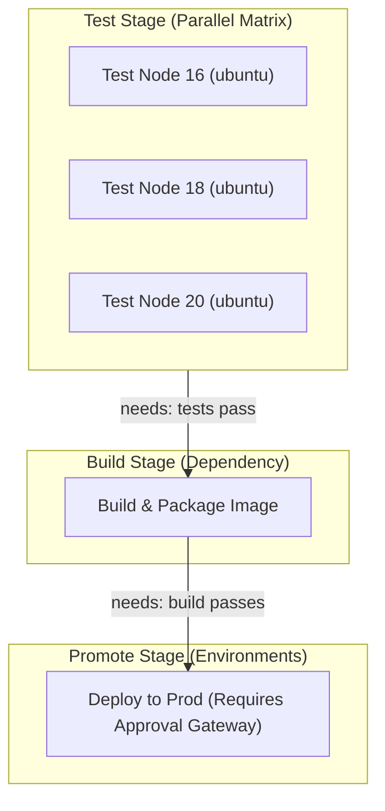

# Module 9-2: Advanced Pipeline Control & Execution

This module covers advanced control structures in GitHub Actions: defining job dependencies, sharing build artifacts, caching dependency folders, executing parallel matrices, and managing environment-scoped secrets.

---

## 🗺️ Cognitive Map: How to Think About the Flow of Knowledge

To optimize execution speed and establish safe promotion gates, structure your pipeline from parallel testing to controlled promotions:



1. **Step 1: Parallel Matrix Testing (Section 1):** Validate code across multiple architectures, OS, and runtimes concurrently.
2. **Step 2: Artifact/Cache Handovers (Section 2):** Save compilation outputs as artifacts and cache vendor directories to speed up downstream builds.
3. **Step 3: Environment Gates (Section 3):** Promote artifacts to isolated environments protected by approval rules and environment-specific secrets.

---

## 1. Job Chaining and Dependencies (`needs` and `outputs`)

By default, jobs defined in a workflow run in parallel. To establish order, use the `needs` key. To pass variables between jobs, use `outputs`.

```yaml
jobs:
  build:
    runs-on: ubuntu-latest
    outputs:
      artifact-version: ${{ steps.set-version.outputs.version }}
    steps:
      - id: set-version
        run: echo "version=1.4.2" >> "$GITHUB_OUTPUT"

  deploy:
    runs-on: ubuntu-latest
    needs: build
    steps:
      - name: Deploy version
        run: echo "Deploying version ${{ needs.build.outputs.artifact-version }}"
```

---

## 2. Deep-Intuition (AARF) Breakdowns: Advanced Execution

### A. Artifact Sharing Across Job Boundaries
#### Deep-Intuition (AARF) Breakdown:
1. **The Answer (Core Pattern):** Use `actions/upload-artifact` in the compiler job to export build outputs, and `actions/download-artifact` in downstream jobs to retrieve those outputs, ensuring that compilation only runs once.
    ```yaml
    jobs:
      build-assets:
        runs-on: ubuntu-latest
        steps:
          - uses: actions/checkout@v4
          - name: Compile Site
            run: npm run build # Outputs to dist/
          - name: Archive Dist Files
            uses: actions/upload-artifact@v4
            with:
              name: compiled-assets
              path: dist/
              retention-days: 5

      deploy-assets:
        runs-on: ubuntu-latest
        needs: build-assets
        steps:
          - name: Fetch Archives
            uses: actions/download-artifact@v4
            with:
              name: compiled-assets
              path: static-files/
          - name: Deploy to Cloud Storage
            run: aws s3 sync static-files/ s3://my-bucket/
    ```
2. **The Assumptions (Context):** Downstream jobs must declare a dependency on the uploading job using the `needs` key. The runner VMs are fresh instances; files on the filesystem of the `build-assets` runner do NOT persist to the `deploy-assets` runner.
3. **The Rationale (Why):** GitHub-hosted runners run on separate VMs. Sharing files via the filesystem is impossible. Uploading artifacts sends them to a central, temporary secure storage bucket, which downstream runner VMs fetch.
4. **The Failure Loop (What if not):** If artifacts are not used and jobs are chained without sharing compilation outputs, downstream jobs (like testing, security scanning, or deploying) must repeat the checkouts, dependency installations, and build compilation commands. This increases pipeline execution time, wastes CPU cycles, and duplicates billing costs.
5. **Alternative Case (When to use 'if not'):** For simple pipelines where build and deployment are done within a single job on the same runner VM, artifact uploading is not strictly necessary for pipeline execution (though useful for archiving final binaries).

### B. Dependency Caching Strategies
#### Deep-Intuition (AARF) Breakdown:
1. **The Answer (Core Pattern):** Utilize the `actions/cache` action or built-in action caches with unique hashing keys based on lockfiles (`package-lock.json`, `go.sum`, `Cargo.lock`) to avoid downloading packages on every run.
    ```yaml
    - name: Cache Node Modules
      uses: actions/cache@v4
      with:
        path: ~/.npm
        key: ${{ runner.os }}-node-${{ hashFiles('**/package-lock.json') }}
        restore-keys: |
          ${{ runner.os }}-node-
    ```
2. **The Assumptions (Context):** The cached path must target the package manager's global cache directory (e.g. `~/.npm` for npm, `~/.cache/pip` for pip), not project-local folders, to ensure robust cross-architecture restoration.
3. **The Rationale (Why):** Downloading external packages from internet registries (npm registry, PyPI, Go proxy) on every run is slow and subject to network flakiness. Hashing the lockfile guarantees that as long as the dependencies do not change, the cache remains valid and is restored in seconds. If the lockfile changes, the hash changes, generating a cache miss and forcing a fresh download which is then saved as a new cache key.
4. **The Failure Loop (What if not):** If caching is omitted, the install step must download hundreds of megabytes of third-party libraries over the network for every single workflow run. This easily adds 2 to 5 minutes of overhead to each job run, exposes the pipeline to failures if the package registry suffers transient downtime, and incurs higher network ingress bandwidth load.
5. **Alternative Case (When to use 'if not'):** If the runtime environment has a very high-speed, persistent disk (like some on-premise Kubernetes runners where node-level directories are persistent), native directory mounts may be preferred.

### C. Matrix Strategy Parallelization
#### Deep-Intuition (AARF) Breakdown:
1. **The Answer (Core Pattern):** Define a `matrix` strategy to execute jobs across different combinations of operating systems and programming language versions simultaneously.
    ```yaml
    strategy:
      fail-fast: false # Do not cancel other runs if one combination fails
      matrix:
        os: [ubuntu-latest, windows-latest]
        node-version: [18, 20]
        exclude:
          - os: windows-latest
            node-version: 18
    ```
2. **The Assumptions (Context):** The runner VM configurations must match the strategy inputs (`runs-on: ${{ matrix.os }}`).
3. **The Rationale (Why):** Multi-platform support is critical for shared library developers. Instead of writing four separate jobs, a single job template is executed concurrently with variables injected, saving configuration code and executing all testing configurations in parallel. Setting `fail-fast: false` ensures that if the Windows/Node-18 run fails, the Ubuntu/Node-20 run continues to completion, giving developers a complete view of failures.
4. **The Failure Loop (What if not):** If a matrix is not used, developers must copy-paste jobs (violating DRY principles) or test sequentially. If tested sequentially, if the first test takes 5 minutes and fails, the developer does not get feedback on whether other environments are broken until they fix the first issue and run the pipeline again.
5. **Alternative Case (When to use 'if not'):** For custom applications deployed strictly to a known, single-architecture production target (e.g., deploying a Go API strictly to a Linux container), matrix testing across multiple operating systems is redundant and wastes runner minutes.

---

## 3. Environments and Secrets Management

GitHub Actions handles configuration values and passwords securely via Secrets and Scoped Environments.

### Secrets Access Rules
*   **Decryption at Runtime:** Secrets are encrypted at rest. The runner decrypts them only upon job launch, injecting them as environment variables or step inputs.
*   **Log Masking:** GitHub Actions monitors stdout and automatically masks any value matching a decrypted secret with `***` in the UI log output.

### Target Environment Configuration
Environments represent deployment targets (e.g., `staging`, `production`). They feature:
1.  **Required Reviewers:** The workflow pauses until designated team members approve the deployment.
2.  **Environment Secrets:** Secrets scoped strictly to that environment (e.g., production database passwords) which are inaccessible to normal test jobs.

```yaml
jobs:
  deploy-prod:
    runs-on: ubuntu-latest
    environment:
      name: production
      url: https://api.prod.example.com
    steps:
      - name: Deploy
        run: ./deploy.sh
        env:
          DB_PASSWORD: ${{ secrets.PROD_DB_PASSWORD }}

---

## ⚙️ 4. Reusable Workflows, Pipeline Inputs/Outputs, and Advanced Caching

### A. Reusable Workflows (`workflow_call`)
Reusable workflows allow organizations to standardise pipeline templates, avoiding duplication (DRY principle).
*   **Caller vs. Called:** The *Called* workflow defines its triggers using `on: workflow_call`. The *Caller* workflow references it using the `uses` directive at the job level.
*   **Passing Inputs and Secrets:**
    ```yaml
    # Caller Workflow (.github/workflows/deploy.yml)
    jobs:
      trigger-deployment:
        uses: kmashour/BrainDump/.github/workflows/reusable-deploy.yml@main
        with:
          environment: 'production'
        secrets: inherit # Implicitly passes all caller secrets to the called workflow
    ```
    ```yaml
    # Called Reusable Workflow (.github/workflows/reusable-deploy.yml)
    on:
      workflow_call:
        inputs:
          environment:
            required: true
            type: string
    jobs:
      execute:
        runs-on: ubuntu-latest
        steps:
          - run: echo "Deploying to ${{ inputs.environment }}"
    ```

### B. Inputs & Outputs Architecture
Values are propagated across steps, jobs, and workflows via file writes:
*   **Step Outputs:** Write values to the `$GITHUB_OUTPUT` file descriptor:
    `echo "target_ip=10.0.5.12" >> "$GITHUB_OUTPUT"`
*   **Job Outputs:** Reference the step output within the job definitions:
    ```yaml
    jobs:
      job1:
        outputs:
          ip: ${{ steps.step1.outputs.target_ip }}
        steps:
          - id: step1
            run: echo "target_ip=10.0.5.12" >> "$GITHUB_OUTPUT"
    ```
*   **Workflow Outputs:** For reusable workflows, map job outputs up to the `workflow_call.outputs` block.

### C. Advanced Caching: Key Restorations
In `actions/cache@v4`, if the exact lockfile hash key results in a cache miss, the `restore-keys` block provides sequential prefixes to match:
```yaml
- uses: actions/cache@v4
  with:
    path: ~/.cache/pip
    key: ${{ runner.os }}-pip-${{ hashFiles('**/requirements.txt') }}
    restore-keys: |
      ${{ runner.os }}-pip-
```
*   **Fallback Logic:** If `requirements.txt` changes, the exact key is missed. The runner falls back to searching for any cache matching `${{ runner.os }}-pip-` (which restores the previous build's python package cache). The runner then only downloads the *newly added* packages, reducing install time compared to a full download.

### D. Matrix Strategy Customization: `include` & `exclude`
*   **Cartesian Multiplier:** Matches every option in the matrix keys (e.g. 3 node versions $\times$ 2 OS = 6 runs).
*   **`include`:** Appends specific parameters to existing matrix combinations, or adds an entirely separate custom job runner (e.g., adding an ARM64 runner VM to the matrix):
    ```yaml
    strategy:
      matrix:
        os: [ubuntu-latest]
        node: [18, 20]
        include:
          - os: ubuntu-latest
            node: 20
            experimental: true # Appends tag only to this combination
          - os: windows-latest # Adds a completely new independent job combination
            node: 20
    ```
*   **`exclude`:** Prevents executing dangerous or unsupported environments.

### E. PoC: Reusable Workflow and Outputs Mapping
This Proof of Concept implements a standard caller-called workflow structure. The called workflow parses input parameters, runs validation, writes step-level outputs to `$GITHUB_OUTPUT`, passes them to job-level outputs, and returns them to the caller workflow:
```yaml
# .github/workflows/called-validator.yml (Called Reusable Workflow)
name: Called Validator
on:
  workflow_call:
    inputs:
      target_host:
        required: true
        type: string
    outputs:
      validation_status:
        description: "Status of node security validation"
        value: ${{ jobs.scan.outputs.status }}

jobs:
  scan:
    runs-on: ubuntu-latest
    outputs:
      status: ${{ steps.run-scan.outputs.scan_status }}
    steps:
      - name: Execute Security Scan
        id: run-scan
        run: |
          echo "Scanning target host: ${{ inputs.target_host }}"
          echo "scan_status=passed" >> "$GITHUB_OUTPUT"
```
```yaml
# .github/workflows/caller-pipeline.yml (Caller Workflow)
name: Caller Pipeline
on:
  push:
    branches: [ main ]
jobs:
  run-validation:
    uses: ./.github/workflows/called-validator.yml
    with:
      target_host: '10.0.8.25'

  deploy:
    runs-on: ubuntu-latest
    needs: run-validation
    steps:
      - name: Evaluate Outputs
        run: |
          echo "Validator returned: ${{ needs.run-validation.outputs.validation_status }}"
```

### F. PoC: Multi-Job Artifact Sharing and Cache Fallback Setup
This Proof of Concept builds a Python application, caches package dependencies using `restore-keys` fallback logic, archives compile output files, and downloads them in a separate deployment job:
```yaml
# artifact-cache-poc.yml
name: Artifact & Cache PoC
on: [push]
jobs:
  build:
    runs-on: ubuntu-latest
    steps:
      - name: Checkout Code
        uses: actions/checkout@v4

      - name: Cache Pip Packages
        uses: actions/cache@v4
        with:
          path: ~/.cache/pip
          key: ${{ runner.os }}-pip-${{ hashFiles('**/requirements.txt') }}
          restore-keys: |
            ${{ runner.os }}-pip-

      - name: Install dependencies
        run: pip install -r requirements.txt

      - name: Generate Output Binary
        run: |
          mkdir dist
          echo "Built package binary" > dist/app.bin

      - name: Upload Build Artifact
        uses: actions/upload-artifact@v4
        with:
          name: app-binary
          path: dist/
          retention-days: 1

  deploy:
    runs-on: ubuntu-latest
    needs: build
    steps:
      - name: Download Build Artifact
        uses: actions/download-artifact@v4
        with:
          name: app-binary
          path: deploy-files/

      - name: Deploy Binary
        run: cat deploy-files/app.bin
```

### G. PoC: Matrix Parallelization with Includes and Excludes
This Proof of Concept demonstrates parallel testing across multiple OS and node environments, limits concurrent executions, avoids cancelling jobs on first failure, and dynamically includes experimental flags:
```yaml
# matrix-poc.yml
name: Matrix Parallelization PoC
on: [push]
jobs:
  test:
    runs-on: ${{ matrix.os }}
    strategy:
      fail-fast: false # Run all combinations to completion even if one fails
      max-parallel: 3  # Restrict concurrency to 3 simultaneous runners
      matrix:
        os: [ubuntu-latest, windows-latest, macos-latest]
        node-version: [18, 20]
        exclude:
          - os: macos-latest
            node-version: 18 # Skip this combination
        include:
          - os: ubuntu-latest
            node-version: 20
            experimental: true # Inject custom tag
    steps:
      - name: Checkout Code
        uses: actions/checkout@v4
      - name: Echo Environment
        run: |
          echo "Running on OS: ${{ matrix.os }}"
          echo "Node Version: ${{ matrix.node-version }}"
          echo "Is Experimental: ${{ matrix.experimental || 'false' }}"
```

---

### 📖 Sources & Ingested Transcripts
*   Varun Joshi GHA Course Transcripts:
    *   `inflow/GitHub Actions Functions Explained  Build a Production-Style CI Pipeline.txt`
    *   `inflow/GitHub Actions Outputs Explained  Step, Job & Reusable Workflow Outputs.txt`
    *   `inflow/GitHub Actions Inputs Explained  Workflow Inputs, Reusable Workflows & Production Use Cases.txt`
    *   `inflow/GitHub Actions Artifacts & Caching Explained  Share Files & Optimize Builds.txt`
    *   `inflow/GitHub Actions Matrix Strategy Explained  Multi-OS, Multi-Version Testing at Scale.txt`
