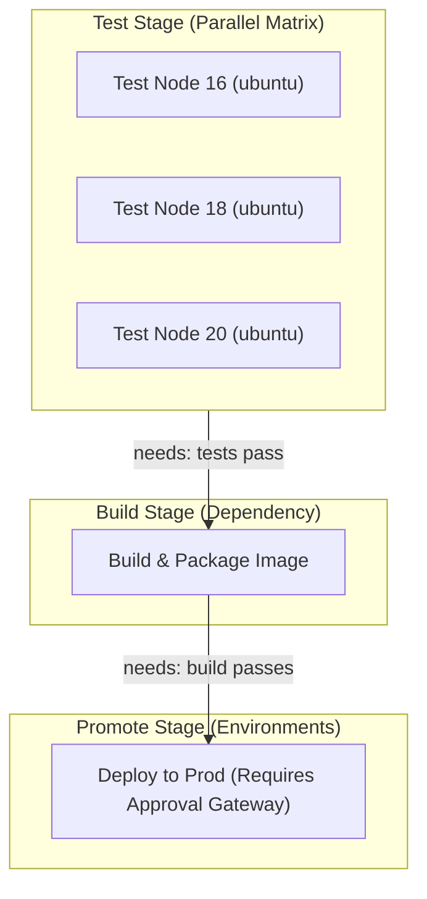
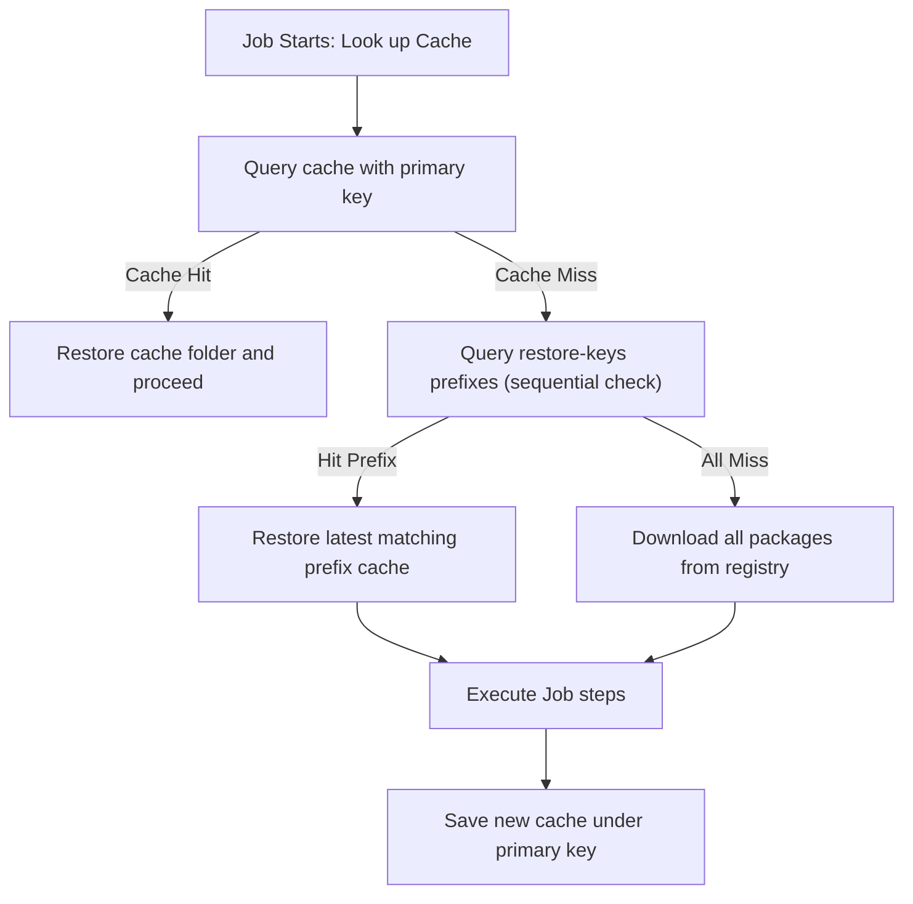

# Module 9-2: Advanced Pipeline Control & Execution

This module covers advanced control structures in GitHub Actions: executing parallel matrices, sharing build artifacts, caching dependency folders, modular reusable workflows, and utilizing the Expression language.

---

## 🗺️ Cognitive Map: How to Think About the Flow of Knowledge

To optimize execution speed and establish safe promotion gates, structure your pipeline from parallel testing to controlled promotions:



1. **Step 1: Parallel Matrix Testing (Section 1):** Validate code across multiple architectures, OS, and runtimes concurrently.
2. **Step 2: Artifact/Cache Handovers (Section 2 & 3):** Save compilation outputs as artifacts and cache vendor directories to speed up downstream builds.
3. **Step 3: Modular Architecture (Section 4):** Standardize deployment pipelines via Reusable Workflows and Composite Actions.

---

## 1. Matrix Strategy Parallelization

The matrix strategy is used to run a job template across multiple combinations of operating systems, language runtimes, or custom inputs concurrently.

### A. The Cartesian Product Logic
By defining arrays of options under the `matrix` key, the GitHub Actions orchestrator automatically expands them into a Cartesian product. For example:
```yaml
strategy:
  matrix:
    os: [ubuntu-latest, windows-latest]
    node-version: [18, 20]
```
This configuration yields $2 \times 2 = 4$ independent running jobs, each executing on a fresh, isolated runner VM.

### B. Include and Exclude Customizations
*   **`exclude`:** Prevents the execution of specific, unsupported combinations of parameters:
    ```yaml
    strategy:
      matrix:
        os: [ubuntu-latest, windows-latest, macos-latest]
        node-version: [16, 18, 20]
        exclude:
          - os: windows-latest
            node-version: 16 # Do not run Node 16 on Windows
    ```
*   **`include`:** Appends unique variables to specific combinations, or inserts entirely new configurations:
    ```yaml
    strategy:
      matrix:
        os: [ubuntu-latest]
        node-version: [20]
        include:
          - os: ubuntu-latest
            node-version: 20
            experimental: true # Injected variable only for this combination
          - os: macos-14 # Completely new standalone job configuration
            node-version: 21
    ```

### C. Concurrency Control & Failure Gates
*   **`fail-fast`:** Default is `true`. If any job in the matrix fails, the orchestrator immediately cancels all other currently running matrix jobs. In CI testing, setting `fail-fast: false` is recommended so developers receive complete feedback across all environments in a single run.
*   **`max-parallel`:** Restricts the maximum number of matrix jobs that can run concurrently. Useful for avoiding rate limits on external services or preserving available runner queues.

### D. Dynamic Matrices
A matrix does not have to be hardcoded. You can compute the matrix array dynamically in a setup job and output it as a JSON string, which is then parsed in the matrix definition using the `fromJSON()` function:
```yaml
matrix: ${{ fromJSON(needs.setup-job.outputs.matrix_config) }}
```

---

## 2. Sharing Data: Artifacts vs. Outputs

Workflows often need to share data across different jobs. There are two primary mechanisms for this: **Artifacts** (for heavy files) and **Outputs** (for lightweight metadata).

| **Feature** | **Artifacts (`actions/upload-artifact`)** | **Outputs (`$GITHUB_OUTPUT`)** |
| :--- | :--- | :--- |
| **Data Type** | Files, directories, binary bundles, log files. | Text strings (key-value pairs). |
| **Capacity** | Large (gigabytes, subject to storage limits). | Small (limited to string size limits). |
| **Storage Mechanism** | Uploaded to central cloud storage. | Propagated via the orchestrator memory. |
| **Latency** | Medium (requires compression, network transfer). | Extremely Low (near-instant metadata pass). |
| **Use Case** | Archiving build compilations, binaries, test reports. | Passing build versions, IPs, or build statuses. |
| **Lifecycle** | Persisted (1 to 90 days, defaults to 90 days). | Discarded immediately after workflow completion. |

---

## 3. Dependency Caching Strategies

Dependency caching speeds up workflow execution by restoring packages and compilation directories from previous runs, reducing network downloads.

### A. How Caching Works (Lookup & Fallback)
GHA uses `actions/cache` to manage caches. It relies on a primary `key` and an optional list of `restore-keys`.



1.  **Primary Key Lookup:** The runner queries the cache API using the primary `key`. If found (a cache hit), it downloads and extracts the files.
2.  **Restore-Keys Fallback:** If there is a cache miss, the runner evaluates the `restore-keys` array sequentially, matching the most recent cache that shares the prefix. This is useful when dependencies change slightly; instead of starting from scratch, the runner downloads a previous cache and updates only the changed packages.

### B. Eviction & Resource Policies
*   **Size Limit:** GHA permits up to 10GB of cache storage per repository.
*   **Eviction Policy:** If the 10GB threshold is exceeded, the orchestrator evicts older caches based on a Least Recently Used (LRU) algorithm.
*   **Inactivity Expiry:** Caches that are not accessed for 7 consecutive days are automatically deleted.

### C. Cache vs. Static Mounting Trade-offs
In self-hosted runner environments, persistent node storage allows developers to mount local folders (e.g., `/var/cache/node-modules`) directly to the runner. While this avoids network transfer and compression overhead, it risks build contamination from residual files. Using GHA's native isolated cache guarantees reproducibility, while static mounting optimizes speed at the cost of strict isolation.

---

## 4. Reusable Workflows (`workflow_call`) vs. Composite Actions

Modularity is key to maintaining clean CI/CD setups across large organizations. GHA provides two ways to reuse code: **Reusable Workflows** and **Composite Actions**.

| **Feature** | **Reusable Workflows (`workflow_call`)** | **Composite Actions** |
| :--- | :--- | :--- |
| **Configuration** | Defined as full workflows in `.github/workflows/`. | Defined in `action.yml` within any directory. |
| **Execution Scope** | Run at the **Job** level. | Run at the **Step** level. |
| **Multi-Job Support** | Can define multiple jobs running in parallel or sequence. | Limited to a single job execution (flat step sequence). |
| **Log Visibility** | Jobs are separated in the GitHub Actions UI. | Steps are nested within the executing step. |
| **Secret Inheritance** | Can inherit all caller secrets (`secrets: inherit`). | Secrets must be explicitly passed as inputs. |
| **Runner Definition** | Reusable workflows define their own `runs-on` targets. | Runs on the runner defined by the caller job. |

### A. Reusable Workflow Parameter Scopes
Called workflows define inputs and secrets under the `workflow_call` key:
```yaml
on:
  workflow_call:
    inputs:
      config-path:
        required: true
        type: string
    secrets:
      token:
        required: true
```

---

## 5. Expression Language, Contexts, & Functions

GHA workflows can evaluate expressions dynamically using the `${{ <expression> }}` syntax.

### A. Evaluation Contexts
*   `github`: Metadata regarding the workflow execution (e.g., `github.sha`, `github.ref`, `github.actor`).
*   `env`: Variables defined in the workflow's `env` blocks.
*   `vars`: Custom non-sensitive variables defined in the repository, environment, or organization settings.
*   `secrets`: Encrypted secrets.
*   `steps`: Outputs and execution statuses of steps within the current job.
*   `jobs`: Outputs of upstream jobs.
*   `matrix`: Parameter values for the current matrix job instance.
*   `inputs`: Parameters passed to reusable workflows or dispatch events.
*   `runner`: Information about the running runner environment (e.g., `runner.os`, `runner.arch`).

### B. Core Utility Functions
*   `hashFiles(path)`: Returns a SHA-256 hash of the files matching the pattern. Commonly used to generate cache keys from lockfiles:
    `${{ hashFiles('**/package-lock.json') }}`
*   `contains(search, item)`: Returns true if `search` contains `item`. Useful for conditional checks on branches or inputs:
    `${{ contains(github.ref, 'refs/heads/feature/') }}`
*   `startsWith(string, prefix)` / `endsWith(string, suffix)`: Checks string boundaries.
*   `toJSON(value)` / `fromJSON(value)`: Converts objects to JSON strings and vice versa.
*   `format(string, ...)`: Replaces tokens with values.

### C. Conditional Evaluations
Expressions in `if` conditionals are evaluated dynamically.
> [!NOTE]
> When writing an expression inside an `if` block, you can omit the `${{ }}` syntax wrapper, as the orchestrator automatically evaluates the contents of an `if` statement as an expression.
> ```yaml
> if: github.ref == 'refs/heads/main'
> ```

---

## 6. Annotated Production-Grade YAML PoC Blocks

### PoC 1: Modular Reusable Workflow Implementation

#### Called Reusable Workflow (`.github/workflows/reusable-deploy.yml`)
```yaml
# .github/workflows/reusable-deploy.yml
name: Reusable Deployment Template

on:
  workflow_call:
    inputs:
      deploy_env:
        required: true
        type: string
        description: "Target environment"
      app_version:
        required: true
        type: string
        description: "SemVer build version"
    secrets:
      api_key:
        required: true
        description: "Deployment authorization token"
    outputs:
      status_message:
        description: "Deployment outcome log"
        value: ${{ jobs.execute-deployment.outputs.result_summary }}

jobs:
  execute-deployment:
    runs-on: ubuntu-latest
    outputs:
      result_summary: ${{ steps.action-deploy.outputs.summary }}
    steps:
      - name: Deploy Action
        id: action-deploy
        run: |
          echo "Deploying version ${{ inputs.app_version }} to ${{ inputs.deploy_env }}..."
          # Securely reference the secret
          echo "Auth length: ${#API_KEY}"
          echo "summary=deployment-completed-successfully" >> "$GITHUB_OUTPUT"
        env:
          API_KEY: ${{ secrets.api_key }}
```

#### Caller Workflow (`.github/workflows/main-pipeline.yml`)
```yaml
# .github/workflows/main-pipeline.yml
name: Main Orchestrator Pipeline

on:
  push:
    branches: [ main ]

jobs:
  build-metadata:
    runs-on: ubuntu-latest
    outputs:
      version: ${{ steps.gen-ver.outputs.build_version }}
    steps:
      - name: Generate Version Number
        id: gen-ver
        run: |
          echo "build_version=v2.4.1-sha-${GITHUB_SHA:0:7}" >> "$GITHUB_OUTPUT"

  deploy-stage:
    needs: build-metadata
    # Reference the called workflow using the local path
    uses: ./.github/workflows/reusable-deploy.yml
    with:
      deploy_env: 'staging'
      app_version: ${{ needs.build-metadata.outputs.version }}
    secrets:
      api_key: ${{ secrets.STAGING_API_KEY }}

  evaluate-outcome:
    runs-on: ubuntu-latest
    needs: deploy-stage
    steps:
      - name: Output Status Log
        run: |
          echo "Deployment Outcome: ${{ needs.deploy-stage.outputs.status_message }}"
```

### PoC 2: Multi-Job Artifact Sharing with Cache Fallback
This pipeline installs Python dependencies using a cache with a fallback key structure, compiles a build asset, uploads it as an artifact, and then downloads it in a downstream deployment job.

```yaml
# .github/workflows/artifact-cache-pipeline.yml
name: Compiled Assets Delivery Pipeline

on:
  push:
    branches: [ main ]

jobs:
  build-and-compile:
    runs-on: ubuntu-latest
    steps:
      - name: Checkout Code
        uses: actions/checkout@v4

      # Step 2: Configure Dependency Cache
      - name: Cache Python Virtualenv
        id: python-cache
        uses: actions/cache@v4
        with:
          path: ~/.cache/pip
          key: ${{ runner.os }}-pip-${{ hashFiles('**/requirements.txt') }}
          restore-keys: |
            ${{ runner.os }}-pip-

      - name: Setup Python environment
        uses: actions/setup-python@v5
        with:
          python-version: '3.11'

      # Step 4: Install dependencies (leveraging cache)
      - name: Install Project Libraries
        run: |
          python -m pip install --upgrade pip
          pip install -r requirements.txt

      # Step 5: Compile application binary
      - name: Compile Distribution Assets
        run: |
          mkdir -p build/dist
          echo "Binary Compilation Successful" > build/dist/app.bin
          date >> build/dist/app.bin

      # Step 6: Upload Build Output
      - name: Upload Binary Artifact
        uses: actions/upload-artifact@v4
        with:
          name: application-binary-package
          path: build/dist/
          retention-days: 7 # Kept for 7 days

  deploy-package:
    runs-on: ubuntu-latest
    needs: build-and-compile
    steps:
      - name: Create Landing Directory
        run: mkdir -p landing/

      # Step 2: Download the artifact uploaded by the build job
      - name: Download Compiled Binary
        uses: actions/download-artifact@v4
        with:
          name: application-binary-package
          path: landing/

      - name: Execute Deployment
        run: |
          echo "Content of package:"
          cat landing/app.bin
```

### PoC 3: Advanced Matrix Configuration with Concurrency Control
This workflow tests code across multiple operating systems and Node.js runtimes in parallel, excluding specific combinations and using `fail-fast: false` to ensure all tests complete.

```yaml
# .github/workflows/parallel-matrix-testing.yml
name: Cross-Platform Matrix Test Suite

on:
  push:
    branches: [ main ]
  pull_request:

jobs:
  run-tests:
    name: Test Node ${{ matrix.node-version }} on ${{ matrix.os }}
    runs-on: ${{ matrix.os }}
    
    strategy:
      fail-fast: false     # Do not cancel other runs if one combination fails
      max-parallel: 4      # Limit concurrent execution to 4 runners
      matrix:
        os: [ubuntu-latest, windows-2022, macos-14]
        node-version: [18, 20, 21]
        exclude:
          # Skip running legacy Node 18 on Windows
          - os: windows-2022
            node-version: 18
        include:
          # Include a custom flag for the latest version on Ubuntu
          - os: ubuntu-latest
            node-version: 21
            enable_experimental_features: true
          # Add a custom job targeting an older version on Ubuntu
          - os: ubuntu-latest
            node-version: 16

    steps:
      - name: Checkout Code
        uses: actions/checkout@v4

      - name: Initialize NodeJS Environment
        uses: actions/setup-node@v4
        with:
          node-version: ${{ matrix.node-version }}

      - name: Run Test Command
        run: |
          echo "Running unit tests on Node ${{ matrix.node-version }}..."
          echo "OS: ${{ runner.os }}"
          echo "Experimental Features: ${{ matrix.enable_experimental_features || 'false' }}"
```

---

## 📖 Sources & Ingested Transcripts
*   `inflow/GitHub Actions Functions Explained  Build a Production-Style CI Pipeline.txt`
*   `inflow/GitHub Actions Outputs Explained  Step, Job & Reusable Workflow Outputs.txt`
*   `inflow/GitHub Actions Artifacts & Caching Explained  Share Files & Optimize Builds.txt`
*   `inflow/GitHub Actions Matrix Strategy Explained  Multi-OS, Multi-Version Testing at Scale.txt`
*   `inflow/GitHub Actions Inputs Explained  Workflow Inputs, Reusable Workflows & Production Use Cases.txt`
