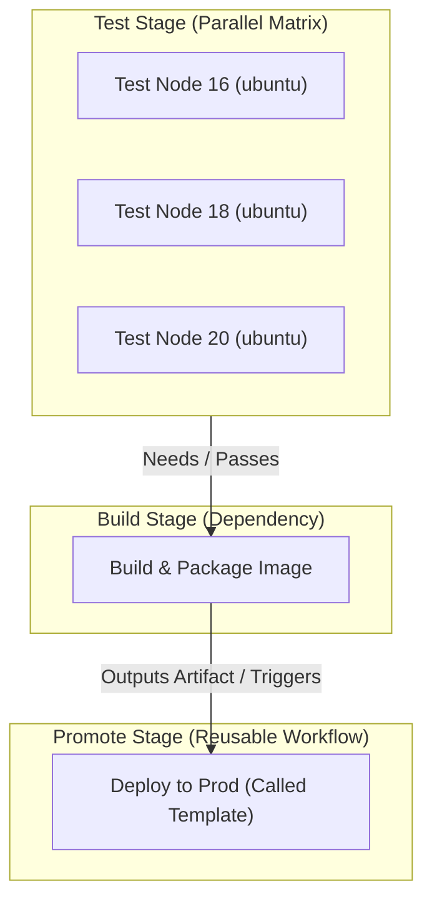
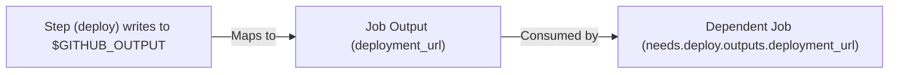

---
domains:
  - "github-actions"
class: reference-note
tier: reference-note
tags:
  - github-actions/execution
  - github-actions/matrix
  - github-actions/caching
  - github-actions/inputs-outputs
---

# Module 9-2: Advanced Pipeline Control & Execution

This module covers advanced control structures in GitHub Actions (GHA): parallel matrix strategies, sharing build data (artifacts vs. outputs), dependency caching mechanics, modular pipeline configurations (reusable workflows vs. composite actions), and dynamic expressions.

---

## 🗺️ Cognitive Map: How to Think About the Flow of Knowledge

To optimize execution speed and establish safe promotion gates, structure your pipeline from parallel testing to controlled promotions:



1. **Step 1: Matrix Parallelism (Section 5):** Run tests concurrently across OS environments and language runtimes to catch platform-specific issues early.
2. **Step 2: Shared Storage Optimization (Section 4):** Persist code packages via caching to speed up downstream steps, and pass build outputs to other jobs via artifacts.
3. **Step 3: Outputs & Reusable Workflows (Section 3):** Capture execution results in outputs, and pass them as inputs to modular, reusable workflows.

---

## 1. Variables, Contexts, & Expressions

GitHub Actions separates compile-time evaluation (orchestrator level) from runtime execution (runner VM level).

### A. Environment Variables Scope & Precedence Rules
Environment variables (`env:`) are key-value strings used to pass settings to shell commands inside your steps. 

#### 1. The Three Scopes of `env`
GHA allows you to declare environment variables at three levels of visibility (scopes):
*   **Workflow (Global) level:** Set at the root of the YAML file. Visible to all steps in all jobs.
*   **Job level:** Set inside a specific job. Visible *only* to the steps within that job.
*   **Step level:** Set inside a single step. Visible *only* to that step's execution.

#### 2. The Precedence Rule (Local Overrides Global)
If you define variables with the **same name** at different levels, GHA resolves them from the **most specific (innermost) to the most general (outermost)**. 

Precedence order: **Step-level > Job-level > Workflow-level**.

##### 📋 Scope & Precedence YAML Example:
```yaml
env:
  API_URL: "https://global.api.com" # 1. Global (Workflow) Level
  APP_ENV: "production"

jobs:
  test:
    runs-on: ubuntu-latest
    env:
      API_URL: "https://job.api.com"   # 2. Job Level (Overrides Global)
    steps:
      - name: Step 1 - Uses Job Level
        run: echo "Connecting to $API_URL" # Prints: "Connecting to https://job.api.com"

      - name: Step 2 - Overrides at Step Level
        env:
          API_URL: "https://step.api.com" # 3. Step Level (Overrides Job and Global)
        run: echo "Connecting to $API_URL" # Prints: "Connecting to https://step.api.com"

      - name: Step 3 - Inherits Global APP_ENV
        run: echo "Deploying to environment $APP_ENV" # Prints: "Deploying to environment production" (Global was not overridden)
```

### B. Context Expressions vs. Runner Shell Variables
Understanding the difference between orchestrator evaluation and runner host evaluation is critical:

| **Feature**         | **GitHub Actions Contexts (`${{ env.KEY }}`)**                                  | **Runner Shell Variables (`$KEY` / `$GITHUB_ENV`)**                                   |
| :------------------ | :------------------------------------------------------------------------------ | :------------------------------------------------------------------------------------ |
| **Evaluation Time** | Pre-processed by the GHA orchestrator **before** the job is sent to the runner. | Evaluated at runtime by the shell interpreter on the runner host.                     |
| **Parsing Context** | Works anywhere in the YAML (triggers, `if` conditions, `with` blocks).          | Only works within the `run` shell command blocks.                                     |
| **Security**        | Safe from shell injection if sanitized; can be used in YAML structure.          | Subject to shell interpolation and environment visibility.                            |
| **Scope**           | Available globally or scoped depending on context map.                          | Scoped to the current shell session or written to `$GITHUB_ENV` for subsequent steps. |

#### Evaluation Example:
```yaml
env:
  VERSION: "1.0.0"
jobs:
  demo:
    runs-on: ubuntu-latest
    steps:
      - name: Print variables
        env:
          LOCAL_VAR: "RunTimeValue"
        run: |
          echo "Orchestrator Compile-Time: ${{ env.VERSION }}"
          echo "Runner Shell Runtime: $LOCAL_VAR"
```

### C. Supported Contexts
GHA makes execution metadata available through contexts. Below is a detailed breakdown of each context with concrete YAML examples:

1. **`github`**: Contains details about the current workflow run and the event that triggered it.
   ```yaml
   # Example: Triggering execution conditionally based on branch name and SHA
   steps:
     - name: Build branch
       if: github.ref == 'refs/heads/main'
       run: echo "Building main branch at commit: ${{ github.sha }}"
   ```

   ##### 📋 Common `github` Context Properties
   Here is a reference of the most frequently used properties inside the `github` context:

   | Property | Type | Description / Meaning | Example Value |
   | :--- | :--- | :--- | :--- |
   | `github.workflow` | `string` | The name of the workflow. If omitted, defaults to the YAML file path. | `Production Deployment Pipeline` |
   | `github.ref` | `string` | The fully qualified git reference that triggered the run. | `refs/heads/main` or `refs/tags/v1.0.0` |
   | `github.ref_name` | `string` | The short ref name (branch or tag name) that triggered the run. | `main` or `v1.0.0` |
   | `github.sha` | `string` | The 40-character commit SHA that triggered the run. | `1ae40397392790516bd66d34188d34188d34188d` |
   | `github.actor` | `string` | The username of the user who triggered the workflow. | `kmashour` |
   | `github.event_name` | `string` | The webhook event type that triggered the workflow. | `push`, `pull_request`, `workflow_dispatch`, `schedule` |
   | `github.run_id` | `string` | A unique ID generated by GitHub for each workflow run. Constant across re-runs. | `9876543210` |
   | `github.run_number` | `integer` | An auto-incrementing number for each run of this specific workflow. | `14` |
   | `github.run_attempt` | `integer` | The attempt number of this specific run (starts at 1, increments on re-runs). | `1` |
   | `github.event` | `object` | The full webhook JSON payload. Used for accessing deep metadata. | `github.event.pull_request.title` |

2. **`env`**: Allows you to read environment variables set at the workflow, job, or step level.
   ```yaml
   # Example: Referencing global variables
   env:
     DEPLOY_REGION: "us-east-1"
   steps:
     - name: Output region
       run: echo "Target region is: ${{ env.DEPLOY_REGION }}"
   ```

3. **`steps`**: Contains the outputs and execution statuses of steps within the current job.
   ```yaml
   # Example: Passing outputs sequentially between steps
   steps:
     - name: Generate Value
       id: generator
       run: echo "random_id=job-id-99" >> $GITHUB_OUTPUT
     - name: Use Value
       run: echo "Received random ID: ${{ steps.generator.outputs.random_id }}"
   ```
   ###### 🗄️ Why is `.outputs.` required in the middle? (The Filing Cabinet Analogy)
   Unlike standard scripting (e.g. JavaScript or jQuery) where you can read properties directly from an object (like `steps.generator.random_id`), GHA compiles step metadata into namespaces. Think of `steps.generator` as a **filing cabinet** containing three distinct drawers:
   *   `steps.generator.outputs` — Contains user-defined outputs written to `$GITHUB_OUTPUT`.
   *   `steps.generator.outcome` — Contains GHA's built-in step execution result (`success`, `failure`, `cancelled`, `skipped`).
   *   `steps.generator.conclusion` — Contains GHA's final status (incorporating overrides like `continue-on-error`).
   To retrieve your custom variable `random_id`, you must explicitly navigate to the outputs drawer: `steps.generator.outputs.random_id`. If you write `steps.generator.random_id`, GHA's parser fails to resolve the context.

4. **`needs`**: Accesses the outputs, result status (`success`, `failure`, `skipped`, or `cancelled`) of jobs listed as dependencies.
   ```yaml
   # Example: Controlling downstream execution based on upstream results
   jobs:
     build:
       runs-on: ubuntu-latest
       outputs:
         build_id: ${{ steps.save.outputs.id }}
       # ...
     deploy:
       needs: build
       if: needs.build.result == 'success'
       runs-on: ubuntu-latest
       steps:
         - run: echo "Deploying build number: ${{ needs.build.outputs.build_id }}"
   ```
   ###### 📮 Why must we use the `needs` keyword? (The Cloud Database & Postal Service Analogy)
   In a single shared-memory browser thread (e.g. jQuery/JavaScript running on a page), scripts can read variables globally. However, in GitHub Actions:
   *   **Physical VM Isolation:** `build` runs on **VM Runner A**. When it finishes, VM Runner A is **instantly destroyed**. `deploy` starts on a completely separate, clean **VM Runner B**.
   *   **The Orchestrator Bridge:** Before VM A is deleted, the runner agent sends all declared `outputs:` up to GHA's cloud control plane (like sending a letter via a postal service). When VM B boots, GHA retrieves those stored values from the cloud database and injects them into VM B's context.
   *   **Why `needs` is mandatory:**
       1.  **Execution Scheduling:** GHA runs all jobs in parallel by default. Specifying `needs: build` forces VM B to wait until VM A completes and saves its values.
       2.  **Context Resolution:** The namespace `needs.build.outputs.build_id` instructs GHA's cloud engine: *"Go to the database, retrieve the stored results of the completed dependency job 'build', and insert the 'build_id' output value here."*

5. **`runner`**: Accesses metadata about the host VM executing the current job.
   ```yaml
   # Example: Locating dynamic workspace and OS parameters
   steps:
     - name: Inspect runner platform
       run: |
         echo "Host Operating System: ${{ runner.os }}"
         echo "Host Temp Directory: ${{ runner.temp }}"
   ```

6. **`secrets`**: Accesses encrypted variables configured in repository or environment scopes.
   ```yaml
   # Example: Injecting secrets into step execution environment
   steps:
     - name: Query Database
       env:
         DB_PASSWORD: ${{ secrets.DATABASE_PASSWORD }}
       run: ./db_query.sh --password "$DB_PASSWORD"
   ```

7. **`inputs`**: Accesses variables supplied via manual triggers (`workflow_dispatch`) or reusable triggers (`workflow_call`).
   ```yaml
   # Example: Dynamic environment choice via manual UI dispatch
   on:
     workflow_dispatch:
       inputs:
         target_env:
           type: string
           default: "staging"
   steps:
     - run: echo "Target destination: ${{ inputs.target_env }}"
   ```

8. **`matrix`**: Accesses parameters of the current matrix execution loop.
   ```yaml
   # Example: Multi-version setup referencing matrix keys
   strategy:
     matrix:
       python-version: ["3.11", "3.12"]
   steps:
     - name: Set up Python
       uses: actions/setup-python@v5
       with:
         python-version: ${{ matrix.python-version }}
   ```

---

## 2. Built-in Functions & Flow Control

Functions process data and evaluate expressions within the `${{ }}` syntax.

### A. General-Purpose Functions
These functions allow you to perform string matching, format variables, serialize payloads, and generate cache hashes. Below is the operational context and usage for each function:


1. **`contains(search, item)`**
   * **Context:** Used to search a string (e.g., checking if a branch name contains a prefix) or to check an array (e.g., checking if a user is part of an approved list).
   * **Access Control Gate:** Since GHA expressions do not support inline array declarations natively, developers convert a JSON string array using `fromJSON` and check it against the `github.actor` context variable.
   * **YAML Example:**
     ```yaml
     # Only run the job if the user who triggered the workflow is listed in the administrative array
     if: contains(fromJSON('["kmashour", "admin-user"]'), github.actor)
     ```

2. **`startsWith(string, search)`** & **`endsWith(string, search)`**
   * **Context:** Used to check string boundaries. Useful for gating steps based on naming conventions (e.g., release tag prefixes, or commit message flags).
   * **Commit Message Skip Check:** Often used to bypass executions if a commit ends with `[skip-ci]`.
   * **The Webhook Null-Safety Trap:** While `!endsWith(github.event.head_commit.message, '[skip-ci]')` works for standard push events, `github.event.head_commit` can be `null` in tag-only triggers (where GHA receives tag metadata without a head commit in the webhook payload). This causes GHA evaluation to fail.
   * **The Step-Level Workaround:** To bypass this, checkout the code first and extract the commit message natively using Git, passing it to GHA outputs:
     ```yaml
     steps:
       - name: Checkout Code
         uses: actions/checkout@v4
       - name: Check Commit Message for Skip Command
         id: check_skip
         run: |
           COMMIT_MSG=$(git log -1 --pretty=%B)
           if [[ "$COMMIT_MSG" == *"[skip-ci]" ]]; then
             echo "should_skip=true" >> $GITHUB_OUTPUT
           else
             echo "should_skip=false" >> $GITHUB_OUTPUT
           fi
       - name: Run CI Step
         if: steps.check_skip.outputs.should_skip != 'true'
         run: echo "Executing validated task..."
     ```

3. **`format(template, val1, val2...)`**
   * **Context:** Synthesizes custom strings by replacing numbered placeholders (`{0}`, `{1}`, etc.) with values. Excellent for creating structured image tags or notification templates.
   * **YAML Example:**
     ```yaml
     steps:
       - name: Set dynamic image tag
         run: echo "TAG=${{ format('app-v{0}-sha-{1}', github.run_number, github.sha) }}" >> $GITHUB_ENV
     ```

4. **`join(array, separator)`**
   * **Context:** Flattens a structured array of strings into a single string joined by a separator. Commonly used to parse list objects (like pull request reviewers or modified paths) for Slack alerts.
   * **YAML Example:**
     ```yaml
     steps:
       - name: Log PR Reviewers
         run: echo "PR Reviewers requested: ${{ join(github.event.pull_request.requested_reviewers.*.login, ', ') }}"
     ```

5. **`hashFiles(path)`**
   * **Context:** Computes a SHA-256 checksum of files matching a glob pattern. This is the **standard mechanism** for generating cache keys; if `requirements.txt` or `package-lock.json` changes, the hash changes, triggering a cache miss.
   * **YAML Example:**
     ```yaml
     uses: actions/cache@v4
     with:
       path: ~/.cache/pip
       key: pip-cache-${{ runner.os }}-${{ hashFiles('**/requirements.txt') }}
     ```

6. **`fromJSON(json)`** & **`toJSON(value)`**
   * **Context:**
     * **The Boundary Constraint:** Across GHA jobs and steps, GHA's orchestration engine only supports flat text strings for outputs and inputs. You cannot directly pass structured arrays or objects.
     * `toJSON(value)`: Serializes structured objects into JSON strings. Frequently used to dump execution contexts (like `github` or `env`) for logs and debugging, which would otherwise crash standard shell echo commands.
     * `fromJSON(json)`: Parses JSON strings back into structured objects. Essential for dynamic matrices where a parent setup job computes an array of targets and outputs it as a string, which the downstream job deserializes into an active matrix array.
   * **Dynamic Matrix Implementation Example:**
     ```yaml
     name: Dynamic Matrix Pipeline
     on:
       push:
         branches: [ main ]
     jobs:
       setup:
         runs-on: ubuntu-latest
         outputs:
           matrix_config: ${{ steps.set-targets.outputs.matrix }}
         steps:
           - id: set-targets
             run: |
               # Compute target list (e.g., based on Git diff) and format as JSON string
               JSON_STRING='["service-auth", "service-payment", "service-frontend"]'
               echo "matrix=$JSON_STRING" >> $GITHUB_OUTPUT
               
       test:
         needs: setup
         runs-on: ubuntu-latest
         strategy:
           matrix:
             service: ${{ fromJSON(needs.setup.outputs.matrix_config) }}
         steps:
           - name: Run Test
             run: echo "Testing microservice: ${{ matrix.service }}"
     ```


### B. Status Check Functions
Status checks control step or job execution based on upstream execution statuses. If no status check is defined, GHA defaults to `success()`.
*   **`success()`**: Returns true if all previous steps (or jobs, if evaluating a job `if:`) succeeded.
*   **`failure()`**: Returns true if any previous step or dependent job failed.
*   **`always()`**: Forces execution regardless of previous step or job status (runs even if the workflow is cancelled or has failed steps).
*   **`cancelled()`**: Returns true if the workflow execution was explicitly cancelled by a user.

```yaml
steps:
  - name: Run Primary Test Suite
    run: npm test
    
  - name: Upload Logs on Failure
    if: failure() # Runs only if tests fail
    run: ./upload-debug-logs.sh
```

#### Job-Level `continue-on-error: true` vs. Fine-Grained Status Evaluation
In multi-job pipelines, when a volatile job fails (such as an integration test suite), you may still want downstream deployment jobs (e.g., to a sandbox/staging environment) to execute. GHA offers two primary architectural patterns to achieve this:

##### Pattern 1: Job-Level `continue-on-error: true`
This pattern forces GHA to intercept job failures and report them as successes to the downstream engine.
```yaml
jobs:
  test-integration:
    runs-on: ubuntu-latest
    continue-on-error: true # <-- Intercepts and reports success (with warning icon)
    steps:
      - run: exit 1

  deploy-staging:
    needs: test-integration
    runs-on: ubuntu-latest
```
*   **Pros:** Extremely simple to implement. Downstream jobs execute automatically since the upstream status is reported as `success`.
*   **Cons:** **Masks the failure.** Because the Git commit history and the overall GHA run are marked with a green checkmark, developers will easily ignore test failures. Furthermore, any subsequent job checking `if: failure()` will be bypassed because the system was told the job succeeded.

##### Pattern 2: Fine-Grained Status Evaluation (`needs.<job_id>.result`)
This pattern allows the volatile job to fail naturally (turning the commit status red to alert developers), but overrides the downstream deployment's execution rules via explicit status checks and the `always()` bypass function.
```yaml
jobs:
  test-unit:
    runs-on: ubuntu-latest
    steps:
      - run: echo "Unit tests passed"

  test-integration:
    runs-on: ubuntu-latest
    steps:
      - run: exit 1 # Fails normally

  deploy-staging:
    needs: [test-unit, test-integration]
    runs-on: ubuntu-latest
    if: |
      always() &&
      needs.test-unit.result == 'success' &&
      (needs.test-integration.result == 'success' || needs.test-integration.result == 'failure')
```
*   **Pros:** Truthful reporting. The overall pipeline run is marked as **Failed** (red X on the Git commit history), but staging deployment is not blocked.
*   **Cons:** Requires complex conditional syntax and an understanding of GHA's state contexts.

##### Boolean Logic Analysis of the Downstream `if:` Check
By default, if an upstream job fails, GHA cancels all downstream jobs in the dependency graph. The downstream `if` conditional resolves this via logical short-circuiting:
1.  **`always()`**: Acts as the master override switch. It prevents GHA's default kill switch from skipping the job, bringing it to an "evaluate" state.
2.  **`needs.test-unit.result == 'success'`**: Enforces that the unit tests *must* have passed. If unit tests are broken, we refuse to deploy.
3.  **`(needs.test-integration.result == 'success' || needs.test-integration.result == 'failure')`**: Only permits deployment if the integration test job ran to completion (regardless of whether it passed or failed). If the integration job was `cancelled` (e.g. by a user) or `skipped`, this evaluates to `false` and the deployment is skipped.

| `test-unit` Result | `test-integration` Result | `always()` | Combined Evaluation | Action |
| :--- | :--- | :--- | :--- | :--- |
| `success` | `success` | `true` | `true && true && (true \|\| false) = true` | **Deploy** |
| `success` | `failure` | `true` | `true && true && (false \|\| true) = true` | **Deploy** |
| `failure` | `success` | `true` | `true && false && (true \|\| false) = false` | **Skip** |
| `success` | `cancelled` | `true` | `true && true && (false \|\| false) = false` | **Skip** |

---

## 3. Modular Reusability: Inputs & Outputs Propagation

To build DRY (Don't Repeat Yourself) pipelines, GHA supports **Composite Actions** and **Reusable Workflows**.

### A. Reusable Workflows vs. Composite Actions
Choosing the correct modular pattern affects security, structure, and execution limits:

| **Feature** | **Reusable Workflows (`workflow_call`)** | **Composite Actions (`composite`)** |
| :--- | :--- | :--- |
| **Execution Boundary**| Runs as a separate job. Can contain multiple jobs. | Runs as a series of steps inside a caller's job. |
| **Compute Choice** | Can define custom `runs-on` runners inside the called file. | Executes on whichever runner the caller job allocates. |
| **Secrets Access** | Can be explicitly passed or inherited (`secrets: inherit`). | Accesses caller's secrets; cannot declare separate secret schemas. |
| **Logical Logic** | Supports nested steps and complex conditional job sequences. | Only contains sequential steps using the `run` or `uses` keys. |

### B. Defining Inputs & Outputs
*   **Step Outputs:** Written to the `$GITHUB_OUTPUT` file descriptor.
*   **Job Outputs:** Map step outputs to the job level so dependent jobs can access them via `needs`.



#### Syntax:
```yaml
# Called Reusable Workflow (deploy-template.yml)
name: Reusable Deployment
on:
  workflow_call:
    inputs:
      env:
        required: true
        type: string
    outputs:
      app_url:
        value: ${{ jobs.deploy.outputs.site_url }}

jobs:
  deploy:
    runs-on: ubuntu-latest
    outputs:
      site_url: ${{ steps.set-url.outputs.endpoint }}
    steps:
      - id: set-url
        run: echo "endpoint=https://${{ inputs.env }}.myapp.com" >> $GITHUB_OUTPUT
```

---

## 4. Shared Storage: Artifacts vs. Caching

Passing files across jobs or preserving dependencies across pipeline runs requires different storage mechanics.

### A. Artifacts vs. Caching Comparison

| **Feature** | **Artifacts (`actions/upload-artifact`)** | **Dependency Caching (`actions/cache`)** |
| :--- | :--- | :--- |
| **Primary Intent** | Sharing immutable build products between jobs, or archiving test results. | Speeding up builds by reusing packages/dependencies across workflow runs. |
| **Data Scope** | Bound to a single workflow run; visible to downstream jobs in the same run. | Shared globally across runs on the same branch or parent branches. |
| **Storage Lifecycle** | Persists post-run (downloadable via UI). Billed after free storage tier. | Ephemeral storage. Cleared automatically if unused (default 7 days). |
| **Update Pattern** | Uploaded as new files every time. | Restored (read-only) at startup; saved only if key is new. |

### B. The Cache Lookup Algorithm
When `actions/cache` runs:
1.  It searches for an exact match of the `key` parameter.
2.  If not found, it evaluates `restore-keys` in order, matching prefixes (e.g., `pip-cache-ubuntu-`).
3.  If a cache hit occurs, the directories are restored. If a cache miss occurs, the step succeeds but dependencies must be re-downloaded and saved at the end of the job.

---

## 5. Parallel Execution: Matrix Strategy

The matrix strategy creates multiple job runs by expanding combinations of variables.

### A. Core Properties
*   **`include`**: Appends specific combinations to the matrix, or adds unique variables to existing configurations.
*   **`exclude`**: Filters out specific combinations from the matrix expansion.
*   **`fail-fast`**: If set to `true` (default), GHA cancels all active matrix jobs if any job fails. Set to `false` in testing suites to collect complete logs.
*   **`max-parallel`**: Limits the number of concurrent jobs running at once to prevent api rate-limiting.

```yaml
strategy:
  fail-fast: false
  max-parallel: 2
  matrix:
    os: [ubuntu-latest, windows-latest]
    python-version: ["3.11", "3.12"]
    exclude:
      - os: windows-latest
        python-version: "3.11"
```

---

## 6. Code & Workflow Demonstrations

### A. Step & Job Outputs Propagation
This pipeline executes a deployment step, outputs the URL, and passes it to a downstream notification job:

```yaml
name: Job Outputs Demo

on:
  workflow_dispatch:

jobs:
  deploy-job:
    runs-on: ubuntu-latest
    outputs:
      deployment_url: ${{ steps.deploy.outputs.deployment_url }}
    steps:
      - name: Deploy Application
        id: deploy
        run: |
          echo "Deploying application..."
          sleep 2
          echo "deployment_url=https://cwvj-demo.com" >> $GITHUB_OUTPUT

  notification-job:
    runs-on: ubuntu-latest
    needs: deploy-job
    steps:
      - name: Send Notification
        run: |
          echo "Sending notification..."
          echo "Application URL: ${{ needs.deploy-job.outputs.deployment_url }}"
```

### B. Artifact Archiving & Downloading
Builds a temporary test report in one job and reviews it in another:

```yaml
name: Artifacts Demo

on:
  workflow_dispatch:

jobs:
  build-job:
    runs-on: ubuntu-latest
    steps:
      - name: Generate Reports
        run: |
          echo "Testing completed on $(date)" > test-results.log
          echo "Build status: PASS" >> test-results.log
          
      - name: Upload Build Report
        uses: actions/upload-artifact@v4
        with:
          name: execution-report
          path: test-results.log
          retention-days: 5

  review-job:
    runs-on: ubuntu-latest
    needs: build-job
    steps:
      - name: Fetch Report
        uses: actions/download-artifact@v4
        with:
          name: execution-report
          
      - name: Output Report
        run: cat test-results.log
```

### C. Advanced Dependency Caching
Caches Python pip packages using OS and requirements hash keys to optimize build speed:

```yaml
name: Python Cache Demo

on:
  workflow_dispatch:

jobs:
  build:
    runs-on: ubuntu-latest
    steps:
      - name: Checkout Code
        uses: actions/checkout@v4

      - name: Setup Python
        uses: actions/setup-python@v5
        with:
          python-version: "3.11"

      - name: Restore Pip Cache
        id: pip-cache
        uses: actions/cache@v4
        with:
          path: ~/.cache/pip
          key: pip-cache-${{ runner.os }}-${{ hashFiles('requirements.txt') }}
          restore-keys: |
            pip-cache-${{ runner.os }}-

      - name: Log Cache Status
        run: echo "Cache Hit Status: ${{ steps.pip-cache.outputs.cache-hit }}"

      - name: Install Dependencies
        run: pip install -r requirements.txt
```

### D. Complex Matrix Testing with Exclusions
Runs a test suite across multiple runtimes and OS platforms, avoiding testing Python 3.11 on Windows:

```yaml
name: Matrix Suite

on:
  workflow_dispatch:

jobs:
  test:
    runs-on: ${{ matrix.os }}
    strategy:
      fail-fast: false
      matrix:
        os: [ubuntu-latest, windows-latest]
        python-version: ["3.11", "3.12", "3.13"]
        exclude:
          - os: windows-latest
            python-version: "3.11"
        include:
          - os: ubuntu-latest
            python-version: "3.13"
            experimental: true

    steps:
      - name: Setup Environment
        uses: actions/setup-python@v5
        with:
          python-version: ${{ matrix.python-version }}

      - name: Log Information
        run: |
          echo "Running on OS: ${{ runner.os }}"
          echo "Running Python: ${{ matrix.python-version }}"
          echo "Experimental status: ${{ matrix.experimental || 'false' }}"

### E. Deferred Failure Script Pattern (Bash)
In developer-friendly pipelines, exiting the pipeline immediately upon finding a single file error can be frustrating because it forces the developer to fix the issue, run the pipeline again, and discover the next error. 

A **deferred failure pattern** loops through all files, compiling or validating each one, flags any failure in a state variable, and only executes `exit 1` at the end of the script. This collects all errors in a single run.

The following script also implements a safety check `[ -f "$file" ]` to handle files that were deleted in the pull request (which would otherwise cause compiling commands like `py_compile` to fail and crash the pipeline falsely).

```bash
#!/usr/bin/env bash
# We set a failure flag so we can check all files before failing the pipeline
FAILED=0

# Assume $CHANGED_FILES contains a list of python files modified in the PR
for file in $CHANGED_FILES; do
  # Only check the file if it actually exists (skip files that were deleted in the PR)
  if [ -f "$file" ]; then
    echo "Compiling $file..."
    # Run py_compile. If it returns a non-zero exit code, it failed.
    # The '!' negates the result, executing the block only on error.
    if ! python3 -m py_compile "$file"; then
      echo "::error file=$file::Syntax error detected in $file"
      FAILED=1
    fi
  fi
done

echo "----------------------------------------"
if [ $FAILED -ne 0 ]; then
  echo "py_compile check failed. Please fix the syntax errors above."
  exit 1 # Fails the GHA step
else
  echo "All changed Python files compiled successfully!"
  exit 0 # Passes the GHA step
fi
```

