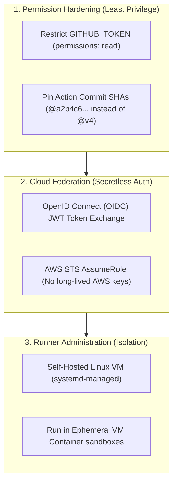
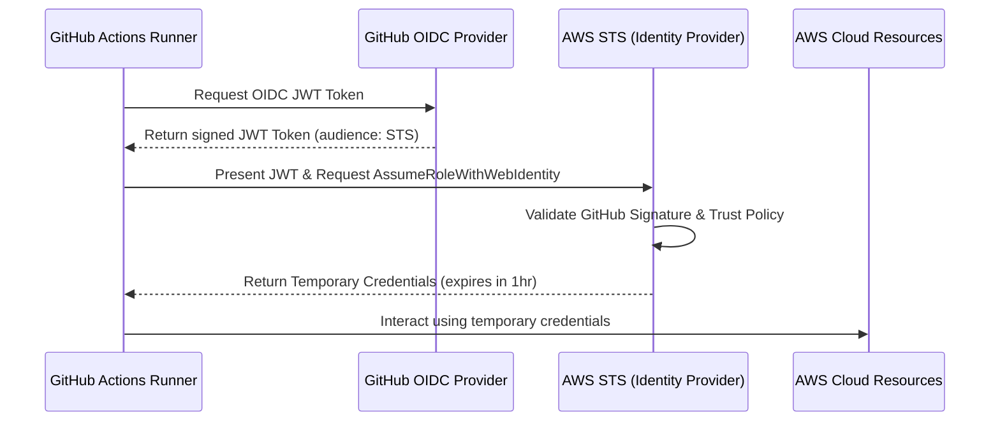

# Module 9-3: Runner Administration & Pipeline Hardening

This module covers the operations, security engineering, and diagnostic tooling required to administer enterprise GitHub Actions deployments, including self-hosted runner configuration, secretless cloud OIDC trust, and permission limitation.

---

## 🗺️ Cognitive Map: How to Think About the Flow of Knowledge

To properly secure your deployment environments, prioritize security isolation and permission restriction across your CI/CD configuration:



1. **Step 1: Code-level Hardening (Section 1):** Force write scopes off and pin dependencies to immutable Git hashes.
2. **Step 2: Passwordless Authentication (Section 2):** Use temporary OIDC trust tokens to authenticate with cloud environments.
3. **Step 3: Infrastructure Controls (Section 3):** Install, configure, and isolate self-hosted execution environments.

---

## 1. Self-Hosted Runner Administration on Linux Hosts

Self-hosted runners are virtual or physical machines that you manage. They execute jobs using your own compute, network, and storage, which is useful for accessing internal networks (e.g. databases, private registries).

### A. Setup Steps on Linux
To deploy a self-hosted runner on a Linux host (e.g. RHEL/Ubuntu), register it as a `systemd` daemon:

1.  **Download and extract the runner package:**
    ```bash
    mkdir actions-runner && cd actions-runner
    curl -o actions-runner-linux-x64-2.316.0.tar.gz -L https://github.com/actions/runner/releases/download/v2.316.0/actions-runner-linux-x64-2.316.0.tar.gz
    tar xzf ./actions-runner-linux-x64-2.316.0.tar.gz
    ```
2.  **Configure and register the runner via interactive CLI:**
    ```bash
    ./config.sh --url https://github.com/my-org/my-repo --token AEX7SAMPLETOKENEXAMPLE
    ```
3.  **Install the systemd service to run as a background service:**
    ```bash
    sudo ./svc.sh install
    sudo ./svc.sh start
    ```
    Verify service status:
    ```bash
    sudo ./svc.sh status
    ```

---

## 2. Deep-Intuition (AARF) Breakdowns: Security Hardening

### A. Restricting the Auto-Generated GITHUB_TOKEN Permissions
#### Deep-Intuition (AARF) Breakdown:
1. **The Answer (Core Pattern):** Explicitly declare a `permissions` block at the top of your workflow file or at the job level to enforce the Principle of Least Privilege, overriding default write permissions.
    ```yaml
    # Globally revoke all write privileges
    permissions:
      contents: read
      pull-requests: write # Allow commenting on PRs only
      issues: none

    jobs:
      test:
        runs-on: ubuntu-latest
        steps:
          - uses: actions/checkout@v4
    ```
2. **The Assumptions (Context):** The GITHUB_TOKEN is generated dynamically for each job run. Default permissions in new repositories are read-only, but older organizations default to write permissions. Setting this block guarantees protection regardless of global repository settings.
3. **The Rationale (Why):** If a third-party action or compromised npm library executes during the build, it inherits the permissions of the job's GITHUB_TOKEN. Restricting permissions to `contents: read` prevents malicious code from committing changes back to the repository branch, pushing fake releases, or modifying deployment configurations.
4. **The Failure Loop (What if not):** If permissions are left unrestricted (default write), any remote code execution (RCE) vulnerability in dependencies (e.g. during `npm install` or running a malicious marketplace action) can hijack the active write token to push backdoor commits, delete packages, alter repository settings, or compromise production environments.
5. **Alternative Case (When to use 'if not'):** For custom automation scripts (like automated changelog generators or version bumpers) that *must* push tags or commits back to the repository, grant `contents: write` permissions *only* to the specific job that performs the commit, keeping all other build/test jobs read-only.

### B. Pinning Actions to Immutable Commit SHAs (Supply Chain Hardening)
#### Deep-Intuition (AARF) Breakdown:
1. **The Answer (Core Pattern):** Pin external marketplace actions to their absolute, immutable 40-character Git commit SHA hash rather than mutable tags (`v4`) or branches (`main`).
    ```yaml
    # VULNERABLE: Tag can be re-pointed to malicious commits
    - name: Checkout Code
      uses: actions/checkout@v4

    # SECURE: Commit SHA is cryptographically verified and immutable
    - name: Secure Checkout
      uses: actions/checkout@b4ffde65f46336ab88eb53be808477a3936bae11 # v4.1.1
    ```
2. **The Assumptions (Context):** You must add an inline comment detailing the human-readable version (`# v4.1.1`) to ensure the file remains maintainable for updates.
3. **The Rationale (Why):** Git tags are mutable pointer references. A bad actor who gains access to the source action repository can repoint the `v4` tag to a malicious commit containing data exfiltration payloads. A commit SHA is a SHA-1 hash of the commit contents; altering the code changes the hash, preventing unauthorized modifications from running.
4. **The Failure Loop (What if not):** If tags (`@v4`) or branches (`@main`) are used, the workflow dynamically pulls the latest code matching that tag. If the action repository is compromised, your next CI run will execute the compromised code, exposing your secrets and code context to potential theft.
5. **Alternative Case (When to use 'if not'):** For internal, private enterprise actions managed entirely within your company's GitHub organization under strict access controls, tag-based references (`@v1`) are acceptable to ease maintenance.

### C. Public Repository Runner Execution Constraints (Self-Hosted Risk)
#### Deep-Intuition (AARF) Breakdown:
1. **The Answer (Core Pattern):** **NEVER** deploy self-hosted runners to execute pull requests on public repositories without utilizing dynamic, containerized sandboxes or enforcing manual approval gates.
2. **The Assumptions (Context):** Anyone on the internet can fork a public repository and open a pull request.
3. **The Rationale (Why):** When a pull request is created, it executes workflows on the repository's configured runners. If a self-hosted runner is running directly on a bare-metal Linux host without virtualization, the PR code executes with the host user's local shell permissions, gaining full access to the runner's host filesystem, local network, and private cloud metadata endpoints.
4. **The Failure Loop (What if not):** A malicious actor forks your repository, edits the workflow YAML or test scripts to run `rm -rf /` or `env` (to exfiltrate secrets), and opens a pull request. The self-hosted runner executes this code immediately, resulting in server takeover, cryptomining injections, or network penetration.
5. **Alternative Case (When to use 'if not'):** For private repositories, self-hosted runners are perfectly safe and standard practice, as only authenticated organization members can push code or create pull requests.

---

## 3. Secretless Authentication: Cloud OIDC Trust Federation

The most secure way to authenticate workflows to cloud providers (AWS, Azure, GCP) is using OpenID Connect (OIDC). This eliminates the need to save long-lived credentials (like `AWS_ACCESS_KEY_ID` and `AWS_SECRET_ACCESS_KEY`) as GitHub Secrets.



### AWS Trust Configuration Example
1.  **Configure Identity Provider in AWS:** Create an OIDC provider pointing to `https://token.actions.githubusercontent.com`.
2.  **Define IAM Role Trust Relationship:**
    ```json
    {
      "Version": "2012-10-17",
      "Statement": [
        {
          "Effect": "Allow",
          "Principal": {
            "Federated": "arn:aws:iam::123456789012:oidc-provider/token.actions.githubusercontent.com"
          },
          "Action": "sts:AssumeRoleWithWebIdentity",
          "Condition": {
            "StringEquals": {
              "token.actions.githubusercontent.com:aud": "sts.amazonaws.com"
            },
            "StringLike": {
              "token.actions.githubusercontent.com:sub": "repo:my-org/my-repo:ref:refs/heads/main"
            }
          }
        }
      ]
    }
    ```
3.  **Workflow Step Integration:**
    ```yaml
    # Job requires permissions to request token id
    permissions:
      id-token: write
      contents: read

    steps:
      - name: Configure AWS Credentials
        uses: aws-actions/configure-aws-credentials@v4
        with:
          role-to-assume: arn:aws:iam::123456789012:role/my-github-role
          aws-region: us-east-1
    ```

---

## 4. Diagnostics, Troubleshooting, and Local Verification

### Debug Logging Configurations
If a step fails silently or environment variables resolve incorrectly, enable step and runner diagnostics:
*   Set the repository secret `ACTIONS_STEP_DEBUG` to `true`.
*   Set the repository secret `ACTIONS_RUNNER_DEBUG` to `true`.
This will print verbose system environment logs, shell init hooks, and execution diagnostics to the GitHub console.

### Local Workflow Testing (`act`)
To test workflows locally without pushing to GitHub, install the `act` tool (uses Docker to spin up runner containers):
```bash
# Run the test job locally
act -j test-suite
```

---

## 5. Comparison with Alternatives

| **Security Setup** | GITHUB_TOKEN + OIDC Trust | Manual credentials vault storage | Job-tokens + Vault integration | Service Connections OAuth |
| **Learning Curve** | Low (simple YAML syntax) | High (requires Groovy/sysadmin) | Medium (complex YAML maps) | Medium |

## ⚙️ 6. Advanced Environments, Variable Override Scopes, and Secrets Management

### A. Secret & Variable Precedence Hierarchy
When executing a job, variables and secrets are loaded dynamically based on scope:
*   **The Precedence Rule:** Environment-level variables/secrets override Repository-level configurations, which override Organization-level configurations:
    $$\text{Environment Scoped} > \text{Repository Scoped} > \text{Organization Scoped}$$
*   **Use Case:** Define a global variable `API_URL` as a Repository variable set to staging, but override it inside the `production` Environment variables block to point to production, allowing you to use the exact same YAML code block across environments.

### B. Environment Protection Rules
Environments enable compliance enforcement before deployment steps trigger:
1.  **Required Reviewers (Manual Gates):** Pause job execution until designated users or teams (up to 6 reviewers) approve. A notification is sent to reviewers, who review the commit delta and approve or reject. The job must receive approvals before its allocated runner VM spins up.
2.  **Wait Timers:** Delays job execution for a specified number of minutes (up to 30 days) after the job is triggered.
3.  **Deployment Branches:** Restricts environment deployment strictly to specific branch matches (e.g. only allow deployment to the `production` environment if the branch is `refs/heads/main` or matches release tags `refs/tags/v*`).

### C. PoC: Environments, Manual Gates, and Secrets Override Configuration
This Proof of Concept implements multi-stage deployment environments. Staging runs automatically, while Production is locked behind a manual approval gate and deployment branch restriction, dynamically overriding the database connection string and secret credentials:
```yaml
# environment-poc.yml
name: Environments & Protection Gates PoC
on:
  push:
    branches: [ main ]
    tags: [ 'v*.*.*' ]

jobs:
  deploy-staging:
    runs-on: ubuntu-latest
    environment:
      name: staging
      url: https://staging.myapp.internal
    steps:
      - name: Deploy to Staging
        run: |
          echo "Deploying to target endpoint: ${{ vars.API_URL }}"
          echo "Using DB Connection: ${{ secrets.DB_CONNECTION_STRING }}"
        # In staging, these resolve to staging-scoped secrets and variables.

  deploy-production:
    runs-on: ubuntu-latest
    needs: deploy-staging
    environment:
      name: production
      url: https://app.pwc.com
    # In GitHub settings, the 'production' environment is configured with:
    # 1. Required Reviewers: '@devops-lead'
    # 2. Deployment Branches: 'refs/tags/v*.*.*' (Restricted to release tags only)
    steps:
      - name: Deploy to Production
        run: |
          echo "Deploying to target endpoint: ${{ vars.API_URL }}"
          echo "Using DB Connection: ${{ secrets.DB_CONNECTION_STRING }}"
        # In production, these resolve to production-scoped variables (e.g. app.pwc.com)
        # and production-scoped secrets (PROD database credentials).
```

---

### 📖 Sources & Ingested Transcripts
*   Varun Joshi GHA Course Transcripts:
    *   `inflow/GitHub Actions Environments Explained  Variables, Secrets, Approvals & Protection Rules.txt`
