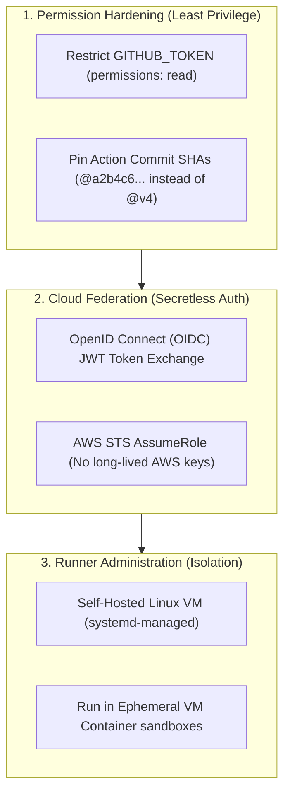
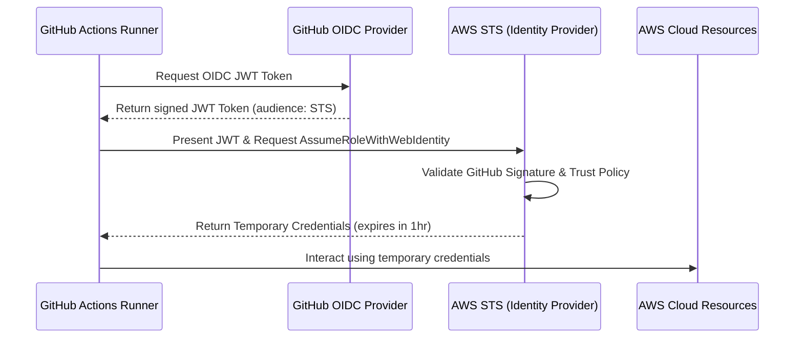

# Module 9-3: Runner Administration & Pipeline Hardening

This module covers the operations, security engineering, and diagnostic tooling required to administer enterprise GitHub Actions deployments, including self-hosted runner configuration, secretless cloud OIDC trust, and permission limitation.

---

## 🗺️ Cognitive Map: How to Think About the Flow of Knowledge

To properly secure your deployment environments, prioritize security isolation and permission restriction across your CI/CD configuration:



1. **Step 1: Code-level Hardening (Section 1):** Force write scopes off and pin dependencies to immutable Git hashes.
2. **Step 2: Passwordless Authentication (Section 2):** Use temporary OIDC trust tokens to authenticate with cloud environments.
3. **Step 3: Infrastructure Controls (Section 3):** Install, configure, and isolate self-hosted execution environments.

---

## 1. Self-Hosted Runner Administration on Linux Hosts

Self-hosted runners allow you to run jobs on your own compute infrastructure. This is useful for accessing internal networks, using custom hardware (e.g., GPUs), or configuring custom software runtimes.

### A. Setup Steps on Linux
To deploy a self-hosted runner on a Linux host (e.g., RHEL/Ubuntu), register it as a `systemd` daemon:

1.  **Download and extract the runner package:**
    ```bash
    mkdir actions-runner && cd actions-runner
    curl -o actions-runner-linux-x64-2.316.0.tar.gz -L https://github.com/actions/runner/releases/download/v2.316.0/actions-runner-linux-x64-2.316.0.tar.gz
    tar xzf ./actions-runner-linux-x64-2.316.0.tar.gz
    ```
2.  **Configure and register the runner via interactive CLI:**
    Generate the registration token from your repository or organization settings under Actions -> Runners.
    ```bash
    ./config.sh --url https://github.com/my-org/my-repo --token AEX7SAMPLETOKENEXAMPLE
    ```
3.  **Install the systemd service to run as a background service:**
    ```bash
    sudo ./svc.sh install
    sudo ./svc.sh start
    ```
    Verify service status:
    ```bash
    sudo ./svc.sh status
    ```

### B. Runner Networking Model
Self-hosted runners use a **pull-based connection model** to communicate with GitHub. The runner daemon initiates outbound HTTPS connections over TCP port 443 (utilizing WebSockets for real-time streaming) to long-poll GitHub's backend API for queued jobs.
*   **No Inbound Ports:** Because all connections are outbound, you do not need to open inbound firewall ports (like SSH or HTTP) or configure public IP addresses for the runner machines.
*   **Outbound Firewall Requirements:** The runner must be allowed outbound access to `github.com` and its subdomain endpoints (e.g., `*.actions.githubusercontent.com`, `*.githubassets.com`).

### C. Security Risks on Public Repositories
> [!WARNING]
> Do **NOT** deploy self-hosted runners to execute workflows from public repositories without strict security controls.
*   **The Threat:** Anyone on the internet can fork a public repository and open a pull request. When they submit a PR, it triggers a workflow run. If your self-hosted runner executes this code directly on the host machine, the PR author can run arbitrary shell commands to access the host filesystem, intercept AWS IAM metadata credentials, or scan your internal network.
*   **Mitigation Strategies:**
    1.  **Manual Approval Gate:** Configure repository settings to require approval from repository maintainers before running workflows for pull requests from outside contributors.
    2.  **Isolated Sandboxing:** Deploy runners inside ephemeral virtual machine containers (e.g., using Kubernetes or Docker) that are immediately destroyed after each job run.
    3.  **Runner Groups:** Scope self-hosted runners to specific private repositories, keeping them inaccessible to public repositories.

---

## 2. Security Hardening Best Practices

### A. Restricting the Auto-Generated GITHUB_TOKEN Permissions
#### Deep-Intuition (AARF) Breakdown:
1. **The Answer (Core Pattern):** Explicitly declare a `permissions` block at the top of your workflow file or at the job level to enforce the Principle of Least Privilege, overriding default write permissions.
    ```yaml
    # Globally revoke all write privileges
    permissions:
      contents: read
      pull-requests: write # Allow commenting on PRs only
      issues: none

    jobs:
      test:
        runs-on: ubuntu-latest
        steps:
          - uses: actions/checkout@v4
    ```
2. **The Assumptions (Context):** The GITHUB_TOKEN is generated dynamically for each job run. Default permissions in new repositories are read-only, but older organizations default to write permissions. Setting this block guarantees protection regardless of global repository settings.
3. **The Rationale (Why):** If a third-party action or compromised npm library executes during the build, it inherits the permissions of the job's GITHUB_TOKEN. Restricting permissions to `contents: read` prevents malicious code from committing changes back to the repository branch, pushing fake releases, or modifying deployment configurations.
4. **The Failure Loop (What if not):** If permissions are left unrestricted (default write), any remote code execution (RCE) vulnerability in dependencies (e.g., during `npm install` or running a malicious marketplace action) can hijack the active write token to push backdoor commits, delete packages, alter repository settings, or compromise production environments.
5. **Alternative Case (When to use 'if not'):** For custom automation scripts (like automated changelog generators or version bumpers) that *must* push tags or commits back to the repository, grant `contents: write` permissions *only* to the specific job that performs the commit, keeping all other build/test jobs read-only.

### B. Pinning Actions to Immutable Commit SHAs
#### Deep-Intuition (AARF) Breakdown:
1. **The Answer (Core Pattern):** Pin external marketplace actions to their absolute, immutable 40-character Git commit SHA hash rather than mutable tags (`v4`) or branches (`main`).
    ```yaml
    # VULNERABLE: Tag can be re-pointed to malicious commits
    - name: Checkout Code
      uses: actions/checkout@v4

    # SECURE: Commit SHA is cryptographically verified and immutable
    - name: Secure Checkout
      uses: actions/checkout@b4ffde65f46336ab88eb53be808477a3936bae11 # v4.1.1
    ```
2. **The Assumptions (Context):** You must add an inline comment detailing the human-readable version (`# v4.1.1`) to ensure the file remains maintainable for updates.
3. **The Rationale (Why):** Git tags are mutable pointer references. A bad actor who gains access to the source action repository can repoint the `v4` tag to a malicious commit containing data exfiltration payloads. A commit SHA is a SHA-1 hash of the commit contents; altering the code changes the hash, preventing unauthorized modifications from running.
4. **The Failure Loop (What if not):** If tags (`@v4`) or branches (`@main`) are used, the workflow dynamically pulls the latest code matching that tag. If the action repository is compromised, your next CI run will execute the compromised code, exposing your secrets and code context to potential theft.
5. **Alternative Case (When to use 'if not'):** For internal, private enterprise actions managed entirely within your company's GitHub organization under strict access controls, tag-based references (`@v1`) are acceptable to ease maintenance.

### C. Log Masking of Secrets & Limitations
GitHub Actions monitors the console output and replaces any text matching configured secrets with `***`. However, this mechanism has limitations:
*   **Minimum Length:** GitHub does not mask secrets shorter than 4 characters to avoid excessive false positives.
*   **Encoding Bypasses:** If a secret is Base64 encoded, printed as hexadecimal, or split into multiple lines, the masking engine will not recognize it, allowing it to leak in the raw log output.
*   **Command Injection:** A compromised script can print a secret character-by-character or write it to a build artifact to bypass log masking.

---

## 3. Secretless Authentication: Cloud OIDC Trust Federation

OpenID Connect (OIDC) allows workflows to authenticate with cloud providers (like AWS, Azure, and GCP) using temporary, short-lived security tokens instead of long-lived secrets (e.g., `AWS_ACCESS_KEY_ID`).



### A. The OIDC JWT Token Architecture
1.  When a job requests cloud access, the runner contacts the GitHub OIDC provider to receive a JSON Web Token (JWT).
2.  The JWT is cryptographically signed by GitHub's private keys and contains metadata claims about the workflow execution:
    *   `iss` (Issuer): `https://token.actions.githubusercontent.com`
    *   `aud` (Audience): The target cloud service provider (e.g., `sts.amazonaws.com`).
    *   `sub` (Subject): The repository identifier (e.g., `repo:org-name/repo-name:ref:refs/heads/main`).
    *   `job_workflow_ref`: The path to the workflow file that triggered the run.
3.  The runner presents this JWT to the cloud provider's Security Token Service (STS).
4.  STS validates GitHub's signature against its public keys, evaluates the IAM Role trust policy, and issues short-lived API credentials (valid for up to 1 hour).

### B. AWS Trust Policy Configuration
Below is an example IAM Role trust policy restricting access to a specific repository on the `main` branch:
```json
{
  "Version": "2012-10-17",
  "Statement": [
    {
      "Effect": "Allow",
      "Principal": {
        "Federated": "arn:aws:iam::123456789012:oidc-provider/token.actions.githubusercontent.com"
      },
      "Action": "sts:AssumeRoleWithWebIdentity",
      "Condition": {
        "StringEquals": {
          "token.actions.githubusercontent.com:aud": "sts.amazonaws.com"
        },
        "StringLike": {
          "token.actions.githubusercontent.com:sub": "repo:my-org/my-repo:ref:refs/heads/main"
        }
      }
    }
  ]
}
```

---

## 4. Environments & Secrets Precedence

GitHub Actions manages configuration scopes through Secrets, Variables, and Scoped Environments.

### A. Precedence Hierarchy
When a workflow references a secret or variable, values are resolved based on the following hierarchy (most specific overrides least specific):
$$\text{Environment Scoped} > \text{Repository Scoped} > \text{Organization Scoped}$$

*   **Repository variables** are global to all branches and jobs in the repository (e.g., `vars.API_URL = "https://staging.myapp.com"`).
*   **Environment variables** are scoped to specific target environments (e.g., `production`). When a job declares an `environment: production` block, any variable or secret defined in the `production` environment overrides the repository-level value of the same name.

### B. Environment Protection Rules
Environments can be protected by compliance policies:
1.  **Required Reviewers (Manual Gates):** Pauses workflow execution before running a job. Up to 6 designated users or teams must approve the run.
2.  **Wait Timers:** Delays job execution for a specified number of minutes after triggering (up to 30 days).
3.  **Deployment Branches:** Restricts environment access to specific branches (e.g., only allowing deployments to the `production` environment from the `main` branch or specific release tags).

---

## 5. Diagnostics, Troubleshooting, and Local Verification

### A. Enabling Debug Logging
To debug failing workflows, you can enable verbose diagnostic logs by setting the following secrets in the repository:
*   `ACTIONS_STEP_DEBUG` = `true`: Logs verbose output for each step execution.
*   `ACTIONS_RUNNER_DEBUG` = `true`: Logs VM state changes, runner daemon actions, and connection details.

### B. Local Execution via `act`
You can test workflows locally without pushing to GitHub using the open-source CLI tool `act`. `act` parses your `.github/workflows/` files and executes the steps inside local Docker containers.
*   **Basic Command:**
    ```bash
    act -j build-and-test
    ```
*   **Simulating Manual Input:**
    ```bash
    act --input target_env=staging
    ```
*   **Limitations of `act`:**
    *   Does not support OIDC tokens; cloud authentication must rely on mock secrets.
    *   Runner environment variables and contexts may not align exactly with GitHub-hosted runners.
    *   Certain third-party actions that require access to the GitHub API may fail without a personal access token (`GITHUB_TOKEN`).

---

## 6. Annotated Production-Grade YAML PoC Blocks

### PoC 1: Secure OIDC AWS Deployment Workflow
This workflow uses OpenID Connect for passwordless AWS authentication and applies strict GITHUB_TOKEN permissions.

```yaml
# .github/workflows/secure-oidc-deploy.yml
name: Secure Cloud Deployment

on:
  push:
    branches: [ main ]

# Revoke all write permissions globally except for id-token (required for OIDC)
permissions:
  contents: read
  id-token: write

jobs:
  deploy-to-aws:
    name: OIDC Cloud Deploy
    runs-on: ubuntu-latest
    
    steps:
      # Step 1: Securely checkout the repository code
      - name: Checkout Code
        uses: actions/checkout@b4ffde65f46336ab88eb53be808477a3936bae11 # v4.1.1

      # Step 2: Authenticate with AWS via OIDC
      - name: Configure AWS Credentials
        uses: aws-actions/configure-aws-credentials@e3dd8a4bbb18e916f90f53c735c05b128218fed7 # v4.0.2
        with:
          role-to-assume: arn:aws:iam::123456789012:role/github-actions-deploy-role
          aws-region: us-east-1
          audience: sts.amazonaws.com

      # Step 3: Verify AWS credentials and upload to S3
      - name: Sync Static Assets
        run: |
          aws sts get-caller-identity
          aws s3 sync ./dist/ s3://my-production-bucket/
```

### PoC 2: Multi-Stage Environments with Manual Approvals and Secret Overrides
This workflow runs automated staging deployments and gates production deployments behind a manual reviewer check, utilizing environment-specific database connection secrets.

```yaml
# .github/workflows/multi-stage-deployment.yml
name: Controlled Environment Promotion

on:
  push:
    branches: [ main ]
    tags: [ 'v*.*.*' ]

jobs:
  deploy-staging:
    name: Deploy Staging Application
    runs-on: ubuntu-latest
    environment:
      name: staging
      url: https://staging.myapp.internal
    steps:
      - name: Deploy Staging
        run: |
          echo "Deploying to Staging endpoint..."
          echo "Connection String: $DB_CONN"
        env:
          # Resolves to the staging environment secret
          DB_CONN: ${{ secrets.DB_CONNECTION_STRING }}

  deploy-production:
    name: Deploy Production Application
    runs-on: ubuntu-latest
    needs: deploy-staging
    environment:
      name: production
      url: https://app.pwc.com
    # In GitHub settings, the 'production' environment is configured with:
    # 1. Required Reviewers: '@devops-lead'
    # 2. Deployment Branches: Restricted to 'refs/tags/v*.*.*' (release tags only)
    steps:
      - name: Deploy Production
        run: |
          echo "Deploying to Production endpoint..."
          echo "Connection String: $DB_CONN"
        env:
          # Resolves to the production environment secret
          DB_CONN: ${{ secrets.DB_CONNECTION_STRING }}
```

---

## 📖 Sources & Ingested Transcripts
*   `inflow/GitHub Actions Environments Explained  Variables, Secrets, Approvals & Protection Rules.txt`
*   `inflow/GitHub Actions Triggers & Runners Explained  Events, Contexts & Hosted Runners.txt`
*   `inflow/GithubAction-Elfakharny.md`
