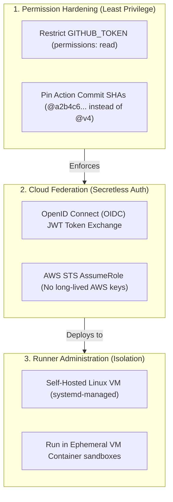
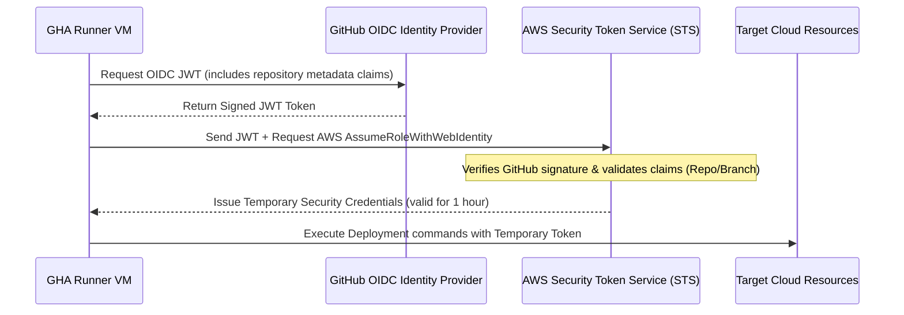

---
domains:
  - "github-actions"
class: reference-note
tier: reference-note
tags:
  - github-actions/security
  - github-actions/runners
  - github-actions/environments
---

# Module 9-3: Runner Administration & Pipeline Hardening

This module covers the operations, security engineering, and diagnostic tooling required to administer enterprise GitHub Actions deployments, including self-hosted runner configuration, secretless cloud OIDC trust, and permission limitation.

---

## 🗺️ Cognitive Map: How to Think About the Flow of Knowledge

To properly secure your deployment environments, prioritize security isolation and permission restriction across your CI/CD configuration:



1. **Step 1: GITHUB_TOKEN Scope (Section 2):** Restrict default scopes to `contents: read` and explicitly request token claims for specific jobs.
2. **Step 2: Federated Trust (Section 2):** Use OpenID Connect (OIDC) to exchange short-lived tokens with cloud providers, eliminating static long-lived credentials.
3. **Step 3: Runner Infrastructure (Section 3):** Isolate self-hosted runners using ephemeral virtualization layers and restrict access when executing forks.

---

## 1. Environments & Deployment Governance

Mature enterprise CI/CD pipelines follow the **"Build Once, Deploy Many"** principle, promoting a single immutable application artifact through a series of gated environments.

### A. The "Build Once, Deploy Many" Principle
Instead of recompiling binaries or rebuilding Docker images for each target environment, a build job compile-packages the application code once, uploads the artifact, and successive deployment jobs download and deploy that identical artifact. This prevents configuration drift and ensures the exact code tested in development is promoted to production.

```text
Compile Code & Build Docker Image -> Upload Image/Artifact
                                      |
                                      +--> Deploy Staging (Downloads same image)
                                      |
                                      +--> Deploy Production (Downloads same image after approval)
```

### B. Environment Protection Rules
GitHub Actions Environments provide dedicated logical namespaces with independent configuration parameters:
1.  **Required Reviewers:** Pause jobs targeting the environment until designated users or teams approve the deployment.
2.  **Wait Timers:** Delay job execution for a specific period after the job is triggered.
3.  **Deployment Branch Restrictions:** Prevent unauthorized branches from deploying (e.g., restrict Production deployments to the `main` branch only).
4.  **Environment Variables vs. Secrets:** Map environment-specific config keys (e.g., `API_ENDPOINT`) and secrets (e.g., `DATABASE_PASSWORD`) directly to the environment. GHA dynamically resolves these values at runtime based on the job's `environment:` declaration.

### C. Preventing Deployment Race Conditions via Concurrency Groups
Because GitHub Actions scales out so aggressively in parallel, multiple developers pushing to the same branch or different branches simultaneously can trigger concurrent deployments. Having two VMs executing deployment steps or database migrations on the exact same server/infrastructure at the same time causes **race conditions**, environment corruption, or broken deployments.

To prevent this, GHA provides the `concurrency` configuration block. It groups runs and forces GHA to either cancel running jobs or queue new ones.

#### Syntax & Strategy
```yaml
concurrency:
  group: ${{ github.workflow }}-${{ github.ref }}
  cancel-in-progress: true
```
*   **`group`**: The identifier used to partition runs. If two runs resolve to the exact same group key, they are evaluated together.
    *   *Example 1 (Per branch/workflow):* `group: ${{ github.workflow }}-${{ github.ref }}` limits concurrency per branch.
    *   *Example 2 (Per environment):* `group: deploy-${{ github.environment }}` prevents concurrent deployments to the same environment regardless of branch.
*   **`cancel-in-progress`**:
    *   **`true`**: If a new run is triggered, the older, currently executing run is automatically **cancelled** (terminated), and only the newest code changes are deployed. This is optimal for CI testing/validation runs.
    *   **`false` (or omitted)**: GHA does *not* cancel the older run. Instead, it pauses the newly triggered run and places it in a **"Pending"** state. It queues the run and executes it sequentially once the active one finishes. This is critical for database migrations, stateful deployments, and production rollouts where terminating middle executions or running them in parallel can corrupt the environment.

---

## 2. Security Engineering & Pipeline Hardening

Pipeline hardening focuses on mitigating supply chain vulnerabilities, restricting execution scopes, and removing static credential leakage vectors.

### A. Secretless Cloud Authentication via OpenID Connect (OIDC)
Traditional cloud deployments require storing long-lived access keys (e.g., `AWS_ACCESS_KEY_ID` and `AWS_SECRET_ACCESS_KEY`) as GitHub Secrets. This introduces risk of credential leakage, management overhead for key rotation, and elevated exposure in the event of an organization compromise.

#### OIDC JWT Exchange Flow
OIDC eliminates static secrets by using short-lived federated trust:



#### Why OIDC is Preferred:
*   **Zero Static Credentials:** No access keys are stored in GitHub.
*   **Automatic Rotation:** Credentials expire automatically within an hour.
*   **Granular Trust Policies:** Cloud providers authorize access based on metadata claims (e.g., allow role assumption only from repository `my-org/my-repo` running on the `main` branch).

### B. GITHUB_TOKEN Least Privilege Hardening
Every job run receives a dynamic installation token (`GITHUB_TOKEN`) with a default set of permissions (read-write or read-only depending on org configurations). To prevent privilege escalation attacks:
1.  Set the default repository token permissions to **Read-only**.
2.  Explicitly define the required permissions block at the top of the workflow or for individual jobs:

```yaml
permissions:
  contents: read      # Required to check out code
  id-token: write     # Required to request OIDC JWT
  packages: write     # Required to push to GitHub Packages
```

### C. Supply Chain Security: SHA-1 Action Pinning
Upstream dependencies can be compromised if an attacker gains control of a public marketplace repository and updates a release tag (e.g., rewriting the `v4` tag on `actions/checkout` to include malicious code).
*   **Mitigation:** Pin actions using the 40-character hexadecimal Git commit SHA. This provides cryptographic immutability.

```yaml
# Vulnerable to tag modification
uses: actions/checkout@v4

# Secure against modifications
uses: actions/checkout@a5ac7e51b41094c92402da3b24376905380afc29 # Pin to v4.1.6 commit SHA
```

---

## 3. Self-Hosted Runner Administration & Isolation

For workloads requiring access to private networks, custom operating systems, or heavy compute resources, organizations host their own runners.

### A. Communication Topology
Self-Hosted Runners do not require inbound firewall access. Instead, the runner agent daemon establishes a secure, outbound-only HTTPS connection (port 443) using WebSockets (long-polling) to communicate with GitHub's control plane.

```text
[Self-Hosted Runner VM] ---> Outbound (443 WebSockets/HTTPS) ---> [GitHub API Gateway]
  (No Inbound Ports Open)
```

### B. Security Risks, Sandboxing & Persistent VM State (Dirty State)
Unlike GitHub-hosted runners which spin up fresh, ephemeral virtual machine instances for every single job, **standard self-hosted runners are persistent machines**. The runner agent executes jobs on the host OS directly, and the machine remains online between executions. This persistence introduces the **"Dirty State"** architectural challenge:

#### Persistent VM State (Dirty State) Analysis
*   **The Benefits:** Persistence allows native speed optimizations. Heavy cache files, Docker layers, package directories (e.g., `node_modules`), or local databases remain on the disk. Subsequent jobs do not need to download or rebuild these dependencies, often reducing build times by 50% or more.
*   **The Dangers:**
    *   **Environment Pollution:** If Job 1 writes temporary files, alters global system environment variables, installs custom binaries, or leaves orphaned processes running, Job 2 (which could be a completely different project) inherits this "dirty" host state. This can cause unpredictable test failures or build pollution.
    *   **Disk Exhaustion:** Over time, compiled artifacts, log files, and Docker cache layers accumulate, eventually filling up the runner's storage disk and causing subsequent runs to fail.
    *   **State Leakage:** Malicious code from a compromised pull request build can drop persistent backdoors, steal secrets, or read workspace files generated by preceding jobs.
    *   **Network Penetration:** A job executing on a private VM has direct access to the runner's network environment. It can perform port scans on the internal corporate subnet, query internal databases, or hit private cloud metadata endpoints.

#### Sandbox & Isolation Mitigations
To secure persistent self-hosted runners, organizations implement the following mitigation controls:
1.  **Containerized Execution (`container:`):** Execute job steps inside isolated Docker containers on the host VM. This keeps dependencies and files confined to the container namespace. When the job finishes, GHA automatically stops and cleans up the container (`docker rm`), preventing host contamination.
2.  **Meticulous Workspace Cleanup:** Add automated post-job steps to delete temporary workspace files, using local cleanup scripts or actions (e.g., running `rm -rf $GITHUB_WORKSPACE` or using git clean command blocks).
3.  **Ephemeral VM Autoscaling:** Instead of a single persistent server, use automated controller groups (like the Actions Runner Controller - ARC) to spin up short-lived, ephemeral runners on Kubernetes or cloud VM templates. Each runner agent processes exactly one job and is immediately terminated and rebuilt from a clean image.
4.  **Runner Group Partitioning:** Segregate runners into logical groups. Assign highly trusted repositories to group runners residing in secure subnets, and place public/untrusted repos in isolated sandboxed networks.
5.  **Untrusted Fork Restrictions:** Disable automatic execution of pull requests originating from forks unless approved by a repository administrator.

---

## 4. Platform Architectural Comparison: GHA vs. Jenkins

Comparing architectural topologies helps in migration planning and security modeling:

| **Architectural Vector** | **GitHub Actions (GHA)** | **Jenkins CI/CD** |
| :--- | :--- | :--- |
| **Orchestration Model** | SaaS-native cloud platform (managed by GitHub). Hybrid model with self-hosted runner support. | Host-managed master-agent model. Organization is responsible for all server operations. |
| **Configuration DSL** | Declarative YAML schema (`.github/workflows/*.yml`). | Groovy DSL (Declarative or Scripted Jenkinsfile). |
| **Plugin Architecture** | Isolated marketplace actions (reusable, composable). | Shared JVM plugins (often causing version conflicts and dependency hell). |
| **Compute Scaling** | Elastic ephemeral VMs (GitHub-hosted) or agent scaling groups (self-hosted). | Static agent VMs or Kubernetes dynamic pod executors. |
| **Secret Management** | Encrypted variables/secrets resolved at execution boundaries. | Credentials plugin (requires masters to decrypt credentials to disk). |
| **Security Isolation** | Ephemeral runner VM sandboxes (host wiped per run). | Shared workspace directories (unless explicitly cleaned); high risk of workspace pollution. |

---

## 5. Operations & Security Playbook Tutorials

### A. Gated Environment Deployment Workflow
This workflow uses environments to deploy an application to `Staging` and `Production` with manual approval rules and environment-specific variables:

```yaml
name: Gated Deployment Pipeline

on:
  push:
    branches:
      - main

jobs:
  build:
    runs-on: ubuntu-latest
    steps:
      - name: Checkout Code
        uses: actions/checkout@b4ffde65f46336ab88eb53be808477a3936bae11 # v4.1.1 SHA
        
      - name: Build Application Package
        run: |
          echo "Compiling application..."
          echo "v1.0.0" > build-artifact.txt

      - name: Upload Artifact
        uses: actions/upload-artifact@v4
        with:
          name: deployment-package
          path: build-artifact.txt

  deploy-staging:
    runs-on: ubuntu-latest
    needs: build
    environment:
      name: staging
      url: ${{ steps.deploy.outputs.endpoint }}
    steps:
      - name: Download Artifact
        uses: actions/download-artifact@v4
        with:
          name: deployment-package

      - name: Deploy to Staging Endpoint
        id: deploy
        run: |
          echo "Deploying to Staging..."
          echo "endpoint=https://staging.internal.myapp.com" >> GITHUB_OUTPUT

  deploy-production:
    runs-on: ubuntu-latest
    needs: deploy-staging
    environment:
      name: production
      url: ${{ steps.deploy.outputs.endpoint }}
    steps:
      - name: Download Artifact
        uses: actions/download-artifact@v4
        with:
          name: deployment-package

      - name: Deploy to Production
        id: deploy
        run: |
          echo "Deploying to Production..."
          echo "endpoint=https://production.myapp.com" >> GITHUB_OUTPUT
```

### B. Hardened AWS Deployment via OIDC
Demonstrates token permission restrictions and secretless OIDC integration:

```yaml
name: Hardened Cloud Deployment

on:
  push:
    branches:
      - main

# Restrict GITHUB_TOKEN to minimum permissions globally
permissions:
  contents: read

jobs:
  deploy-aws:
    runs-on: ubuntu-latest
    permissions:
      contents: read
      id-token: write # Required for requesting the OIDC JWT token
      
    steps:
      - name: Checkout Code
        uses: actions/checkout@b4ffde65f46336ab88eb53be808477a3936bae11 # v4.1.1
        
      - name: Configure AWS Credentials via OIDC
        uses: aws-actions/configure-aws-credentials@v4
        with:
          role-to-assume: arn:aws:iam::123456789012:role/github-actions-deployment-role
          aws-region: us-east-1
          audience: https://github.com/my-org
          
      - name: Verify AWS Connection
        run: |
          aws sts get-caller-identity
```

### C. Self-Hosted Runner Installation & systemd Service Script
Deploy a self-hosted runner on an Ubuntu VM using an automated systemd script:

```bash
#!/usr/bin/env bash
set -euo pipefail

# Configuration parameters
RUNNER_VERSION="2.316.0"
RUNNER_DIR="/opt/actions-runner"
GITHUB_URL="https://github.com/my-org/my-repo"
RUNNER_TOKEN="PLACEHOLDER_REGISTRATION_TOKEN" # Retrieve this dynamic token from GitHub API

echo "=== Creating Runner Directory ==="
sudo mkdir -p "${RUNNER_DIR}"
sudo chown -R $USER:$USER "${RUNNER_DIR}"
cd "${RUNNER_DIR}"

echo "=== Downloading Runner Package ==="
curl -o actions-runner-linux-x64-${RUNNER_VERSION}.tar.gz -L \
  "https://github.com/actions/runner/releases/download/v${RUNNER_VERSION}/actions-runner-linux-x64-${RUNNER_VERSION}.tar.gz"

tar xzf "./actions-runner-linux-x64-${RUNNER_VERSION}.tar.gz"

echo "=== Running Dependency Configuration ==="
sudo ./bin/installdependencies.sh

echo "=== Registering the Runner ==="
./config.sh \
  --url "${GITHUB_URL}" \
  --token "${RUNNER_TOKEN}" \
  --name "prod-k8s-runner-01" \
  --work "_work" \
  --unattended

echo "=== Installing systemd Service ==="
sudo ./svc.sh install

echo "=== Starting Runner Service ==="
sudo ./svc.sh start
sudo ./svc.sh status
```
