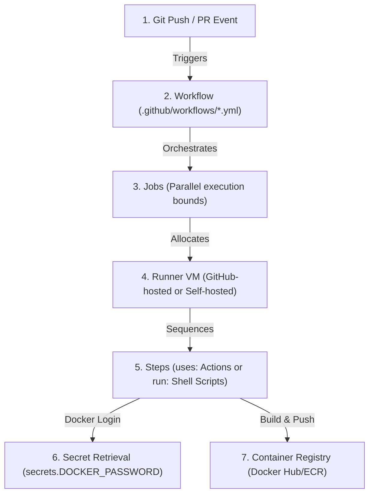
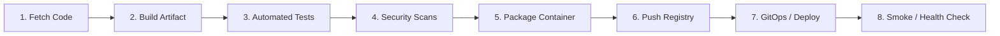

# Module 9-5: GitHub Actions Introduction & Production Workflows

**Breadcrumbs:** [[9-Index - GitHub Actions|🏠 GitHub Actions References Index]] > **GitHub Actions Introduction & Production Workflows**

This module covers the core principles of CI/CD, the native architectural model of GitHub Actions, the core constructs (workflows, jobs, steps, runners, and actions), and provides hands-on playbooks for building foundational pipelines and production-style containerized workflows with Docker Hub integration.

---

## 🗺️ Cognitive Map: How to Think About the Flow of Knowledge

To build a strong intuition for GitHub Actions pipelines, trace the path of code from repository push to container registry deployment:



1. **Continuous Integration (Section 1):** Code is pushed, triggering automated builds, unit/integration testing, and quality/security scanning.
2. **Core Constructs & Runner Allocation (Section 2):** GHA compiles the YAML workflow, spawning isolated VM runners for each job.
3. **Foundational Workflow (Section 3):** Run basic steps and commands inside clean hosted runners.
4. **Production-Style Workflows (Section 4):** Secure credentials via GitHub Secrets, perform Docker Hub logins, build and tag container images, and publish artifacts using marketplace actions.

---

## 1. Foundations of CI/CD & Pipeline Lifecycle

Modern software delivery relies on standardizing, automating, and operationalizing the lifecycle of code promotion:



### A. Continuous Integration (CI)
Continuous Integration focuses on the automated verification of individual code changes pushed to a version control system:
*   **Fetch Source Code:** Triggered on events (push, pull request), cloning the repository into the pipeline environment.
*   **Build the Application:** Compiling source files to executable bytecode/binaries (e.g., converting Java `.java` files to `.class` bytecode packaged inside `.jar` or `.war` files using **Maven**, **Gradle**, or **Ant**).
*   **Automated Testing:** Running unit tests (verifying isolated code logic) and integration tests (verifying service/module communication) using plugins such as **Maven Surefire** and **Maven Failsafe**.
*   **Static Security & Quality Scans:** Checking for code smells, coverage limits, and vulnerabilities using tools like **SonarQube**, **Trivy**, or **Snyk**. Quality gates are configured (e.g., minimum 80% coverage) to fail the build if criteria aren't met.
*   **Containerization & Packaging:** Packaging the application into a Docker container image, tagging the image, and pushing it to a registry (e.g., **Docker Hub**, **Amazon ECR**, or **GitHub Container Registry - GHCR**).
*   **Artifact Archiving:** Publishing software bills of materials (S-BOMs), build reports, or binaries to long-term storage (e.g., **JFrog Artifactory**, **Sonatype Nexus**, or **AWS CodeArtifact**).

### B. Continuous Delivery (CD) vs. Continuous Deployment (CDP)
*   **Continuous Delivery:** Ensures that the main codebase is always kept in a deployable state. Promoting the artifact to production requires a manual approval step (e.g., a release engineer gating the release).
*   **Continuous Deployment:** Automates the end-to-end pipeline. Any code changes passing the automated CI steps are automatically deployed straight to the production environment without manual intervention.
*   **GitOps Deployment:** Modern enterprise GitOps engines (e.g., **ArgoCD** or **Flux**) run agents inside the destination cluster (e.g., Kubernetes). These agents continuously compare the desired cluster state declared in Git with the actual cluster state, pulling down and applying changes automatically to prevent drift.
*   **Validation:** Post-deployment validation (smoke and health checks) automatically runs to verify basic functionality. If validation fails, automated rollback triggers.

---

## 2. GitHub Actions Architecture & Core Constructs

GitHub Actions serves as an **orchestration layer** that directs the timing and environment for invoking external tools.

### A. Core Terminologies
*   **Workflow:** A YAML configuration file stored inside `.github/workflows/` that represents the overall pipeline.
*   **Job:** A logical group of steps executed on the same runner VM. Jobs run in **parallel** by default, but can be configured sequentially using dependencies.
*   **Step:** An individual task within a job. Steps execute **sequentially** on the runner and can run shell scripts (`run`) or call reusable actions (`uses`).
*   **Action:** A reusable, packaged block of automation (e.g., checkout code, set up Node.js, log in to Docker Hub).
*   **Runner:** The execution machine hosting the job workspace.
    *   **Control Plane:** The brain managed by GitHub that processes the YAML workflow and schedules jobs.
    *   **Data Plane:** The execution environments (runners) that do the actual work.

### B. Runner Types: Hosted vs. Self-Hosted
*   **GitHub-Hosted Runners:** Clean, isolated virtual machines provisioned on Azure (e.g., in `East US` or `North Central US` regions) that are completely destroyed and wiped after the job completes. Standard OS environments include Ubuntu, Windows, and macOS.
*   **Self-Hosted Runners:** Physical servers, virtual machines, or container pods (e.g., scaled using the **Actions Runner Controller (ARC)** on Kubernetes) managed by the organization. They are persistent, support custom hardware/software requirements, can sit within private VPC networks, and help avoid GitHub hosted runner billing fees. However, they carry higher maintenance overhead (updating, security compliance, patching).

---

## 3. Hands-on Basic Configuration

Workflows are defined in the repository root at `.github/workflows/`. Below is a foundational GHA workflow demonstrating parallel job execution and sequential step scripting:

```yaml
# .github/workflows/basic-workflow.yml
name: Foundational Pipeline

# Define the triggers for the workflow
on:
  push:
    branches:
      - main

jobs:
  # Job 1 runs independently
  job-one:
    name: Core Build Job
    runs-on: ubuntu-latest
    steps:
      - name: Executing Step One
        run: echo "Hello from step one of job one"

      - name: Executing Step Two
        run: echo "Hello from step two of job one"

  # Job 2 runs in parallel with Job 1 by default
  job-two:
    name: Parallel Diagnostic Job
    runs-on: ubuntu-latest
    steps:
      - name: Executing Final Step
        run: echo "Hello from the final step of job two"
```

### Rationale & Key Behaviors:
*   **Indentation Integrity:** YAML uses spaces for indentation. Incorrect indentation will cause GHA parsing errors.
*   **Runs-on:** Specifies the VM environment. GHA provisions a distinct VM for `job-one` and a completely different VM for `job-two` in parallel.
*   **Run Commands:** The `run` keyword launches a shell script process inside the runner's shell environment.

---

## 4. Hands-on Production-Style Containerized Workflows

In production, pipelines must connect with external services securely using secrets and specialized actions. This blueprint demonstrates a Python Flask application pipeline that logs into Docker Hub, builds a Docker image, pushes it to the registry, and runs a smoke test.

### Step 1: Configure Repository Secrets
To prevent exposing credentials in code, save them as GitHub Secrets:
1. Navigate to your GitHub repository -> **Settings** -> **Secrets and variables** -> **Actions**.
2. Click **New repository secret** and add:
   *   `DOCKER_USERNAME`: Your Docker Hub username.
   *   `DOCKER_PASSWORD`: Your Docker Hub Personal Access Token (PAT).

### Step 2: Write the Production Workflow

```yaml
# .github/workflows/flask-ci.yml
name: Flask Production-Style CI

on:
  push:
    branches:
      - main

jobs:
  build-and-deploy:
    name: Build & Push Flask Application
    runs-on: ubuntu-latest

    steps:
      # Step 1: Check out the repository source code to the runner
      - name: Checkout Code
        uses: actions/checkout@v4

      # Step 2: Authenticate with Docker Hub using repository secrets
      - name: Login to Docker Hub
        uses: docker/login-action@v3
        with:
          username: ${{ secrets.DOCKER_USERNAME }}
          password: ${{ secrets.DOCKER_PASSWORD }}

      # Step 3: Build and push the container image
      - name: Build and Push Docker Image
        uses: docker/build-push-action@v5
        with:
          context: .
          push: true
          tags: ${{ secrets.DOCKER_USERNAME }}/flask-app:latest

      # Step 4: Validate deployment via local container spin-up and smoke test
      - name: Spin up Flask Container
        run: |
          docker run -d -p 5000:5000 --name webapp ${{ secrets.DOCKER_USERNAME }}/flask-app:latest
          sleep 5

      # Step 5: Execute Smoke Test
      - name: Execute Smoke Test
        run: |
          curl -f http://localhost:5000 || (docker logs webapp && exit 1)

      # Step 6: Cleanup Test Container
      - name: Cleanup Test Container
        if: always()
        run: |
          docker rm -f webapp
```

### Deep-Intuition (AARF) Breakdown: Secrets Security & Log Masking
1. **The Answer (Core Pattern):** GitHub automatically redacts any outputs matches variables defined under the `secrets` context, printing `***` in execution logs.
2. **The Assumptions (Context):** Secrets must be configured before pipeline execution. If a secret is deleted or mistyped, the GHA steps will fail with authentication errors.
3. **The Rationale (Why):** Plaintext credentials inside Git commits expose the infrastructure to compromise. Utilizing `${{ secrets.NAME }}` references them dynamically during VM runtime, while GHA's log parser filters out plaintext values in real-time.
4. **The Failure Loop (What if not):** Scripting `docker login -u myuser -p mypassword` prints credentials into the job logs. Any developer, auditor, or external collaborator with repository read access can view raw access tokens, compromising container registries and systems.
5. **Alternative Case (When to use 'if not'):** For cloud-hosted environments (like AWS ECR), instead of managing static passwords/secrets, use **OIDC (OpenID Connect)** to establish trust between GitHub and your cloud provider, eliminating the need to store long-lived credentials in GitHub.
6. **The Evolutionary Bridge:** Traditional CI pipelines relied on static Jenkins credentials binding or custom SSH key setups manually managed by administrators. Modern Git hosting providers bundle secure KMS engines directly into the repository control plane, allowing self-service secret enrollment with automatic injection and masking.

---

## 5. Summary & Best Practices
*   **Enforce clean installs:** Use `npm ci` or virtualenv clean setups inside runners instead of caching corrupted workspace configurations.
*   **Always use action versions:** Pin actions using tags or exact commit SHA hashes (e.g., `actions/checkout@v4` or `actions/checkout@b4ffde65f46336ab88eb53be808477a3936bae11`) to prevent upstream changes from breaking builds.
*   **Isolate jobs logically:** Keep unit tests, build operations, and deployments in separate jobs to allow parallel scale and clear failure boundaries.

---

### 📖 Sources & Ingested Transcripts
- Source 1: `inflow/What is GitHub Actions  Build Your First Workflow from Scratch.txt`
- Source 3: `inflow/Build Your First Production-Style Workflow with GitHub Actions.txt`
