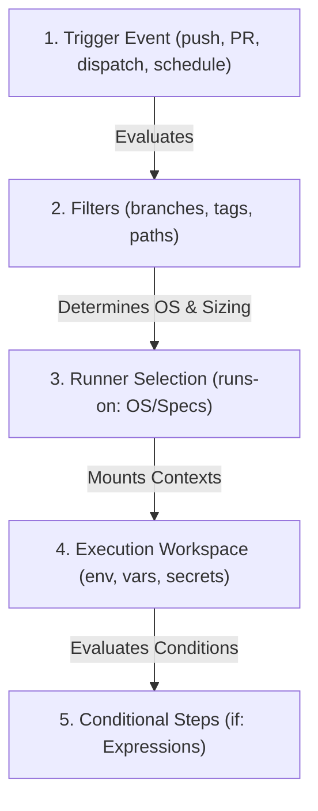

# Module 9-6: GitHub Actions Triggers, Runners & Workflow Logic

**Breadcrumbs:** [[9-Index - GitHub Actions|🏠 GitHub Actions References Index]] > **GitHub Actions Triggers, Runners & Workflow Logic**

This module covers the execution logic of GitHub Actions, tracing workflow trigger categories, standard vs. larger hosted runner sizing, built-in contexts, variables, and expression handling.

---

## 🗺️ Cognitive Map: How to Think About the Flow of Knowledge

To manage pipeline run cycles and target environment sizing, visualize the execution logic flowing from triggering filters to runner allocation:



1. **Trigger Configuration (Section 1):** Define repository events, manual dispatches, schedule patterns, or API webhooks.
2. **Runner Sizing & Allocation (Section 2):** Select standard or larger hosted instances based on memory requirements and network policies.
3. **Variables, Contexts & Expressions (Section 3):** Capture runtime metadata to dynamically modify step behavior.
4. **Conditional Execution (Section 4):** Control execution flows using branch, event, or status checking expressions.

---

## 1. Workflow Trigger Categories & Filtering

Workflows remain idle in the repository until a configured event matches.

### A. Core Trigger Categories
*   **Repository Events:** Actions triggered by Git events such as `push` or `pull_request`.
*   **Manual Triggers:** `workflow_dispatch` allows developers to trigger runs manually through the GitHub UI or GitHub CLI, passing custom input parameters.
*   **Scheduled Workflows:** `schedule` runs pipelines periodically using POSIX standard cron expressions.
*   **External Triggers:** `repository_dispatch` allows external systems (e.g., custom monitoring tools, Jira, or third-party webhooks) to trigger GHA workflows via GitHub REST APIs.
*   **Reusable Workflows:** `workflow_call` allows a workflow to be invoked by other workflows.

### B. Event Filtering (Glob Patterns)
By default, triggers run on every change to any file on any branch. You can filter triggers using `branches`, `tags`, or `paths` with glob patterns:
*   `*` matches zero or more characters (excluding `/`).
*   `**` matches zero or more characters recursively across directories.
*   `?` matches a single character.
*   `!` negates the pattern (e.g., exclude changes to `docs/**`).

---

## 2. Runner Selection & Sizing

Choosing the right runner ensures pipeline reliability, security, and cost efficiency.

### A. Standard Hosted vs. Larger Hosted Runners
*   **Standard Runners:** Provided by default for public and private repositories.
    *   **Ubuntu latest (private repo):** 2 vCPUs, 8 GB RAM, 14 GB SSD.
    *   **Ubuntu latest (public repo):** 4 vCPUs, 16 GB RAM, 14 GB SSD (higher configuration provided by GitHub to encourage open source projects).
    *   **Windows latest:** 2 vCPUs, 7 GB RAM, 256 GB SSD.
    *   **macOS latest:** 3 vCPUs, 14 GB RAM, 14 GB SSD.
*   **Larger Hosted Runners:** Up to 64 vCPUs and 256 GB RAM. They are paid instances available only to organization/enterprise accounts using Teams or Enterprise Cloud plans. They support static IP ranges and GPU acceleration.
*   **Sizing Failure Modes:** Standard runners running heavy compilation, SonarQube scans, or large container builds can encounter **Memory Exhaustion (OOM)**, **Disk Pressure**, or **Timeout Failures**.

### B. Runner Selection Strategies
*   Choose **GitHub-hosted standard runners** for typical lightweight testing and build flows.
*   Choose **self-hosted runners** for custom networking (e.g., deploying inside a private AWS VPC), heavy resource requirements, persistent caching, and strict data compliance.

---

## 3. Variables, Contexts, and Expressions

Data access in GitHub Actions is split into shell-level environment variables and orchestrator-level YAML contexts.

### A. Environment Variables
Environment variables exist at the runner OS level and are accessed using standard shell syntax (e.g., `$VAR_NAME` or `%VAR_NAME%`).
*   **Default Variables:** Pre-populated by GitHub during execution:
    *   `GITHUB_WORKSPACE`: The directory containing the cloned repository (where actions run).
    *   `GITHUB_REPOSITORY`: The owner and repository name (e.g., `octocat/Hello-World`).
    *   `GITHUB_REF`: The branch or tag ref that triggered the run (e.g., `refs/heads/main`).
    *   `GITHUB_SHA`: The commit hash that triggered the run.
    *   `GITHUB_EVENT_NAME`: The event name (e.g., `push`, `pull_request`).
*   **Custom Variables:** Defined in the workflow under `env` keys at the workflow, job, or step level.
*   *Rule of Thumb:* Use environment variables inside shell scripts and commands (`run` blocks).

### B. YAML Contexts
Contexts are structured JSON objects managed by the GHA orchestrator. They are accessed using expression interpolation syntax `${{ context.property }}`.
*   **Key Contexts:** `github` (event metadata), `env` (environment variables), `vars` (configuration variables), `secrets` (encrypted secrets), `job` (runner details), `steps` (step outputs), and `matrix` (current matrix properties).
*   *Rule of Thumb:* Use contexts for workflow logic, runner OS sizing properties, and conditional `if:` guards.

### C. Expressions
Expressions evaluate conditions dynamically:
*   Use standard operators like `==`, `!=`, `&&`, `||`, and `!`.
*   Example: `${{ github.event_name == 'push' && github.ref == 'refs/heads/main' }}`

---

## 4. Hands-on Workflow Logic Blueprint

Below is a production-style workflow file detailing advanced event triggers, branch/path filtering, manual inputs, cron schedules, environment variable cascading, and conditional step execution:

```yaml
# .github/workflows/workflow-logic-demo.yml
name: Pipeline Logic and Runner Sizing Demo

on:
  # 1. Repository Event Triggers with Glob Filters
  push:
    branches:
      - main
      - 'releases/**' # Matches releases/v1, releases/v2, etc.
    paths:
      - 'src/**'     # Only trigger if files under src change
      - 'package.json'
  pull_request:
    branches:
      - main

  # 2. Scheduled Cron Trigger (Runs at 02:00 UTC Monday-Friday)
  schedule:
    - cron: '0 2 * * 1-5'

  # 3. Manual UI Dispatch with Input Parameters
  workflow_dispatch:
    inputs:
      debug_mode:
        description: 'Enable verbose logging'
        required: true
        default: 'false'
        type: choice
        options:
          - 'true'
          - 'false'

# Cascade custom environment variables
env:
  GLOBAL_LOG_LEVEL: "info"
  PROJECT_NAME: "Microservice-A"

jobs:
  validate-and-test:
    name: Test and Analyze Code
    runs-on: ubuntu-latest
    
    # Define job-level environment variables
    env:
      JOB_SCOPE: "testing"

    steps:
      - name: Checkout Source Code
        uses: actions/checkout@v4

      # Verify runtime environment variables
      - name: Print Debug Info
        run: |
          echo "Workspace path: $GITHUB_WORKSPACE"
          echo "Git reference: $GITHUB_REF"
          echo "Commit SHA: $GITHUB_SHA"
          echo "Global Project: $PROJECT_NAME"
          echo "Job Scope: $JOB_SCOPE"

      # Step executes only if debug_mode is manually set to true
      - name: Debug Output Step
        if: ${{ github.event.inputs.debug_mode == 'true' }}
        run: |
          echo "Verbose diagnostics active."
          echo "Triggered by: ${{ github.actor }}"

      # Step executes only on the main branch
      - name: Deploy Staging Artifacts
        if: ${{ github.ref == 'refs/heads/main' && success() }}
        run: |
          echo "Performing deployment validation on staging..."
```

---

## 5. Summary & Best Practices
*   **Default to Choice Inputs:** Prefer `choice` inputs over `string` inputs for `workflow_dispatch` to prevent human typing errors.
*   **Utilize Paths Filters:** Restrict workflow execution using `paths` to avoid consuming billing minutes on documentation updates (like `README.md`).
*   **Differentiate Env vs. Context:** In `run:` blocks, reference environment variables (e.g., `$MY_VAR`) rather than printing secrets or contexts directly. This prevents credentials exposure in log files and shell history.

---

### 📖 Sources & Ingested Transcripts
- Source 2: `inflow/GitHub Actions Triggers & Runners Explained  Events, Contexts & Hosted Runners.txt`
- Source 4: `inflow/GitHub Actions Workflow Logic Explained  Filters, Contexts, Variables & Expressions.txt`
