# Module 9-7: GitHub Actions Functions, Inputs, Outputs & Reusable Workflows

**Breadcrumbs:** [[9-Index - GitHub Actions|🏠 GitHub Actions References Index]] > **GitHub Actions Functions, Inputs, Outputs & Reusable Workflows**

This module covers the data orchestration mechanisms in GitHub Actions. It details generic utility functions, status check execution gates, input validation patterns, output mapping (across steps, jobs, and reusable boundaries), and multi-workflow architectures.

---

## 🗺️ Cognitive Map: How to Think About the Flow of Knowledge

Data promotion in reusable pipelines requires mapping inputs and outputs across step, job, and file boundaries:

```mermaid
graph TD
    subgraph CallerWorkflow["1. Caller Workflow"]
        CallInputs["with: (env, version)"] -->|Calls| CalledWorkflow
        CalledOutputs["needs.Called.outputs.tag"] -->|Reads| DeployJob["Deploy Job"]
    end

    subgraph CalledWorkflow["2. Called/Reusable Workflow (.github/workflows/called.yml)"]
        onCall["on: workflow_call: inputs: env, version"] -->|Runs Job| CalledJob["Build Job"]
        CalledJob -->|Step Output| StepOut["echo 'tag=v1.0' >> $GITHUB_OUTPUT"]
        StepOut -->|Job Output Mapping| JobOut["outputs: tag: ${{ steps.id.outputs.tag }}"]
        JobOut -->|Workflow Call Output Mapping| CallOut["on: workflow_call: outputs: tag"]
    end

    CallOut -->|Returns data| CalledOutputs
```



1. **Generic Functions & Status Gates (Section 1):** Evaluate conditions and control execution pathways.
2. **Inputs & Parameters (Section 2):** Accept user choices or caller arguments to define pipeline runtime.
3. **Outputs & Data Promotion (Section 3):** Pass values from step to job, and job to caller workflow.
4. **Reusable Workflow Integration (Section 4):** Standardize organization pipelines using DRY (Don't Repeat Yourself) called/caller models.

---

## 1. Generic Functions & Status Checks

Functions extend the capabilities of GHA expressions, allowing string matching, object conversions, and execution status gating.

### A. Generic Functions
*   `contains(search, item)`: Returns `true` if `search` contains `item`. Used to scan lists, arrays, or string messages (e.g., `${{ contains(github.event.pull_request.title, 'WIP') }}`).
*   `startsWith(searchString, searchValue)`: Returns `true` if `searchString` starts with `searchValue` (useful for prefix checks like branch names).
*   `endsWith(searchString, searchValue)`: Returns `true` if `searchString` ends with `searchValue` (useful for suffix tags like `-prod`).
*   `format(string, val1, val2, ...)`: Replaces placeholders `{0}`, `{1}` with arguments. Used for dynamic tagging: `${{ format('{0}/app:{1}', vars.REGISTRY, github.sha) }}`.
*   `join(array, separator)`: Concatenates array items with a delimiter.
*   `hashFiles(pathPattern)`: Computes an SHA-256 hash of files matching the pattern. Vital for setting cache keys.
*   `toJSON(value)`: Converts an object to a pretty-printed JSON string (ideal for debugging contexts).
*   `fromJSON(value)`: Parses a JSON string to a GHA object.

### B. Status Check Functions
Status checks reside in step or job-level `if:` keys to determine if execution should proceed. GHA evaluates them at runtime:
*   `success()`: Returns `true` only if all previous steps in the job completed successfully. This is the **implicit default** for steps if no `if:` guard is declared.
*   `failure()`: Returns `true` if *any* previous step or job failed. Commonly used to trigger alert notifications or capture diagnostic logs.
*   `always()`: Returns `true` regardless of success, failure, or cancellation. Perfect for cleanup scripts and test report uploads.
*   `cancelled()`: Returns `true` only if the workflow execution was explicitly cancelled by a user.

---

## 2. Inputs & Scoping

Inputs allow parameters to be passed into workflows, reusable workflows, and custom actions.

### A. Workflow Dispatch Inputs
Configured under `on.workflow_dispatch.inputs` to collect manual parameters from the UI or CLI:
*   Supported types include `string`, `choice` (list of strings), `boolean` (checkbox), and `number` (numeric validation).
*   Accessed via the `inputs` context: `${{ inputs.environment }}`.

### B. Reusable Workflow Inputs
Configured under `on.workflow_call.inputs`. Passed from caller workflows under `with:` blocks.

### C. Action Inputs
Configured under `inputs:` inside a custom action's `action.yml` file, defining arguments passed during step execution.

---

## 3. Outputs & Data Propagation

By default, jobs run on isolated machines and steps run in clean shells. Passing data across these boundaries requires explicit mapping.

### A. Step-to-Step Outputs (Same Job)
To pass data from one step to another in the same job, write variables to the GHA environment file `$GITHUB_OUTPUT`.
*   *Modern Syntax:* `echo "my_key=my_value" >> "$GITHUB_OUTPUT"`
*   *Accessing:* `${{ steps.<step_id>.outputs.my_key }}`. Note that the step must have an explicit `id:` declared.
*   *Deprecation Warning:* Do not use the legacy syntax `echo "::set-output name=my_key::my_value"`. It is deprecated for security reasons and will fail in newer runner agents.

### B. Job-to-Job Outputs (Same Workflow)
Because jobs run on different VMs, sharing data requires bubbling step outputs up to the job level:
1. Define an `outputs` block at the job level mapping to step outputs.
2. Configure the downstream job with `needs: <upstream_job>`.
3. Access the data using the `needs` context.

### C. Reusable Workflow Outputs
To return data from a called workflow back to the caller workflow:
1. Map job outputs in the called workflow under `on.workflow_call.outputs`.
2. Access the returned properties in the caller workflow via `${{ jobs.<called_job_id>.outputs.<output_key> }}`.

---

## 4. Hands-on Reusable Architecture Blueprint

This blueprint demonstrates a multi-file architecture: a **Called (reusable) workflow** that builds an artifact, sets its version, and outputs it, and a **Caller workflow** that triggers on a manual dispatch, calls the build, and consumes the output to perform deployment.

### File 1: The Called Workflow (Reusable)
Save this file at `.github/workflows/reusable-build.yml` in the repository.

```yaml
# .github/workflows/reusable-build.yml
name: Reusable Build Template

on:
  workflow_call:
    # 1. Define Inputs accepted from Caller
    inputs:
      target_env:
        description: 'Target Deployment Environment'
        required: true
        type: string
        default: 'dev'
    # 2. Define Outputs returned to Caller
    outputs:
      app_version:
        description: "Generated Version ID"
        value: ${{ jobs.build.outputs.out_version }}

jobs:
  build:
    name: Build & Version Job
    runs-on: ubuntu-latest
    # Map step output to job output
    outputs:
      out_version: ${{ steps.version-generator.outputs.version_tag }}

    steps:
      - name: Checkout Code
        uses: actions/checkout@v4

      # Generate version and write to output file
      - id: version-generator
        name: Generate Version Tag
        run: |
          VERSION="${{ inputs.target_env }}-${{ github.run_number }}-${{ github.sha }}"
          echo "Generated version: $VERSION"
          echo "version_tag=$VERSION" >> "$GITHUB_OUTPUT"

      - name: Build Application
        run: |
          echo "Building microservice for environment: ${{ inputs.target_env }}"
```

### File 2: The Caller Workflow
Save this file at `.github/workflows/caller-pipeline.yml` in the repository.

```yaml
# .github/workflows/caller-pipeline.yml
name: Master Deployment Orchestrator

on:
  # Manual dispatch trigger to initiate pipeline
  workflow_dispatch:
    inputs:
      environment:
        description: 'Choose Target Environment'
        required: true
        default: 'dev'
        type: choice
        options:
          - dev
          - qa
          - prod

jobs:
  # Call the reusable build workflow
  call-build:
    name: Invoke Reusable Build
    uses: ./.github/workflows/reusable-build.yml
    with:
      target_env: ${{ github.event.inputs.environment }}

  # Deploy job consumes the outputs returned by the build job
  deploy:
    name: Run Deploy Workloads
    needs: call-build
    runs-on: ubuntu-latest
    steps:
      - name: Deploy Versioned Release
        run: |
          echo "Starting release deployment..."
          echo "Target Version ID: ${{ needs.call-build.outputs.app_version }}"
```

---

## 5. Summary & Best Practices
*   **Deprecate set-output:** Ensure all legacy `::set-output` instances are replaced with `echo "key=value" >> "$GITHUB_OUTPUT"` to maintain pipeline execution compatibility.
*   **Encapsulate Workflows:** Keep reusable called workflows generic. Avoid hardcoding environment names or accounts; pass them in as inputs instead.
*   **Check status keys:** Use status checks like `always()` to ensure resources are cleaned up even on build failure.

---

### 📖 Sources & Ingested Transcripts
- Source 5: `inflow/GitHub Actions Functions Explained  Build a Production-Style CI Pipeline.txt`
- Source 6: `inflow/GitHub Actions Outputs Explained  Step, Job & Reusable Workflow Outputs.txt`
- Source 10: `inflow/GitHub Actions Inputs Explained  Workflow Inputs, Reusable Workflows & Production Use Cases.txt`
