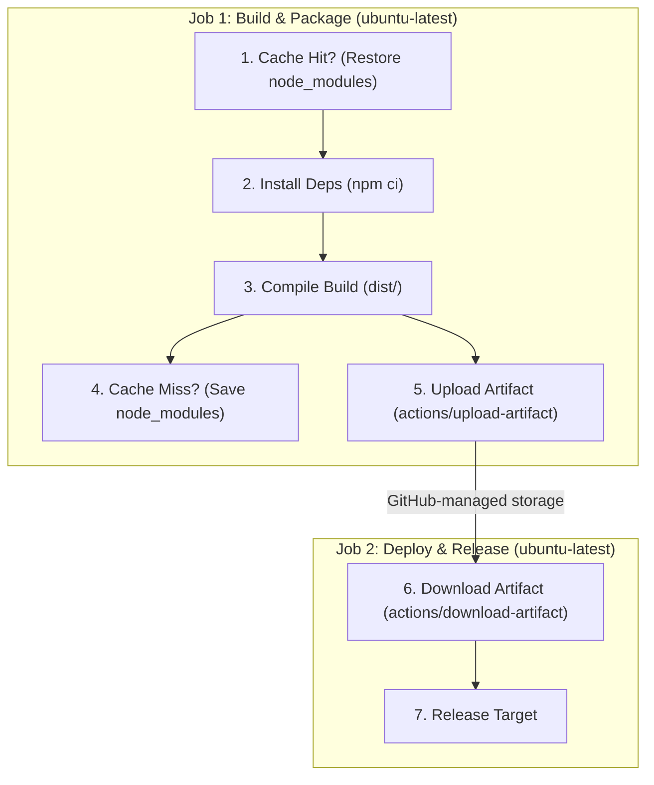
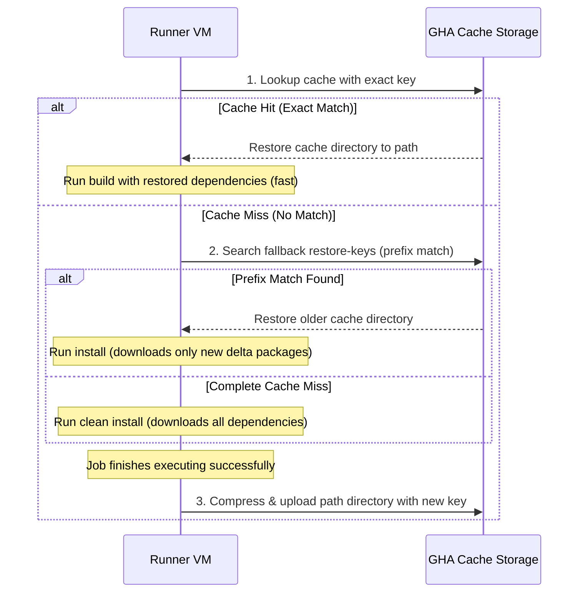

# Module 9-8: GitHub Actions Artifacts & Caching

**Breadcrumbs:** [[9-Index - GitHub Actions|🏠 GitHub Actions References Index]] > **GitHub Actions Artifacts & Caching**

This module covers speed optimization and data persistence in GitHub Actions. It outlines the architectural boundaries separating step outputs, persistent workflow artifacts, and dependency cache stores, providing hands-on blueprints for caching and cross-job artifact sharing.

---

## 🗺️ Cognitive Map: How to Think About the Flow of Knowledge

Optimize pipeline run times and manage build outputs by routing files to the appropriate storage layer:



1. **Storage Classification (Section 1):** Categorize data into small text outputs, persistent artifacts, or temporary caches.
2. **Artifact Management (Section 2):** Use upload and download actions to pass built assets between isolated runners.
3. **Dependency Caching (Section 3):** Speed up execution times using key-based cache hits and fallback restore keys.
4. **Optimization Blueprint (Section 4):** Implement an end-to-end build pipeline that integrates caching and artifact sharing.

---

## 1. Storage Classification: Outputs vs. Artifacts vs. Caching

GitHub Actions provides three mechanisms to share data and optimize execution across steps, jobs, and workflow runs:

| Attribute | Step/Job Outputs | Workflow Artifacts | Dependency Caching |
| :--- | :--- | :--- | :--- |
| **Purpose** | Share small variables/strings between steps and jobs. | Preserve physical files produced during job runs (binaries, test reports, logs). | Reuse intermediate dependency directories to speed up builds (e.g., `node_modules`, Maven `.m2`). |
| **Data Type** | Plaintext strings, metadata (JSON/YAML). | Binary packages, files, ZIP archives. | Dependency packages, libraries, binaries. |
| **Scope** | Current workflow run execution. | Available during and after the run (retention: 1–90 days). | Shared across multiple workflow runs on the same branch/repository. |
| **Storage Location** | Runner VM memory / Orchestrator state. | GitHub-Managed Blob Storage. | GitHub-Managed Cache Storage. |
| **Primary Action** | `echo "key=value" >> $GITHUB_OUTPUT` | `actions/upload-artifact@v4` / `actions/download-artifact@v4` | `actions/cache@v4` |

---

## 2. Artifact Management (Upload and Download)

Artifacts preserve physical assets generated by jobs. They are stored in GitHub's managed storage space and can be downloaded from the run's UI.

### A. Uploading Artifacts
Use `actions/upload-artifact@v4` to save directories or files:
*   `name`: The identifier for the artifact ZIP package (e.g., `release-binaries`).
*   `path`: The absolute or relative path to the directory or files you want to upload (e.g., `dist/`).
*   `retention-days`: The duration in days that the artifact is kept before being purged. The default is **90 days**. It can be configured down to **1 day** to save storage costs.

### B. Downloading Artifacts
Use `actions/download-artifact@v4` to retrieve artifacts in a downstream job:
*   `name`: The name of the uploaded artifact.
*   `path`: The target directory where the ZIP package will be extracted.
*   *Note:* The downloading job must require the uploading job via `needs:` to guarantee the files exist before download.

---

## 3. Dependency Caching and Lookup Lifecycle

Caching speeds up builds by skipping the download of external libraries (like `node_modules` or Maven `.m2` packages) that rarely change.

### A. Cache Configuration (`actions/cache@v4`)
Caching requires three parameters:
*   `path`: The directory on the runner VM to cache (e.g., `~/.npm` or `node_modules`).
*   `key`: The primary lookup key. This key should change whenever dependencies change, achieved by hashing configuration files: `${{ runner.os }}-node-${{ hashFiles('**/package-lock.json') }}`.
*   `restore-keys`: A list of fallback keys to search if an exact match for `key` fails (cache miss). It matches by prefix, loading the most recent matching cache.

### B. The Caching Lookup Sequence



---

## 4. Hands-on Optimization Blueprint

This blueprint demonstrates a multi-job build pipeline. **Job 1 (build-job)** restores npm caches, installs project dependencies, compiles the build, saves the cache, and uploads the compiled bundle. **Job 2 (deploy-job)** downloads the bundle and simulates staging promotion.

```yaml
# .github/workflows/optimized-pipeline.yml
name: Optimized Build and Deployment

on:
  push:
    branches:
      - main

jobs:
  build-job:
    name: Compile and Package Application
    runs-on: ubuntu-latest

    steps:
      - name: Checkout Source Code
        uses: actions/checkout@v4

      # Step 2: Cache npm dependencies using hashFiles keying
      - name: Cache Node Modules
        uses: actions/cache@v4
        id: npm-cache # Exposes cache-hit output
        with:
          path: ~/.npm
          key: ${{ runner.os }}-node-${{ hashFiles('**/package-lock.json') }}
          restore-keys: |
            ${{ runner.os }}-node-

      - name: Install Dependencies
        # Only run full npm install if there was a cache miss
        run: npm ci

      - name: Build Application
        run: npm run build # Compiles files to build/ or dist/ directory

      # Step 3: Archive and upload the compiled build folder
      - name: Upload Production Build Artifact
        uses: actions/upload-artifact@v4
        with:
          name: production-build
          path: dist/
          retention-days: 7 # Kept for 7 days to optimize storage costs

  deploy-job:
    name: Deploy to Staging Target
    needs: build-job # Ensure build job completes successfully
    runs-on: ubuntu-latest

    steps:
      - name: Checkout Source Code
        uses: actions/checkout@v4

      # Step 4: Download the build artifact uploaded by the build job
      - name: Download Staging Artifacts
        uses: actions/download-artifact@v4
        with:
          name: production-build
          path: staging-dist/

      - name: Validate Staging Package
        run: |
          echo "Listing restored build files:"
          ls -la staging-dist/
          echo "Deploying versioned release to staging environment..."
```

---

## 5. Summary & Best Practices
*   **Use lockfiles for hashing:** Always hash lockfiles (e.g., `package-lock.json`, `pom.xml`, `requirements.txt`, or `Gemfile.lock`) to generate the cache key. Hashing source files makes the key change too often, negating the speed benefits of caching.
*   **Limit retention limits:** Do not use the default 90-day retention for temporary build artifacts (like test directories). Keep them to 3–7 days to reduce storage costs.
*   **Utilize native runtime actions:** When using official setup actions (like `actions/setup-node@v4` or `actions/setup-java@v4`), use their built-in caching parameters (e.g., `cache: 'npm'` or `cache: 'maven'`) to simplify your workflow file.

---

### 📖 Sources & Ingested Transcripts
- Source 7: `inflow/GitHub Actions Artifacts & Caching Explained  Share Files & Optimize Builds.txt`
