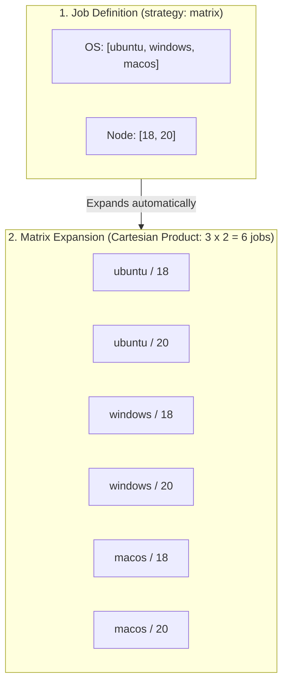

# Module 9-9: GitHub Actions Matrix Strategy

**Breadcrumbs:** [[9-Index - GitHub Actions|🏠 GitHub Actions References Index]] > **GitHub Actions Matrix Strategy**

This module covers the execution of multi-platform and multi-version workflows in GitHub Actions. It details matrix expansion, `include` and `exclude` filters, `fail-fast` safety controls, concurrency limits, and parallel scaling patterns.

---

## 🗺️ Cognitive Map: How to Think About the Flow of Knowledge

Manage testing combinations by mapping the Cartesian expansion from a single job definition down to isolated parallel executions:



1. **Matrix Expansion Principles (Section 1):** Define variables to automatically generate combinations of jobs.
2. **Matrix Control Properties (Section 2):** Tune execution using `fail-fast` and `max-parallel` parameters.
3. **Customizing Combinations (Section 3):** Refine combinations by explicitly adding or removing test targets.
4. **Hands-on Scaling Blueprint (Section 4):** Write a production-ready workflow for testing multiple runtimes across different OSs.

---

## 1. Matrix Expansion & Orchestration Principles

A matrix strategy allows you to run a single job definition multiple times in parallel, substituting variables with different combinations of values.

*   **Cartesian Expansion:** If you define `os: [ubuntu-latest, windows-latest]` and `node-version: [18, 20]`, GHA automatically expands this into **4 distinct jobs** (2 OSs × 2 Node versions).
*   **Parallel Execution:** GHA schedules these expanded jobs to run concurrently on separate runner virtual machines.
*   **Dynamic Context Access:** During execution, steps access their current combination variables using the `matrix` context (e.g., `${{ matrix.os }}` or `${{ matrix.node-version }}`).

---

## 2. Matrix Control Properties

You can control how GHA handles failures and runner resources in a matrix:

### A. Fail-Fast Safety Gate (`fail-fast`)
*   **Default Behavior (`true`):** If any single job in the matrix fails, GHA automatically issues cancellation requests to all other currently running jobs in that matrix.
*   **Rationale:** Saves billing minutes. If a core bug fails on Ubuntu, there is no need to keep Windows and macOS instances running.
*   **Overriding (`false`):** Crucial for regression testing. Set `fail-fast: false` when you want a complete report of which environments and versions failed.

### B. Concurrency Limits (`max-parallel`)
*   Limits the number of matrix jobs that can run concurrently.
*   **Use Case:** If a matrix expands to 20 jobs, but your test database only supports 4 concurrent connections, set `max-parallel: 4` to prevent overloading the database.

---

## 3. Include and Exclude Mappings

You can customize the matrix combinations by adding or removing specific configurations.

### A. Excluding Combinations (`exclude`)
Use `exclude` to remove specific combinations of variables from the generated matrix:
*   *Example:* If Python 3.9 is incompatible with Windows, exclude only that combination while keeping Windows testing for newer Python versions.

### B. Including Combinations (`include`)
Use `include` to add specific combinations of variables or add extra properties to a specific combination:
*   **Adding values:** Append a unique, non-generated combination to the matrix.
*   **Adding properties:** Inject environment variables or flags into a specific combination without expanding the matrix.

---

## 4. Hands-on Scaling Blueprint

This blueprint demonstrates a testing pipeline that evaluates Python versions `3.10`, `3.11`, and `3.12` across `ubuntu-latest` and `windows-latest`. It excludes the unstable combination of Python `3.10` on `windows-latest`, includes an experimental Python `3.13` build on Ubuntu, and sets a custom environment variable for a specific target.

```yaml
# .github/workflows/matrix-testing.yml
name: Scalable Matrix Test Suite

on:
  push:
    branches:
      - main
  pull_request:

jobs:
  test-suite:
    name: Run Python Tests
    runs-on: ${{ matrix.os }}
    
    strategy:
      # Prevent failures in one job from cancelling the remaining test runs
      fail-fast: false
      # Limit parallel execution to optimize runner usage
      max-parallel: 4
      
      matrix:
        os: [ubuntu-latest, windows-latest]
        python-version: ["3.10", "3.11", "3.12"]
        
        # 1. Exclude a specific, unstable combination
        exclude:
          - os: windows-latest
            python-version: "3.10"

        # 2. Include custom combinations and inject properties
        include:
          # Add an experimental python version only on Ubuntu
          - os: ubuntu-latest
            python-version: "3.13-dev"
          
          # Inject an extra environment variable to a specific combination
          - os: windows-latest
            python-version: "3.12"
            experimental_flag: "true"

    steps:
      - name: Checkout Source Code
        uses: actions/checkout@v4

      # Step 2: Set up the Python runtime dynamically using matrix context
      - name: Initialize Python Runtime
        uses: actions/setup-python@v5
        with:
          python-version: ${{ matrix.python-version }}

      - name: Verify Environment Configurations
        run: |
          echo "Operating System: ${{ matrix.os }}"
          echo "Python version tag: ${{ matrix.python-version }}"
          echo "Is Experimental Run? ${{ matrix.experimental_flag || 'false' }}"

      - name: Install Project Dependencies
        run: |
          python -m pip install --upgrade pip
          pip install pytest

      - name: Execute Automated Test Suite
        # Set environment variable dynamically from the include block if present
        env:
          RUN_EXPERIMENTAL: ${{ matrix.experimental_flag || 'false' }}
        run: |
          pytest tests/
```

---

## 5. Summary & Best Practices
*   **Format version tags as strings:** When specifying versions (e.g., Node `18`, `20` or Python `3.10`), wrap them in quotes (e.g., `"3.10"`). If unquoted, YAML parser may interpret `3.10` as the float `3.1`, causing GHA to set up Python 3.1 instead.
*   **Set fail-fast: false on dev runs:** Keep `fail-fast: false` on integration branches to ensure developers receive logs for all failing environments.
*   **Use matrix for configuration directories:** Matrix variables don't have to be runtimes. You can use them to run parallel jobs across directories: `dir: [microservice-a, microservice-b, microservice-c]`.

---

### 📖 Sources & Ingested Transcripts
- Source 8: `inflow/GitHub Actions Matrix Strategy Explained  Multi-OS, Multi-Version Testing at Scale.txt`
