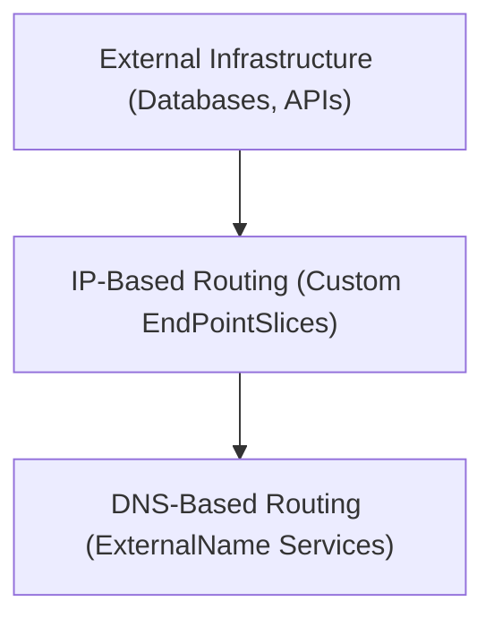

# Module 8-26: External Services Integrations

This module covers the integration of external databases and APIs into the Kubernetes DNS network using custom EndPointSlices and ExternalName services.

---

## 🗺️ Cognitive Map: How to Think About the Flow of Knowledge

To build a strong intuition for this domain, think of the topics as moving from foundational primitives to advanced implementations:



1. **Step 1: IP-Based Integration (Section 1):** Mapping external static IPs to a local Service.
2. **Step 2: DNS-Based Integration (Section 2):** Aliasing external domains using CNAME redirection.

By following this flow, you progress from **Static IP Mappings → DNS CNAME Aliasing**.

---

## 1. IP-Based Integration (Custom EndPointSlices)

* If you need to connect to an external resource (such as a database running on a standalone VM outside the cluster) using its IP address, you can create a Service without a label selector.
* **Mechanics:** Because the Service lacks a selector, Kubernetes does not generate an endpoint list automatically. Instead, you create a custom `EndPointSlice` resource manually:
  * Register the external IPs and ports in the custom `EndPointSlice`.
  * The Service will direct traffic to these external IPs in a round-robin sequence.
* *Note:* Kubernetes does not perform health checks on manual endpoints.

---

## 2. DNS-Based Integration (ExternalName Services)

* **Behavior:** Maps a Service to a DNS name instead of a selector or IP address.
* **Mechanism:** When a client inside the cluster queries the Service DNS name, the cluster DNS service returns a `CNAME` record pointing to the external domain.
* **YAML Example:**
  ```yaml
  apiVersion: v1
  kind: Service
  metadata:
    name: external-db
  spec:
    type: ExternalName
    externalName: db.external.net
  ```
* **Access:** Internal Pods can connect to the database using the short DNS name `external-db`. The client redirects traffic to the external host `db.external.net`, which handles its own routing and health checks.
