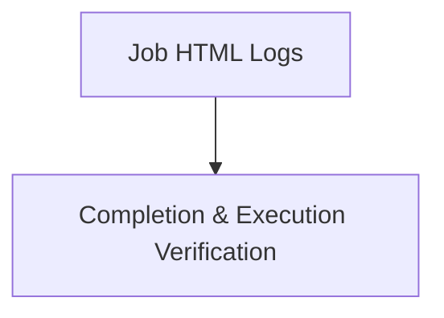

# Module 8-33: Jobs Lab Walkthrough

This module covers hands-on validation and execution tracking of Jobs and CronJobs inside a cluster.

---

## 🗺️ Cognitive Map: How to Think About the Flow of Knowledge

To build a strong intuition for this lab, follow the workflow:

1. **Step 1: Lab Resources (Section 1):** Access the interactive logs and YAML manifests for the Job lab.

---

## 1. Lab Resources

* **Interactive Lab HTML Logs:** [jobs.html](jobs.html) (embed: `![[jobs.html]]`)
