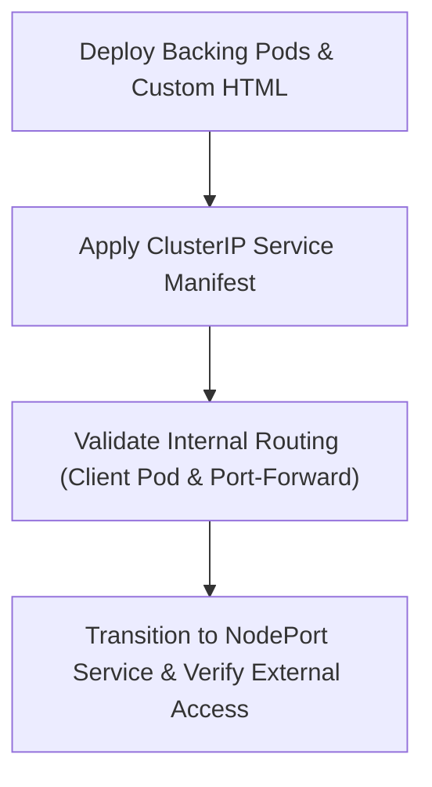

# Module 8-25: Lab 01: ClusterIP and NodePort Services

This module covers the hands-on configuration, validation, and testing of ClusterIP and NodePort services in a local cluster environment.

---

## 🗺️ Cognitive Map: How to Think About the Flow of Knowledge

To build a strong intuition for this lab, follow these sequential steps:



1. **Step 1: Pod Deployments (Section 1):** Running multiple Pods with customized index pages to observe load balancing.
2. **Step 2: ClusterIP Verification (Section 2 & 3):** Creating a ClusterIP service and testing it internally.
3. **Step 3: NodePort Verification (Section 4):** Reconfiguring the Service as a NodePort and testing access via node IPs.

---

## 1. Lab Architecture & Pod Setup

We deploy two Pods running Nginx. To verify that load balancing functions, we edit the index pages of the containers to identify the host Pod:
* **Container IP Isolation:** Containers running inside separate Pods are allocated unique IPs on the cluster network, preventing port conflicts even if they use the same port.

---

## 2. Implementing a ClusterIP Service

Create a ClusterIP service manifest to group the Pods.
```yaml
apiVersion: v1
kind: Pod
metadata:
  name: web-pod-1
  labels:
    app: my-web-app
spec:
  containers:
    - name: nginx
      image: nginx
```
Apply the default Service (which configures a ClusterIP):
```yaml
apiVersion: v1
kind: Service
metadata:
  name: my-clusterip-service
spec:
  selector:
    app: my-web-app
  ports:
    - port: 80
      targetPort: 80
```

---

## 3. Testing Internal Cluster Routing

To test the ClusterIP service internally without exposing it, deploy a temporary interactive client Pod:
```bash
# Launch a temporary curl client pod
kubectl run client-pod --image=curlimages/curl -it --rm -- sh
```
* **Note on `--rm`:** This flag automatically deletes the Pod when the interactive shell session exits, saving manual cleanup steps.
* **Execute Tests:** Run curl commands against the Service DNS name inside the client shell:
  ```bash
  curl my-clusterip-service.default.svc.cluster.local
  ```
  The responses will alternate between the two backends in a round-robin sequence.

### Local Port Forwarding
Developers can test ClusterIP services locally by forwarding traffic from a local port to the service:
```bash
kubectl port-forward svc/my-clusterip-service 8080:80
```
Open a browser and navigate to `http://localhost:8080` to verify connectivity.

---

## 4. Transitioning to a NodePort Service

Modify the Service manifest to set `type: NodePort`:
```yaml
apiVersion: v1
kind: Service
metadata:
  name: my-nodeport-service
spec:
  type: NodePort
  selector:
    app: my-web-app
  ports:
    - port: 80
      targetPort: 80
      nodePort: 32000
```
Verify that the Service is accessible from the host system or external machines by querying any cluster node's IP address on port `32000`:
```bash
curl http://192.168.2.76:32000
```
