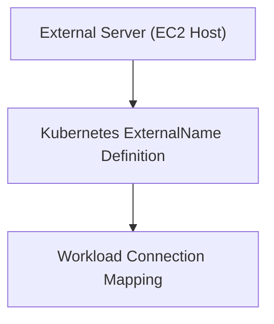

# Module 8-27: Lab 02: External Services Insights

This module covers the hands-on setup and connection mapping of Kubernetes workloads to external host systems using ExternalName resources.

---

## 🗺️ Cognitive Map: How to Think About the Flow of Knowledge

To build a strong intuition for this lab, analyze the setup steps:

1. **Step 1: External Infrastructure (Section 1):** Deploying the target service on an external virtual machine.
2. **Step 2: Manifest Definition (Section 2):** Configuring the ExternalName service mapping.

---

## 1. External Infrastructure Setup

In this lab, we configure connection mapping to a target application running on an external virtual machine (such as an AWS EC2 instance). Instead of hardcoding the EC2 instance's public IP address in the configuration of internal workloads, we map it to an internal DNS alias.

---

## 2. Interactive Lab Logs

* **Interactive Lab HTML Logs:** [../Attachments/service+discovery+-+lab02+-+resources 1.html](../Attachments/service+discovery+-+lab02+-+resources 1.html) (embed: `![[../Attachments/service+discovery+-+lab02+-+resources 1.html]]`)
