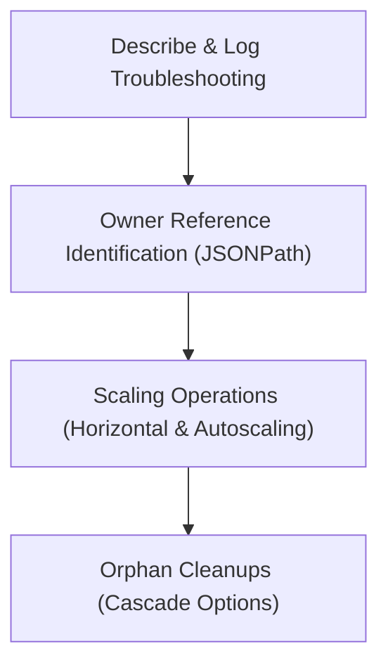

# Module 8-11: ReplicaSet Lab Walkthrough

This module covers practical operations for inspecting, scaling, troubleshooting, and cleaning up ReplicaSets.

---

## 🗺️ Cognitive Map: How to Think About the Flow of Knowledge

To build a strong intuition for this domain, think of the topics as moving from foundational primitives to advanced implementations:



1. **Step 1: Inspection (Section 1):** Using explain, describe, and log commands to troubleshoot ReplicaSets.
2. **Step 2: Ownership (Section 2):** Extracting owner references to confirm which controller manages a Pod.
3. **Step 3: Scaling (Section 3):** Scaling workloads horizontally, vertically, and through cluster-level autoscaling.
4. **Step 4: Cleanup (Section 4):** Deleting controllers while preserving or cascade-deleting their child Pods.

By following this flow, you progress from **Operational Inspection → Ownership Verification → Scaling Workloads → Cleanup Operations**.

---

## 1. Inspection and Troubleshooting

* **Describe:** Use `kubectl describe replicaset <name>` to view configuration details, selector values, and controller event logs.
* **Logs:** Use `kubectl logs` to inspect the application output. Note that logs are generated by the containerized applications inside the Pods, so the target Pod must be running for you to fetch logs.

---

## 2. Identifying Pod Ownership

Because ReplicaSets are loosely coupled, you can verify which controller owns a Pod by inspecting the metadata owner references.
* **Inspect raw YAML:**
  ```bash
  kubectl get pods <pod-name> -o yaml
  ```
* **Query the owner name directly via JSONPath:**
  ```bash
  kubectl get pods <pod-name> -o jsonpath='{.metadata.ownerReferences[0].name}'
  ```
* **Query the controller type (Kind):**
  ```bash
  kubectl get pods <pod-name> -o jsonpath='{.metadata.ownerReferences[0].kind}'
  ```

---

## 3. Scaling Workloads

Workloads can be scaled in three ways:

### A. Horizontal Scaling
Adjusting the number of replica Pods:
* **Imperative CLI command:**
  ```bash
  kubectl scale replicaset myapp --replicas=5
  ```
  * *Best Practice:* Always update your declarative manifest files to match the new scale configurations to prevent subsequent deployments from reverting changes.
* **Horizontal Pod Autoscaling (HPA):** Uses a metrics server to monitor CPU/Memory thresholds and automatically scales Pod counts.

### B. Vertical Scaling
Increasing the resource allocation (CPU and Memory) of existing Pods. This eventually requires updating the host hardware.

### C. Cluster Autoscaling
Dynamically adding or removing physical/virtual worker nodes in response to pending Pod resource demands, commonly utilized in cloud environments.

---

## 4. Cleanup and Cascade Deletion

* **Default Deletion:** Deleting a ReplicaSet deletes both the controller and all of its associated Pods.
  ```bash
  kubectl delete replicaset myapp
  ```
* **Orphan Deletion:** To delete the ReplicaSet controller but leave its child Pods running, specify the `--cascade=orphan` flag:
  ```bash
  kubectl delete replicaset myapp --cascade=orphan
  ```
  * If you deploy a new ReplicaSet with a matching label selector, it will automatically adopt the orphan Pods and reconcile them to match its desired replica count.
