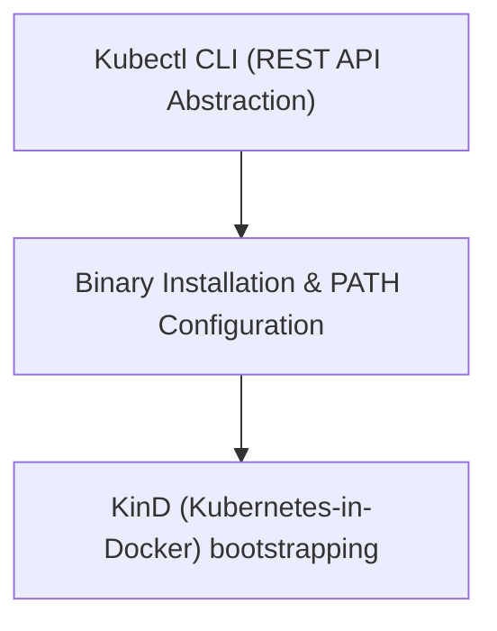

# Module 8-42: Kubernetes Tooling & KinD Setup

This module covers the installation and configuration of core Kubernetes command-line tooling, detailing `kubectl` binary installation and KinD cluster setups.

---

## 🗺️ Cognitive Map: How to Think About the Flow of Knowledge

To build a strong intuition for this domain, think of the topics as moving from foundational primitives to advanced implementations:



1. **Step 1: Kubectl CLI (Section 1):** Understanding how `kubectl` abstracts HTTP REST API calls.
2. **Step 2: CLI Configuration (Section 2):** Installing the binary and setting execute permissions.
3. **Step 3: Cluster Bootstrapping (Section 3):** Initializing local clusters using KinD.

By following this flow, you progress from **API Abstraction → Binary Installation → Cluster Bootstrapping**.

---

## 1. Kubectl CLI and REST API Abstraction

* The Kubernetes API server exposes an HTTP REST API.
* **Abstraction Layer:** `kubectl` is a command-line interface tool written in Go. It abstracts raw REST calls, allowing developers to manage cluster resources using declarative commands instead of manual HTTP requests.
* **Version Compatibility:** `kubectl` is compatible with API servers up to one version older or newer (v-1 to v+1). Using mismatched versions outside this range is not recommended.

---

## 2. Installing and Configuring Kubectl

You can install `kubectl` using package managers or by downloading the compiled binary:
1. **Download the Binary:**
   ```bash
   curl -LO "https://dl.k8s.io/release/$(curl -L -s https://dl.k8s.io/release/stable.txt)/bin/linux/amd64/kubectl"
   ```
2. **Install to PATH:** Move the binary to `/usr/local/bin` so it can be called globally:
   ```bash
   sudo mv kubectl /usr/local/bin/
   ```
3. **Set Permissions:** Grant execute permissions:
   ```bash
   sudo chmod +x /usr/local/bin/kubectl
   ```
4. **Verify Installation:**
   ```bash
   kubectl version --client
   ```

---

## 3. KinD (Kubernetes in Docker)

* **KinD** runs local Kubernetes clusters by simulating nodes as Docker containers.
* **Requirements:** Requires either a running Docker daemon or Podman.
* **Benefits:** Highly lightweight compared to traditional virtual-machine-based solutions (like Minikube), making it ideal for continuous integration pipelines and local development testing.
