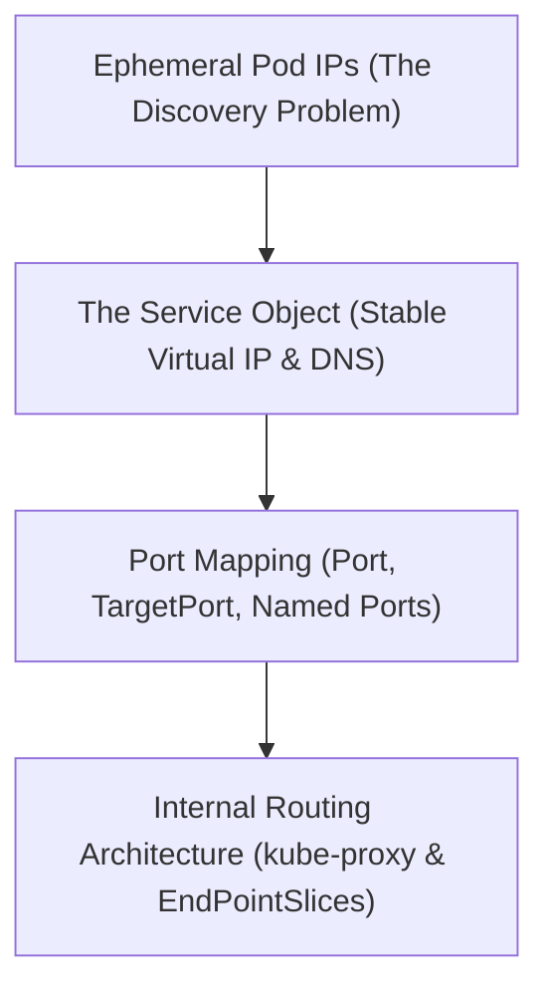

# Module 8-23: What is a Service Object

This module covers the core concepts of Service Discovery in Kubernetes, explaining how Service objects provide stable IP addresses, DNS names, and round-robin load balancing.

---

## 🗺️ Cognitive Map: How to Think About the Flow of Knowledge

To build a strong intuition for this domain, think of the topics as moving from foundational primitives to advanced implementations:



1. **Step 1: The Discovery Problem (Section 1):** Realizing that Pods have ephemeral IPs and lack stable DNS configurations.
2. **Step 2: Service Abstraction (Section 2):** Implementing Service resources to establish a stable virtual IP and DNS name.
3. **Step 3: Port Mechanics (Section 3):** Routing traffic from service ports to targeted container ports.
4. **Step 4: Control Plane Routing (Section 4):** Understanding how kube-proxy and EndPointSlices manage routing rules in the background.

By following this flow, you progress from **Dynamic IPs → Stable Service VIPs → Port Mapping → Kernel-Level Routing**.

---

## 1. The Ephemeral IP Problem & Service Discovery

* **Ephemeral IPs:** Pods are ephemeral resources. If a Pod is updated or rescheduled, it is assigned a completely new IP address.
* **No Default DNS:** Standalone Pods do not have stable FQDNs registered in the cluster DNS.
* **The Problem:** If a frontend application needs to communicate with a backend API, it cannot hardcode backend Pod IPs because those IPs change constantly.
* **The Solution:** A **Service** acts as an abstraction layer that groups a set of Pods and defines a policy to access them.

---

## 2. The Service Object and Load Balancing

A Service provides:
* **Stable Virtual IP (ClusterIP):** A static IP address that remains constant as long as the Service resource exists.
* **Stable DNS Name:** Registering a local DNS name that points to the stable IP address:
  * **Same Namespace:** `service-name`
  * **Cross-Namespace:** `service-name.namespace.svc.cluster.local`
* **Round-Robin Load Balancing:** Incoming requests are routed to the backing Pods using a basic round-robin algorithm.

---

## 3. Selectors and Port Mapping

Services identify their target Pods using label selectors:
* **Equality Selectors:** Services use equality-based selectors. If you define multiple selector labels, Kubernetes applies an **AND** operation to filter Pods.
* **Port Configurations:**
  * `port`: The port that the Service listens on inside the cluster.
  * `targetPort`: The port on the container where the traffic is forwarded.
  * **Named Ports:** You can assign a name to a container port in the Pod spec and reference that name in the Service's `targetPort`. This isolates the Service from changes to the physical port numbers.

### Imperative Expose Command
```bash
kubectl expose pod nginx-pod --name=backend-service --port=80 --target-port=80
```

---

## 4. Internal Routing Architecture

### A. EndPointSlices
* An `EndPointSlice` is a resource generated automatically by the controller manager for each Service.
* It dynamically tracks the IP addresses, ports, and readiness states of all healthy Pods that match the Service's selector.
* **Sharding Slices:** Unlike the older legacy `Endpoints` resource, `EndPointSlices` shard lists of endpoints to prevent performance bottlenecks in very large clusters.

### B. kube-proxy
* `kube-proxy` is a network agent running on every node that monitors the API server for changes to Services and `EndPointSlices`.
* It dynamically updates the node's local packet filtering rules (typically using `iptables` or `IPVS` modes) to forward traffic directed at a Service's IP directly to the backing Pods.
* If a Pod fails its readiness probe, the controller manager removes its IP from the `EndPointSlice`, and `kube-proxy` stops routing traffic to it.
