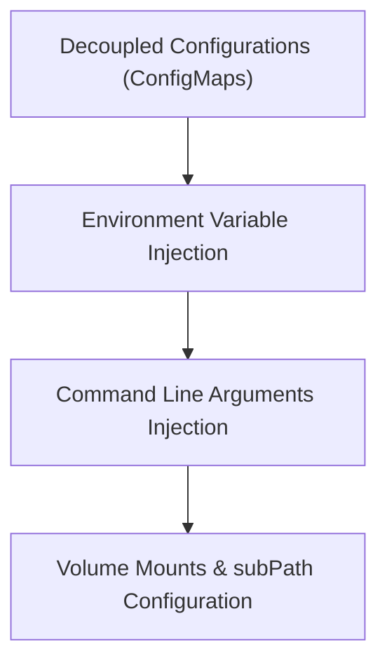

# Module 8-16: ConfigMaps Configurations

This module covers the decoupling of configuration data from container images using Kubernetes ConfigMaps, detailing env-based, arg-based, and volume-based injection.

---

## 🗺️ Cognitive Map: How to Think About the Flow of Knowledge

To build a strong intuition for this domain, think of the topics as moving from foundational primitives to advanced implementations:



1. **Step 1: Configuration Decoupling (Section 1):** Moving configuration out of the container image into the cluster.
2. **Step 2: Injection Mechanisms (Section 2):** Injecting values via environment variables and arguments.
3. **Step 3: Volume Mounting (Section 3):** Mounting configuration files directly using volumes and subPaths.

By following this flow, you progress from **Decoupled Data → Variable Injection → File-System Mounting**.

---

## 1. Decoupling Configuration

* **ConfigMaps** store non-confidential configuration data as key-value pairs.
* By storing configuration parameters in ConfigMaps, you can run the same container image across development, testing, and production environments without rebuilding the image.

---

## 2. Environment Variables and Arguments Injection

ConfigMaps can be injected into container runtimes in three ways:

### A. Environment Variables
Injects keys as environment variables directly available to the application process.
```yaml
spec:
  containers:
    - name: app
      image: my-app
      env:
        - name: LOG_LEVEL
          valueFrom:
            configMapKeyRef:
              name: app-config
              key: LOG_LEVEL
```

### B. Command-Line Arguments
Injects ConfigMap values as start arguments for the container entrypoint.
```yaml
spec:
  containers:
    - name: app
      image: my-app
      command: ["/bin/sh", "-c"]
      args: ["echo $(MY_CONFIG_VAR)"]
      env:
        - name: MY_CONFIG_VAR
          valueFrom:
            configMapKeyRef:
              name: app-config
              key: MY_CONFIG_VAR
```

---

## 3. Mounting ConfigMaps as Volumes

You can mount an entire ConfigMap as a volume, exposing keys as configuration files inside the container filesystem:
* **YAML Syntax:** To declare multi-line files inside a YAML ConfigMap, use the literal block scalar indicator `|`.
* **subPath Usage:** When mounting a configuration file into an existing directory (such as `/etc/nginx/`), configure `subPath` to prevent the volume mount from overwriting other files in that directory.
```yaml
spec:
  containers:
    - name: web
      image: nginx
      volumeMounts:
        - name: nginx-config-vol
          mountPath: /etc/nginx/nginx.conf
          subPath: nginx.conf
  volumes:
    - name: nginx-config-vol
      configMap:
        name: nginx-config
```
